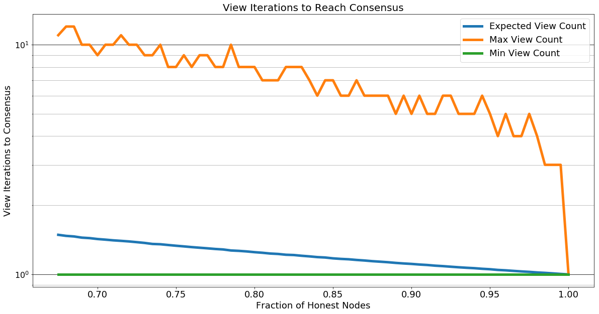
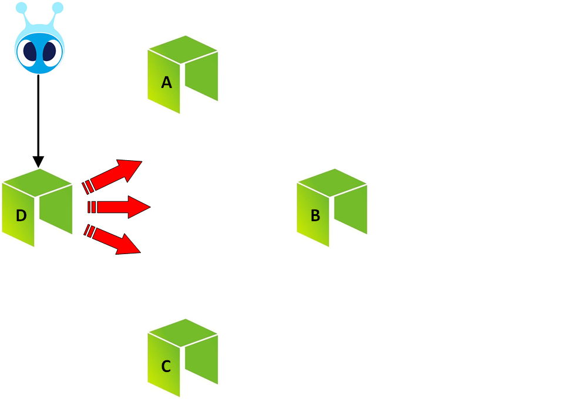
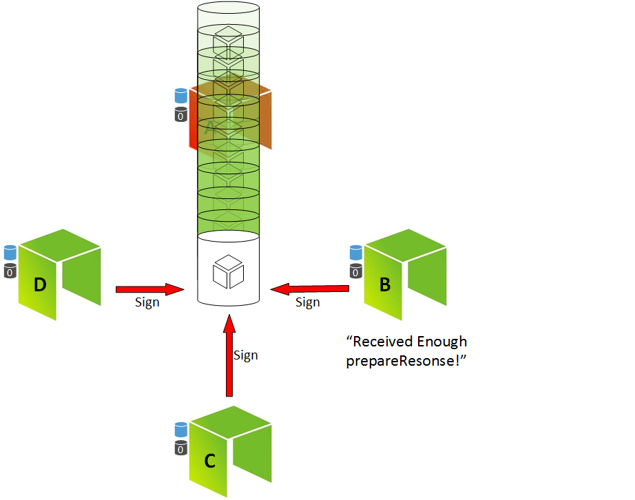

## 1 - List of Terms

* **Proof of Stake** `PoS` - A type of algorithm which uses network consensus to handle fault tolerance.

* **Proof of Work** `PoW` - A type of algorithm which uses computing power to handle fault tolerance.

* **Byzantine Fault** `BF` - A failure in which a node remains functional, but operates in a dishonest manner.

* **Delegated Byzantine Fault Tolerance** `DBFT` - A consensus algorithm implemented within the AntShares blockchain to guarantee fault tolerance.

* **View** `v` - The dataset used during a consensus activity in AntShares `DBFT`

## 2 - Introduction

## 3 - Background

One of the fundamental differences between blockchains is how they can guarantee fault tolerance given defective, non-honest activity on the network.

Traditional methods implemented using PoW can provide this guarantee as long as a majority of the network's computational power is honest.  However, because of this schema's dependency on compute, the mechanism can be very inefficient (computational power costs energy and requires hardware).  These dependencies expose a PoW network to a number of limitations, the primary one being the cost of scaling.These dependencies expose a PoW network to a number of limitations, the primary one being the cost of scaling.

**(Describe conventional PoS mechanic)**

AntShares implements a PoS schema using Delegated Byzantine Fault Tolerance which protects the network from Byzantine faults using minimal resources.  This solution addresses performance and scalability issues associated with current blockchain implementations without a significant impact to the fault tolerance.

## 4 - Theory

**(Outline Byzantine Generals Problem)**

## 5 - Practical Implementation

The practical implementation of DBFT in AntShares uses an iterative consensus method to guarantee that consensus is reached.  The performance of the algorithm is dependent on the fraction of honest nodes in the system. The chart below depicts the
expected iterations as a function of the fraction of dishonest nodes.  Note that the plot doesn't extend below 66.66% node honesty. Below this point, there is a 'No-Man's Land' where a consensus is unreachable until reaching 33.33% **Consensus Node** honesty.
Below this critical point, dishonest nodes (assuming they are aligned in consensus) are able to reach a consensus themselves and become the new point of truth in the system.

### 5.1 - Roles
**In the AntShares consensus algorithm, Consensus Nodes are elected by ANS holders and vote on validity of transactions.**

   **Consensus Node** - This node participates in the consensus activity.  During a consensus activity, consensus nodes take turns assuming the following two roles:
  -  **Speaker** `(One)` - The speaker is analogous to the general in section 4.  They are responsible for transmitting a block proposal to the system.
  -  **Congressman** `(Multiple)` - Congressman nodes are analogous to lieutenants in section 4. They are responsible for reaching a consensus on the transaction.
  

### 5.2 - Definitions

**Within the algorithm, we define the following:**

  - `t`: The amount of time allocated for block generation, measured in seconds.

	
  - `n`: The number of active **Consensus Nodes**.
 
	
  - `f`: The minimum threshold of faulty **Consensus Nodes** within the system. 
  	- `f = (n - 1) / 3`
  
	
  - `h` : The current block height during consensus activity.

	
  - `i` : **Consensus Node** index.
  
  
  - `v` : The view of a **Consensus Node**.  The view contains the aggregated information the node has received during a round of consensus.  This includes the vote (`prepareResponse` or `ChangeView`) issued by all congressmen.

  - `k` : The index of the view `v`.  A consensus activity can require multiple rounds.  On consensus failure, `k` is incremented and a new round of consensus begins.

  
  - `p` : Index of the **Consensus Node** elected as the **Speaker**. 
  	- `p = (h - k) mod (n)`
  

  - `s`: The safe consensus threshold.  Below this threshold, the network is exposed to fault.  
  	- `s = ((n - 1) - f)`

### 5.3 - Requirements

**Within AntShares, there are three primary requirements for consensus fault tolerance:**

1. `s` **Congressmen** must reach a consensus about a transaction before a block can be committed.

2. Dishonest **Consensus Nodes** must not be able to persuade the honest consensus nodes of faulty transactions. 

3. At least `s` **Congressmen** are in same state (`h`,`k`) to begin a consensus activity

	
### 5.3 - Algorithm
**The algorithm works as follows:**

1. A **Consensus Node** broadcasts a transaction to the entire network with the sender's signatures.

  
  
2. **Consensus Nodes** log transaction data into local memory.

3. The first view `v` of the consensus activity is initialized.

4. The **Speaker** is identified.

	
	
  **Wait** `t` seconds
	
5. The **Speaker** broadcasts the proposal :
    <!-- -->
        <prepareRequest, h, k, p, bloc, [block]sigp>

	
	
6. The **Congressmen** receive the proposal and validate:

    - Is the data format consistent with the system rules?
    - Is the transaction already on the blockchain?
    - Are the contract scripts correctly executed?
    - Does the transaction only contain a single spend?	(i.e. does the transaction avoid a double spend scenario?)

    - **If Validated Proposal Broadcast:**
	    <!-- -->
	        <prepareResponse, h, k, i, [block]sigi>
	 	
    - **If Invalidated Proposal Broadcast:**
	    <!-- -->
	        <ChangeView, h,k,i,k+1>
			
  

7. After receiving `s` number of 'prepareResponse' broadcasts, a **Congressman** reaches a consensus and publishes a block.

8. The **Congressmen** sign the block.

  
  
8. When a **Consensus Node** receives a full block, current view data is purged, and a new round of consensus begins. 
	- `k = 0`
 
--- 
  
**Note:**
 
 If after   ( )  seconds on the same view without consensus:
  - **Consensus Node** broadcasts:

	<!-- -->
	    <ChangeView, h,k,i,k+1>
		
  - Once a **Consensus Node** receives at least `s` number of broadcasts denoting the same change of view, it increments the view `v`, triggering a new round of consensus.
	
	
## Example 
 

	

## References
1. [A Byzantine Fault Tolerance Algorithm for Blockchain](https://www.antshares.org/Files/A8A0E2.pdf)
2. [Practical Byzantine Fault Tolerance](https://kelehers.me/others/pbftByzantine.pdf)
3. [The Byzantine Generals Problem](http://pmg.csail.mit.edu/papers/osdi99.pdf)

