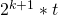

## 1 - List of Terms

* **Proof of Stake** `PoS`  A schema which uses network consensus to handle fault tolerance.

* **Proof of Work** `PoW` - A schema which uses compute utility to handle fault tolerance.

* **Byzantine Fault** `BF` - A failure in which a node remains functional, but operates in a non-honest manner.

* **Practical Byzantine Fault Tolerance** `PBFT` - A cosensus algorithm implemented within the AntShares block chain to garantee fault tolerance.

* **View** - The data set used during a consensus instance in AntShares PBFT

## 2 - Introduction

## 3 - Background

One of the fundamental differences between blockchains is how they can guarantee fault tolerance due to defective, non-honest activity on the network.

Traditional methods implemented using PoW can provide this garantee as long as a majority of the network's computational power is honest
However, because of this schema's dependency on compute, the mechanism can be very resource intensive (computational power costs energy and requires hardware).
These dependencies expose a PoW network to a number of limitations, the primary one being the cost of scaling.

**(Describe conventional PoS mechanic)**

AntShares implements a PoS schema using Practical Byzantine Fault Tolerance which protects the network from Byzantine faults using minimal resources.
This solution provides a profound solution to performance and scalability issues associated with current blockchain implementations without a significant impact to the fault tolerance.

## 4 - Theory

**(Outline Byzantine Generals Problem)**

## 5 - Practical Implementation
The practical implementation of PBFT in AntShares uses an iterative consensus method to garantee that consensus is reached.  The performance of the algorithm is dependent on the fration of non-honest nodes in the system.  The chart below depicts the
expected iterations as a function of the fraction of non-honest nodes.

**{insert equation and plot}**

### 5.1 - Roles
**In AntShares, there are two primary roles that nodes can inherit:**

1. **Consensus Node** - This node participates in the consensus activity.  During a consensus activity, consensus nodes take turns assuming the following two roles:
    - **Speaker** `(1)` - The speaker is analogous to the general in section 4.  They are responsible for transmitting a block proposal to the system.
    - **Congressman** `(Many)` - Congressman nodes are analogous to the leutenant in section 4.  They are responsible reaching a consensus on the transaction.
  
2. **Bookkeeper Node** `(Many)` - The bookkeeper nodes act as a scribe and digitally sign the blocks that are generated by consensus nodes.  They must agree with the result of the consensus activity to sign the block.

### 5.2 - Definitions

**Within the algorithm, we define the following:**

  - `t` (Seconds) This is the atomic unit of time allocated for block generation.

	
  - `n` (Number) The number of active **Consensus Nodes**
 
	
  - `f` (Number) The minimum threshold of faulty **Consensus Nodes** within the system. (n -1) / 3
  
	
  - `h` : The current block height during the consensus activity

	
  - `i` : **Consensus Node** index
  
  
  - `v` : The view of a **Consensus Node**.  The view contains the aggregated information the node has received during a consensus round.

  - `k` : The index of the view.  A consensus activity can require multiple rounds.  On consensus failure, `k` is incremented and a new round of consensus begins.

  
  - `p` : Index of the **Consensus Node** elected as the **Speaker**.  p = (h - k) mod (n)
  

  - `s` (Number) The safe consensus threshold.  Below this threshold, the network is exposed to fault.  s = (n - f)

### 5.3 - Requirements

**In AntShares, we have five primary requirements for consensus fault tolerance:**

1. `s` **Congressmen** must reach a consensus about a transaction before a block can be committed.

2. Dishonest **Consensus Nodes** must not be able to persuade the honest consensus nodes of faulty transactions. 

3. `s` **Bookkeepers** must reach consensus about the block produced by the consensus activity	

  
4. If the generated block is honest, all honest **Bookkeepers** are in agreement with the honest **Congressmen**.

5. At least `s` **Consensus Nodes** are in same state (`h`,`k`) to begin a conensus activity

	
### 5.3 - Algorithm
**The algorithgm works as follows:**

1. a consensus node broadcasts a transaction to entire network with sender's signatures

2. bookkeeper nodes log transaction data into local memory

3. initialize view

4. identify speaker of the house
	
  **Wait** `t`
	
5. **Speaker** broadcasts the proposal :
    <!-- -->
        <prepareRequest, h, k, p, bloc, [block]sigp>

6. **Congressmen** receive proposal and validates:

    - Is data format consistant with system rules?
    - Is transaction already on blockchain?
    - Are the contract scripts correctly executed?
    - Does the transaction only contain a single spend?	

    - **if Validated proposal:**

      If the proposal is valid, the **Congressman** broadcasts:
	    <!-- -->
	        <prepareResponse, h, k, i, [block]sigi>
	 	
    - **If Invalidated Proposal**
    
	  If the proposal is invalid, the **Congressman** increments their view `k + 1`.

7. After receiving `s` 'prepareResponse' broadcasts, a **Congressman** reaches a consensus and publishes a block.

8. At least `s` **Bookkeepers** sign the published block.

8. When a **Consensus Node** receives a full block, purge current view data, begin new concensus round. `k = 0`
 
--- 
  
**Note:**
 
 If after   ( )  seconds on the same view without consensus:
  - **Consensus Node** broadcasts:

	<!-- -->
	    <ChangeView, h,k,i,k+1>
		
  - Once a **Consensus Node** receives at least `s` broadcasts denoting the same change of view, it increments the view, triggering a new round of consensus.
	
	
## Example 
 
 
# Questions:
  - How is spoofing prevented?	
  - How calculate `n`
  - Bookkeepers?
  - synchronicity
  - penalization (?)
	

## References
1. [The Byzantine Generals Problem](http://www-inst.eecs.berkeley.edu/~cs162/fa12/hand-outs/Original_Byzantine.pdf)
2. [Practical Byzantine Fault Tolerance](https://kelehers.me/others/pbftByzantine.pdf)
3. [A Byzantine Fault Tolerance Algorithm for Blockchain](https://www.antshares.org/Files/A8A0E2.pdf)
