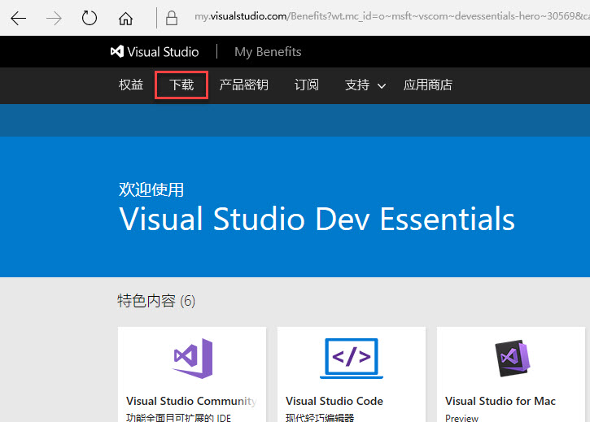
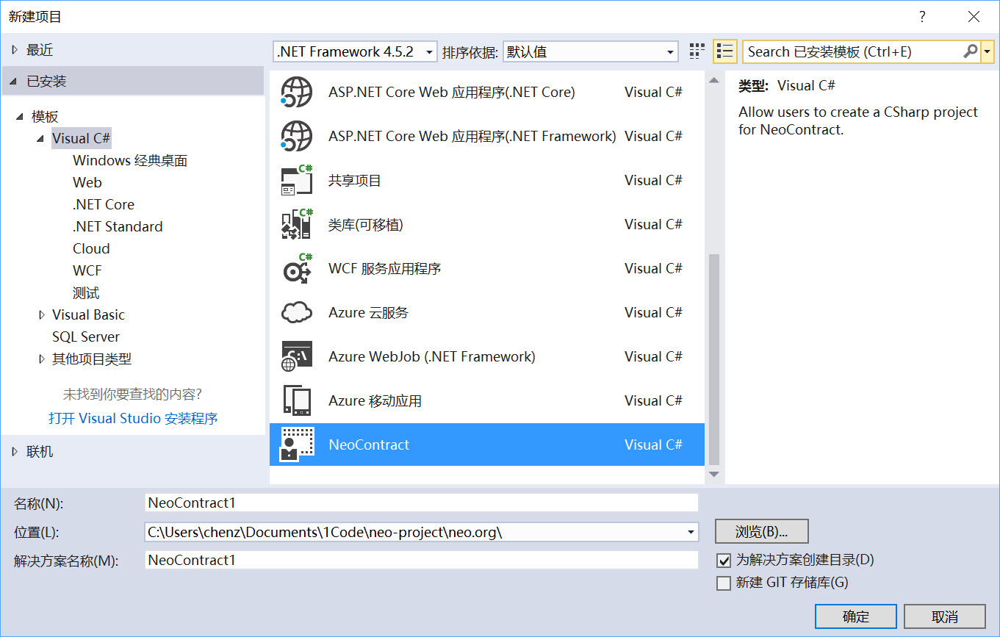

# How to use C # to write NEO smart contract for VS2015

We currently recommend C# for developing smart contracts (though we support or plan to support Java, Kotlin, Go, C/C + +, Python, JavaScript and other programming languages)

This section contains a short tutorial that guides you in configuring the C# development environment for NEO smart contracts and gives you an idea of how to create a smart contract project and how to compile it.

## development tools

### 1. Visual Studio 2015

Download and install method:

If you have already installed Visual Studio 2015 (any version) on your computer, you can skip this section.

Visual Studio 2015 has been off the official website from home, but can be downloaded.

Open the [Visual Studio old version download page](https://www.visualstudio.com/en/vans/vs/older-downloads/) click `free to join`

   

Use your own Microsoft account login, enter Visual Studio Dev Essentials in the navigation menu, click `download`



In the search box, enter Visual Studio Community 2015 with Update 3, and then select the search results in a good version, language, etc., click the right side of the `download` button


Installation method and the general software is basically the same, the installation process without the need to select additional features, only the core part of the VS2015 can be installed


### 2. NET Core tools Preview 2 for Visual Studio 2015

Download and install method:

Open the [.Net Core download page](https://www.microsoft.com/net/download/core)

Download and install NET Core tools Preview 2 for Visual Studio 2015


### 3. NeoContractPlugin

installation method:

Open Visual Studio 2015, open the tool, extended and updated, click on the left for online search for NEO installation, Neo.SmartContract


### 4. neo-compiler

Installation and configuration methods:

Download the [neo-compiler](https://github.com/neo-project/neo-compiler) project on Github, open the solution with Visual Studio 2015, compile the neon project,


After the compilation is successful, the neon.exe file will be generated in `bin\Debug\netcoreapp1.0\win10-x64`
   > [!Note]
   > If your computer is a 32-bit operating system, you need to change the win10-x64 in the project.json file to win10-x86

You now need to add a path, so that any location can access the program. To add the path method, open the computer properties (or turn on the control panel, system and security, system), open the advanced system settings, select the Advanced tab, click the environment variable button, as shown in Figure


Then select Path and click `Edit '


In the pop-up window, click "New" input neon.exe where the directory, click `OK`, `OK`


Add the path, run cmd test, enter neon.exe, no error, the output as shown in the figure that the environment variable configuration is successful


## Create project

After the above four-step installation is successful, you can create an NEO smart contract project in Visual Studio 2015.



This will automatically generate a C# file, the default class inherited from the FunctionCode, as shown in the following:


- Note: If the following image appears, because the project in the Neo.SmartContract.Framework did not successfully restore, you can restore the NuGet package in the following way (the process without networking)


In the Solution Explorer, select the solution, right-click, and click `Restore NuGet Package`


Then open the project reference, click `Neo.SmartContract.Framework`. A few cases still can not restore Nuget package how to do? Please restart Visual Studio 2015 or try to generate a solution directly.


## Compile the project

Everything is now ready to add the entry method to the project:

```c#
public class Contract1: FunctionCode
{
    public static void Main ()// Note that the main method to capitalize
    {
        
    }
}
```
After this compiles successfully, you will see the generated `SmartContract1.avm` file in the `bin/Debug` directory, which is the file that is generated by the NEO smart contract.


!Note:
   If you are generated, there is no output of the results of the map, it does not matter, you can also directly enter the command to compile the dll avm file

   Open a command prompt, navigate to the Debug directory, enter the following highlight (SmartContract1.dll is the name of the dll generated by the previous step).
```
	> C: \ ... \ bin \ Debug> `./neon SmartContract1.dll`
	>
	> Neo.Compiler.MSIL console app v1.6.4.2
	>   
	> Find function entry point: System.Void SmartContract1.Contract1 :: Main ()
	>   
	> Convert succ
	>   
 	> Write: SmartContract1.avm
 	>
 	> SUCC
  	>
	> C: \ ... \ bin \ Debug>
```

Now that you have completed the configuration of the smart contract development environment, please refer to the [Art Experiment Guide for Tomids](tutorial.md)
