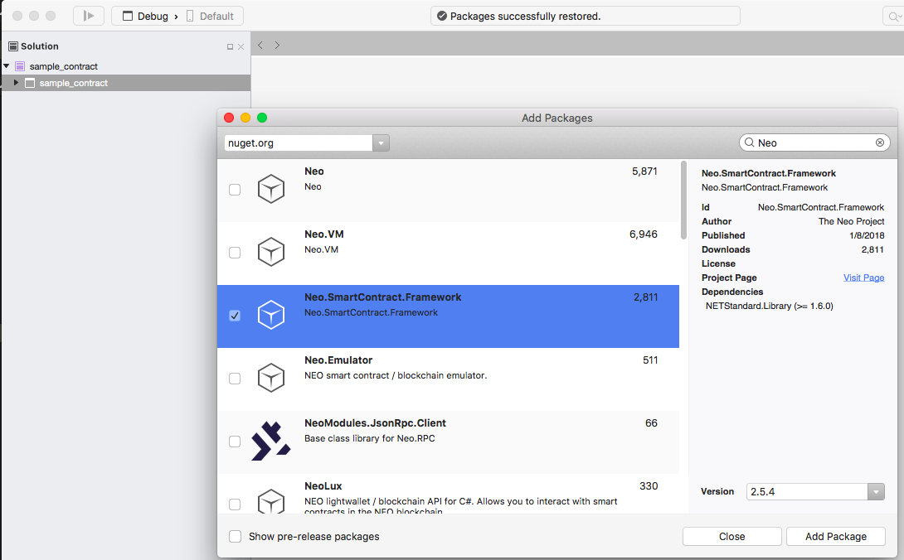

# How to write smart contracts in C# on macOS

### 1. Visual Studio for Mac 

If you already have Visual Studio for Mac installed on your computer, skip this section. Otherwise, download [Visual Studio for Mac](https://www.visualstudio.com/vs/mac/)

Just check the basic functions when installing, without selecting the platform specific components.


### 2. New Project

Open Visual Studio for Mac，create a new project, and select .NET Standard Library（.NET Core → Library）。


> [!Note]
> When you create a new project, select 2.0 for the .NET Core version，because if you select 1.x ，then adding “Neo.SmartContract.Framework” will fail.

Next, right click on the project，click `Add NuGet Packages...`，search for “neo”，select “Neo.SmartContract.Framework”，and click on `Add Package`。



After the installation is successful, write the following sample code in your Class1.cs file.

```c#
using Neo.SmartContract.Framework;
using Neo.SmartContract.Framework.Services.Neo;

public class Class1: SmartContract
{
    public static bool Main()
    {
        return true;
    }
}
```

In the menu choose `Build`，`Build All` to compile the corresponding code. A .dll library file will be created in the folder `bin/Debug/netstandard2.0/`. The .dll is the .NET IL language file that we will feed to the `neo-compiler` later on to convert it to a .avm smart contract file that can be deployed on the blockchain.

In the example the contract is named `sample_contract`. After compilation the file `sample_contract.dll` is created that we'll use in the next section.

### 3. neo-compiler

Download [neo-compiler](https://github.com/neo-project/neo-compiler) from GitHub. Before opening the solution in Visual studio we first have to edit the `neon.csproj` to alter the runtime identifiers. Locate the file at `/neo-compiler/neon/neon.csproj`, open it using a text editor and replace 
```
<RuntimeIdentifiers>win10-x64</RuntimeIdentifiers>
```
with
```
<RuntimeIdentifiers>osx.10.12-x64</RuntimeIdentifiers>
```
Next open the `neo-compiler` solution and build the project. You'll now find `neon.dll` under `/bin/Debug/netcoreapp2.0/`.


### 4. .NET Core

Download and install  [.NET Core 2.0.3](https://www.microsoft.com/net/download/macos) if you haven't already done so.


### 5. Compiling your smart contract to .avm

The basic syntax is 

```
dotnet neon.dll <your smart contract.dll>
```

Note: `neon.dll` is the file from Step 3. In our example `sample_contract.dll` would be our smart contract. The output should look like this
```bash
Eriks-Air:netcoreapp2.0 erik$ dotnet neon.dll ~/Projects/sample_contract/sample_contract/bin/Debug/netstandard2.0/sample_contract.dll
Neo.Compiler.MSIL console app v2.0.3.1
Find entrypoint:System.Boolean Class1::Main()
convert succ
gen abi succ
write:sample_contract.avm
write:sample_contract.abi.json
SUCC
```

You should now find the `.avm` file in the sample_contract output folder
```
Eriks-Air:netcoreapp2.0 erik$ ls -1 ~/Projects/sample_contract/sample_contract/bin/Debug/netstandard2.0/
sample_contract.abi.json
sample_contract.avm
sample_contract.deps.json
sample_contract.dll
sample_contract.pdb
```
