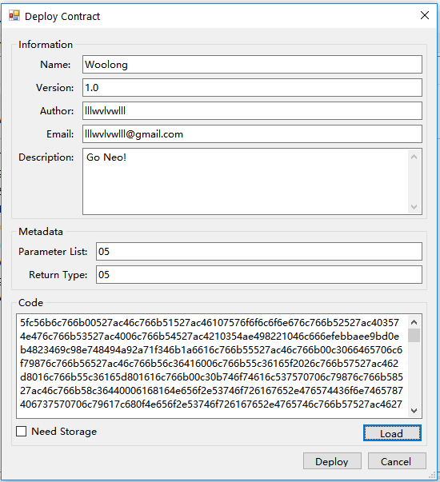

# Deploying a Smart Contract with Parameters

## 1 - Introduction
This tutorial is designed to cover how to deploy and invoke a smart contract on the NEO blockchain using the desktop GUI.  The tutorial is generic and is appropriate for all contract types including NEP5 tokens.  This tutorial assumes that the contract has already been compiled into a .avm file.  If it has not, please reference the other tutorials first.  A compiled version of the contract and the source used in this tutorial are provided.  

## 2 - Useful Resources

The following resources are used in this tutorial and can be helful references when developing a smart contract:

1. [Lock2](Lock2.md)
2. [Parameter](Parameter.md)
3. [Woolong NEP5 Smart Contract](assets/examples/woolong.cs.md)
4. [Developer GUI](https://github.com/CityOfZion/neo-gui-developer)
5. [Neo API](../api/neo.md)
6. [NEP5 Token Standard](https://github.com/neo-project/proposals/pull/4)

## 3 - SC Code
This document will be using the example code provided in the Woolong example to walk through the tutorial.  For fun, this contract will generate 1 Woolong for every invoke event.

The example has been deployed on the testnet and can be accessed at the following script hash: 
​    
	dc675afc61a7c0f7b3d2682bf6e1d8ed865a0e5f
​	

## 4 - Deploying a Smart Contract with Parameters

1. To deploy the smart contract (.avm) on the blockchain, click on the **Advanced** menu option on the NEO desktop wallet and select **Deploy Contract**.  FOr development contracts, we recommend using the NEO development GUI.

<p align="center"></p>

2. Populate all of the fields in the **Information** section of the window that appears.  All fields must be populated to deploy the contract.
3. Load the .avm file using the **Load** buttton.  The **code field** will be populated with the script hash.  Copy the contents of the **Code** field for use in a later step.
4. Populate the **Metadata** fields referencing the [Parameter](Parameter.md) documentation.

    **The Woolong example token is defined as:**  

    ```csharp
    public static object Main(string method, params object[] args)  
    ```

    So we use:  
    * **Parameter List:** 0710
    * **Return Type:** 05

5. If the contract requires storage (uses the [Read/Write API](../api/neo.md#readwrite-api)), check the **Need Storage** box.  The NEP5 standard uses storage to maintain accounts so make sure this is checked when deploying a NEP5 token.

6. Click the **Deploy** button.


## 5 - Watching the Smart Contract   

1. On the main NEO wallet window, right click on the address area and select (Create Contract Add > Custom)
2. Select the Account that you want to associate the Contract with from the **Related Account** dropdown
3. In the **Parameter List** field, populate the **Parameter List** values used in Step 4 of the **Deploy Smart Contract w/ Parameters** sections.
4. Populate the **Script** field with the value provided in Step 3 of **Deploy Smart Contract w/ Parameters**.
5. Click **Confirm** to load the contract into the wallet window.


## 6 - Invoking the Smart Contract

To invoke a smart contract on the NEO blockchain, you will need the smart contract script hash. 
1. To acquire the contract hash, right click on the contract account populated in the address window as a result of the **Watching the Smart Contract** window.
2. Select **View Contract** to open a window containing information about the smart contract.  Copy the value in the **Script Hash** field.
3. Click on the **Advanced** menu option and select **Invoke Contract**.
4. Populate the **Script Hash** field with the value copied in Step 2.  As an example, you can invoke the Woolong using the script hash in **Section 3**
5. The Smart Contract information should automatically populate in the remaining **Invoke Function** fields.
6. To populate the input parameters, click on the **...** button next the the Parameters field to open the parameter population menu.
7. Select the parameters on the left field and populate the variable values in the lower right field.

  **For example, invoking the following:**
  * `6e616d65` when calling the Woolong, will return 'Woolong'.
    ```csharp
    if (method == "name") return name;
    ```
  * `73796d626f6c` will return 'WNG'.
    ```csharp
     if (method == "symbol") return symbol;
    ```
  * `62616c616e63654f66, 5fe459481de7b82f0636542ffe5445072f9357a1261515d6d3173c07c762743b` will return the current balance of Woolong that lllwvlvwll holds on the testnet.
    ```csharp
    if (method == "balanceOf") return Storage.Get(Storage.CurrentContext, (byte[]) args[0]);
    ```

8. Click **OK** to close the parameter input window.
9. Click the **Invoke** button to invoke the smart contract.

**Note:** The current standard desktop GUI does not support viewing returns.  Using the developer GUI is recommended when executing the events.

 
