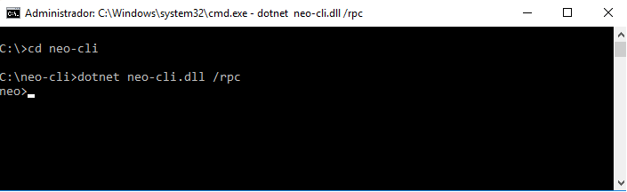
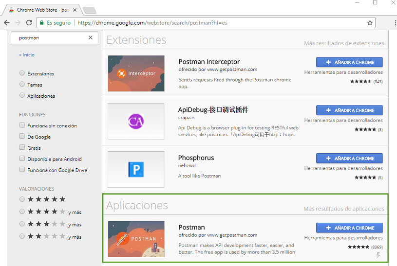

# Referencia de la API

`NEO-cli` proporciona una interfaz API para obtener datos de la cadena de bloque, lo que facilita el desarrollo de aplicaciones blockchain. Esta interfaz se proporciona a través de [JSON-RPC](http://wiki.geekdream.com/Specification/json-rpc_2.0.html) y usa el protocolo **HTTP/HTTPS** para la comunicación. Para iniciar en un nodo el servicio RPC, se debe  ejecutar el siguiente comando:

`dotnet neo-cli.dll /rpc`




Para acceder al servidor RPC a través de HTTPS hay que modificar el archivo de configuración `config.json` antes de ejecutar `NEO-cli` y configurar el nombre del dominio, certificado y contraseña.

```json
{
  "ApplicationConfiguration": {
    "DataDirectoryPath": "Chain",
    "NodePort": 10333,
    "WsPort": 10334,
    "UriPrefix": [ "https://*:10331", "http://*:10332" ],
    "SslCert": "YourSslCertFile.xxx",
    "SslCertPassword": "YourPassword"
  }
}                                          
```

Después de que el servidor JSON-RPC arranque, monitorizará los siguientes puertos, correspondientes a la red principal (MainNet) y/o a la red de pruebas (TestNet):

Para información sobre los tipos de clientes, [click aquí](introduction.md)

|                | Red principal (MainNet) | Red de pruebas （TestNet） |
| -------------- | ------------ | ------------- |
| JSON-RPC HTTPS | 10331        | 20331         |
| JSON-RPC HTTP  | 10332        | 20332         |

## Funciones API

| Comando                                       | Referencia                                     | Explicación                         | Comentario       |
| ---------------------------------------- | --------------------------------------- | -------------------------- | -------- |
| [dumpprivkey](api/dumpprivkey.md)          | \<address>                             |Devuelve la clave privada de en función de una cuenta especificada.   | Necesita abrir el monedero.   |
| [getaccountstate](api/getaccountstate.md)          | \<hash>                             |Devuelve el estado de la cuenta.   |
| [getassetstate](api/getassetstate.md)          | \<hash>                             |Devuelve el estado del activo.   |
| [getbalance](api/getbalance.md)          | \<asset_id>                             |Devuelve el balance del activo correspodiente en el monedero en función del número del activo especificado.   | Necesita abrir el monedero.   |
| [getbestblockhash](api/getbestblockhash.md) |                                         | Obtiene el hash del bloque más alto de la cadena principal.     |          |
| [getblock](api/getblock.md)              | \<hash> [verbose=0]                     | Devuelve la información de bloque correspodiente en función del bloque-hash especificado.  |          |
| [getblock](api/getblock2.md)             | \<index> [verbose=0]                    | Devuelve la información de bloque correspodiente en función del índice especificado.          |          |
| [getblockcount](api/getblockcount.md)    |                                         | Obtiene el número de bloques de la cadena principal.                 |          |
| [getblockhash](api/getblockhash.md)      | \<index>                                | Devuelve el valor hash del bloque en función del índice especificado.         |          |
| [getblocksysfee](api/getblocksysfee.md)          | \<hash>            |Devuelve la tarifa del bloque.   ||
| [getconnectioncount](api/getconnectioncount.md) |                                         | Obtiene el número de conexiones del nodo.                 |          |
| [getcontractstate](api/getcontractstate.md)          | \<hash>        |Devuelve el estado del contrato.  |
| [getnewaddress](api/getnewaddress.md)          |                              | Crea una cuenta estandar.   | Necesita abrir el monedero.   |
| [getpeers](api/getpeers.md)          |         | Devuelve la lista de pares que estan conectados, desconectados o con problemas.  |
| [getrawmempool](api/getrawmempool.md)    |                                         | Obtiene la lista de transacciones no confirmadas de la memoria.            |          |
| [getrawtransaction](api/getrawtransaction.md) | \<txid> [verbose=0]                     | Devuelve la información de la correspondiente transacción en función del valor hash de la transacción especificado.         |          |
| [getstorage](api/getstorage.md)          | \<hash> \<key>                            |Devuelve el valor del almacenamiento en funcion al script hash y clave especificado.   |
| [gettxout](api/gettxout.md)              | \<txid> \<n>                            | Devuelve la información de la correspondiente transacción en función del valor hash de la transacción y del índice especificado.  |          |
| [sendmany](api/sendmany.md)   |   \<asset> \<value> \<address>       | Permite realizar tranferencias por lote a más de una cuenta.   | Necesita abrir el monedero.   |
| [sendrawtransaction](api/sendrawtransaction.md) | \<hex>                                  | Transmite una transacción a la red. Ver la documentación de [network protocol](network-protocol.md).                       |          |
| [sendtoaddress](api/sendtoaddress.md)    | \<asset_id> \<address> \<value> [fee=0] | Transferir al monedero especificado.                     | Necesita abrir el monedero.   |
| [submitblock](api/submitblock.md)  | \<hex> | Envia nuevos bloques. Necesita ser un nodo consenso. |
| [validateaddress](api/validateaddress.md)          | \<hash>                             |Valida la cuenta.  |


## Ejemplo de petición GET

A continuación se muestra un ejemplo de cómo obtener el números de bloques de la cadena principal usando la función `getblock`. La petición, es una petición GET JSON-RPC.

Petición:

```
http://nodo:10332?jsonrpc=2.0&method=getblockcount&params=[]&id=1
```

Despues de enviar la petición, recibirás la siguiente respuesta:

```json
{
  "jsonrpc": "2.0",
  "id": 1,
  "result": 909129
}
```

## Ejemplo de petición POST


A continuación se muestra un ejemplo de cómo obtener el bloque más alto (height) de la cadena principal usando la función `getblockcount`. La petición es del tipo POST JSON-RPC.


URL:

```
http://nodo:10332
```

Petición POST：

```json
{
  "jsonrpc": "2.0",
  "method": "getblockcount",
  "params":[],
  "id": 1
}
```

Despues de enviar la petición, recibirás la siguiente respuesta:

```json
{
  "jsonrpc": "2.0",
  "id": 1,
  "result": 909122
}
```

## Herramientas de pruebas

Puedes usar la extensión de Chrome **Postman** para facilitar las pruebas. La instalación de la extensión Chrome requiere de una conexió a Internet.




## Otros

[C# JSON-RPC Lista de Comandos](https://github.com/chenzhitong/CSharp-JSON-RPC/blob/master/json_rpc/Program.cs)

