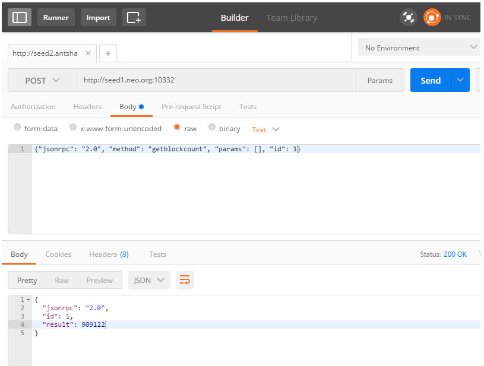

# Referencia de la API

`NEO-cli` proporciona una interfaz API para obtener datos de la cadena de bloque, lo que facilita el desarrollo de aplicaciones blockchain. Esta interfaz se proporciona a través de [JSON-RPC](http://wiki.geekdream.com/Specification/json-rpc_2.0.html) y usa el protocolo usa **HTTP/HTTPS** para la comunicación. Para iniciar en un nodo el servicio RPC, ejecute el siguiente comando:

`dotnet neo-cli.dll /rpc`


Para acceder al servidor RPC a través de HTTPS, debe modificar el archivo de configuración `config.json` antes de ejecutar `NEO-cli` y configurar el nombre del dominio, certificado y la contraseña:

```json
{
  "ApplicationConfiguration": {
    "DataDirectoryPath": "Chain",
    "NodePort": 10333,
    "WsPort": 10334,
    "UriPrefix": [ "https://*:10331", "http://*:10332" ],
    "SslCert": "YourSslCertFile.xxx",
    "SslCertPassword": "YourPassword"
  }
}                                          
```

Después de que el servidor JSON-RPC arranque, monitorizará los siguientes puertos, correspondientes a la red principal (MainNet) y a la red de pruebas (TestNet):

Para información P2P y WebSocket ver [Node/Introduction](introduction.md)。

|                | Red principal (MainNet) | Red de pruebas （TestNet） |
| -------------- | ------------ | ------------- |
| JSON-RPC HTTPS | 10331        | 20331         |
| JSON-RPC HTTP  | 10332        | 20332         |

## Lista de comandos

| Comando                                       | Referencia                                     | Explicación                         | Comentario       |
| ---------------------------------------- | --------------------------------------- | -------------------------- | -------- |
| [getbalance](api/getbalance.md)          | \<asset_id>                             |Obtiene el balance del activo correspondiente en el monedero de acuerdo con el numero del activo especificado.   | Necesita abrir el monedero.   |
| [getbestblockhash](api/getbestblockhash.md) |                                         | Obtiene el hash del bloque más alto de la cadena principal.     |          |
| [getblock](api/getblock.md)              | \<hash> [verbose=0]                     | Devuelve la información de bloque correspodiente de acuerdo con el valor hash especificado.  |          |
| [getblock](api/getblock2.md)             | \<index> [verbose=0]                    | Devuelve la información de bloque correspondiente al índice especificado.          |          |
| [getblockcount](api/getblockcount.md)    |                                         | Obtiene el numero de bloques de la cadena principal.                 |          |
| [getblockhash](api/getblockhash.md)      | \<index>                                | Devuelve el valor hash al correspondiente bloque en base al índice especificado.         |          |
| [getconnectioncount](api/getconnectioncount.md) |                                         | Obtiene el numero de conexiones de nodo actual.                 |          |
| [getrawmempool](api/getrawmempool.md)    |                                         | Obtiene una lista de transacciones no reconocidas en memoria.            |          |
| [getrawtransaction](api/getrawtransaction.md) | \<txid> [verbose=0]                     | Devuelve la información de la correspondiente transacción en base al valor hash especificado.         |          |
| [gettxout](api/gettxout.md)              | \<txid> \<n>                            | Devuelve la salida de la correspondiente transacción en base al hash y al índice especificado. |          |
| [sendrawtransaction](api/sendrawtransaction.md) | \<hex>                                  | Transmite una transacción a la red. Ver la documentación de [network protocol](network-protocol.md).                       |          |
| [sendtoaddress](api/sendtoaddress.md)    | \<asset_id> \<address> \<value> [fee=0] | Transferir al monedero especificado.                     | Necesita abrir el monedero.   |
| [submitblock](api/submitblock.md)  | \<hex> | Envia nuevos bloques. Necesita ser un nodo consenso. |

## Ejemplo de petición GET

Un formato de petición GET JSON-RPC típico es el siguiente:

A continuación se muestra un ejemplo de cómo obtener el número de bloques en la cadena principal.


Petición URL:

```
http://nodo.net:10332?jsonrpc=2.0&method=getblockcount&params=[]&id=1
```

Despues de enviar la petición, recibirás la siguiente respuesta:

```json
{
  "jsonrpc": "2.0",
  "id": 1,
  "result": 909129
}
```

## Ejemplo de petición POST

Un formato de petición POST JSON-RPC típico es el siguiente:

A continuación se muestra un ejemplo de cómo obtener el número de bloques en la cadena principal.


Petición URL:

```
http://nodo.net:10332
```

Cuerpo de la petición：

```json
{
  "jsonrpc": "2.0",
  "method": "getblockcount",
  "params":[],
  "id": 1
}
```

Despues de enviar la petición, recibirás la siguiente respuesta:

```json
{
  "jsonrpc": "2.0",
  "id": 1,
  "result": 909122
}
```

## Herramientas de pruebas

Puedes usar la extensión de Chrome **Postman** para facilitar las pruebas (La instalación de la extensión Chrome requiere de una conexió a Internet), lo siguiente es una captura de pantalla de prueba:





## Otros

[C# JSON-RPC Lista de Comandos](https://github.com/chenzhitong/CSharp-JSON-RPC/blob/master/json_rpc/Program.cs)

