# Instrucciones de uso del cliente NEO-gui

## Descripción

### Introducción

Las version Windows compatibles con el cliente son: `Windows 7 Sp1` / `Windows 8 `/ `Windows 10.`

El cliente no necesita instalación. Descárgalo y ejecútalo haciendo doble-click sobre el ejecutable `neo-gui.exe`. Si el programa no se ejecuta de forma correcta, por favor guarda el archivo `error.log` y contacta con el staff técnico para que te asista.

> [!Note]
> Las versiones anteriores a Windows10 requiere la instalación de [.NET Framework 4.6.2](https://www.microsoft.com/net/download/framework).

### Sincronización

El cliente debe estar totalmente sincronizado antes de usarlo. En la parte inferior izquierda el apartado `Height` debe tener el mismo valor, distinto a cero y el número de conexiones aumentado de forma progresiva.

La primera sincronización puede durar entre **24-48 horas.**

> [!TIP] 
> Posibles razones por las cuales el cliente no sincroniza:
> * Un Firewall/Proxy está bloqueado la conexiones salientes. Revisa que tu equipo puede hacer conexiones a los puertos 
> [10331-10334]
> * Antivirus/IDS está bloqueado el cliente. Revisa que el ejecutable `neo-gui.exe` está excluido.

### Glosario

#### Monedero

El monedero guarda la información de tus monedas NEO, del NeoGas y la información de tu cuenta en un fichero de base de datos
con extensión `.Db3`. Este fichero es muy importante y requiere que realices copia de seguridad.

> [!IMPORTANT] 
> La perdida de este fichero resultará la perdida de todos tus activos. Por favor, asegurate de guardar este fichero de forma segura y de recordar la contraseña del monedero.

#### Cuenta

Se usa para rastrear activos en un bloque NEO. 
La información que contiene es: dirección, tipo, clave privada y clave pública.  

**1.** Dirección: Es lo equivalente a tu cuenta bancaria o al número de tarjeta, se usa para recibir activos durante las transacciones.

**2.** Tipo de cuentas: 

   * Cuenta Básica: Consiste en una clave pública cuya dirección de cuenta es multi-firma 1-de-1.
   
   * Cuenta Multifirma: consiste en multiples claves publicas cuya dirección de cuenta es multi-firma m-de-n. 
   Se usa para contratos inteligentes.
    
**3.** Clave privada: Un número aleatorio de 256-bits guardado por el usuario y no expuesto públicamente, representa al propietario de la cuenta y sus activos.

**4.** Clave pública: Cada clave privada tiene su clave pública (Nota: la clave pública y la privada se pueden visualizar, click  el botón derecho sobre la dirección.)

> [!IMPORTANT] 
> De ninguna manera la clave privada debe ser expuesta a otros. En el momento que la clave privada se filtra, puede resultar
> perdida de todos los activos.

#### Activos

Los activos de la cuenta. Información de los activos, siendo: Activo (NEO, NeoGas, o activos creados por otros usuarios), el tipo, balance, y el emisor.

#### Historial de transacciones

Es un registro de todas las transacciones asociadas con la cuenta.

#### Transferencia

Trasferencia de un activo a una dirección destino. 

#### Transacción

Realiza el intercambio de activos, ambas partes tienen que confirmar antes que el intercambio exitoso de activos se realice.

#### Firmar información

Firmar información, confirmar la información por el firmante. Para las transacciones que implican la asignación de capital y la transferencia de activos, la firma requiere una prueba de conformidad de las parte involucradas.

#### Registro de activos

Creación de un activo emitido por el usuario en la red NEO. El usuario puede definir el tipo, nombre, total,
de un activo y especificar la cuenta del administrador del activo. La creación de activos consume una cierta
cantidad de NEO asi como una cantidad de NeoGas.

#### Distribuir activos

Dentro del limite de la cantidad establecida por el creador del activo, el activo se puede emitir a la dirección
espeficiada por el emisor. La distribución de activos consume NeoGas.

#### Elección

Aquellos que quieran ser contadores en NEO deben registrarse por eleción. Deben pagar una cierta cantidad de NEO.Los candidatos deben recibir calificaciones para poder se contadores. Esta función actualmente no está disponible.

#### Votar

Los poseedores de NEO pueden votar por los candidatos a contadores y determinar los acreedores en base a los resultados. Esta funcion actualmente no está disponible. 

#### Emisión 

Después de la firma la información de la transacción se transmite a toda la red, donde la confirmación por un nodo completa la transacción. En este momento, esta característica sólo esta disponible en la opción firma (Signature)

#### Monitorizar dirección (Watch-Only)

Te permite importar una dirección y monitorizarla. También te permite ver los activos.

## Monedero
### Crear el fichero de base de datos del monedero

1. Click en `Wallet`, click en `New Wallet Database`. Una vez pulsado aparecerá la ventana `New Wallet` y click en `Browser`

2. Seleciona una ubicación donde crear el fichero. Escribe el nombre del fichero y click en `Guardar`.

> [!IMPORTANT] 
> Asegúrate de guarda el fichero en un lugar seguro y hacer copias de seguridad

3. Introduce la conseña en `Password` y repitela en `Re-Password` y click en `Confirm`. Una vez pulsado `Confirm` el monedero creará por defecto un dirección estandard.

> [!IMPORTANT] 
> Introduce una contraseña compleja y anota la contraseña en un lugar seguro.

### Abrir el fichero base de datos

1. Cada vez que el cliente se abre se debe abrir el fichero base de datos del monedero. 
Click en `Wallet`, click en `Open Wallet Database` y seleciona el fichero del monedero. Por defecto aparece el ultimo monedero abierto e introduce la contraseña y click en `Confirm`

Si el fichero del monedero tiene errores, puedes intentar abrir el fichero selecionando la opción `repair mode`

### Cambiar la contraseña

Esta opción se usa para cambiar la contraseña del fichero del monedero.

> [!IMPORTANT] 
> Al cambiar la contraseña recuerda volver hacer una copia de seguridad del fichero del monedero porque la anterior copia 
> tendrá asociada la contraseña anterior.

### Recrear los índices del monedero.

Esta opción se usa para restaurar errores en el cliente cuando ocurre una excepción. 

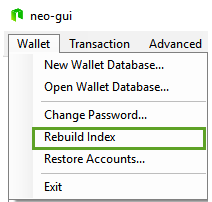

Los índinces del momendero se deben recrear en los siguientes casos:
  
  1. Después de importar la clave privada.
  
  2. Una transación que no ha sido confirmada desde hace tiempo.
  
  3. Los activos del monedero dan un error y los datos de la blockchain no coinciden.
  
  
Como el tamaño del bloque actualmente es grande, recrear los índices del monedero puede tardar varios minutos. Por favor, se paciente.

### Restaurar cuenta

Esta opción se usa para restaurar una dirección del fichero del monedero donde accidentalmente se ha borrado una dirección y sus activos. Cabe señalar que generalmente no se recomienda operativas de eliminar dentro del cliente para evitar la pérdida de activos.

## Transacciones

### Transferir

#### Transferencia de NeoGas

Pasos para transferir NeoGas

1. Click on the `Transaction` y click en `Transfer`. 

2. Click en el botón `[+]`. En `Asset` seleciona `NeoGas` en `Pay to` la dirección donde enviar los tokens y el `Amount`
la cantidad, y pulsa `OK`

3. Click en `OK` para tranferrir los tokens.

#### Tranferencia de Neo

1. Click on the `Transaction` y click en `Transfer`. 

2. Click en el botón `[+]`. En `Asset` seleciona `NEO` en `Pay to` la dirección donde enviar los tokens y el `Amount`
la cantidad, y pulsa `OK`

3. Click en `OK` para tranferrir los activos.

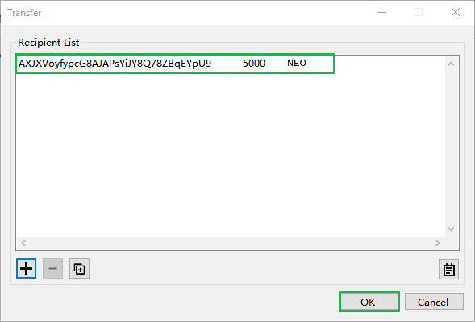

#### Transferencias por lote

Esta funcionalidad se usa para simplificar la transferencia desde el mismo activo a diferentes direcciones.

Hay que introducir la dirección y la cantidad separada de un espacio. Tal y como se muestra en la imagen.

Cabe señalar que el formato debe ajustarse a lo anteriormente indicado, siendo: `dirección (un espacio) cantidad`. Un espacio extra puede llevar a un error en la transferencia.

Una vez introducida, pulsa `OK`

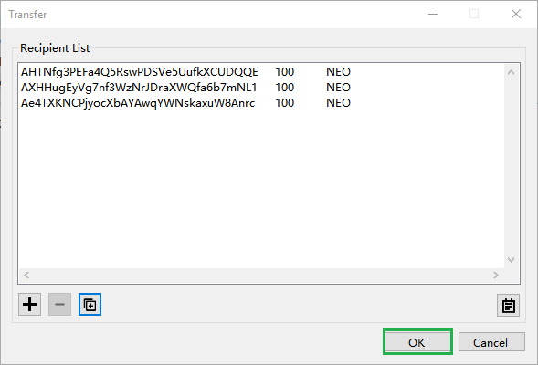

#### Observaciones

Esta función se usa para establecer información en la transación de la blockchain de NEO. Actualmente, puede usar el siguiente explorador de blockchain [AntChain](https://www.antchain.xyz/) para visualizar esta información.

### Transacciones (X)

#### Iniciar un acuerdo / Cerrar un acuerdo

Para iniciar un acuerdo deben existir una aprobación entre las dos partes. 

**Parte A**

1. Click on the `Transaction` y click en `Transaction X`. En `Pay To` indica la dirección de la otra parte y click en el botón `[+]`. En la ventada de Payment indica el `Asset` en mi ejemplo 'MyToken' y en `Amount` la catidad, en mi ejemplo 5 y click en `Initiate`

2. Al hacer click, nos aparecerá la ventada `Trade Request`, copiamos el codigo y click en `Close`. 

3. Una vez cerrada nos aparecerá la ventana de `Merge tx. request`. Aqui tendremos que pegar el codigo de la otra parte, parte, que debera decidir cuanto pagará.

**Parte B**

4. Para eso, la otra parte debe realizar el mismo proceso e indicar cuanto le pagaremos, en nuestro ejemplo, por 5 MyToken. Click on the `Transaction` y click en `Transaction X`. En `Pay To` indica la dirección de la otra parte y click en el botón `[+]`. En la ventada de Payment indica el `Asset` en mi ejemplo 'NEO' y en `Amount` la catidad, en mi pagaremos 1 NEO por 5 MyToken y click en `Initiate`

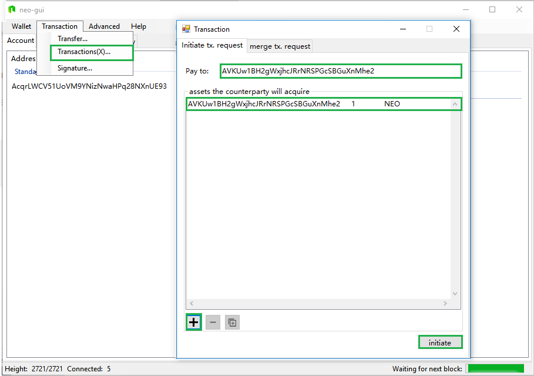

5. Al hacer click, nos aparecerá la ventada `Trade Request`, copiamos el código y click en `Close`.

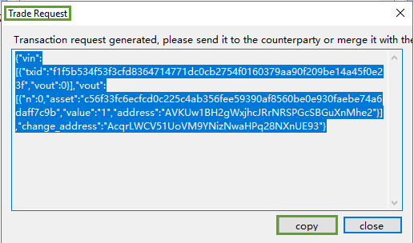

**Parte A**

6. El código anterior lo pegaremos en el apartado `Merge tx. request` y click en `Validate`.

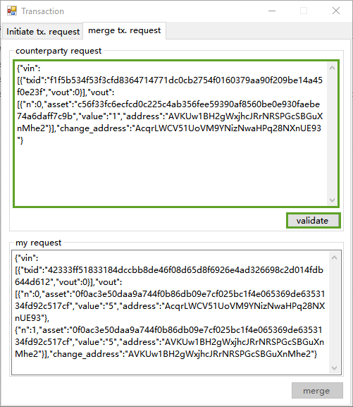

7. A hacer click nos aparecerá la ventana `Transaction Verification`, seleccionamos el activo y click en `Accept`

8. Una vez aceptado, click en `Merge`.

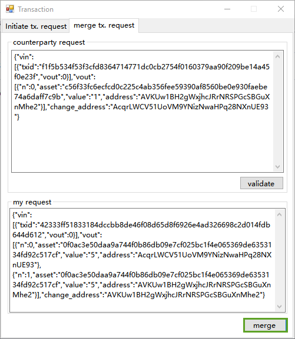

9. Nos aparecerá la ventana `Need Signature` y copiamos el código.

**Parte B**

9. El código anterior lo pegaremos en el apartado `Merge tx. request` y click en `Validate`.

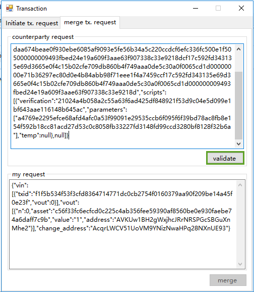

10. A hacer click nos aparecerá la ventana `Transaction Verification`, seleccionamos el activo y click en `Accept`

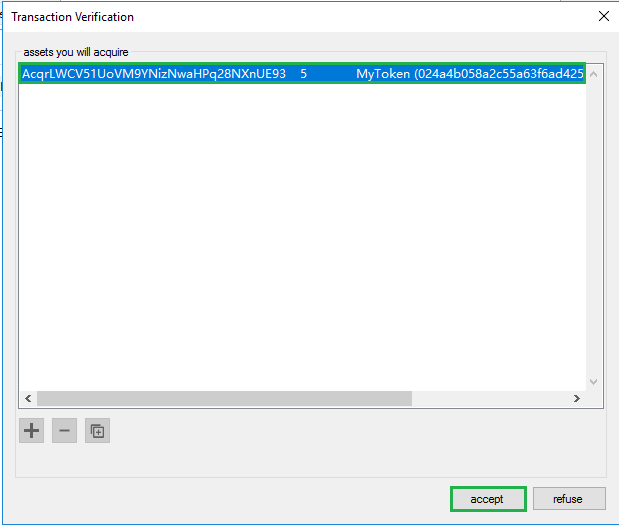

11. Una vez aceptado, click en `Merge`.

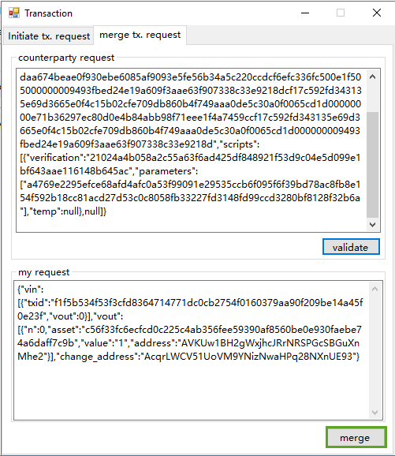

12. Si todo ha ido bien, nos aparecerá la ventana `Trade Success` y click en `Close`

13. En el apartado `Asset`veremos nuestros activos que acabamos de acordar con la otra parte.

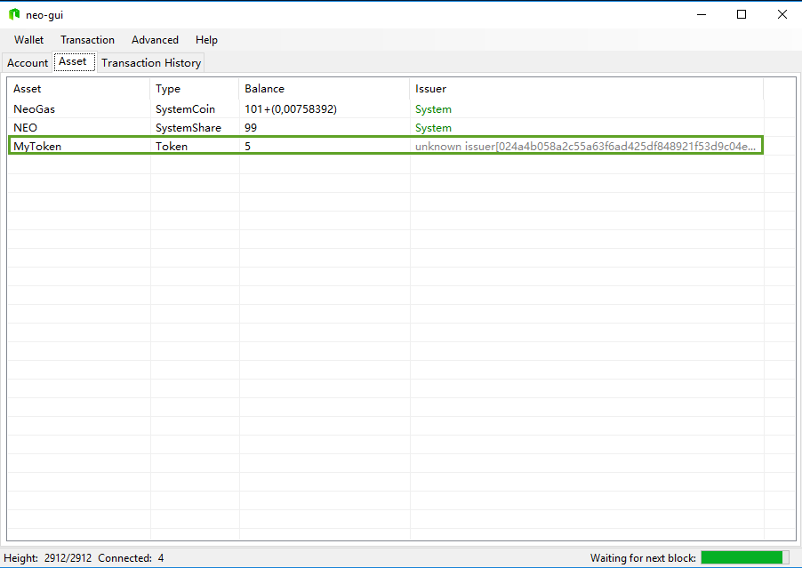

#### Firma

Transaciones deben ser firmadas por otra o varias parte(s). El codigo recibido debe ser pegado dentro del
apartado `Input` y una vez pegado, click en `Signature`.

Si se ha llegado al número de firmas necesarias nos aparecerá el botón `Broadcast`para completar la transación. Click en `Broadcast` para enviar transación.

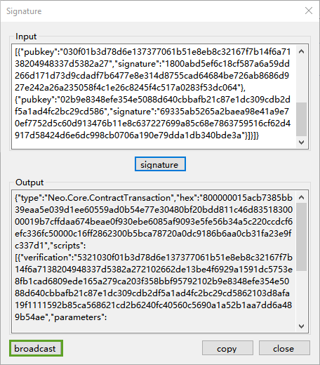

Si la transación se ha realizado con exito, se nos muestra una ventana de confirmación.

## Avanzado

### Reclamar NeoGas

NeoGas son generados por cada bloque nuevo y se registrarán en la direcciónes de los titulares/poseedores de NEO. En el apartado de activos `Asset` el número dentro de los parentesis es el saldo de NeoGas que pueden ser reclamado.

En cualquiero momento los poseedores de NEO pueden iniciar el proceso de reclamo para canjear los NeoGas en la dirección correpodiente de NEOs. De momento, unicamente la vesión PC `neo-gui` tiene la funcionalidad de reclamar NeoGas.

Los pasos especificos son los siguientes:

1. Transfiere todos los NEOs dentro del monedero usando una operación de transferencia. Es posible enviar los NEOs directamente a la dirección actual. 

      * Vamos al barra de menu, apartado Avanzado `Advanced`y click en `NeoGas Claim` nos aparecen el botón `Claim All` en
      gris. No podemos reclamar hasta que nos realicemos uns tranferencia de los NEOs. En nuestro ejemplo **vamos a transferir 
      los NEOs directamentea a la misma cuenta para poder reclamar los NeoGas.**
       
      
      
      
      * Desde el menu `Trasanction`, click en `Tranfer` y realizamos una tranferencia de todos los NEOs a la misma cuenta tal y 
      como podemos ver en la imagen.
       
      
      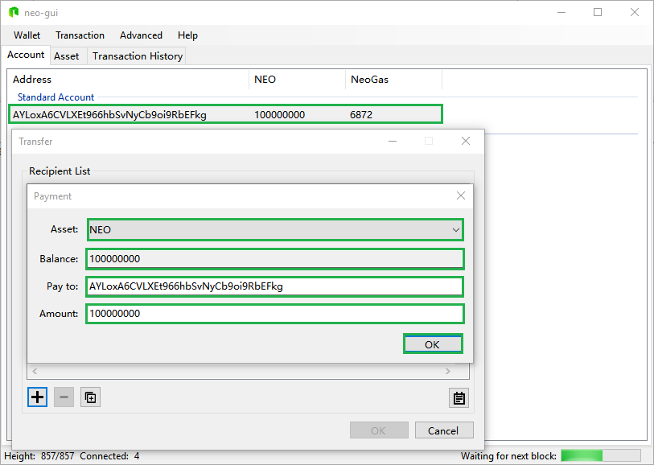
      
      * Una vez realizada la tranferencia, volvemos al menu Avanzado `Advanced`, click en `NeoGas Claim` y ahora click en `Claim 
      All` 
       
      
      
      * Una vez realizada la reclamación podemos ver los NeoGas en la dirección.
       
      
      

### Solicitar un certificado

> [!IMPORTANT] 
> La funcionalidad de solicitar e importar certificado NO está soportada en la versión actual.

Esta funcionalidad unicamente te permite generar el archivo para aplicación de certificado. Es necesario aplicar en una autorizad certificadora para obtener el certificado.

Click en `Advanced` y click en `Request Certificate` y rellena los campos. 

Click en `Ok`y le indicamos donde guardar el archivo.

Una vez generado el archivo aplicaremos el fichero en una entidad certificadores para que nos emitan el certificado. Una vez emitido importaremos el certificado en el almacén **Personal**.

/

Una vez importado, click en la dirección con el botón derecho, click en `Import` y click en `Import from Certificate`, selecionamos el certificado y click en `Ok`.

### Registrar activos

Existen dos tipos de activos. Tokens y Share. En este ejemplo vamos a registrar un activo del tipo Token.

Click en `Advanced` y click en `Asset Registration`. En `Asset Type` indica el tipo de activo, en nuestro ejemplo "Token",
y rellena los campos, y click en `Ok`

El regitro de activos requiere una cantidad de NeoGas. Click en `Test` para saber la tarifa, y click en `Invoke` si queremos registrar el registro.

Si la transacción se ha realizado bien, nos aparecerá una ventana con el Id. de la transacción. Ese Id. de transacción lo usaremos en el siguiente apartado para distribuir activos.

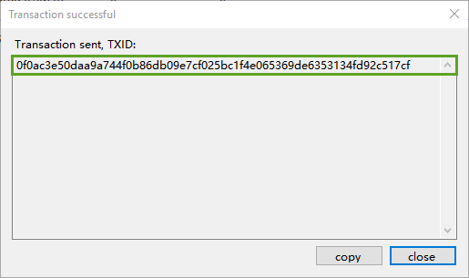

### Distribución de activos

Click en `Advanced` y click en `Asset Distribution`. En el apartado `Asset Id` insertamos el Id. de la transacción anterior.
y click en el símbolo `[+]`

En `Pay To` indicamos la dirección donde vamos a distribuir los activos y la cantidad a distribuir. 
Click en `Ok`y click en `Confirm`

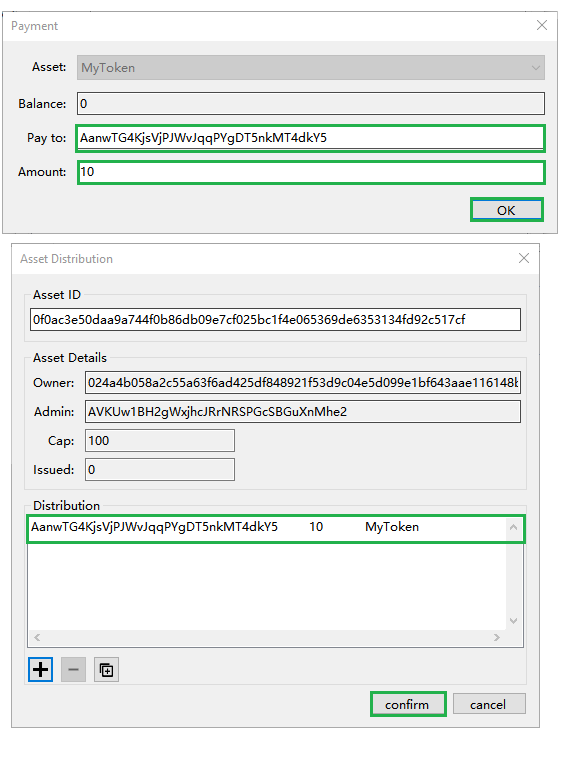

Una vez distribuido, en la dirección destino, apartado `Asset` verá los assets que le acabamos de distribuir.

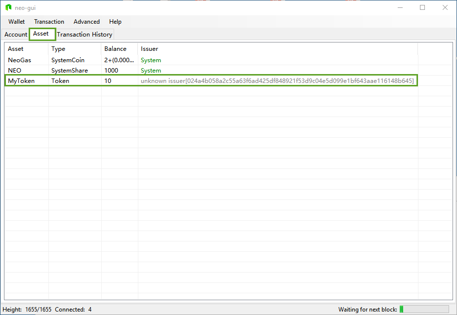

### Desplegar contratos

Vamos a desplegar un contrato. En nuestro ejemplo vamos a deplegar un cotrato creado en la sección [Contratos Inteligentes](../sc/getting-started.md)

Click en `Advanced` y click en `Deploy Contract`. Rellenamos todos los campos.

En en apartado `Code` podemos pegar el código o bien cargar fichero, en nuestro ejemplo cargaremos el contrato inteligente. 

Click en `Load` y selecionamos el fichero del contrato inteligente a cargar y click en `Deploy`.

En la siguiente pantalla click en `Test` para saber la tarifa por generar un contrato en la blockchain, y click en `Invoke`

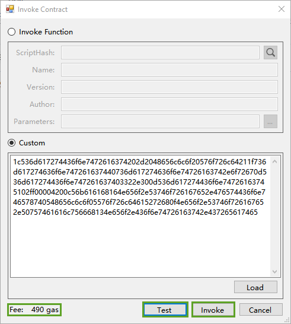

Si la transacción se ha realizado con éxito, nos aparecerá una ventana con el identificador de la transacción.

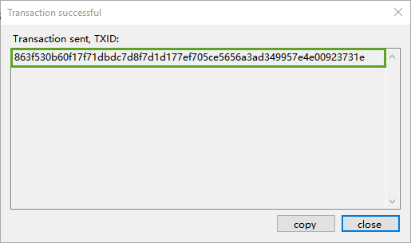

En la pestaña `Transaction History` podemos ver como se ha desplegado correctamente y el estado de las confirmaciones.

### Invocar un contrato

En nuestro ejemplo, vamos a invocar el contrator anteriormente desplegado.

Click en `Advanced` y click en `Invoke Contract`. En el apartado `Code` pegamos el codigo anterior que se generó al desplegar el contrato. Click en `Test` para saber la tarifa por invocar el contrato y click en `Invoke`

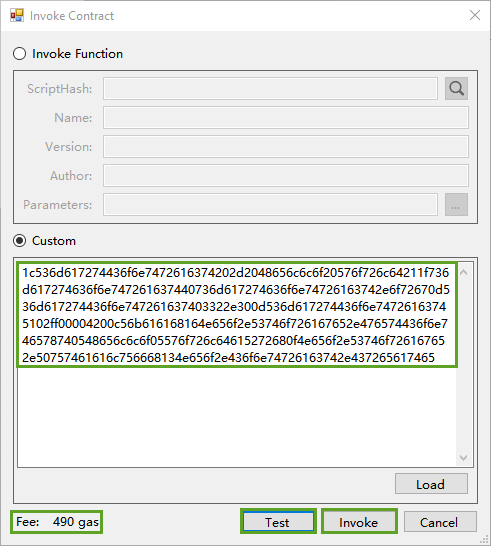

Una vez invocado nos aparecerá un mensaje de confirmación.

En la pestaña `Transaction History` podemos ver como se ha desplegado correctamente y el estado de las confirmaciones.

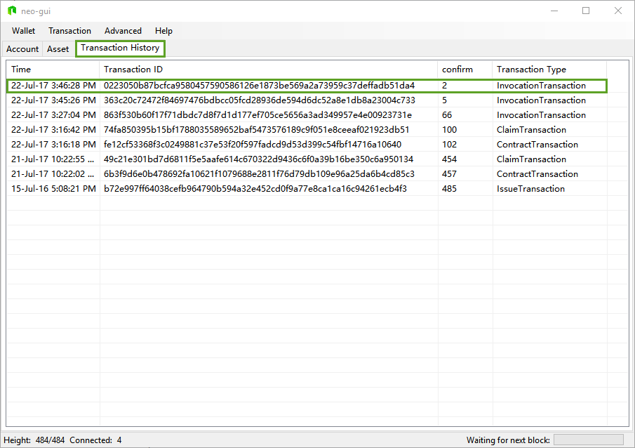

### Elección

Esta funcion se usa para registrar un candidato en la blockchain como bookkeeper. (revisar si es registrar o votar)

> [!IMPORTANT] 
> La función de elegir un candidato como bookeeper o nodo consenso no está disponible en la actual versión.

Click en `Advanced` y click en `Election`

El regitro de activos requiere una cantidad de NeoGas. En la red principal (MainNet) la tarifa es 1000 NeoGas y en la red de pruebas (TestNet) de 10 NeoGas.

### Sincronización offline del Monedero

Descagar los bloques del siguiente enlace [https://www.neo.org/client/chain.acc.zip](https://www.neo.org/client/chain.acc.zip) 

Una vez descargado asegurate que el cliente no se está ejecutando y deja el fichero en la raiz del directorio donde se encuentra el ejecutable `Neo-gui.exe`. Al iniciar el cliente, el cliente descromprimirá el fichero zip y comenzará a cargar los bloques.

>

Una vez cargado los bloques el programa eliminará el fichero zip.

>

### 4.8 Opciones

## Ayuda

### Comprobar ayuda

Pendiente / To be Added.

### Official Web

Salta a la página oficinal de NEO.

### Developer Tool

Pendiente / To be Added.

### About NEO

Muestra la versión del cliente NEO.
