# Creación de una blockchain privada

El desarrollo de una blockchain privada NEO requiere el mínimo de cuatro servidores para llegar a un consenso, donde cada servidor corresponde a nodo consenso y dispone de un monedero dedicado.

## Laboratorio de pruebas

|  **Nombre**        | **Dirección IP/DNS** | **Sistema operativo** | **Observaciones**
| -------------- | ---------------- | ----------------- |--------------|
| **privatechain1**  | privatechain1.neolab.local  | Win 2016 Server | neo-cli - privatechain1.db3 |
| **privatechain2**  | privatechain2.neolab.local  | Win 2016 Server | neo-cli - privatechain2.db3 |
| **privatechain3**  | privatechain3.neolab.local  | Win 2016 Server | neo-cli - privatechain3.db3 |
| **privatechain4**  | privatechain4.neolab.local  | Win 2016 Server | neo-cli - privatechain4.db3 |
| **neoscan**  | neoscan.neolab.local        | Ubuntu 16.04.2 LTS        |Opcional| 
| **pc**  | pc.neolab.local        | NEO-gui / Visual Studio |Opcional|

## 1. Configuracion de la máquina virtual

Para fines demostrativos, he creado cuatro servidores virtuales en Azure, el tamaño es `Standard_DS1 v2` (1 core, con 3.5 GB RAM). Puedes desplegar la blockchain privada en una LAN o en Maquinas virtuales.


Despues de crear las maquinas virtuales, abre los puertos 10331-10334, accede a la configuración `firewall` `advanced setting` `inbound rules`, para establecer nuevas reglas y añade los puertos 10331-10334.

> [!Nota]<br>
> Si creas una maquina virtual en un entorno cloud, logeate en el panel de administración de la máquinas virtuales y configura los grupos de seguridad.
>
> En Azure la configuración es: `network interface` `network security group` `inbound security rules` `add` y añade los puertos 10331-10334.
>

Una vez que las maquina virtual han sido creadas anota las direcciones IP para su uso posterior.

## 2. Instalación de un nodo NEO

El proceso de instalación de un nodo NEO ha sido descrito anteriormente. Por favor, consulta las instrucciones de instalación [Setup](setup.md).

## 3. Crear monederos

Primero hemos creados cuatro ficheros de monedero llamados `privatechain1.db3 - privatechain4.db3.` Este paso puede ser creado tanto con la versión de PC como con la versión de línea de comandos. La siguiente imagen es usando la línea de comandos.

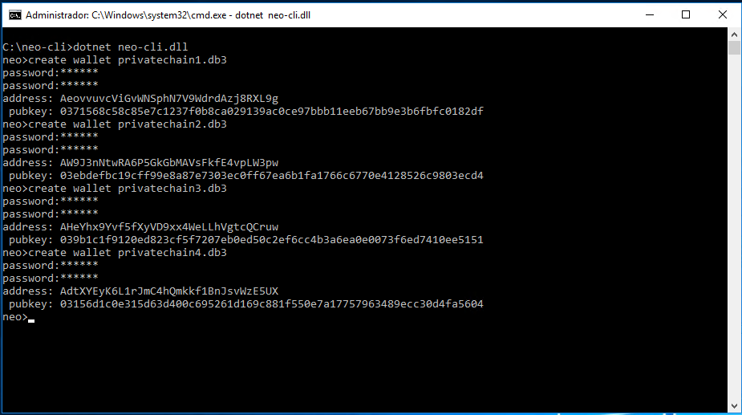

Una vez que los monederos han sido creado y su correspondiente clave publica guardada, cópiala en el portapapeles y por ejemplo guardala en un fichero txt, o usa el comando `list key` vía [CLI Command](cli.md)

A continuación, copia los cuatro monederos a los directorios de las máquinas virtuales.

## 4. Modificar los ficheros de configuració de los nodos

  Accede al directorio donde se encuenta el cliente CLI y modifica el fichero `protocol.json` con los siguientes parametros. 
  
  Primero modifica el valor de `Magic`. El valor `Magic` se usa para identificar el origen de la red del mensaje, al especificar el mismo valor `Magic` nos aseguramos que los mensajes se reciben en la misma red y no se envian a otra distinta.

> [!Nota]
><br>
> El tipo de Magic es uint, el valor a introducir debe ser del rango. [0 - 4294967295].
> <br>
 
  Modifica el valor `StandbyValidators`. Hay que introducir las 4 claves publicas anotadas en el paso 3.
  Finalmente mofificar el valor `SeedList`, introduce las direcciones IPs de los nodos, el numero de puerto se matiene sin cambios. 
  
  A modo de ejemplo, nuestra configuración es la siguiente:
  
```json
{
  "ProtocolConfiguration": {
    "Magic": 12345678,
    "AddressVersion": 23,
    "StandbyValidators": [
      "0371568c58c85e7c1237f0b8ca029139ac0ce97bbb11eeb67bb9e3b6fbfc0182df",
      "03ebdefbc19cff99e8a87e7303ec0ff67ea6b1fa1766c6770e4128526c9803ecd4",
      "039b1c1f9120ed823cf5f7207eb0ed50c2ef6cc4b3a6ea0e0073f6ed7410ee5151",
      "03156d1c0e315d63d400c695261d169c881f550e7a17757963489ecc30d4fa5604"
      ],
    "SeedList": [
      "privatechain1.neolab.local:10333",
      "privatechain2.neolab.local:10333",
      "privatechain3.neolab.local:10333",
      "privatechain4.neolab.local:10333"
      ],
    "SystemFee": {
      "EnrollmentTransaction": 1000,
      "IssueTransaction": 500,
      "PublishTransaction": 500,
      "RegisterTransaction": 10000
    }
  }
}

```

El valor `SystemList` es la tarifa del sistema. La tarifa se paga en NeoGas. Puede establecer la tarifa de tu blockchain privada modificando esos valores.

:zap: 
**Importante: Una vez modificado el fichero `protocol.json` sustituyelo en los 4 nodos, en el directorio donde se encuentra el cliente NEO-cli**

Una vez sustituido el fichero de configuración en los cuatro nodos, introduce los siguiente comandos para arrancar el nodo, abrir el monedero y ejecutar el conseso. Revisa la línea de comandos aquí [CLI Command Reference](cli.md).

Arrancar el cliente:<br>
:point_right:`dotnet neo-cli.dll`

Abrir el monedero:<br>
:point_right:`open wallet privatechain1.db3`

>[!Nota] Se debe abrir el monedero correspondiente al nodo.

Ejecutar consenso:<br>
:point_right:`start consensus`

## Ejecución paso a paso en los cuatro nodos

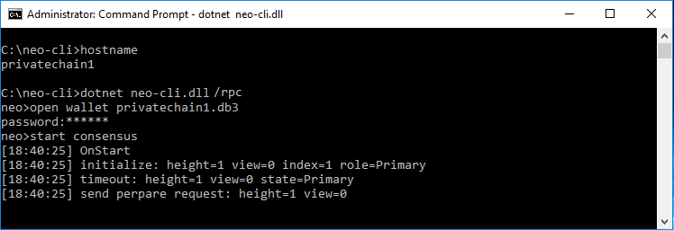
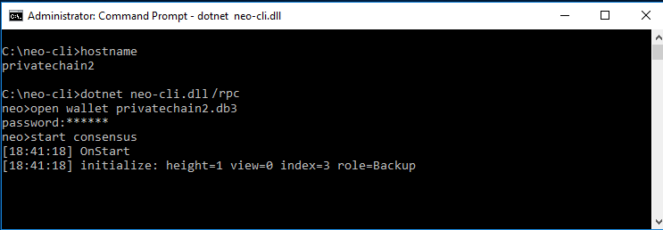
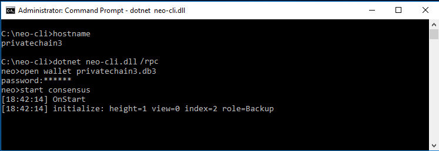


Si la operación anterior se ha ejecutado de forma correcta el proceso consenso se ejecutará en los cuatro nodos, tal y como se muestra en la imagen.

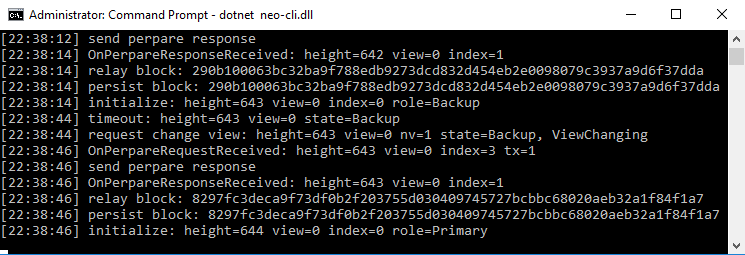

En la siguiente imagen se muestra como 1 nodo han sido apagado y todavia se consigue consenso:


## 5. Extraer NEO y NeoGas

Instala la versión cliente PC `NEO-gui` y modifica el fichero de configuración `protocol.json` con los paramentros del paso 4 para conectar a la blockchain privada.

Abre el monedero. Para comprobar que nos hemos conectado correctamente a la blockchain privada en la parte inferior izquierda el tamaño de bloque `Height` no es cero y el número conexiones `Connected` corresponde al numero de nodos en nuestra blockchain privada, en nuestro ejemplo 4 nodos.


Abre el fichero del monedero `privatechain1.db3` click derecho sobre la dirección y click en `Create Contract Add.` y click en `Multi-Signature.` 


Introduce las cuatro claves publicas apuntadas en el paso 4. Para eso, introduce la clave y pulsa el simbolo `[+]` **Una vez introducida las 4 claves publicas**, modifica el parametro número mínimo de firmas `Min.Sig.Num` a 3, siendo `(número de nodos consensos/2 + 1)`, tal y como se muestra en la imagen.


:zap: 
**Debe hacer la misma operación anterior en los 4 monederos: crear un cuenta contrato multi-firma y añadir las 4 claves publicas.**
**Paso a paso:** 
  * Abrir el monedero `privatechain2.db3` click en `Create Contract Add` click en `Multi-Signature` y añade las 4 claves publicas.
  * Abrir el monedero `privatechain3.db3` click en `Create Contract Add` click en `Multi-Signature` y añade las 4 claves publicas.
  * Abrir el monedero `privatechain4.db3` click en `Create Contract Add` click en `Multi-Signature` y añade las 4 claves publicas

Una vez introducidas las claves publicas, abre nuevamente el monedero `privatechain1.db3` y recrea los indices, click en la barra del menu `Wallet` y click en `Rebuild Index`. 

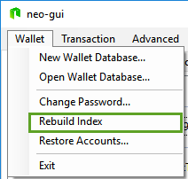

Una vez recreados los indices aparecerá la dirección de contrato con 100 millones de NEOs.


Una vez realizado el paso anterior debemos tranferir los NEO de la dirección de contrato a la dirección nomal. Para eso, abre cualquiera de los cuatro monederos. (en mi ejemplo, abriré el primer monedero `privatechain1.db3`

Click en la barra del menu `Transaction` y click en `Transfer` e introduce la dirección de la cuenta estandard para transferir los 100 millones de NEOs a esa dirección. Click en OK.


El sistema mostrará el siguiente mensaje `Transaction initiated, but the signature is incompleted`. 

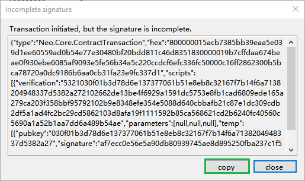

Copia el codigo. Click en `Copy` y abre otro monedero distinto, en mi ejemplo el fichero `privatechain2.db3`, click en la barra del menu `Transaction` y click en `Signature`

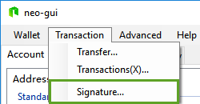

Pega el codigo que anteriormente has copiado. Click `Signature` y vuelte a copiar el codigo de salida `Output`, click en `Copy`

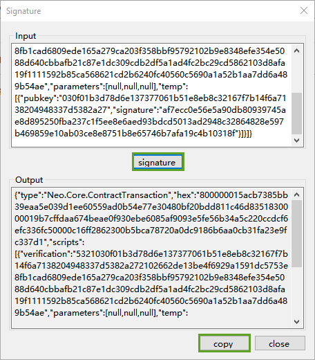

Nuevamente abre otro monedero distinto, en mi ejemplo el fichero `privatechain3.db3`, click en la barra del menu `Transaction` y click en `Signature` y pega el codigo anteriormente copiado y click en `Signature`. En este momento aparecerá un botón `Broadcast` que significa que la transación se ha completado (Se ha alcanzado el número mínimo de firmas requerido para el contrato). En este momento la transación puede ser emitida. Click en `Broadcast`. 

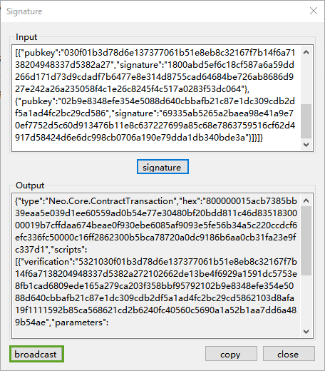

La operación puede tardar unos 15 segundos para ver la tranferencia realizada. Una vez esperado ese tiempo abre el fichero del monedero `privatechain1.db3` para ver las monedas recibidas en la cuenta normal.

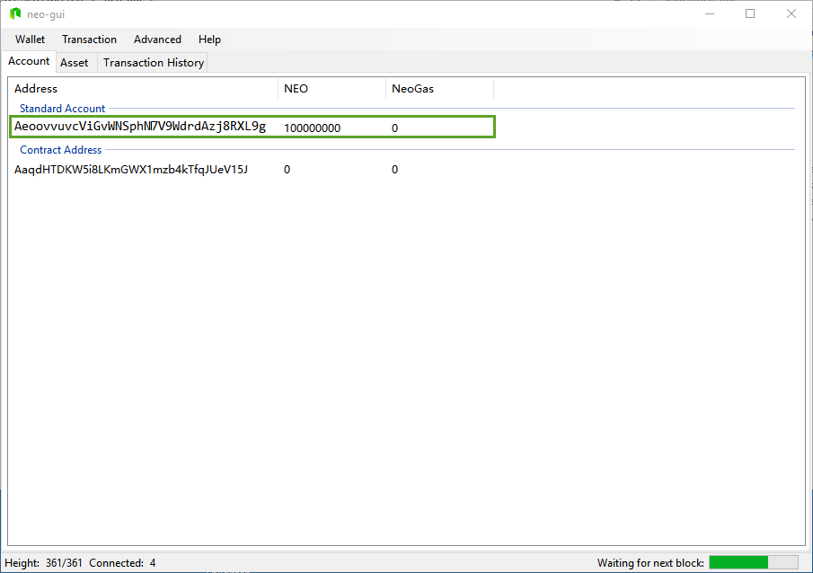

La operación para extraer los NeoGas es similar. Abre el primer fichero monedero `privatechain1.db3` y click en el barra de `Advanced` y click en `NeoGas Claim`,


Click en `Claim All`


Una vez pulsado del botón `Claim All`. Nos aparecerá el siguiente mensaje:

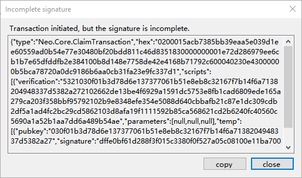

La operación es similar a la de transferir NEOs. Copia el codigo de firma incompleta, abre el fichero del segundo monedero `privatechain2.db3` click en la barra de menu y click en `Transaction` y `Signature` y pega el codigo anteriormente copiado.
Una vez copiado, copia el codigo de salida `Output`. Abre otro monedero, en mi caso `privatechain3.db3` click en la barra del menu `Transaction` y click en `Signature` y pega el codigo anteriormente copiado y click en `Signature`.

Una vez copiado aparecerá el botón de Broadcast `Broadcast` y la transación puede ser emitida. Click en `Broadcast`.

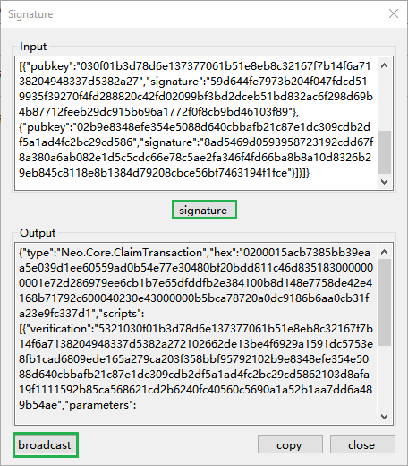

La operación puede tardar unos 15 segundos para ver la tranferencia realizada. Una vez esperado ese tiempo abre el fichero del monedero `privatechain1.db3` y recrea los indices del monedero.


Una vez recreado los indices veremos los NeoGas.

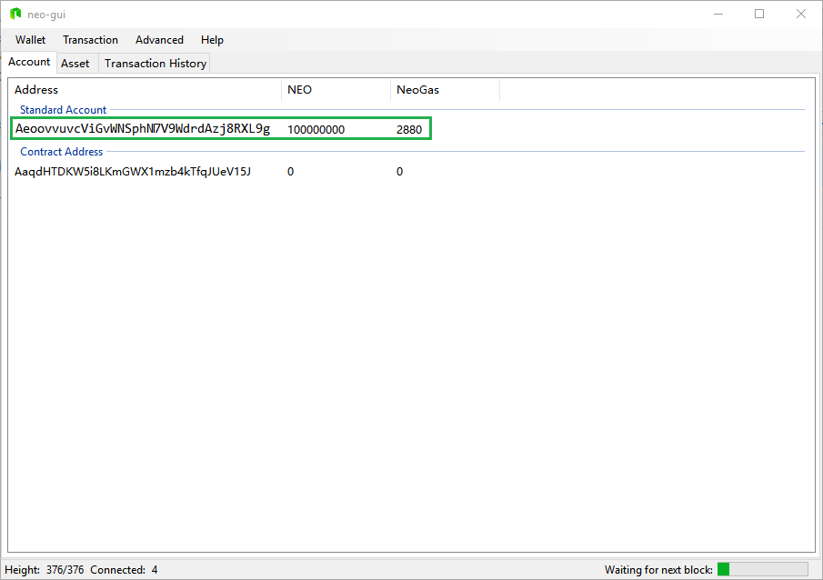


## 6. Instalación de NeoScan (Opcional)

NeoScan es un explorador blockchain para NEO. Ha sido diseñado y creado por la comunidad de desarrollo **City of Zion** que promueve el desarrollo de la plataforma. Puedes encontrar más información aquí, [City of Zion](https://github.com/CityOfZion)

>[Nota] NeoScan NO es parte del proyecto NEO. En caso de incidencia o colaboracion dirígite a la comunidad de desarrollo 
> **City of Zion.**

# Pasos de instalación

1. Descarga e instala la distribución Linux [Ubuntu 16.04.2 LTS](http://releases.ubuntu.com/16.04/)
2. Una vez instalada sigue los siguiente pasos de instalación:
  
  **Erlang**
  ```
  sudo wget https://packages.erlang-solutions.com/erlang-solutions_1.0_all.deb 
  sudo dpkg -i erlang-solutions_1.0_all.deb
  sudo apt-get update
  sudo apt-get install make ssh unzip
  sudo apt-get install esl-erlang elixir
  sudo mix local.hex
  ```
  
  **NodeJS**
  ```
  sudo curl -sL https://deb.nodesource.com/setup_6.x | sudo -E bash -
  sudo apt-get update
  sudo apt-get install nodejs
  ```
  
  **Postgres**
  ```
  sudo apt-get install postgresql postgresql-client
  ```
  
  **Establecer la contraseña del usuario "postgres"**
  
  _por defecto NEOScan usa en Postgres como usuario y password **'postgres/postgres'**. Puedes cambiar la contraseña en el fichero `dev.exs` en la siguiente ruta: **'/neo-scan/apps/neoscan/config/dev.exs'**_
  ```
  sudo postgres psql
  \password postgres
  ...
  \q
  ```
  
  **Phoenix**
  ```
  sudo mix archive.install https://github.com/phoenixframework/archives/raw/master/phoenix_new.ez
  ```
  
  **Descargar NeoScan**
  ```
  sudo wget https://github.com/CityOfZion/neo-scan/archive/master.zip
  sudo unzip master.zip -d /
  sudo mv /neo-scan-master/ /neo-scan
  ```
 
 **Configuración de NeoScan**
  ```
 cd /neo-scan
 sudo mix deps.get
 sudo mix ecto.create
 sudo mix ecto.migrate
 cd /neo-scan/apps/neoscan/assets
 sudo npm install
 ```
 
 **Configuración de la ips de los nodos de nuestra blockchain privada**
 
 _Asegúrate que han arrancado los nodos con la opción rpc: **'neo-gui.dll /rpc'** edita el fichero `http.ex` y configura las 4 ips de los nodos_
 
 ```
 sudo vi /neo-scan/apps/neoscan/lib/neoscan/HttpCalls/http.ex
 ```
 
 ```
 def url(index \\ 0) do
     %{
       2 => "http://privatechain1.neolab.local:10332",
       3 => "http://privatechain2.neolab.local:10332",
       1 => "http://privatechain3.neolab.local:10332",
       0 => "http://privatechain4.neolab.local:10332",
     }
    |> Map.get(index)
  end
  
 ```
 
 
**Arrancamos Phoenix**

```
cd /neo-scan
sudo mix phx.server
```
 
**NeoScan**

Desde el navegador web, accedemos a la ip del servidor y al puerto 4000, en mi ejemplo: http://neoscan.neolab.local:4000


