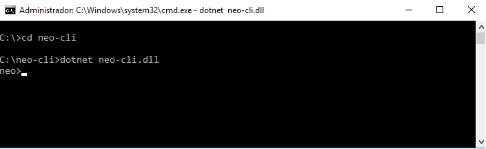
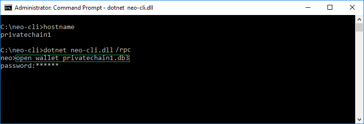
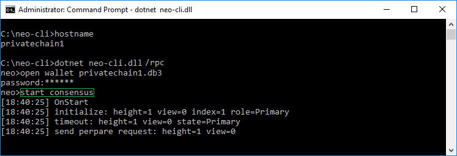

# Instalación del nodo de NEO

Existen dos tipos de nodos para la red NEO. Uno es [NEO-cli](https://github.com/neo-project/neo-cli/releases) (el cliente en modo línea de comandos - para el desarrollador) y el otro el [NEO-gui](https://www.neo.org/download) (el cliente gráfico - para el usuario avanzado)

Para el desplegar un nodo consenso se usa el cliente `NEO-cli`. Un programa multi-plataforma que se ejecuta en Windows, Linux y en un cotenedor Docker.

|                                   | NEO-cli |
| --------------------------------- | ----------------- |
| Windows 7 SP1 x64                 | ✅                 |
| Windows Server 2008 R2 SP1        | ✅                 |
| Red Hat Enterprise Linux 7 Server | ✅                 |
| Ubuntu 14.04, 16.04, 16.10        | ✅                 |
| Debian 8                          | ✅                 |
| Fedora 23, 24                     | ✅                 |
| CentOS 7.1 & Oracle Linux 7.1     | ✅                 |
| openSUSE 13.2, 42.1               | ✅                 |
| Docker                            | ✅                 |

> [!Nota]
> De momento el nodo NEO no funciona de forma correcta bajo macOS. En un futuro habrá soporte para esta plataforma, por favor espera a las próximas actualizaciones.

## Ejecutar el entorno

Ejecutar el nodo NEO requiere la instalación de [.NET Core Runtime](https://www.microsoft.com/net/download/core#/runtime), la **versión 1.1.2** o superior.

### Instalación en un entorno Windows

La instalación de .NET Core Runtime en un sistema Windows es muy sencilla, simplemente descárgalo y ejecútalo.

### Instalación en un entorno Linux

A continuación se muestra como instalar .NET Core en Red Hat Enterprise Linux 7 Server:

> [!Nota]
> Para la instalación de .NET Core en otras distribuciones Linux consulta el siguiente enlace [.NET Core installation tutorial](https://www.snetnet/core#linuxredhat) :boom: (Broken Link)


```
subscription-manager repos --enable = rhel-7-server-dotnet-rpms
yum install scl-utils
```

```
yum install rh-dotnetcore11
scl enable rh-dotnetcore11 bash
```

Una vez que la instalación se ha completado, ejecuta el siguiente comando para comprobar que el entorno .NET Core se ha instalado de forma correcta.

```
dotnet new console -o hwapp
cd hwapp
dotnet restore
dotnet run
```

Si muestra la salida **"Hello World!"** la instalación de .NET Core ha sido realizada correctamente.

## Instalación de un nodo NEO

1. Descaga el paquete [NEO-cli](https://github.com/neo-project/neo-cli/releases) de Github y descomprímelo.

> [!Nota]
> Si intentas descargar y compilar el código de NEO-cli de Github, encontraras que `dotnet neo-cli.dll` se ejecuta de forma incorrecta tras compilarlo. Necesitas copiar `libleveldb.dll` y `sqlite3.dll` en el mismo directorio donde se encuentra el fichero `neo-cli.dll`. Estos dos ficheros se pueden descargar previo a descargar el paquete.

2. Desde la línea de comandos, ir al directorio del programa, y ejecuta el siguiente comando para arrancar el nodo NEO. 

```
dotnet neo-cli.dll
```



> [Nota!]
> Opcional. NEO-cli proporciona una serie de APIs para el acceso externo. Si quiere arrancar el nodo y abrir el acceso a 
>esta APIs, ejecuta el siguiente comando. Más información, consulta [API](api.md)

```
dotnet neo-cli.dll /rpc
```


> [Nota!]
> Si quiere que un programa externo acceda a las APIs del nodo necesitas abrir los puertos del firewall: 10331-10334 y 20331-20334.

3. Una vez ejecutado, abre un monedero con el comando `open wallet`.
> [Nota!] El monedero debe haberse creado anteriormente. 



4. Inicia el modo consenso con el comando `start consensus`, tal y como muestra la imagen:




