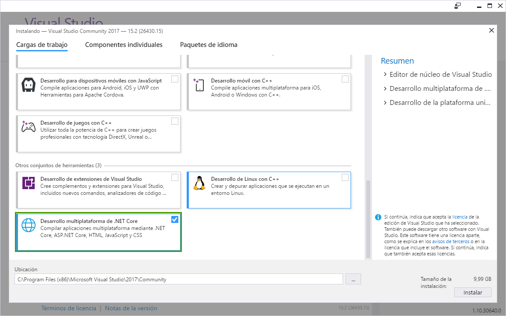
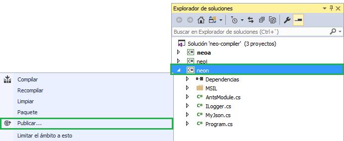
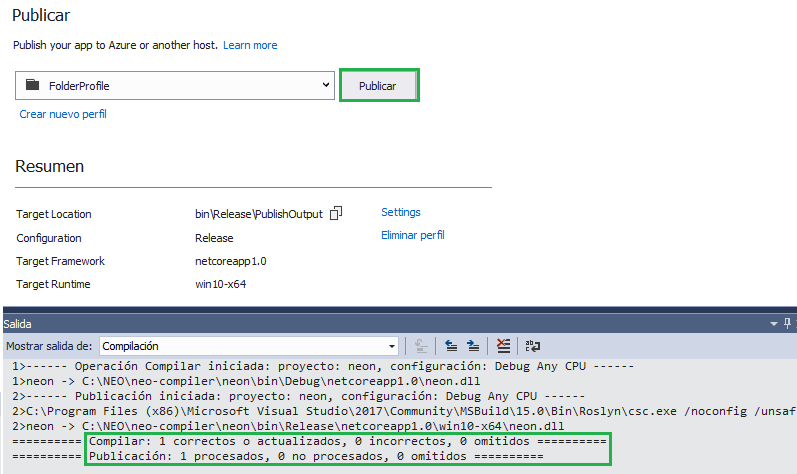
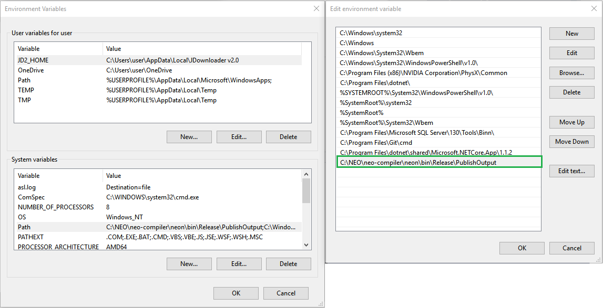
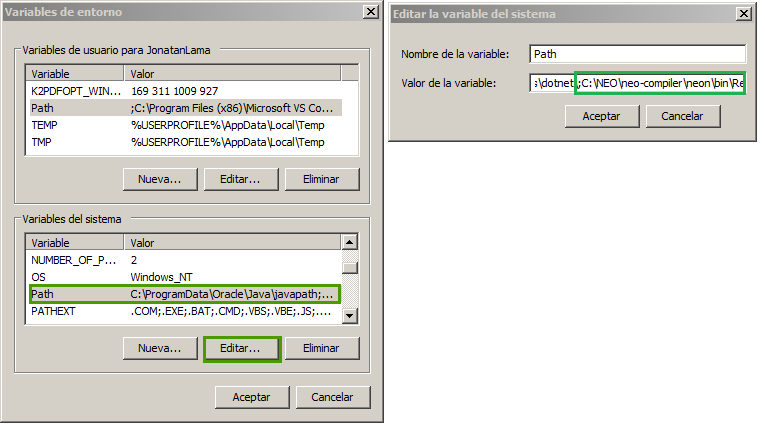

### Crear un Contrato Inteligente NEO con C#

Esta sección contiene un pequeño tutorial que guía al desarrollador la configuración del entorno de desarrollo en C# y le ofrece una idea de cómo crear un proyecto para crear y compilar un contrato inteligente.


> [!NOTE]
> Actualmente todos los proyectos han sido actualizados a la versión Visual Studio 2017. 

## Herramientas de desarrollo

### 1. Visual Studio 2017

Si ya se tiene instalado Visual Studio 2017 junto con la opción `Desarrollo Multiplataforma de .Net Core`, se puede omitir este punto. Descarga e instalación: [Visual Studio 2017](https://www.visualstudio.com/products/visual-studio-community-vs)

El proceso de instalación es muy sencillo, basta con seguir el asistente, teniendo en cuenta que debe de estar marcada la opción de `Desarrollo Multiplataforma de .Net Core`. La instalación de Visual Studio podría llevar entre diez minutos a una hora.




### 2. Plug-in NEOContract

El plug-in NEOContract nos permitirá compilar y generar contratos inteligentes en Visual Studio.

Pasos de instalación:

Abre Visual Studio 2017 y desde la barra de menú, clic en `Herramientas` y clic en `Extensiones y Actualizaciones`. En la ventana Extensiones, clic en `En línea` y en el apartado de la derecha, en el campo de búsqueda, introduce `Antshares` y pulsa Enter.

Una vez finalizada la búsqueda, aparecerá `NeoContractPlugin`. Click en `Descargar` para iniciar la descarga del plugin.


### 3. NEOCompiler.MSIL

Instalación y configuración:

Descarga el proyecto [NEO-compiler](https://github.com/neo-project/neo-compiler) de GitHub, abre la solución en Visual Studio 2107 y publica `neon` (el compilador MSIL). Botón derecho del ratón y click en `Publicar` tal y como se muestra en la imagen:



Por defecto publicará en mismo directorio del proyecto, en la carpeta: `bin\Release\PublishOutput`


Click en `Publicar`



Una vez compilado y publicado sin errores debemos añadir la ruta de la publicación en el PATH del sistema. La varible PATH es una variable del SO que el sistema usa para localizar los ficheros necesarios para la ejecución de programas.

**Windows 10 y Windows 8**

  Para modificar la variable PATH del sistema: 
  Boton derecho en el bottón de `Inicio -> Panel de control -> Sistema y Seguridad -> Sistema -> Configuración avanzada del Sistema -> Opciones avanzadas -> Variables de entorno`
  
   En el apartado `Variables del Sistema` selecciona `Path`, click en `Editar` y click en `Nuevo` e introduce el path donde se en encuentre el fichero `neon.exe`, en mi ejemplo en: `C:\NEO\neo-compiler\neon\bin\Release\PublishOutput`
 
 
  

**Windows 7**

  Para modificar la variable PATH del sistema: 
  `Panel de control -> Sistema y Seguridad -> Sistema -> Configuración avanzada del Sistema -> Opciones avanzadas -> Variables de entorno`
  
  En el apartado `Variables del Sistema` selecciona `Path` y click en `Editar` e introduce el path donde se encuentre el fichero `neon.exe`,  en mi ejemplo en: `;C:\NEO\neo-compiler\neon\bin\Release\PublishOutput`. Una vez modificar, pulsa `Aceptar` en todas las ventanas.
 
> [!IMPORTANT] Cuando se añade una ruta adicional en Windows 7 el PATH debe empezar con un punto y coma ';'
 


  Desde el línea de comandos o la Powershell introduce `neon.exe`. Si no hay errores en la salida debería aparecer la versión del compilador (tay como se muestra en la imagen). La variable de entorno PATH para el compilador `neon` está bien configurada.
  


> [!NOTE]
> En Windows 7 SP1 puede aparecer el siguiente error "Unhandled Exception: System.DllNotFoundException: Unable to load DLL 'api-ms-win-core-console-l2-1-0.dll': The specified module could not be found". 
> 
> La libreria **'api-ms-win-core-console-l2-1-0.dll'** sólo se encuentra en Windows 8 o versiones posteriores. Para solucionar el problema obten una copía de la libreria **'api-ms-win-core-console-l2-1-0.dll'** y cópiala en el directorio `c:\Windows\System32`

## Crear un proyecto

Después de la configuración, puedes crear un proyecto plantilla `NEOContract` desde Visual Studio.

Para eso, click en `Achivo`, click en `Nuevo`y click en `Proyecto`. Una vez que nos aparezca la ventada del proyecto,
selecionamos en la parte izquierda `Pantillas`y `Visual C#` tal y como se muestra en la imagen:


Selecciona `NeoContract` y configura los directorios de proyecto y click en `Aceptar`. Una vez creado el proyecto, de forma automática nos gerará el fichero C#, la clase por defecto hereda de **FunctionCode** tal y como se muestra:


## Compilar el proyecto.

Ahora todo está listo para agregar el método entrada que define el contrato inteligente:

```c#
public class Contract1: FunctionCode
{
    public static void Main () 
    {
        
    }
}
```

Una vez compilado con éxito verá `SmartContract1.avm` en el directorio `bin\Debug`, que es el archivo que se genera cuando se crea un contrato inteligente NEO.


Ahora que has completado la configuración del entorno de desarollo de contratos inteligentes de NEO, consulte el tutorial [Tutorial contratos inteligentes NEO](tutorial.md)
