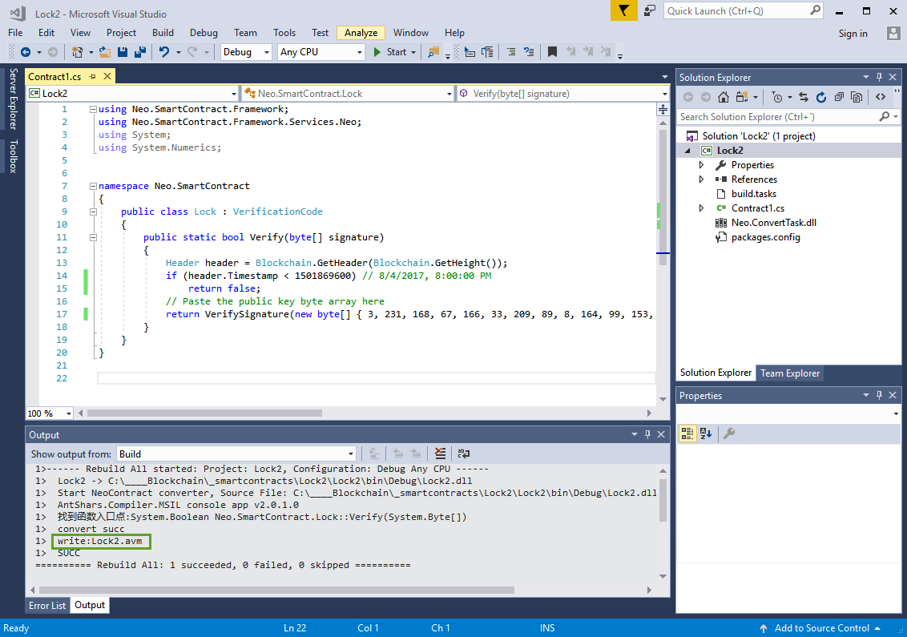
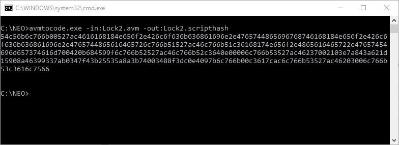
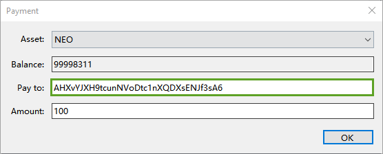
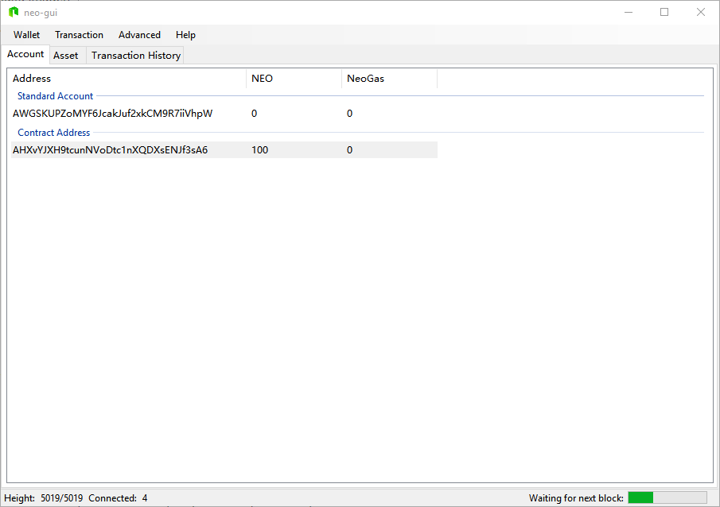
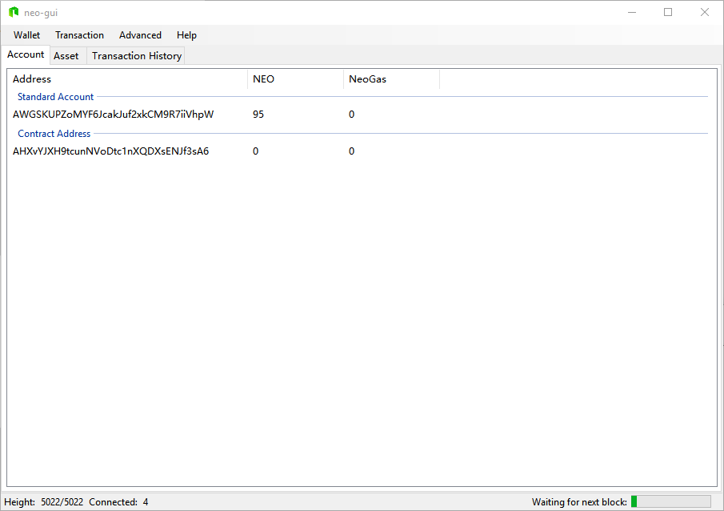
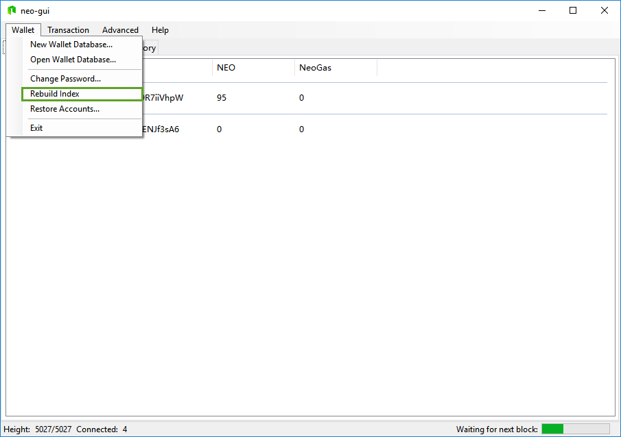
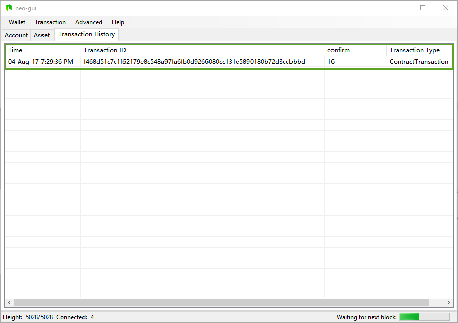
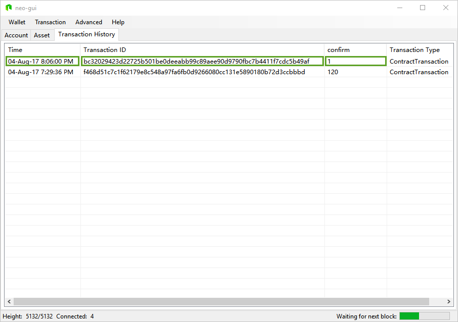

# Ejemplo de contrato inteligente - Lock2 (Bloqueo de contrato2)

Lee los siguiente tutoriales antes de crear este contrato inteligente:

[Crear contratos inteligentes con CSharp](../getting-started-csharp.md)

[Tutorial contrato inteligente NEO](../tutorial.md)

[Ejemplo de contrato inteligente - Lock](Lock.md)

[Ejemplo de contrato inteligente - Verificación](Verify.md)

[Parámetros y valores de retorno de un contrato inteligente](Parameter.md)

Asumimos que tienes un conocimiento básico de como crear contratos inteligentes. A continuación mostraremos cómo implementar un contrato de bloqueo a una dirección usando el monedero.

## Crear un monedero

1. Click en `Wallet`, click en `New Wallet Database`. Una vez pulsado aparecerá la ventana `New Wallet` y click en `Browser`
Seleciona una ubicación donde crear el fichero. Escribe el nombre del fichero y click en `Guardar`.


2. Introduce la conseña en `Password` y repitela en `Re-Password` y click en `Confirm`. Una vez pulsado `Confirm` el monedero creará por defecto una cuenta estandard.


## Obtener la clave pública

Una vez creado el monedero nos creará una cuenta estandard. Click con el botón-derecho del raton y click en `View Private Key` y copiamos la clave pública, tal y como se muestra en la imagen:


> [!IMPORTANT] La clave privada que se muestra en la imagen está pixelada. Recuerda no divulgarla.

Ahora debemos convertir la cable pública de hexadecimal a un array de byte, puedes usar el siguiente código en C#:

```c#
using System;
using System.Collections.Generic;
using System.Linq;
using System.Text;
using System.Threading.Tasks;

namespace ConsoleApp1
{
    class Program
    {
        static void Main(string[] args)
        {
            //Address: AWGSKUPZoMYF6JcakJuf2xkCM9R7iiVhpW
            //PubKey: 03e7a843a621d15908a46399337ab0347f43b25535a8a3b74003488f3dc0e4097b

            byte[] b = HexToBytes("03e7a843a621d15908a46399337ab0347f43b25535a8a3b74003488f3dc0e4097b");
            foreach (var item in b)
            {
                Console.Write($"{item}, ");
            }
            Console.ReadLine();
        }

        static byte[] HexToBytes(string hexString)
        {
            hexString = hexString.Trim();
            byte[] returnBytes = new byte[hexString.Length / 2];
            for (int i = 0; i < returnBytes.Length; i++)
            {
                returnBytes[i] = Convert.ToByte(hexString.Substring(i * 2, 2), 16);
            }
            return returnBytes;
        }
    }
}

```
Una vez ejecutado el código anterior nos aparecerá una ventana con la clave pública convertida a un array de byte. Cópiala para usarla más tarde.

## Crear un contrato inteligente

Crea el siguiente contrato inteligente. El contrato inteligente debe heredar de `VerificationCode`. El motivo que herede de esta clase es porque el contrato será del tipo cuenta de autenticación de contrato, esto es, el contrato tendrá una cuenta.

```c#
using System;
using System.Numerics;
using Neo.SmartContract.Framework;
using Neo.SmartContract.Framework.Services.Neo;

namespace Neo.SmartContract
{
    public class Lock : VerificationCode
    {
        public static bool Verify(byte[] signature)
        {
            Header header = Blockchain.GetHeader(Blockchain.GetHeight());
            if (header.Timestamp < 1501869600) // 8/4/2017, 8:00:00 PM
                return false;
            // Paste the public key byte array here
            return VerifySignature(new byte[] { 3, 231, 168, 67, 166, 33, 209, 89, 8, 164, 99, 153, 51, 122, 176, 52, 127, 67, 178, 85, 53, 168, 163, 183, 64, 3, 72, 143, 61, 192, 228, 9, 123 }, signature);
        }
    }
}


```

El contrato `Lock` tiene dos variables importantes a cambiar. Una es la clave pública y la otra el tiempo de bloqueo.

  * En el código del contrato modifica la clave pública en formato array de byte con la anteriormente copiada.
  * Modifica el tiempo de bloqueo `timestamp`del codigo, está en formato Unix timestamp. Puedes usar una herramienta online. [Unix timestamp online](http://www.unixtimestamp.com/index.php).

Despues de reemplazar las dos variables, compila el contrato para obtener el fichero `Lock.avm`



## Crear el contrato inteligente

Para crear el contrato inteligente primero necesitamos obtener el script de contrato. Existen distintas forma de obtener el script, podemos por ejemplo usar el siguiente codigo en C# para leer el archivo `avm` y obtener el bytecode.

```c#

using System;
using System.IO;
using System.Text;

namespace avmtocode
{
    class Program
    {
        static void Main(string[] args)
        {
            if (args.Length < 1)
                fnShowHelp();
            if (args.Length > 2)
                Console.WriteLine("Too many input arguments!!");
            else
            {
                string infile = "";
                string outfile = "";

                foreach (string prmt in args)
                {
                    switch (prmt.Substring(0, prmt.IndexOf(":")))
                    {
                        case "-in":
                            infile = prmt.Substring(prmt.IndexOf(":")+1);
                            break;
                        case "-out":
                            outfile = prmt.Substring(prmt.IndexOf(":")+1);
                            outfile = (string.IsNullOrEmpty(outfile) ? Environment.CurrentDirectory + "\\codesscript.txt" : outfile);
                            break;
                    }
                }

                if (!string.IsNullOrEmpty(infile))
                    fnReadAVMFile(infile, outfile);
                else
                    fnShowHelp();
            }

            Console.ReadLine();
        }

        static void fnReadAVMFile(string infile, string outfile)
        {
            byte[] bytes = File.ReadAllBytes(infile);
            string filedata = BitConverter.ToString(bytes);

            filedata = filedata.ToLower().Replace("-", "");

            Console.WriteLine(filedata);
            
            if (!string.IsNullOrEmpty(outfile))
                File.WriteAllText(outfile, filedata);
        }

        static void fnShowHelp()
        {
            Console.WriteLine("avmtocode -in:'avm file path' [-out:'destination file path']");
            Console.WriteLine(" -in: path to avm file to read.");
            Console.WriteLine(" -out: optional. If present, it must be accompanied file destination path.");
        }
    }
}

```

Si compilamos el codigo, podemos obtener el scripthash ejecutando:




o bien, una opción más sencilla es hacerlo desde el cliente PC `Neo-GUI`. Para eso, click en `Advanced` y click en `Deploy Contract`. Click en `Load` y seleccionamos el archivo, en nuestro ejemplo `Lock2.avm`. Una vez cargado en el apartado `Code` nos aparecerá el bytecode del contrato. Copíalo para usarlo más tarde.


Ahora necesitamos crear una cuenta contrato, para eso, desde el cliente en el tab `Account` click en con el botón derecho, y click en `Create Contract. Add` y click en `Custom`


En el apartado `Related Account` necesitamos asociar una cuenta, siendo más especifico, estamos asociando una pareja de claves pública/privada. Esta asociación significa que si el contrato inteligente requiere una operación de firma, el cliente usará la clave privada asociada para realizar la firmar. 

En este paso seleccionaremos la clave pública usada en paso "Obtener clave pública", de lo contrario la firma no coincide y la ejecución del contrato fallará. Debido a que el contrato tiene un parametro del tipo Signature (public static bool Verify(byte[] signature) en el apartado `Parameter List` hay que poner **00** (click aquí, para consultar los parametros [Parameter](Parameter.md)) y en `Script` copia el script del contrato.


Una vez completados los pasos veremos la cuenta de contrato creada:


## Prueba

A continuación se muestra una prueba de verificación/autenticación de cuenta del contrato inteligente. Se transferirá un activo desde la cuenta contrato y no se validará la transacción hasta que el nodo consenso valide y ejecute el contrato. Si la verificación/autenticación se realiza correctamente (devuelve el resultado `true`), entoces la transacción se confirma. Hasta que no se reciba el resultado `true` la transacción tendrá el estado `Unconfirmed`; Para probarlo, vamos a tranferirnos unos activos a la cuenta y luego los tranferiremos a otra cuenta.

> [!NOTE]
> Para realizar correctamente la prueba, asegúrate de no tener ningún otro activo en el monedero. De lo contrario, es posible que no sepas si el activo se transfirió de la cuenta estándar o se transfirió de la cuenta del contrato, a menos que entiendas "el algoritmo de búsqueda de cambios del cliente" y puedas confirmar que la transacción se transfirió desde la dirección del contrato inteligente.

### Transferir activos a la cuenta contrato

Abre un monedero y transfiere una cantidad de activos a la cuenta contrato. En nuestro ejemplo, vamos a transferir 100 NEO a la cuenta contrato.



Al cabo de unos segundo vemos como hemos recibidos los 100 NEO a la cuenta contrato.



### Tranferir activos desde la cuenta contrato

Desde el monedero de la cuenta contrato, transfiere activos desde la cuenta contrato a otra cuenta. En nuestro ejemplo vamos a transferir 5 NEO.


Vemos en la imagen como los 5 NEO ya no aparecen en los activos de las cuentas.



Pero en al apartado `Transaction History` la transferencia está sin confirmar porque se ha realizado a las 7:32PM tiempo inferior a las 8:00PM.


Acabo de 5 minutos recontruimos los indices con `Rebuild Index` del menú Wallet.



Al realizar la reconstrucción de índices vemos como han vuelto los 5 NEO a nuestra cuenta contrato.


si vamos al `Transaction History` la transacción anterior que estaba sin confirmar ha desaparecido.



En el siguiente ejemplo, vemos como hemos realizado la misma transferencia a partir de las 8:00PM.



La transferencia se ha realizado correctamente, y los 5 NEO ya no estan en nuestro monedero.


**Resumiendo:**

  * Si el tiempo actual es menor que el tiempo de bloqueo, la transferencia no se confirmará y la transferencia fallará. Después de hacer click en `Rebuild Index`, después de 5 minutos, la transferencia sin confirmar desaparecerá y los activos volverán al estado anterior.
  * Si el tiempo actual es mayor que el tiempo de bloqueo, la transferencia se realizará con éxito.
  

