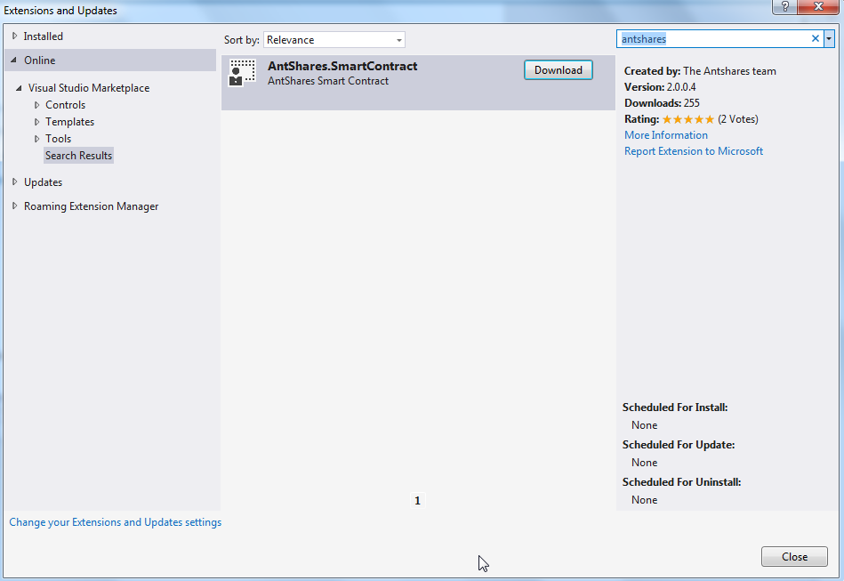
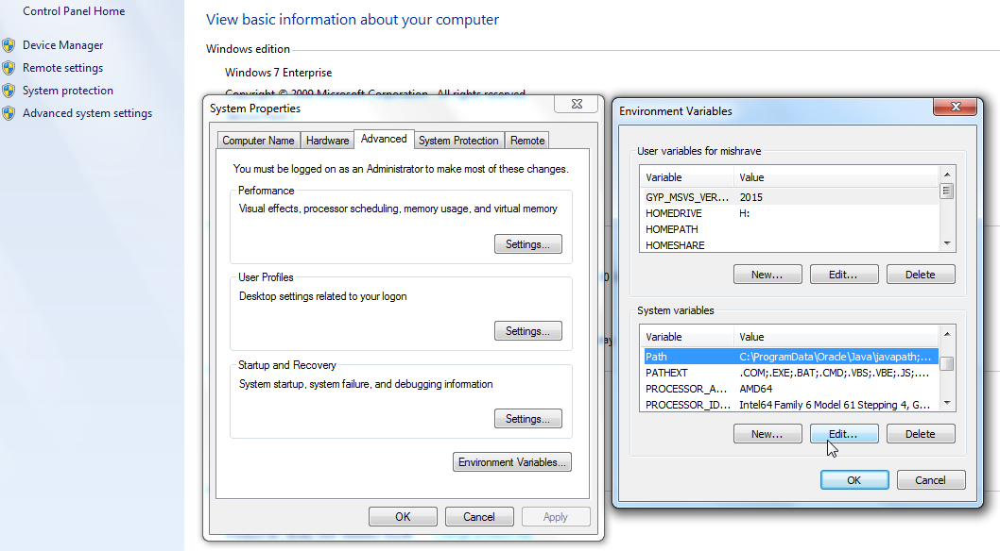
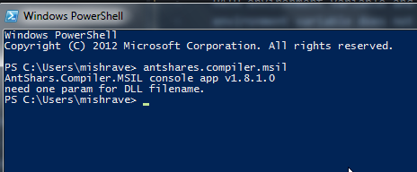
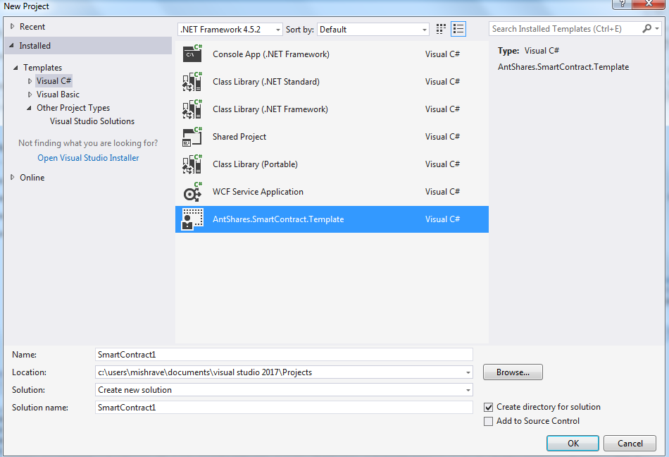
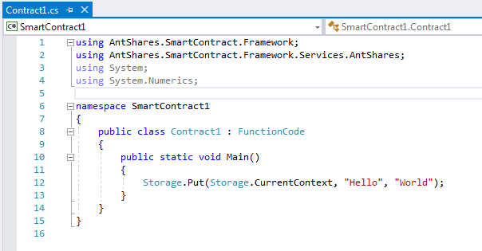

### C#を使用してAntSharesスマートコントラクトを作成する方法

スマートコントラクトの開発には現在C#を推奨しています（ただし、Java、Kotlin、Go、C / C ++、Python、JavaScriptなどのプログラミング言語をサポートまたは計画しています）

このセクションでは、AntSharesスマートコントラクトのC#開発環境を設定するための簡単なチュートリアルと、スマートコントラクトプロジェクトの作成方法とコンパイル方法を紹介します。

   > [!Note]
   > 現在、Visual Studio2015を使用してインテリジェントな契約を作成するには、[VS2015のAntsのインテリジェントな契約書をC#でどのように使用するのか？](getting-started-2015.md)を参照できるように、すべてのプロジェクトがVisual Studio 2017バージョンにアップグレードされています。

## 開発ツール

### 1. Visual Studio 2017

お使いのコンピュータにVisual Studio 2017をインストールし、インストール時に.NET .NET Cross-Platform Developmentを確認した場合は、このセクションをスキップできます。

ダウンロードとインストール：

[Visual Studio download address](https://www.visualstudio.com/products/visual-studio-community-vs)

インストールプロセスは非常に簡単です、操作画面に従って進んで、あなたは.NET Core cross-platform developmentのインストールを確認する必要があります。そうでなければAntShares.VMプロジェクトを開くことができません。ステップ＃3のインストールには、約10分から1時間かかります。


### 2. AntShares.SmartContractプラグイン

インストール方法：

Visual Studio 2017を開き、ツールを開き、拡張機能と更新をクリックし、ウィンドウの左側にある[オンライン]タブをクリックし、ウィンドウの右上にある検索ボックスでAntSharesを検索し、AntShares.SmartContractプラグインをダウンロードします（インターネットアクセスが必要です）。



### 3. AntShares.Compiler.MSIL

インストールと設定の手順：

Githubで[AntShares.VMプロジェクト](https://github.com/neo-project/neo-vm)をダウンロードし、Visual Studio 2017でソリューションを開き、AntShares.Compiler.MSILプロジェクトを発行、


リリースが成功すると、AntShares.Compiler.MSIL.exeファイルが’bin\Release\PublishOutput’によって生成されます。

このディレクトリを実行パスに追加する必要があります。 パスは、オペレーティングシステムがコマンドラインまたはターミナルウィンドウから必要な実行ファイルを見つけるために使用するシステム変数です。

**Windows 10およびWindows 8：**

検索で、検索して選択します。システム（コントロールパネル）[システム設定の詳細設定]リンクをクリックします。環境変数をクリックします。 「システム変数」セクションで、パス環境変数を見つけて選択します。 [編集]をクリックします。パス環境変数が存在しない場合は、「新規」をクリックします。 「システム変数の編集（または新しいシステム変数）」ウィンドウで、パス環境変数の値を指定します。 [OK]をクリックします。 [OK]をクリックして残りのウィンドウをすべて閉じます。

**Windows 7：**

デスクトップの[コンピュータ]アイコンを右クリックします。コンテキストメニューから[プロパティ]を選択します。 [システム設定の詳細設定]をクリックします。環境変数をクリックします。 「システム変数」セクションで、パス環境変数を見つけて選択します。 [編集]をクリックします。 パス環境変数が存在しない場合は、「新規」をクリックします。 「システム変数の編集（または新しいシステム変数）」ウィンドウで、パス環境変数の値を指定します。 [OK]をクリックします。 [OK]をクリックして残りのウィンドウをすべて閉じます。



次に、CommandまたはPowerShellを実行し、Antshares.Compiler.Msilと入力します。エラーがなく、出力にバージョン番号が表示されている場合（図示）、環境変数の設定は成功しています。




注意してください。 Windows 7 SP1のユーザーは「未処理の例外：System.DllNotFoundException：DLL 'api-ms-win-core-console-l2-1-0.dll'を読み込めません：指定されたモジュールが見つかりませんでした」というエラーが発生する可能性があります。必要な 'api-ms-win-core-console-l2-1-0.dll'ファイルはWindows 8以降のバージョンにのみ存在します。このエラーは、 'api-ms-win-core-console-l2-1-0.dll'のコピーを取得し、それをC:\Windows\System32ディレクトリに置くことで解決できます。

## プロジェクトを作成

上記のインストール構成が成功したら、Visual Studio 2017でAntShares.SmartContract.Templateプロジェクトを作成できます。



プロジェクトを作成すると、次のように、FunctionCodeから継承されたデフォルトのクラスであるC#ファイルが自動的に生成されます。



## プロジェクトをコンパイルする

スマートコントラクトを定義するエントリメソッドをすべて追加する準備が整いました。

```c#
public class Contract1: FunctionCode
{
    public static void Main ()// Note that the main method to capitalize
    {
        
    }
}
```

正常にコンパイルすると、’bin/Debug’ディレクトリにあるSmartContract1.avmが表示されます。これはAntSharesスマートコントラクトとして生成されるファイルです。


AntSharesスマートコントラクト開発環境の設定を完了したので、[AntSharesスマートコントラクトチュートリアル](tutorial.md)を参照してください。

