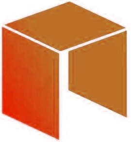

# Консенсус

## Список терминов

* **Доказательство доли владения** ( **Proof of Stake** ) `PoS` - тип алгоритма, использующий консенсус сети для обеспечения отказоустойчивости.

* **Доказательство выполнения работы** ( **Proof of Work** ) `PoW` - тип алгоритма, использующий вычислительные ресурсы для  обеспечения отказоустойчивости.

* **Задача византийских генералов** ( **Byzantine Fault** ) `BF` - ошибка, при которой узел остается функциональным, но выполняемые им действия приобретают нечестный характер.

* **Делегированная византийская отказоустойчивость ** ( **Delegated Byzantine Fault Tolerance** ) `DBFT` - алгоритм достижения консенсуса, реализуемый в блокчейне NEO для обеспечения отказоустойчивости.

* **View** `v` - набор данных, используемый во время реализации консенсуса в NEO `DBFT`

## Роли
В алгоритме консенсуса NEO держатели NEO выбирают узлы консенсуса и голосуют за валидность транзакций. Ранее эти узлы упоминались как буккиперы, в дальнейшем они будут называться узлами консенсуса.

  -  **Узел консенсуса** -  этот узел участвует в процессе достижения консенсуса. Во время данного процесса узлы консенсуса по очереди принимают на себя одну из следующих ролей:
  -  **Спикер** `(один)` - **Спикер** отвечает за передачу предложения блока в систему.
  -  **Делегат** `(несколько)` - **Делегаты** отвечают за достижение консенсуса по транзакции.

## Введение

Одно из принципиальных различий между блокчейнами заключается в том, каким образом они обеспечивают отказоустойчивость в случае неверных или нечестных действий в сети.

Традиционные методы, в основе которых лежит алгоритм PoW,  гарантируют отказоустойчивость при условии, что основные вычислительные ресурсы сети характеризуются честным поведением. Тем не менее, поскольку  этот метод зависит в большей степени от вычислений, то механизм его реализации  может быть крайне неэффективным (вычислительные ресурсы связаны со значительными энергозатратами  и требуют аппаратного обеспечения). Такая зависимость от многих факторов накладывает на PoW-сеть ряд ограничений, основным из которых можно назвать затраты на масштабирование.

NEO реализует алгоритм консенсуса делегированной византийской отказоустойчивости, который взял на вооружение некоторые особенности алгоритма PoS (держатели NEO проводят голосование по узлам консенсуса ), защищающего сеть от византийской ошибки при минимальном использовании ресурсов (при этом алгоритму NEO удалось избежать недостатков PoS). Данное решение снимает вопрос о производительности и масштабируемости, который непременно возникает при попытке реализовать блокчейн без значительного влияния на отказоустойчивость системы.

## Теория

Задача византийских генералов является классической проблемой распределенных вычислений. Она заключается в следующем: некоторое число **Делегатов**  должны достигнуть консенсуса по результатам распоряжения **Спикера**. При этом в системе необходимо соблюдать осторожность, поскольку **Спикер** или любое число **Делегатов** могут быть предателями. Нечестный узел может, к примеру, не высылать соответствующие сообщения каждому из получателей, что считается самой катастрофической ситуацией. Для решения данной задачи необходимо, чтобы **Делегаты** определяли, является ли **Спикер** честным, и какова была фактическая команда от всей группы.

Чтобы описать принцип работы DBFT, мы рассмотрим в этой главе обоснование 66.66% степени консенсуса, использованной в Главе 5. Обращаем ваше внимание на тот факт, что нечестный узел не всегда означает активные зловредные действия, он может просто не выполнять положенные ему функции.

Далее мы опишем и обсудим пару сценариев. В этих простых примерах мы предположим, что каждый узел присылает нам сообщение, полученное от **Спикера**. Данный механизм, который имеет очень большое значение для системы, используется так же в DBFT. Мы будем описывать только различия между работоспособной и неработоспособной системами. Более подробное объяснение см. по ссылкам.

### **Честный спикер**

  
  <b>Figure 1:</b> Рисунок 1:  Пример с нечестным <b>делегатом</b>, где n = 3

  На **Рисунке 1**, мы видим одного надежного **Делегата** (50%). Оба **Делегата** получили одно и то же сообщение от честного **Спикера**. Однако поскольку один из **Делегатов** нечестный, честный **Делегат** может определить только наличие нечестного узла, но он не способен определить, было ли это ядро блока (**Спикер**) или **Делегат**. По этой причине делегат должен воздержаться от голосования и измения View.
  
  
  <b>Рисунок 2</b>: Пример с нечестным <b>Делегатом</b>, где n = 4 

  На **Рисунке 2** мы имеем два надежных **Делегата** (66%). Все **Делегаты** получают одинаковое сообщение от честного **Спикера** и отправляют свои результаты валидации, а также сообщение, полученное от **Спикера**, каждому из **Делегатов**. На основании консенсуса двух честных **Делегатов**, мы можем заключить, что либо **Спикер**, либо правый **Делегат** выполняют нечестные действия в системе.

### **Нечестный спикер** 

  
 <b>Рисунок 3</b>: Пример с нечестным <b>Спикером</b>, где n = 3. 

  В случае, показанном на **Рисунке 3** (нечестный **Спикер**),  мы получаем результат, аналогичный тому, что изображен на **Рисунке 1**. Ни один из **Делегатов** не способен выявить нечестный узел.

  
  <b>Рисунок 4</b>: Пример с нечестным <b>Спикером</b>, где n = 4. 

  В примере на **Рисунке 4** блоки, полученные как средним, так и правым узлами, невозможно проверить. По этой причине узлы вынуждены отложить весь процесс до нового View, который выберет нового **Спикера**,  поскольку данные узлы составляют большинство (66%). Если бы нечестный **Спикер** из данного примера отправил честные данные двум из трех **Делегатов**, то эти данные прошли бы проверку и были утверждены без необходимости изменения View.

## Практическая реализация

Для того чтобы реализовать DBFT в NEO, необходимо использовать метод итераций консенсуса. Реализация алгоритма зависит от доли честных узлов в  системе. На **Рисунке 5** ожидаемые итерации показаны как функция доли нечестных узлов.

Обращаем ваше внимание на тот факт, что 66.66% честности **узлов Консенсуса** – это максимальное значение, показанное на **Рисунке 5**. Между данной точкой и 33% честности **узлов Консенсуса**, находится «нейтральная территория», где консенсус недостижим в принципе. При честности **узлов Консенсуса** менее 33.33%, нечестные узлы (если предполагать, что они выстроены в консенсусе) способны достичь консенсуса между собой и стать новым источником достоверных данных в системе.

   

**Рисунок 5:** Симуляция Монте-Карло для алгоритма DBFT, изображающая итерации, необходимые для достижения консенсуса. {100 узлов; 100 000 смоделированных блоков с произвольной выборкой честного узла}

### Определения

**Для данного алгоритма мы вводим следующие определения:**

  - `t`: Отрезок времени, отведенный на генерацию блока (измеряется в секундах).
    - На данный момент: `t = 15 seconds`
    - Данное значение может быть использовано для того, чтобы определить примерную продолжительность одной итерации, поскольку действия по реализации консенсуса и события по передаче сообщений тесно связаны с этой константой времени.

  - `n`: Число активных  **узлов Консенсуса**.

  - `f`: Минимальное (пороговое) число неисправных **узлов Консенсуса**  в пределах системы.
     - `f = (n - 1) / 3`

  - `h` : Текущая высота блока во время процесса достижения консенсуса.

  - `i` :  индекс **Consensus Node**.

  - `v` : View **узла Консенсуса**. View содержит агрегированную информацию, полученную узлом во время цикла консенсуса. В эти данные входит голосование (`prepareResponse` или `ChangeView`), инициированное всеми делегатами.
  
  - `k` : Индекс View `v`. Для того чтобы достигнуть консенсуса, может потребоваться несколько циклов. В случае ошибки при его достижении, происходит приращение `k`, и начинается новый цикл консенсуса.

  - `p` : Индекс **узла Консенсуса**, выбранного в качестве **Спикера**. Для вычисления данного индекса необходимо обойти **узлы Консенсуса**, чтобы один узел не выступал в качестве индикатора в пределах системы. 
     - `p = (h - k) mod (n)`

  - `s`: Порог безопасного консенсуса. При достижении данного порогового значения в сети может произойти ошибка/ отказ. 
     - `s = ((n - 1) - f)`

### Требования 

**NEO предъявляет три основных требования для реализации отказоустойчивости при достижении консенсуса :**

1. `s` число **Делегатов** должны достигнуть консенсуса по транзакции до того, как блок будет подтвержден.

2. Нечестные **узлы Консенсуса** должны быть лишены возможности убедить честные **узлы Консенсуса** в некорректных транзакциях.

3. По меньшей мере s число **Делегатов** находятся в одинаковом состоянии  (h,k), что позволяет начать реализацию консенсуса. 

### Алгоритм
**Алгоритм работает следующим образом:**

1. A **Узел Консенсуса** рассылает транзакцию с подписью отправителя в сеть.

   
  <b>Рисунок 6: Узел консенсуса</b> получает транзакцию и рассылает ее в систему. 

2. **Узлы консенсуса** заносят данные о транзакции в локальную память.

3. Первый View `v` процесса реализации консенсуса инициализирован.

4. **Спикер** идентифицирован. **Ждите** t секунд.

  
  <b>Рисунок 7: Спикер</b> идентифицирован, View задан.

5. **Спикер** транслирует предложение: `<prepareRequest, h, k, p, bloc, [block]sigp>`

     
  <b>Рисунок 8: Спикер</b> формирует предложение блока для рассмотрения его <b>Делегатами</b>. 

6. **Делегаты** получают предложение и проверяют:

    - Соответствует ли формат данных правилам системы?
    - Находится ли транзакция уже в блокчейне?
    - Реализованы ли скрипты контракта корректно?
    - Содержит ли транзакция только одно расходование? (другими словами, удалось ли транзакции избежать двойного расходования?)
    - **Если предложение прошло проверку, и оно утверждено, то рассылается следующее:**  `<prepareResponse, h, k, i, [block]sigi>`
    - **Если предложение не прошло проверку, и оно не утверждено, то рассылается следующее:**  `<ChangeView, h,k,i,k+1>`

   
  <b>Рисунок 9</b>: <b>Делегаты</b> рассматривают предложение блока и принимают решение по нему. 

7. Получив `s` число трансляций 'prepareResponse', **Делегат** достигает консенсуса и публикует блок.

8. **Делегаты** подписывают блок.

   
  <b>Рисунок 10</b>: Консенсус достигнут, и <b>Делегаты</b>, утвердившие данное решение, подписывают блок и привязывают его к цепи. 

9. Когда **узел Консенсуса** получает полный блок, данные текущего View стираются, и начинается новый цикл реализации консенсуса.
  - `k = 0`

---

> [!Note]
>
>  При отсутствии консенсуса через   ( )  секунд в том же View:
>   - **Узел консенсуса** транслирует: <ChangeView, h,k,i,k+1>
>
>   - Когда **узел Консенсуса** получает хотя бы `s` число трансляций, указывающих на такое же количество изменений View, он увеличивает View `v` на единицу, запуская новый цикл реализации консенсуса.
>

## Ссылки
- [A Byzantine Fault Tolerance Algorithm for Blockchain](whitepaper.md)
- [Practical Byzantine Fault Tolerance](http://pmg.csail.mit.edu/papers/osdi99.pdf)
- [The Byzantine Generals Problem](https://www.microsoft.com/en-us/research/wp-content/uploads/2016/12/The-Byzantine-Generals-Problem.pdf)

