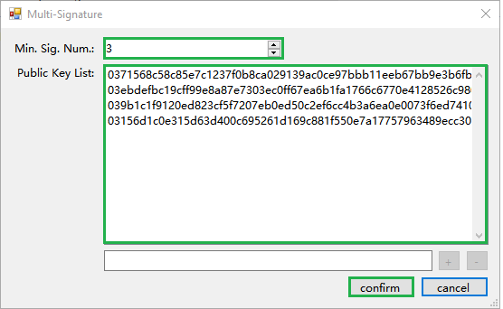
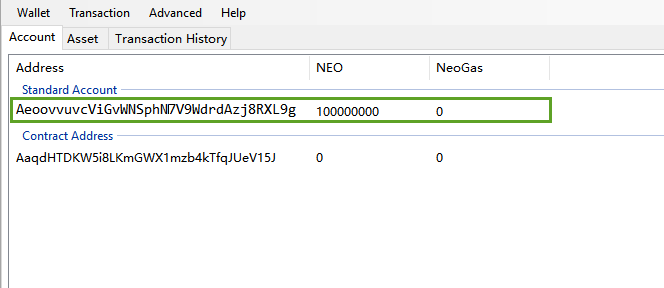

# Создание приватной сети с помощью виртуальной машины

Данный раздел поможет вам создать приватную сеть при помощи четырех виртуальных машин и управлять активами NEO и GAS в приватной сети.

## Настройка виртуальных машин

Для развертывания приватной сети NEO потребуются как минимум четыре сервера (для достижения консенсуса), каждый из которых будет соответствовать узлу консенсуса и выделенному кошельку NEO. Мы создали четыре виртуальные машины Windows в Azure, размер Standard DS1 v2 (1 ядро, 3,5 ГБ ОЗУ).


После создания четырех виртуальных машин откройте  порты 10331-10334, добавляя новые правила из `firewall` ->`advanced setting`-> `inbound rules`.

> [!Note]
> Если вы создаете виртуальную машину на облачном сервере, то вам необходимо войти в administrative background виртуальной машины и настроить группу сетевой безопасности:  `network interface`-> `network security group` ->`inbound security rules`-> `add` -> добавьте порты 10331-10334.

Когда все четыре виртуальные машины созданы, сохраните их IP-адреса.

## Установка NEO-CLI

Выполните следующие действия для четырех виртуальных машин:

1. [Установите NEO-CLI](../../node/cli/setup.md).
2. Скачайте [SimplePolicy](https://github.com/neo-project/neo-plugins/releases/download/v2.9.2/SimplePolicy.zip). Извлеките файл и поместите папку Plugins в корневой каталог neo-cli.

## Создание файлов кошелька

1. Создайте файлы четырех кошельков (wallet1.db3 - wallet4.db3), используя NEO-CLI или NEO-GUI. На следующем скриншоте продемонстрировано создание файлов с помощью NEO-CLI.
2. Запишите открытые ключи четырех кошельков, то есть скопируйте их и сохраните в txt-файле или же используйте `list key` в [CLI Command](../../node/cli/cli.md), чтобы увидеть открытый ключ, а затем скопировать его.
3. Скопируйте файлы четырех кошельков в  папку neo-cli folder каждой из четырех виртуальных машин.


## Изменение файлов настройки

1. В каталоге neo-cli каждого из четырех узлов откройте файл `protocol.json` и измените его следующим образом::

   - `Magic`: используется для идентификации исходной сети сообщения. Указывая другой Magic, вы гарантируете, что информация другой сети в блоке NEO не отправляется в другие сети при передаче данных. Тип Magic - unit, поэтому имейте в виду, что значение, которое вы вводите, находится в диапазоне [0 - 4294967295].
   - `StandbyValidators`: Введите открытые ключи четырех кошельков, записанные ранее.
   - `SeedList`: Введите IP-адреса четырех виртуальных машин, записанные ранее. Номер порта оставьте без изменений. 

   ```json
   {
     "ProtocolConfiguration": {
       "Magic": 1704630,
       "AddressVersion": 23,
       "StandbyValidators": [
   "02f27545181beb8f528d13bbb66d279db996ecb56ed9a324496d114acb48aa7a32",
         "02daa386d979ae6643869a365294055546023acb332ee1a74a5ae5d54774a97bac",
         "0306f12f7217569cdbe9dde9ff702d0040e0a4570873eee63291adaa658128e55c",
         "035781b4d55dc58187f61b5d9277afbaae425deacc5df57f9891f3a5c73ecb24df"
      ],
       "SeedList": [
         "13.75.112.62:10333",
         "137.116.173.200:10333",
         "168.63.206.73:10333",
         "137.116.171.134:10333"
      ],
       "SystemFee": {
         "EnrollmentTransaction": 0,
         "IssueTransaction": 0,
         "PublishTransaction": 0,
         "RegisterTransaction": 0
       }
     }
   }
   ```

2. Измените файл config.json каждого узла для того, чтобы при запуске он мог открывать кошелек и запускать реализацию консенсуса автоматически:

   - `Path`：Введите имя файла соответствующего кошелька.
   - `Password`：Ведите пароль кошелька.
   - `StartConsensus`：Задайте `true`, чтобы включить консенсус.

   ```json
   "UnlockWallet": {
     "Path": "1.json",
     "Password": "11111111",
     "StartConsensus": true,
     "IsActive": true
   }
   ```

## Запуск приватной сети

В четырех виртуальных машинах запустите командную строку и введите каталог  neo-cli . Чтобы запустить узел, выполните команду: `Dotnet neo-cli.dll /rpc`. Кошелек открывается автоматически. Затем начинается процесс достижения консенсуса. Если все прошло успешно, то четыре узла начнут реализацию консенсуса, как показано ниже:


Четыре узла смогут достичь консенсуса, даже если одна из машин окажется выключенной (как показано ниже):


В первичном блоке сети NEO генерируются 100 миллионов NEO. Кроме того, при генерации новых блоков происходит генерация GAS. Когда частная цепочка настроена, вы можете снимать данные NEO и GAS с адреса с многопользовательской подписью, используя NEO-GUI (чтобы облегчить разработку и тестирование вашего блокчейна).

### Установка и настройка NEO-GUI

1. Скачайте [NEO-GUI](https://github.com/neo-project/neo-gui/releases) с Github и извлеките файл.
2. Настройте файл protocol.json в папке neo-gui, чтобы подключить клиента к частной цепочке:
   - StandbyValidators`：Введите открытые ключи четырех кошельков, созданные ранее.
   - `SeedList`：Введите IP-адреса четырех виртуальных машин. Номер порта оставьте без изменений.
3. Настройте файл config.json для того, чтобы порт NEO-GUI не конфликтовал с портами других четырех узлов. При использовании того же порта NEO-GUI не сможет функционировать, поскольку в этот момент будет выполняться NEO-CLI.

Запустите NEO-GUI и откройте любой из кошельков. Если количество соединений в нижнем левом углу не равно 0, и клиент скачивает блоки, значит, клиент был успешно подключен к частной цепочке. 

### Создание адреса с многопользовательской подписью

В NEO-GUI откройте четыре кошелька и выполните следующие действия:

1. Щелкните правой кнопкой мыши по пустой области на странице счета, щелкните по `Create Contract Address` -> `Multi-Signature`.

2. Введите четыре открытых ключа и задайте минимальное количество подписей, равное 3(количество консенсусных узлов / 2 + 1). Щелкните по `Confirm`. 

   

3. Щелкните по `Wallet` -> `Rebuild` wallet index.

   > [!Note]
   > Для того чтобы транзакция передачи была подписана, вы должны создать адрес с многопользовательской подписью в каждом кошельке.

Теперь вы видите, что адрес контракта имеет 100 миллионов акций NEO.


### Перевод NEO в обычный адрес

Для того чтобы отправить NEO с адреса контракта на обычный адрес:

1. В любом из четырех кошельков щелкните по `transaction`->`transfer` 

2. Введите адрес получателя и сумму перевода (100 миллионов NEO).

3. Система сообщит вам, что для завершения транзакции не хватает подписей. Скопируйте код в ваш буфер обмена.

4. Откройте второй кошелек, щелкните по `transaction`->`signature` и вставьте код, который вы только что скопировали.  

5. Щелкните по `signature` и скопируйте код. 

6. Откройте третий кошелек, щелкните по `transaction`->`signature`  и вставьте код, который вы только что скопировали. Щелкните по `signature`. 

   Во всплывающем окне в нижнем левом углу отобразится кнопка `broadcast`, что означает, что все подписи, необходимые для отправки транзакции, были собраны. 

7. Щелкните по `broadcast`. 

   Когда транзакция передачи начнет транслирование, потребуется некоторое время для успешного перевода на счет.



### Перевод GAS на обычный адрес

Откройте кошелек, на который вы хотите перевести GAS, и щелкните по `Advanced`->`Claim GAS`-> `Claim`. 


Следующая операция аналогична передаче NEO. Скопируйте код, имеющий недостаточное количество подписей, последовательно откройте второй и третий кошельки, чтобы завершить подписание и транслирование транзакции. 

После успешного извлечения GAS введите первый стандартный адрес кошелька (то есть верхний адрес кошелька), где вы инициировали извлечение GAS (см. ниже).

