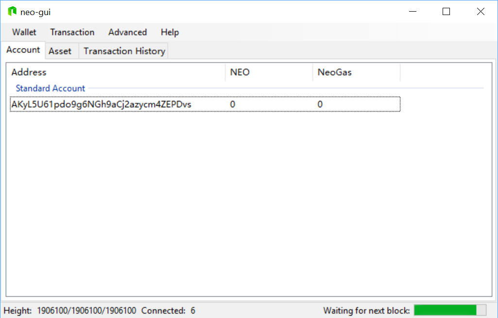

# Как синхронизировать блокчейн быстрее 

Перед использованием клиент должен быть полностью синхронизирован. Для того чтобы ускорить сетевую синхронизацию, вы можете загрузить офф-лайн пакет данных блокчейна до определенной высоты блока. Это означает, что клиент должен будет синхронизировать только дополнительные блоки из сети NEO, а не весь блокчейн целиком. 

> [!Note]
 >
 > Прежде чем клиент NEO сможет синхронизировать данные блока с автономным пакетом, необходимо установить плание [ImportBlocks](https://github.com/neo-project/neo-plugins/releases/download/v2.9.4/ImportBlocks.zip):
 >
 > 1. Скачайте [ImportBlocks](https://github.com/neo-project/neo-plugins/releases/download/v2.9.4/ImportBlocks.zip) и распакуйте архив.
 > 2. Создайте каталог Plugins (первая буква в верхнем регистре) в корневом каталоге клиента и скопируйте туда распакованные данные. 

## Шаг 1 – Загрузите офф-лайн пакет

1. Закройте клиент NEO и щелкните кнопкой мыши по [Download offline synchronized package](https://sync.ngd.network/)  со страницы [Client Downloads](https://neo.org/download).

   

2. На странице скачивания офф-лайн пакета щелкните кнопкой мыши по **Mainnet** или **Testnet** (в зависимости от вашей сети), а затем загрузите один из следующих пакетов (разархивировать пакет не требуется):

   - **Full offline package**: содержит данные наиболее полного блокчейна. Он применим к клиенту, запущенному в первый раз. Файл загрузки - chain.0.acc.zip.
   - **Increment offline package**: содержит данные в диапазоне от начальной высоты пакета до его конечной высоты. Он применим к клиенту, который был синхронизирован до высоты блока в пределах охвата офф-лайн пакета приращения. Файл загрузки - chain.xxx.acc.zip, где xxx - начальная высота пакета (например, chain.1855770.acc.zip).

   

## Шаг 2 – Переместите офф-лайн пакет

Переместите скаченный пакет (chain.0.acc.zip или chain.xxx.acc.zip) в папку, где находится исполняющая программа клиента (neo-gui. exe или neo-cli.exe).

> [!Warning]
>
> Вы не должны изменять имя файла офф-лайн пакета, принятое по умолчанию (chain.acc.zip или chain.xxx.acc.zip), иначе он не будет функционировать в целях синхронизации.

## Шаг 3 – Проверьте статус синхронизации клиента 

Снова запустите клиент и проверьте статус загрузки блоков：

- NEO-GUI: вы можете видеть, что клиент синхронизирован до определенной точки; он продолжит синхронизацию остальной части блокчейна. Данные, расположенные рядом с Height, соответствуют высоте кошелька/ синхронизированного блокчейна/ заголовка блокчейна.

- For NEO-CLI，enter  `open wallet <path>` to open a wallet, and then enter `show state` to check the blocks downloading status. When you see the connected nodes is 0 and the synchronizing speed is greatly accelerated, that means the offline package is working. When the three values after "Height" get to the same, it indicates the synchronization is almost completed.

  

> [!Note]
>
> - Для клиентов NEO-CLI, чья версия ранее 2.9.0, клиент не может быть достигнут, поскольку он синхронизируется с офф-лайн пакетом. По этой причине количество подключенных узлов равно 0, и вы не можете вызвать APIs из клиента, пока он не завершит синхронизацию.
> - Также вы можете использовать команду NEO-CLI `export blocks`, чтобы экспортировать данные всего блокчейна в пакет или экспортировать указанное количество данных блока из указанной высоты блока. Дополнительную информацию см. в [CLI Command Line](../node/cli/cli.md).
