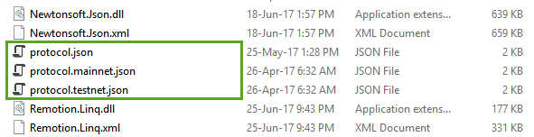
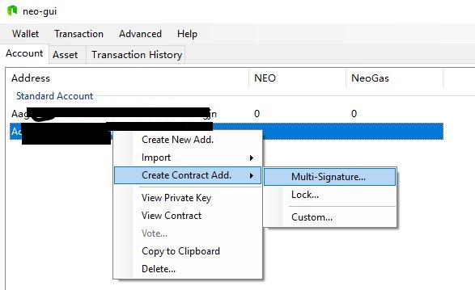
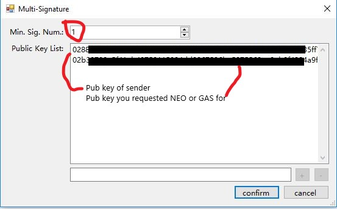

# Тестовая сеть

TestNet – это среда, где пользователь может разрабатывать, запускать и тестировать программы. За тестирование программ в тестовой сети взимается комиссия, состоящая из GAS тестовой сети (ненастоящие GAS). NEO и GAS тестовой сети можно бесплатно использовать на официальном сайте (см. подробную инструкцию ниже).

Все элементы блокчейна тестовой сети не зависят от главной сети. Если вы разрабатываете простой смарт-контракт или хотите зарегистрировать активы, то возможностей тестовой сети будет для вас достаточно. По завершении тестирования разработку можно продолжить в онлайн-режиме в главной сети NEO.

## Характеристики TestNet 

1. Регистрация и распределение активов, выполнение контракта и тд. (реальные деньги при этом не расходуются).
2. Глобализированное развертывание в Интернет-среде.
3. Тестирование сетевых блоков; транзакции и прочую информацию можно беспрепятственно просматривать в браузере блокчейна.
4. Развертывание смарт-контрактов в тестовой среде, где любой человек из любого уголка мира может воспользоваться им.
5. Тестовая сеть не может быть использована как коммерческое приложение фактической лендинговой среды.

## Загрузки клиента 

Клиент тестовой сети приравнивается к клиенту первичной сети. Модифицируя файл конфигурации клиента, клиент может переключаться между первичной и тестовой сетями.

Ссылка: [Introduction of NEO node](../node/introduction.md).

|      | Neo-GUI                        | Neo-CLI                        |
| ---- | ---------------------------------------- | ---------------------------------------- |
| Версии | [Official website](https://www.neo.org/download) и [Github](https://github.com/neo-project/neo-gui/releases) | [Github](https://github.com/neo-project/neo-cli/releases) |
| Исходный код | [Github](https://github.com/neo-project/neo-gui) | [Github](https://github.com/neo-project/neo-cli) |

## Способы переключения на тестовую сеть

1. Скопируйте содержимое каталога программы из `protocol.testnet.json` в `protocol.json` (как показано ниже).

2. Скопируйте содержимое каталога программы (GUI) `config.testnet.json` в `config.json` (как показано на Рисунке).

## Способы получения тестовых GAS и NEO

Если вы являетесь разработчиком, то вы можете запросить NEO и GAS в TestNet. Развертывание контракта в TestNet стоит 500 тестовых (Test) GAS.

- Заполните форму запроса (https://www.neo.org/Testnet/Create), указав ваши ОТКРЫТЫЙ ключ и EMAIL.
- Через день или чуть позже вы получите email с адресом контракта и вторым ОТКРЫТЫМ КЛЮЧОМ.
- Создайте/добавьте адрес с многопользовательской подписью в ваш кошелек.
- Выберите новый адрес и переведите активы из адреса с многопользовательской подписью на ваш собственный адрес.

### Шаг 1 – Найдите ваш ОТКРЫТЫЙ ключ 
В NEO адрес и ОТКРЫТЫЙ ключ отличаются друг от друга.
ОТКРЫТЫЙ КЛЮЧ можно увидеть, просматривая ЗАКРЫТЫЙ КЛЮЧ (никогда не позволяйте кому-либо еще использовать ваш ЗАКРЫТЫЙ ключ).

  

### Шаг 2 – Заполните форму запроса
Заполните форму здесь https://www.neo.org/Testnet/Create и укажите ваши EMAIL и ОТКРЫТЫЙ ключ. Через день или чуть позже вы получите email, содержащий адрес с многосторонней подписью и ОТКРЫТЫЙ ключ отправителя. См. Advanced Features, Multi-party signed address.

### Шаг 3 – Создайте адрес с многопользовательской подписью
Чтобы получить доступ к активам, в вашем кошельке в neo-gui вы должны создать Multi-party signed address (адрес с многосторонней подписью), используя
- Адрес с многосторонней подписью (из email)
- ОТКРЫТЫЙ КЛЮЧ отправителя (из email)
- Ваш ОТКРЫТЫЙ КЛЮЧ (из Шага 1)

1. В NEO-GUI щелкните правой кнопкой мыши по области счета и выберите `Create Contract Address` -> `Multi-Signature`.

  

2. В список открытых ключей внесите открытые ключи, использованные для подписания (ОТКРЫТЫЙ ключ отправителя и ваш). 
3. Укажите минимальное количество подписей, равное `1`.
4. Щелкните кнопкой мыши по `confirm`.

Адрес контракта, указанный в email, создан и отображается на странице счета. 

Рядом с адресом контракта вы увидите количество NEO и/или GAS.

### Шаг 4 – Переведите активы на другой счет 

1. Выберите `Contact address`, щелкнув кнопкой мыши по нему.

2. В меню NEO-GUI выберите `Transaction` -> `Transfer`

3. Выберите актив (и его сумму), который хотите отправить, и счет, на который хотите перевести данный актив.

## Альтернативы для TestNet
Тестирование смарт-контракта в TestNet перед публикацией его в рабочей сети - это хорошая идея, но в вашем цикле разработки вы должны рассмотреть также возможность использования других методов для тестирования смарт-контактов, например:
- Использование Neo.VM при разработке в C# с Visual Studio
- Развертывание частной тестовой сети
