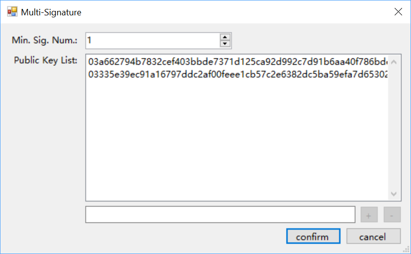

# Взаимодействие со смарт-контрактами

## Адрес с многопользовательской подписью 

Адрес с многопользовательской подписью – это адрес контракта, который должен быть подписан одной и более сторонами во время проведения транзакции.

Для создания адреса с многопользовательской подписью выполните следующие действия:

1. В NEO-GUI щелкните правой кнопкой мыши по счету и выберите `Create Contract Address` -> `Multi-Signature`.

2. В список открытых ключей добавьте открытые ключи, используемые для подписания.

3. Укажите минимальное число подписей.

   

4. Щелкните кнопкой мыши по `OK`.

Адрес контракта создан и отображается на странице счета. 

## Lock-контракт

Lock-контракт определяет временную метку для счета. Никакие активы не могут быть выведены со счета, пока не наступит указанное время.

Существуют два варианта создания Lock-контракта:

- Написать контракт самостоятельно - см. в  [Lock Contract Tutorial](../../sc/tutorial/Lock2.md).
- Использовать NEO-GUI для создания контракта (этот вариант описан в следующем разделе).

### Создание Lock-контракта

1. В NEO-GUI создайте кошелек.
2. RЩелкните правой кнопкой мыши по пустому участку на странице счета, а затем – по `Create Contract Add` -> `Lock`.
3. Выберите счет и укажите дату разблокировки. Щелкните кнопкой мыши по `Create`.

На странице будет указан новый адрес контракта. Щелкните правой кнопкой мыши по адресу контракта и выберите `View Contact`. Теперь вы можете видеть адрес контракта и скрипт. 

### Верификация скрипта Lock-контракта

Если скрипт Lock-контракта является стандартным и действительным, то вы можете подтвердить его, используя  http://lockverify.azurewebsites.net/.

На следующем скриншоте показан результат нормальной верификации, который включает адрес контракта и время разблокировки.   

Если введенный скрипт некорректен, то на экране отобразится ошибка.

## Развертывание и вызов смарт-контрактов

Скомпилированные смарт-контракты можно развертывать и вызывать в блокчейн NEO с помощью NEO-GUI. Дополнительную информацию см. в  [deploying and invoking smart contracts](../../sc/quickstart/deploy-invoke.md).