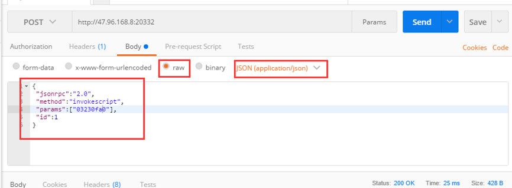
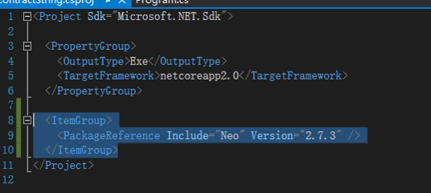
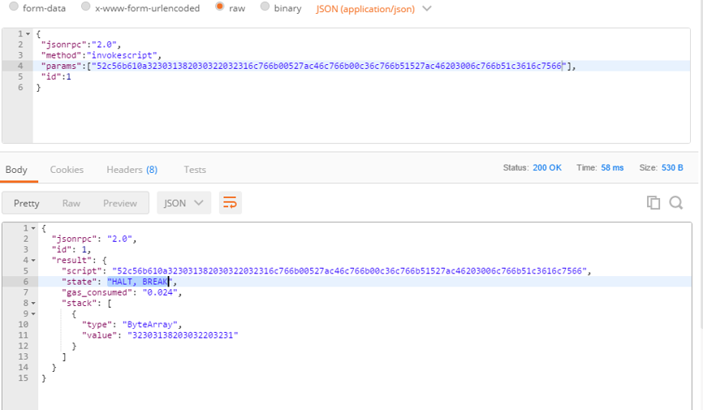
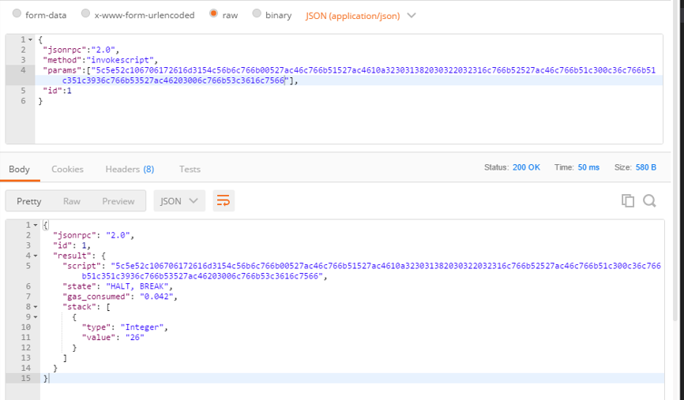

# Unit-тестирование

Вы можете воспользоваться методом NEO-CLI [invokeScript](../../node/cli/latest-version/api/invokescript.md), предназначенным для unit-тестирования.


### Инструменты для тестирования

Для инициирования unit-теста используется POST-запрос. В данном разделе вы применяем распространенный инструмент тестирования, POSTMAN. Кроме того, вы можете написать необходимый инструмент сами. 

После компиляции смарт-контракта и получения соответствующего скрипта (script hash), вы можете воспользоваться POSTMAN, чтобы провести тестирование. Для этого:

1. Настройте адрес CLI. Выберите в списке POST и введите адрес RPC-сервера, запущенного из NEO-CLI.

2. Выберите **raw** и **JSON** и выполните настройку, как показано ниже

   ```
   {
    "jsonrpc":"2.0",
    "method":"invokescript",
    "params":["03230fa0"],
    "id":1
   }
   ```

   Замените строку в `params` на скрипт смарт-контракта, чтобы протестировать его.  Кликните по **Send**, чтобы начать тестирование. См. картинку ниже:


   

###  Пример 1: тестирование контракта без параметров


1. Напишите следующий код и сохраните сгенерированный файл .avm как    `d:\\1.avm`.

    ```c#
    public class Test01 : SmartContract
    {
        public static object Main()
        {
            var magicstr = "Hello, World!";
            return magicstr;
        }
    }
    ```


2. Создайте проект netcore (netcore project) и импортируйте проект NEO.

   

   Для получения хэша скрипта смарт-контракта напишите следующий код:

   ```c#
   class Program
       {
           static void Main(string[] args)
           {
               var noparamAVM = System.IO.File.ReadAllBytes("d:\\1.avm");
               var str = Neo.Helper.ToHexString(noparamAVM);
               Console.WriteLine("AVM=" + str);
               Console.ReadLine();
           }
   }
   ```

   После выполнения кода вы получите скрипт смарт-контракта: “52c56b6c766b00527ac461516c766b51527ac46203006c766b51c3616c7566”.

3. Для тестирования используйте postman (как показано ниже):

   

"state": значение "HALT, BREAK" указывает на то, что тестирование прошло успешно.


Stack – это значение, оставшееся в стеке (Stack) и представленное в виде байтового массива, который соответствует строке «Hello, World!».

###  Пример 2: тестирование контракта с параметрами


1. Напишите следующий код и сохраните сгенерированный файл .avm как`d:\\2.avm`。

   ```c#
   public class Test01 : SmartContract
   {
       public static object Main(string param1,int[] value)
       {
             var magicstr = "2018 02 21";
             return value[0]+value[1];
       }
   }
   ```


2. Напишите следующий код для тестирования:


   ```c#
    static void Main(string[] args)
           {
               var noparamAVM = System.IO.File.ReadAllBytes("d:\\2.avm");
               var str = Neo.Helper.ToHexString(noparamAVM);

               Neo.VM.ScriptBuilder sb = new Neo.VM.ScriptBuilder();
               sb.EmitPush(12);
               sb.EmitPush(14);
               sb.EmitPush(2);
               sb.Emit(Neo.VM.OpCode.PACK);
               sb.EmitPush("param1");
               var _params = sb.ToArray();
               var str2 = Neo.Helper.ToHexString(_params);

               Console.WriteLine("AVM=" + str2 + str);
               Console.ReadLine();
           }
   ```

3. Для тестирования используйте PostMan:

   


### Пример 3: тестирование контракта, развернутого в блокчейне 


Большинство шагов аналогичны. См. первые два примера.

Ниже представлен код для тестирования：

```c#
static void Main(string[] args)
{
     //var noparamAVM = System.IO.File.ReadAllBytes("d:\\2.avm");
     //var str = Neo.Helper.ToHexString(noparamAVM);
     Neo.VM.ScriptBuilder sb = new Neo.VM.ScriptBuilder();
     sb.EmitPush(12);
     sb.EmitPush(14);
     sb.EmitPush(2);
     sb.Emit(Neo.VM.OpCode.PACK);
     sb.EmitPush("param1");
     //To call the deployed contract, add EmitAppCall at the end
     var addr = Neo.UInt160.Parse("0x10ad2338f972e90406fd2ebea9a60f38f4aebd53");
     sb.EmitAppCall(addr.ToArray());
     var _params = sb.ToArray();
     var str2 = Neo.Helper.ToHexString(_params);
     Console.WriteLine("AVM=" + str2);
     Console.ReadLine();
}
```

