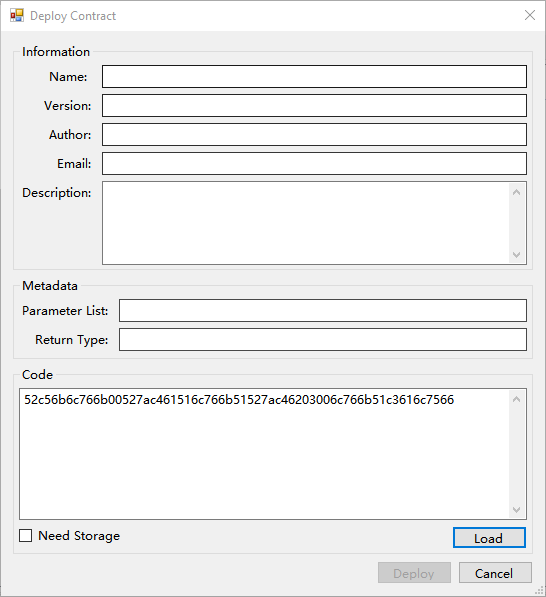

# Инструкция по контракту верификации

При переводе активов со счета верификации смарт-контракта узлы консенсуса выполняют контракт, когда валидируют транзакцию. Если валидация контракта прошла успешно (возвращает результат true), то транзакция подтверждается. Пока не будет получен результат true, транзакция будет иметь статус не подтвержденной.

Данная инструкция создана на базе Visual Studio 2017. Удостоверьтесь в том, что ваш Visual Studio обновлен ​​до версии 2017. Помимо этого, данная инструкция создана на базе демоверсии Smart Contract 2.7.4, поэтому вам нужно скачать последнюю версию клиента [NEO-GUI](https://github.com/neo-project/neo-gui/releases) с GitHub и запустить [test net](../../network/testnet.md).

## Компилирование скрипта контракта 

Чтобы скомпилировать файл смарт-контракта Test.avm, используя код, представленный ниже, необходимо в первую очередь изучить раздел [how to use C# to write a smart contract](../quickstart/getting-started-csharp.md). 

```c#
using Neo.SmartContract.Framework;
using Neo.SmartContract.Framework.Services.Neo;
using Neo.SmartContract.Framework.Services.System;
namespace Neo.SmartContract
{
    public class Test : SmartContract
    {
        public static bool Main(byte[] signature)
        {
            return true;
        }
    }
}
```

## Создание кошелька

В клиенте NEO-GUI щелкните кнопкой мыши по `Wallet` -> `New Wallet` Database, чтобы создать новый кошелек, как показано ниже:


## Получение скрипта контракта 

Чтобы получить скрипт контракта, вы можете воспользоваться одним из предложенных способов:

- Используйте следующий код C#, чтобы прочитать его непосредственно из `.avm` файла:

```c#
byte[] bytes = System.IO.File.ReadAllBytes("Test.avm");
for (int i = 0; i < bytes.Length; i++)
    Console.Write(bytes[i].ToString("x2"));
```

Вы можете получить скрипт контракта (бинарный код Test.avm) Test.avm:  52c56b6c766b00527ac461516c766b51527ac46203006c766b51c3616c7566

- Используйте NEO-GUI для получения скрипта:
  1. Щелкните кнопкой мыши по `Advanced`-> `Deploy Contract`
  2. Щелкните кнопкой мыши по кнопке `Load` в нижнем правом углу. Выберите файл `Test.avm` , сгенерированный ранее.
  3. Скопируйте скрипт контракта из `Code`, как показано ниже.



## Создание адреса контракта 

1. После создания собственного кошелька щелкните правой кнопкой мыши по области с адресом и выберите `Create Contract Add` -> `Custom`, чтобы создать адрес контракта со скриптом контракта, сгенерированным ранее:

   

2. В окне Import Custom Contract укажите следующее:

   1. Parameter List: поскольку ваш контракт имеет параметр для подписи, вы должны ввести `00`. Более подробно см. в[Parameter](../Parameter.md)),
   2. Script: введите скрипт контракта, скопированный в предыдущем шаге.
   3. Private Key: Опционально. Если контракт необходимо подписать, укажите закрытый ключ, требующийся для подписания.

3. Щелкните по `OK`. Верификационный счет смарт-контракта успешно создан.

## Тестирование

Далее представлено тестирование счета аутентификации смарт-контракта. Способ тестирования выглядит следующим образом: необходимо сначала перевести какие-либо активы на счет аутентификации контракта, а затем вывести их со счета.

> [!Note]
> Чтобы обеспечить точность тестирования, не располагайте никакие другие активы в кошельке. В противном случае вы не сможете узнать, с  какого счета был переведен данный актив (со стандартного или с контрактного счета), пока не поймете алгоритм поиска изменений клиента и не подтвердите, что транзакция переведена с адреса смарт-контракта

### Переведите актив в адрес контракта

Переведите определенную сумму активов на счет вашего контракта:


### Переведите контрактные активы 

Выведите активы со счета вашего смарт-контракта:


### Заключение

Баланс активов в клиенте - это сумма баланса в стандартном счете и баланса в адресе контракта, то есть сумма активов всех адресов, вместе взятых. Возможность использования активов в адресе контракта зависит от результата выполнения смарт-контракта. Если контракт выполнен успешно (результат имеет значение true), актив может быть выведен (в противном случае это невозможно).