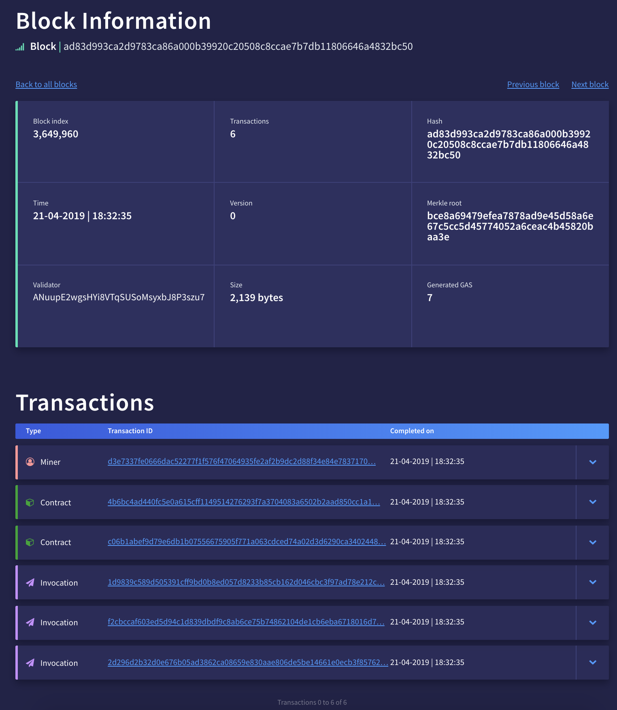

# Structure of a block

Below is the JSON dump of block #3649960 on the NEO MainNet. It can be obtained using the following command (NB: the node chosen is random and may stop working in the future. It can be replaced with any node on the NEO MainNet that accepts RPC requests):

```
curl https://seed4.switcheo.network:10331 -H 'Content-Type: application/json' -d '{ "jsonrpc": "2.0", "id": 1, "method": "getblock", "params": ["ad83d993ca2d9783ca86a000b39920c20508c8ccae7b7db11806646a4832bc50",1] }'
```

Below is a shortened version of the result from the above request, leaving out request metadata and only showing one of the many transactions of the block. However, it shows sufficient information to help understand the structure of a block. The full response of the cURL request can be found [here](neo-block.json).

## Example block

```{
"hash": "0xad83d993ca2d9783ca86a000b39920c20508c8ccae7b7db11806646a4832bc50",
"size": 2139,
"version": 0,
"previousblockhash": "0x82616a5cc9b6beb808dd4e81d5ddd8aac1a0bf369df6599a953bd3441c4d3e2f",
"merkleroot": "0xbce8a69479efea7878ad9e45d58a6e67c5cc5d45774052a6ceac4b45820baa3e",
"time": 1555864355,
"index": 3649960,
"nonce": "3f7f9582d84e0052",
"nextconsensus": "ANuupE2wgsHYi8VTqSUSoMsyxbJ8P3szu7",
"script": {
	"invocation": "4013a82dff8a58ff750703cc32852899124917ded6bd7a7d66bf31d693890488717ab4ee258c0806286d3c2d49da4f9f52d1c6a20843ab5a9a0b4e867ed3d4c5644087875bbc17e8300bb2ee82b3623833be4693fe378cde10e380ce64fe4f1cdba6acb70b6d9d3c52efaa776a6c8a5f91cf3a48b6df79edeae1cd26259b00add96640a1053731b59c6687965e942600301b68f79252e9aa08047115e649930df679d853438bc95c88c9cfa7aa9737d51f82d25dde5b5435cd8266a132a726d7d01f294043df832e612d220c3ce639cbca4ab18f9ce21dfd8718340dae4ca49fd239a4ee06d294e9d583bc4e0da5cccb5eb0f35e7b836d7c633b1e9ca20c0c0af429644740c352f2425c56001a292cc28cba9e736913f9c116580796efacda4270ac104659173ee1bc4bed706c0f3ea90c9b8201653abe74a30e627c443855af6c08c90acb",
	"verification": "5521024c7b7fb6c310fccf1ba33b082519d82964ea93868d676662d4a59ad548df0e7d21025bdf3f181f53e9696227843950deb72dcd374ded17c057159513c3d0abe20b6421035e819642a8915a2572f972ddbdbe3042ae6437349295edce9bdc3b8884bbf9a32103b209fd4f53a7170ea4444e0cb0a6bb6a53c2bd016926989cf85f9b0fba17a70c2103b8d9d5771d8f513aa0869b9cc8d50986403b78c6da36890638c3d46a5adce04a2102ca0e27697b9c248f6f16e085fd0061e26f44da85b58ee835c110caa5ec3ba5542102df48f60e8f3e01c48ff40b9b7f1310d7a8b2a193188befe1c2e3df740e89509357ae"
},
"tx": [{
	"txid": "0xd3e7337fe0666dac52277f1f576f47064935fe2af2b9dc2d88f34e84e7837170",
	"size": 70,
	"type": "MinerTransaction",
	"version": 0,
	"attributes": [],
	"vin": [],
	"vout": [{
		"n": 0,
		"asset": "0x602c79718b16e442de58778e148d0b1084e3b2dffd5de6b7b16cee7969282de7",
		"value": "0.001",
		"address": "AKNLArGjLisJB9mXvtSxASxHd9jaCBFs1B"
	}],
	"sys_fee": "0",
	"net_fee": "0",
	"scripts": [],
	"nonce": 3628990546
},
	{ "txid": "0x1d9839c589d505391cff9bd0b8ed057d8233b85cb162d046cbc3f97ad78e212c",
		"size": 541,
		"type": "InvocationTransaction",
		"version": 1,
		"attributes": [{
			"usage": "Script",
			"data": "57d40b321c35277ea977f76e5e431e04cb14cda4"
		}],
		"vin": [{
			"txid": "0x0c1d6f7c23ea52d7b1d66b0903efaf34be3b98e057813f91c4e7dc4ad4b36d81",
			"vout": 0
		}, {
			"txid": "0xacca07162a2a544ff1e73fd67c62941f10d71081af52f11f21db1361f2916193",
			"vout": 0
		}],
		"vout": [{
			"n": 0,
			"asset": "0x602c79718b16e442de58778e148d0b1084e3b2dffd5de6b7b16cee7969282de7",
			"value": "0.00000001",
			"address": "ASH41gtWftHvhuYhZz1jj7ee7z9vp9D9wk"
		}],
		"sys_fee": "0",
		"net_fee": "0.001",
		"scripts": [{
			"invocation": "404a4f5d2e426977a6a788559878091bad62c932dfe5820f6db5ab0cf6cdf148760b1a62577bf65162c352efcf0faa86f5309b628b291b63db92b0fc8003f81178",
			"verification": "21039ab3dfa0876901f78ec20d8969f7684e635b7540a3e6584a0973943f566c0810ac"
		}, {
			"invocation": "40f2f4b5f99ccec7027e9a89a142f2bed38207ab7ee7259225ac1c38a219c840f86a35a72e53ee1b957f43191d4cb4b23d6f06929d4786331567858cf3e7413c05",
			"verification": "2102c29b96cf2db558bd8265dfb29f425c9fc333a8b30c0e91b5b7338469e7939c87ac"
		}, {
			"invocation": "404d226b4bc30955a1dc74387df80cd25a56d1f136594339f7e269f49032b3c6ffcde9d8fd0ca68238d97993753a390ee1b9b33728eab75efdb768cf08e5a08e42",
			"verification": "2102a1e6ed9a5cff73ad33b7896465af8e9206eab9c8c75502868b783deb64f232eaac"
		}],
		"script": "05cba800841b1437e558ef781b899d61fe204c75761e699bd42ede1457d40b321c35277ea977f76e5e431e04cb14cda453c1076465706f73697467d4c357a466cf12e8167b00a440f782705dcf2ba3",
		"gas": "0"
	},
	{"...more transactions..."}],
"confirmations": 117,
"nextblockhash": "0x77875e7a3d255c3fc82070c51c7999487fb927dfec6a158b5d1dcd4031ee1c5c"
```
## Visual representation
The block can be inspected in a more user-friendly way by using a block explorer. Neoscan.io is one such explorer, and the block above can be found at [this URL](https://neoscan.io/block/AD83D993CA2D9783CA86A000B39920C20508C8CCAE7B7DB11806646A4832BC50). The information and transactions included in this block are shown below. The Invocation Script and Verification Script are not included in this image and are discussed in detail in [Block Validation & Processing](4-Block_validation_processing.md).



# Block contents
## Block header
- ***hash***: The hash of the header of the block. Currently the following fields are used when calculating the hash, used to uniquely identify the block:
	* version
	* previousblockhash
	* merkleroot
	* time
	* index
	* nonce
	* nextconsensus

- ***size***: the size of the block.

- ***version***: The block version number indicates which set of block validation rules to follow. Whenever new rules are introduced, the version number is increased to reference which set of rules were followed.

- ***previousblockhash***: The hash of the previous block, also known as the parent of the current block. The child block always refers to a single parent block. Referencing the previous block hash is an important part of the security of the network.

	Since the block will always reference the previous block by the hash of its header, any changes to any of the transactions inside the previous block would result in a new hash of the [Merkle root](resource.md) of that previous block. Since the Merkle root hash is used in calculating the block header hash, changing any transaction would totally change the block header hash. This hash would then be totally different from what it was, thus changing what the next block is referring to as its parent block. This way any change can easily be detected, as it would effectively break the chain. This ensures that fraudulent blocks can be detected and ignored by all other nodes, securing the network. In a Proof of Work-based blockchain like Bitcoin, getting a malicious block accepted would mean recalculating all Nonces of the malicious block *plus* all blocks thereafter to come up with a longer chain than the current one, so it will be accepted by all other nodes as the single truth. This is why the younger the block is, the less secure it is, and the general rule is to wait for 6 blocks before assuming a transaction is final. This generally is about 1 hour (6 x 10min block) in Bitcoin.

	NEO however is using [dBFT](https://docs.neo.org/en-us/basic/consensus/whitepaper.html), which results in a block being final as soon as it is committed to the blockchain. For a hacker to submit a malicious block, he would need to convince 66% of the consensus nodes to build the next block on top of his malicious blockchain, and use his malicious block header as the 'previous block hash' in the new block.

- ***merkleroot***: The hash of the root of the Merkle Tree of the block's transactions.

- ***time***: The block time is a Unix epoch time of the moment the block was created. A Unix Epoch time is the amount of seconds since Epoch - January 1, 1970 at 00:00:00 GMT.

- ***index***: The height of the current block. The Genesis block has index 0. This field is not present in the block itself but is calculated by the node serving the RPC request for completeness.

- ***Nonce***: A random number that can be used as such by a Smart Contract. It should be understood that this is quite different from the nonce in on other blockchain protocols such as Bitcoin, where miners compete to find the nonce that results in a has that will satisfy a certain difficulty level. Because of the dBFT consensus mechanism in NEO, there is no Proof of Work (PoW) and nodes are working together to achieve consensus. Since there is no PoW required, the Nonce field is used as a random number to be used by all transactions occurring in that block. When each block is generated, the consensus nodes will reach a consensus on a random number, and fill it into the Nonce field of the new block. The contract program can easily obtain the random number of any block by referencing the Nonce field.

- ***nextconsensus***: During consensus on the current block, the algorithm ensures a new consensus node is chosen, which is stored in this field.

- ***script***: Script used to validate the block. Discussed in detail in [Block Validation & Processing](4-Block_validation_processing.md).

## Block body

The body of a block contains all the transactions that are embodied in that block.

### Transaction types
Below are the type of transactions that can occur in a block:

- **MinerTransaction**: The first transaction in each block must be the MinerTransaction. It is used to award all transaction fees of the current block to the validator.
- **IssueTransaction**: Used to issue an asset. Asset managers can create the assets that have been registered in NEO's blockchain through IssueTransaction, and send them to any address.
- **ClaimTransaction**: Transaction invoked to claim NeoGas that was not yet claimed for holding NEO.
- **EnrollmentTransaction**: The transaction represents an enrollment form, which indicates that the sponsor of the transaction would like to sign up as a validator.
- **ContractTransaction**: This is a very common kind of transaction as it allows one wallet to send NEO to another. The inputs and outputs transaction fields will usually be important for this transaction (for example, to govern how much NEO will be sent, and to what address).
- **InvocationTransaction**: Transaction type used to invoke a Smart Contract.

### Transaction structure
- **Type**: Type of the transaction, which must be one of the above. Furthermore, the first transaction of a block must always be of the type ***MinerTransaction***.
- **Version**: Version used to define transactions. Currently at 0. Similar to block version, but on the level of a transaction.
- **Attributes**: Additional features that the transaction has.
- **Inputs**: The transaction inputs. When sending NEO from one address to another, this refers to the UTXO of the NEO being sent by the sender.
- **Outputs**: The transaction outputs. When sending NEO from one address to another, this creates new UTXO for the recipient to spend after this block has been mined.
- **Scripts**: List of scripts used to validate the transaction. When sending NEO from one address to another, this validates the spending of any UTXO's that are referenced in the inputs.

## Additional fields

- ***confirmations***: The amount of blocks that were built on top of this block. Each time a new block is confirmed on top of the chain that contains this block, the latter block gets an extra confirmation. This field is not present in the block itself but is calculated by the node serving the RPC request for completeness.
- ***nextblockhash***: The hash of the next block, resulting in a linked-list of blocks. This field is not present in the block itself but is calculated by the node serving the RPC request for completeness.

## What's next?

[Block Creation by Consensus Nodes](3-Block_creation_broadcasting.md)

