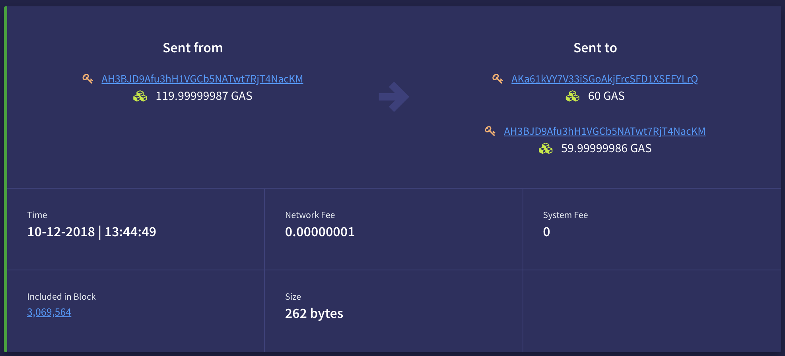

# Block Creation by Consensus Nodes
As discussed in [Introduction to blocks and blockchain](1-Introduction_to_blocks_and_blockchain.md), NEO uses the dBFT mechanism to generate new blocks. In short, this means there are a selected amount of consensus nodes, elected by the network, which are required to reach a 2/3 majority agreement on any new potential block.

For each new block that needs to be generated, one of these nodes is elected as the speaker. In the best case scenario, where we have no Byzantine nodes, the speaker node will propose a new block and distribute it to all other consensus nodes for agreement. When the speaker node receives enough signatures from other consensus nodes, the block is propagated to the network and final. For more details on the dBFT consensus mechanism, have a look at the [whitepaper](../../../docs/en-us/basic/technology/dbft.md).

## The new block
When a user wants to send a transaction, typically his wallet will create and sign the transaction and send that to either an RPC or P2P node. Both RPC and P2P nodes will relay (valid) transactions across the network, where they eventually reach one of the consensus nodes. More can be read in the section [Network](../5-network/1-Introduction_to_the_NEO_network_protocol.md). [This medium post](https://medium.com/neoresearch/understanding-neo-network-in-five-pictures-e51b7c19d6e0) also gives a great summary of this mechanism.

Once the valid transaction has arrived at the consensus nodes, it is stored and sorted in the mempool. When creating a new block, transactions will be selected from this mempool to be included. Every block can contain up to 500 transactions, from which the first one always is of the type [MinerTransaction](../3-transaction/types.md#minertransaction).

## Transaction (network) fees

The speaker node will then select transactions to include in the new block. When a user wants to make sure his transaction is executed as quickly as possible, he can choose to include a transaction fee. There are currently no required transaction fees (though free transactions are limited to 20 per block). The user, however, may choose to pay a transaction fee for priority. The larger the fee, the more likely it is this transaction will be included in the next block, as the mempool is sorted by fee paid per byte and the speaker node receives all the transaction fees attached to transactions included in the block it proposes. This makes including transactions with a higher fee more interesting for the node than free transactions. This transaction fee is not a specific field, rather, it is the remaining GAS that was not accounted for when spending the UTXO.

This follows from the fact that a UTXO is not divisible and needs to be spent in its entirety. For example, if you want to send a friend 5 GAS but only have one single 500 GAS UTXO in pocket, you cannot split that 500 GAS UTXO directly. Instead, a transaction is created with the 500 GAS UTXO as an input, with two outputs added to the transaction; 5 GAS to your friend, and the remaining 495 GAS back to yourself. This may be compared with handing a $100 bill to a cashier for a $1 purchase; $99 is expected in return as change. With an UTXO, this is similar. You need to pay this change back to yourself in the same transaction.

Every unit of a UTXO that is not explicitly sent to an address is interpreted as the transaction fee. Continuing from the previous example, you have one 495 GAS UTXO. If you send another 5 GAS to a friend and only send 489 GAS back to yourself in the same transaction, the remaining 1 GAS would be seen as the transaction fee. In essence, the transaction is telling the consensus node to *keep the change*.

Normal users do not need to worry about constructing transactions with UTXOs in this manner. The majority of advanced wallet software will provide the option for the user to specify a transaction fee, and generate the transaction in such a way that the change will be sent back into your account.

As an example, you can look at [this specific transaction](https://neoscan.io/transaction/80b963d68c0f3d65c0e906057f7517a17ef7dcc1b29e2a79205e4aa235131f95).

The source address had an UTXO containing 119.99999987 GAS and wanted to send 60 GAS to another address. To do so, it specified the recipient together with the 60 GAS, and it spent the remaining GAS to itself again (59.99999986 GAS). However, 60 + 59.99999986 equals to 119.99999986 GAS. This differs by 0.00000001 GAS, which was the implied transaction fee. By not specifying the address for the 0.00000001 that was left from the UTXO, it was handled as a transaction fee for the consensus node that created [the related block](https://neoscan.io/block/eabb36acfb055592afb06786f831390762000a9aa669016d27eb031f41e14a07).

## System fees
A transaction fee is used to gain priority on the network. There are, however, fees with other specific purposes, known as system fees.

- ***Smart Contract Creation*** The current fee to deploy a new contract on the Mainnet ranges between 100-1000 GAS based on the required functions (such as storage or dynamic invocation) and size. For structured development, it is advised to start development on a [local private TestNet](https://github.com/CityOfZion/neo-local). Once the Smart Contract is stable, you can apply for TestNet funds [here](https://neo.org/testcoin/apply), for final validation. After you are certain that your Smart Contract is implemented correctly, only then should you deploy it onto the Mainnet, as this process is irrevokable. This means that the GAS paid for deployment will not be returned, even if you destroy the contract.

- ***Smart Contract Execution*** To be able to execute a Smart contract, the nodes need to perform specific computations for you. In order to compensate the nodes for this effort, a system fee should be added to the transaction that is executing the contract. Currently, the first 10 GAS of any system call is free, meaning no fee is required for contract invocations that require less than 10 GAS. [This page](../../../docs/en-us/sc/fees.md) gives the complete overview of the system fees required to execute a Smart Contract. For each operation, the required fee for the specific operation is mentioned.

## Block broadcasting
Once the consensus nodes agree on a new block according to the dBFT mechanism, they will broadcast the new block to the entire network. Because of the characteristics of the dBFT consensus mechanism, block finality is achieved immediately in 1 single block. This means that all clients can interrogate the blockchain (any RPC or P2P node) immediately after a new block has been created, and be certain these transactions are final.

## What's next?

[Validation of blocks](4-Block_validation_processing.md)

