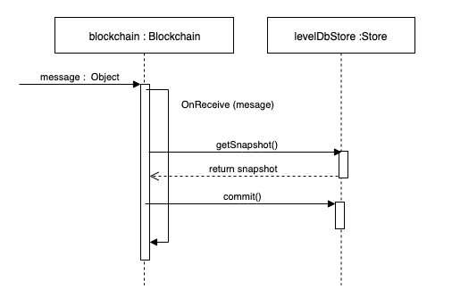
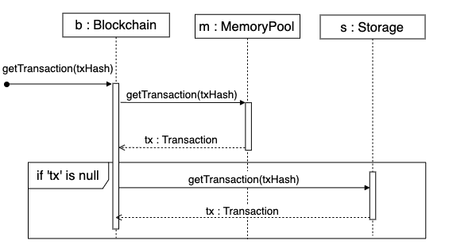

# LevelDB Blockchain Data Structure
The current implementation of NEO in C# uses LevelDB, a fast key-value database, to persist blockchain information. This DB is used for both system data, like blocks and transactions, but also for smart contract data.  
When the node receives a message that triggers a change in state (like a new block or header), it retrieves and updates a snapshot, commiting its results when the operation is done.   
Below we have a simplified example of how this is happens:




## LevelDB Table Structure
The data is stored using the structured provided by the classes from the [Ledger](https://github.com/neo-project/neo/tree/master-2.x/neo/Ledger) package. Using a `prefix` to separate each 'table'.

We can see here the prefixes used in neo (C#):


| Prefix     | Description     | LevelDB Key | Level DB Value
| :------------- | :------------- | :------------- | :------------- |
| 0x01      | **Block**: Block header prepended with `system fee`     | Block Hash | [BlockState](https://github.com/neo-project/neo/blob/master-2.x/neo/Ledger/BlockState.cs) |
| 0x02      | **Transaction**: Transaction prepended with `block index`       | Transaction Hash | [TransactonState](https://github.com/neo-project/neo/blob/master-2.x/neo/Ledger/TransactionState.cs) |
| 0x40      | **Account**: account meta-data (votes, balances)       | Account Script Hash | [AccountState](https://github.com/neo-project/neo/blob/master-2.x/neo/Ledger/AccountState.cs) |
| 0x44      | **Unspent Coins**: Transactions that can be used as input in another transaction       | Transaction Hash | [UnspentCoinState](https://github.com/neo-project/neo/blob/master-2.x/neo/Ledger/UnspentCoinState.cs) |
| 0x45      | **Spent Coins**: Transactions used as input in a previous transaction (spent)       | Transaction Hash | [SpentCoinState](https://github.com/neo-project/neo/blob/master-2.x/neo/Ledger/SpentCoinState.cs) |
| 0x48      | **Validators**: Network Validators meta-data        | Validator Public Key | [ValidatorState](https://github.com/neo-project/neo/blob/master-2.x/neo/Ledger/ValidatorState.cs)|
| 0x4c      | **Assets**: Native coins meta-data       | Register Transaction Hash | [AssetState](https://github.com/neo-project/neo/blob/master-2.x/neo/Ledger/AssetState.cs) |
| 0x50      | **Contracts**: Contract meta-data       | Contract Script Hash| [ContractState](https://github.com/neo-project/neo/blob/master-2.x/neo/Ledger/ContractState.cs) |
| 0x70    | **Smart Contract Storage**: Storage used by SmartContracts       | ScriptHash + Key | Byte[] |
| 0x80      | **Pending Headers**: Used in synchronization to track blocks waiting to be synced        | Prefix only | [HeaderHashList](https://github.com/neo-project/neo/blob/master-2.x/neo/Ledger/HeaderHashList.cs) |
| 0x90      | **Validators Count**: Used for recording the votes of the consensus nodes to be selected         | Prefix only| [ValidatorsCountState](https://github.com/neo-project/neo/blob/master-2.x/neo/Ledger/ValidatorsCountState.cs) |
| 0xc0      | **Current block**: Last commited block    | Prefix only |  [HashIndexState]([HashIndexState](https://github.com/neo-project/neo/blob/master-2.x/neo/Ledger/HashIndexState.cs))|
| 0xc1      | **Current header**: Block under synchronization    | Prefix only | [HashIndexState]([HashIndexState](https://github.com/neo-project/neo/blob/master-2.x/neo/Ledger/HashIndexState.cs))|
| 0xf0      | **System version**: Current system version. Used to prevent data inconsistency     | Prefix only | String ("2.9.2") |
*Prefixes 0xf1 to 0xff are reserved for external use.*

The prefixes can be found [here](https://github.com/neo-project/neo/blob/master/neo/Persistence/LevelDB/Prefixes.cs).


### Memory Pool
The memory pool is a collection in memory used to track transactions that are not yet committed/persisted.
When looking for a transaction, the node will always check first if the transaction is in the memory pool, before checking the device storage.



If the `Storage`  returns a null transaction, either the transaction does not exist (if the node is fully synchronized), or the transaction must be retrieved from other nodes.


### 0x01 - Blocks 

```CSharp
private void OnNewHeaders(Header[] headers)
        {
            using (Snapshot snapshot = GetSnapshot())
            {
                foreach (Header header in headers)
                {
                    if (header.Index - 1 >= header_index.Count) break;
                    if (header.Index < header_index.Count) continue;
                    if (!header.Verify(snapshot)) break;
                    header_index.Add(header.Hash);
                    snapshot.Blocks.Add(header.Hash, new BlockState
                    {
                        SystemFeeAmount = 0,
                        TrimmedBlock = header.Trim()
                    });
                    snapshot.HeaderHashIndex.GetAndChange().Hash = header.Hash;
                    snapshot.HeaderHashIndex.GetAndChange().Index = header.Index;
                }
                SaveHeaderHashList(snapshot);
                snapshot.Commit();
            }
            UpdateCurrentSnapshot();
            system.TaskManager.Tell(new TaskManager.HeaderTaskCompleted(), Sender);
        }
```


**Important note**: The `block`that is returned to external peers through the network is called `trimmed block` at persistence level.


```CSharp
public static bool ContainsBlock(this IPersistence persistence, UInt256 hash)
{
  BlockState state = persistence.Blocks.TryGet(hash);
  if (state == null) return false;
    return state.TrimmedBlock.IsBlock;
}

 public bool IsBlock => Hashes.Length > 0;
```

### 0x02 - Transactions
All transactions are stored under the Transactions prefix. The transactions are added individually by the consensus nodes and then committed in one block, these can be retrieved individually or in batches.

```CSharp
private bool AddTransaction(Transaction tx, bool verify)
{
      if (verify && !tx.Verify(context.Snapshot, context.Transactions.Values))
      {
          Log($"Invalid transaction: {tx.Hash}{Environment.NewLine}{tx.ToArray().ToHexString()}", LogLevel.Warning);
          RequestChangeView();
          return false;
      }
      if (!Plugin.CheckPolicy(tx))
      {
          Log($"reject tx: {tx.Hash}{Environment.NewLine}{tx.ToArray().ToHexString()}", LogLevel.Warning);
          RequestChangeView();
          return false;
      }
      context.Transactions[tx.Hash] = tx;
      if (context.TransactionHashes.Length == context.Transactions.Count)
      {
          if (VerifyRequest())
          {
              // if we are the primary for this view, but acting as a backup because we recovered our own
              // previously sent prepare request, then we don't want to send a prepare response.
              if (context.IsPrimary() || context.WatchOnly()) return true;

              // Timeout extension due to prepare response sent
              // around 2*15/M=30.0/5 ~ 40% block time (for M=5)
              ExtendTimerByFactor(2);

              Log($"send prepare response");
              localNode.Tell(new LocalNode.SendDirectly { Inventory = context.MakePrepareResponse() });
              CheckPreparations();
          }
          else
          {
              RequestChangeView();
              return false;
          }
      }
      return true;
  }

```

### 0x40 - Accounts

NEO uses this collection to track user balance, but without tracking UTXO.

### 0x44 - (Unspent) Coins collections
A transaction is considered "unspent" if this it is not referenced as input by some transaction. The node keeps track of these unspent coins to validate transactions but doesn't group it by account, meaning it can determine if a coin is spendable, but it cannot get all spendable coins for a specific account. The role of tracking the spendable coins by account is done by the wallet or an indexer service like [neoscan](neoscan.io) or [neotracker](neotracker.io).

This collection is used to determine if the coin is spendable. Here is how it's done in C#:

``` CSharp
public static bool IsDoubleSpend(this IPersistence persistence, Transaction tx)
{
  if (tx.Inputs.Length == 0) return false;
    foreach (var group in tx.Inputs.GroupBy(p => p.PrevHash))
    {
      UnspentCoinState state = persistence.UnspentCoins.TryGet(group.Key);
      if (state == null) return true;
      if (group.Any(p => p.PrevIndex >= state.Items.Length || state.Items[p.PrevIndex].HasFlag(CoinState.Spent)))
        return true;
      }
  return false;
}
```

Note that at this moment, we are not checking the memory pool. This is done before the `IsDoubleSpend` check.

### 0x45 - Spent Coins
NEO tracks the spent coins in order to allow users to `claim GAS`. The claimable GAS is calculated based on interval of blocks between the block where the transaction was created to the moment it is spent.   
This means that, to be able to Claim GAS, you need to use that transaction. It is common to send it to yourself to "unlock" the claimable GAS.

``` CSharp
public Dictionary<ushort, SpentCoin> GetUnclaimed(UInt256 hash)
        {
    TransactionState tx_state = Transactions.TryGet(hash);
    if (tx_state == null) return null;
    SpentCoinState coin_state = SpentCoins.TryGet(hash);
    if (coin_state != null)
    {
        return coin_state.Items.ToDictionary(p => p.Key, p => new SpentCoin
        {
            Output = tx_state.Transaction.Outputs[p.Key],
            StartHeight = tx_state.BlockIndex,
            EndHeight = p.Value
        });
    }
    else
    {
        return new Dictionary<ushort, SpentCoin>();
    }
}

```

### 0x48 - Validators
This collection is used to verify a block, since it is required to know the validators public keys in order to validate the multiple signatures contained in a block.  

```CSharp
private void Fill()
        {
            IEnumerable<Transaction> memoryPoolTransactions = Blockchain.Singleton.MemPool.GetSortedVerifiedTransactions();
            foreach (IPolicyPlugin plugin in Plugin.Policies)
                memoryPoolTransactions = plugin.FilterForBlock(memoryPoolTransactions);
            List<Transaction> transactions = memoryPoolTransactions.ToList();
            Fixed8 amountNetFee = Block.CalculateNetFee(transactions);
            TransactionOutput[] outputs = amountNetFee == Fixed8.Zero ? new TransactionOutput[0] : new[] { new TransactionOutput
            {
                AssetId = Blockchain.UtilityToken.Hash,
                Value = amountNetFee,
                ScriptHash = wallet.GetChangeAddress()
            } };
            while (true)
            {
                ulong nonce = GetNonce();
                MinerTransaction tx = new MinerTransaction
                {
                    Nonce = (uint)(nonce % (uint.MaxValue + 1ul)),
                    Attributes = new TransactionAttribute[0],
                    Inputs = new CoinReference[0],
                    Outputs = outputs,
                    Witnesses = new Witness[0]
                };
                if (!Snapshot.ContainsTransaction(tx.Hash))
                {
                    Nonce = nonce;
                    transactions.Insert(0, tx);
                    break;
                }
            }
            TransactionHashes = transactions.Select(p => p.Hash).ToArray();
            Transactions = transactions.ToDictionary(p => p.Hash);
            NextConsensus = Blockchain.GetConsensusAddress(Snapshot.GetValidators(transactions).ToArray());
            Timestamp = Math.Max(TimeProvider.Current.UtcNow.ToTimestamp(), this.PrevHeader().Timestamp + 1);
        }
```

### 0x4c - (Native) Assets
This collection has information about native assets registered using the **Register Transaction** to allow or deny **Issue Transactions**.  
This collection is also used by wallets to retrieve token information (name, symbol, etc.).

This collection is not deprecated yet, however, with plans of moving native assets to NEP-5 like contracts, there is a chance this collection becomes depreciated in the near future.

At code level, we can see that the Asset information is used to do additional verifications:

``` CSharp
public virtual bool Verify(Snapshot snapshot, IEnumerable<Transaction> mempool)
{
    if (Size > MaxTransactionSize) return false;
    for (int i = 1; i < Inputs.Length; i++)
        for (int j = 0; j < i; j++)
                if (Inputs[i].PrevHash == Inputs[j].PrevHash && Inputs[i].PrevIndex == Inputs[j].PrevIndex)
                        return false;
    if (mempool.Where(p => p != this).SelectMany(p => p.Inputs).Intersect(Inputs).Count() > 0)
        return false;
    if (snapshot.IsDoubleSpend(this))
        return false;
    foreach (var group in Outputs.GroupBy(p => p.AssetId))
    {
        AssetState asset = snapshot.Assets.TryGet(group.Key);
        if (asset == null) return false;
        if (asset.Expiration <= snapshot.Height + 1 && asset.AssetType != AssetType.GoverningToken && asset.AssetType != AssetType.UtilityToken)
            return false;
        foreach (TransactionOutput output in group)
            if (output.Value.GetData() % (long)Math.Pow(10, 8 - asset.Precision) != 0)
                return false;
    }
    TransactionResult[] results = GetTransactionResults()?.ToArray();
    if (results == null) return false;
    TransactionResult[] results_destroy = results.Where(p => p.Amount > Fixed8.Zero).ToArray();
    if (results_destroy.Length > 1) return false;
    if (results_destroy.Length == 1 && results_destroy[0].AssetId != Blockchain.UtilityToken.Hash)
        return false;
    if (SystemFee > Fixed8.Zero && (results_destroy.Length == 0 || results_destroy[0].Amount < SystemFee))
        return false;
    TransactionResult[] results_issue = results.Where(p => p.Amount < Fixed8.Zero).ToArray();
    switch (Type)
    {
        case TransactionType.MinerTransaction:
        case TransactionType.ClaimTransaction:
            if (results_issue.Any(p => p.AssetId != Blockchain.UtilityToken.Hash))
                return false;
            break;
        case TransactionType.IssueTransaction:
            if (results_issue.Any(p => p.AssetId == Blockchain.UtilityToken.Hash))
                return false;
            break;
        default:
            if (results_issue.Length > 0)
                return false;
            break;
    }
    if (Attributes.Count(p => p.Usage == TransactionAttributeUsage.ECDH02 || p.Usage == TransactionAttributeUsage.ECDH03) > 1)
        return false;
    if (!VerifyReceivingScripts()) return false;
    return this.VerifyWitnesses(snapshot);
}

```

### 0x50 - Contract
This collection is where the Smart Contract code and meta-data is stored.
Contracts are deployed using an **InvocationTransaction** and saved under this prefix, where all code(script) and meta-data is stored. Note that the storage used by the contracts is put elsewhere (0x70 prefix), however, this is the collection used by a node to check if the contract, can use the storage or execute a dynamic invoke.

This collection is not deprecated yet, however, with plans of moving meta-data to a `Manifest` file, there is a chance this collection becomes depreciated in the near future.

In the check below, not only we check if the Smart Contract exists, but also if it can use the storage (deploying a contract that uses the storage is more expensive).

``` CSharp
internal bool CheckStorageContext(StorageContext context)
{
  ContractState contract = Snapshot.Contracts.TryGet(context.ScriptHash);
  if (contract == null) return false;
  if (!contract.HasStorage) return false;
    return true;
}
```

Here is a verification done at runtime to ensure the contract has dynamic invoke flag:

```CSharp
private bool CheckDynamicInvoke()
{
    Instruction instruction = CurrentContext.CurrentInstruction;
    switch (instruction.OpCode)
    {
        case OpCode.APPCALL:
        case OpCode.TAILCALL:
            if (instruction.Operand.NotZero()) return true;
            // if we get this far it is a dynamic call
            // now look at the current executing script
            // to determine if it can do dynamic calls
            return snapshot.Contracts[new UInt160(CurrentContext.ScriptHash)].HasDynamicInvoke;
        case OpCode.CALL_ED:
        case OpCode.CALL_EDT:
            return snapshot.Contracts[new UInt160(CurrentContext.ScriptHash)].HasDynamicInvoke;
        default:
            return true;
    }
}

```

### 0x70 - Smart Contract Storage
This part of the storage is reserved for Smart Contract custom data storage. In this collection, we use the SmartContract script-hash as base prefix to all `Get` call executed by the ExecutionContext.

Here is an example of it's usage. Note that it also sends the context script-hash in order to retrieve the data:

```CSharp
protected bool Storage_Get(ExecutionEngine engine)
{
   if (engine.CurrentContext.EvaluationStack.Pop() is InteropInterface _interface)
   {
       StorageContext context = _interface.GetInterface<StorageContext>();
       if (!CheckStorageContext(context)) return false;
       byte[] key = engine.CurrentContext.EvaluationStack.Pop().GetByteArray();
       StorageItem item = Snapshot.Storages.TryGet(new StorageKey
       {
           ScriptHash = context.ScriptHash,
           Key = key
       });
       engine.CurrentContext.EvaluationStack.Push(item?.Value ?? new byte[0]);
       return true;
   }
   return false;
}
```

### 0x80 - Header hash list
NEO nodes sync block headers and block transactions separately, this means that first nodes download a list of headers (referenced by its hash), and pull the transactions list for each of this blocks separately, including getting this information from multiple nodes.  
Note that the `Block` collections is also changed when we get new headers because a block is a header with transactions.

```CSharp
private void OnNewHeaders(Header[] headers)
{
   using (Snapshot snapshot = GetSnapshot())
   {
       foreach (Header header in headers)
       {
           if (header.Index - 1 >= header_index.Count) break;
           if (header.Index < header_index.Count) continue;
           if (!header.Verify(snapshot)) break;
           header_index.Add(header.Hash);
           snapshot.Blocks.Add(header.Hash, new BlockState
           {
               SystemFeeAmount = 0,
               TrimmedBlock = header.Trim()
           });
           snapshot.HeaderHashIndex.GetAndChange().Hash = header.Hash;
           snapshot.HeaderHashIndex.GetAndChange().Index = header.Index;
       }
       SaveHeaderHashList(snapshot);
       snapshot.Commit();
   }
   UpdateCurrentSnapshot();
   system.TaskManager.Tell(new TaskManager.HeaderTaskCompleted(), Sender);
}
```


### 0x90 - Validators count

### 0xc0 - Current block

The current block represents the highest block verified block, with it's transactions. We store it this information to know the latest (higher) synchronized block.
The current blockchain height is defined by the height of the object in this key.

``` CSharp
public uint Height => BlockHashIndex.Get().Index;
```

Remember: A block **is** a block-header with additional information (transactions), so the block hash is always the same as it's block-header hash.

### 0xc1 - Current header
This prefix is used to store the latest(higher) block header. This is considered meta-data and is used only to help the node to synchronize it's data.

```CSharp
public override MetaDataCache<HashIndexState> GetHeaderHashIndex()
{
  return new DbMetaDataCache<HashIndexState>(db, null, null, Prefixes.IX_CurrentHeader);
}

public Blockchain(NeoSystem system, Store store)
{
 this.system = system;
 this.MemPool = new MemoryPool(system, MemoryPoolMaxTransactions);
 this.Store = store;
 lock (lockObj)
 {
     if (singleton != null)
         throw new InvalidOperationException();
     header_index.AddRange(store.GetHeaderHashList().Find().OrderBy(p => (uint)p.Key).SelectMany(p => p.Value.Hashes));
     stored_header_count += (uint)header_index.Count;
     if (stored_header_count == 0)
     {
         header_index.AddRange(store.GetBlocks().Find().OrderBy(p => p.Value.TrimmedBlock.Index).Select(p => p.Key));
     }
     else
     {
         HashIndexState hashIndex = store.GetHeaderHashIndex().Get();
         if (hashIndex.Index >= stored_header_count)
         {
           DataCache<UInt256, BlockState> cache = store.GetBlocks();
           for (UInt256 hash = hashIndex.Hash; hash != header_index[(int)stored_header_count - 1];)
           {
             header_index.Insert((int)stored_header_count, hash);
             hash = cache[hash].TrimmedBlock.PrevHash;
           }
         }
     }
     if (header_index.Count == 0)
         Persist(GenesisBlock);
     else
         UpdateCurrentSnapshot();
         singleton = this;
   }
}
```

### 0xf0 - System version
The `SYS_Version` prefix is used to track the current system version. This check is used to ensure that the data we are using is compatible with our system.

We can see it's usage in node code [here](https://github.com/neo-project/neo/blob/master/neo/Persistence/LevelDB/LevelDBStore.cs) and also at wallet level [here]()

Node usage:

``` CSharp
public LevelDBStore(string path)
{
  this.db = DB.Open(path, new Options { CreateIfMissing = true });
  if (db.TryGet(ReadOptions.Default, SliceBuilder.Begin(Prefixes.SYS_Version), out Slice value) && Version.TryParse(value.ToString(), out Version version) && version >= Version.Parse("2.9.1"))
    return;
  WriteBatch batch = new WriteBatch();
  ReadOptions options = new ReadOptions { FillCache = false };
  using (Iterator it = db.NewIterator(options))
  {
    for (it.SeekToFirst(); it.Valid(); it.Next())
    {
      batch.Delete(it.Key());
    }
  }
  db.Put(WriteOptions.Default, SliceBuilder.Begin(Prefixes.SYS_Version), Assembly.GetExecutingAssembly().GetName().Version.ToString());
  db.Write(WriteOptions.Default, batch);
}
```

Wallet usage:

``` CSharp
public WalletIndexer(string path)
{
  path = Path.GetFullPath(path);
  Directory.CreateDirectory(path);
  db = DB.Open(path, new Options { CreateIfMissing = true });
  if (db.TryGet(ReadOptions.Default, SliceBuilder.Begin(DataEntryPrefix.SYS_Version), out Slice value) && Version.TryParse(value.ToString(), out Version version) && version >= Version.Parse("2.5.4"))
  {
      ReadOptions options = new ReadOptions { FillCache = false };
      foreach (var group in db.Find(options, SliceBuilder.Begin(DataEntryPrefix.IX_Group), (k, v) => new
      {
          Height = k.ToUInt32(1),
          Id = v.ToArray()
      }))
      {
          UInt160[] accounts = db.Get(options, SliceBuilder.Begin(DataEntryPrefix.IX_Accounts).Add(group.Id)).ToArray().AsSerializableArray<UInt160>();
          indexes.Add(group.Height, new HashSet<UInt160>(accounts));
          foreach (UInt160 account in accounts)
              accounts_tracked.Add(account, new HashSet<CoinReference>());
      }
      foreach (Coin coin in db.Find(options, SliceBuilder.Begin(DataEntryPrefix.ST_Coin), (k, v) => new Coin
      {
          Reference = k.ToArray().Skip(1).ToArray().AsSerializable<CoinReference>(),
          Output = v.ToArray().AsSerializable<TransactionOutput>(),
          State = (CoinState)v.ToArray()[60]
      }))
      {
          accounts_tracked[coin.Output.ScriptHash].Add(coin.Reference);
          coins_tracked.Add(coin.Reference, coin);
      }
  }
  else
  {
      WriteBatch batch = new WriteBatch();
      ReadOptions options = new ReadOptions { FillCache = false };
      using (Iterator it = db.NewIterator(options))
      {
          for (it.SeekToFirst(); it.Valid(); it.Next())
          {
              batch.Delete(it.Key());
          }
      }
      batch.Put(SliceBuilder.Begin(DataEntryPrefix.SYS_Version), Assembly.GetExecutingAssembly().GetName().Version.ToString());
      db.Write(WriteOptions.Default, batch);
  }
  thread = new Thread(ProcessBlocks)
  {
      IsBackground = true,
      Name = $"{nameof(WalletIndexer)}.{nameof(ProcessBlocks)}"
  };
thread.Start();
}
```

## What's next?

[Introduction to Consensus](../7-consensus/1-Introduction_to_consensus.md)

