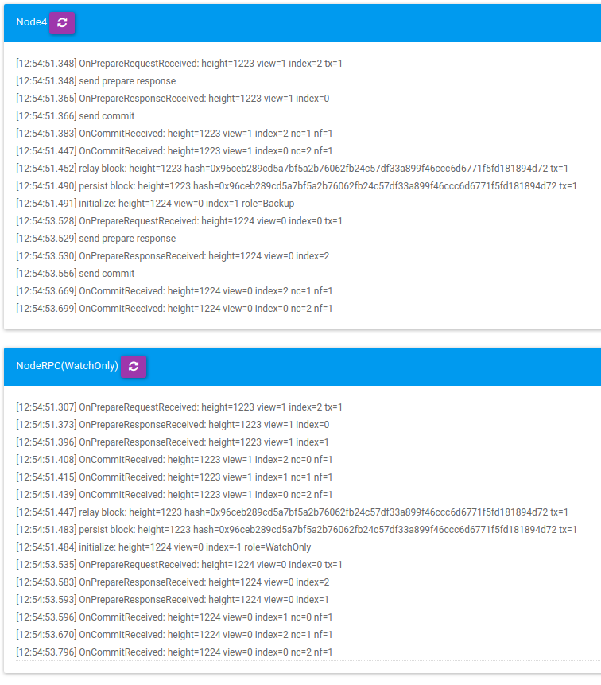
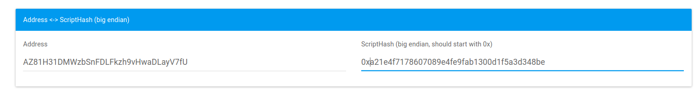

# Examples and consensus scenarios for dBFT

## Watch-only consensus nodes

As could be verified in the [Network tutorial](../5-network/1-Introduction_to_the_NEO_network_protocol.md), NEO network operates in a fully distributed fashion, such as this figure above, extracted from this [Medium Article](https://medium.com/neoresearch/understanding-neo-network-in-five-pictures-e51b7c19d6e0):

The green boxes represents consensus, which are emerged in the pool of nodes.
Messages are all broadcasted to neighbors (in an optimal scenario).
Nodes with special feature can be designed for just monitoring the CN P2P messages, as can be accesed here in the [NeoCompiler Eco Shared Privatenet](https://neocompiler.io/#!/ecolab/cnnodesinfo).

In this figure, this Watch-Only node also has the feature of RPC.
It is noteworthy that nodes can have special features and summarize any information desired by those that manage that client.

## dBFT consensus scenarios

We will now outline possible consensus scenarios, using the following characters to represent nodes:

- **N1:** Erik Zhang, the Jedi Master;
- **N2:** Da Hongfei, the hearth of the Smart Economy;
- **N3:** Peter Lin, the truth in the hearth;
- **N4:** NEO Ecosystem, the sum of all projects and interests of users, exchanges, and developers;
- **N5:** City of Zion, the combination and partnership of individuals around the world;
- **N6:** NeoResearch Butterfly, the ability to explore, recover, and transform;
- **N7:** Master Yoda, learning from past.

By using these 7 consensus nodes and their virtues, we are going give some examples that may enlighten the mind of the readers about how dBFT may work:

### The Genesis Block

Genesis block is created with 3 transactions, in which native assets NEO and GAS are created then subsequently transferred to a multi-signature account composed of the current validators.

### Case 1 (normal operation)

- We are at Height `1` and view `0`, the primary will be `N1`(considering a didactic formula);
- Erik Zhang picks the first set of transactions, signed by the multi-sig accounts, and proposes a block `b_1_0`;
- `2f+1`nodes needs to agree with the proposal. Nodes N2, N3, N4, and N5 are the first ones to reply with their agreement on this block. Together with N1, they reach the required total of 5 (exactly 2f +1);
- N1, ..., N5 will probably be the ones that are first to enter into the commit phase.
- Those that are in the commit phase will automatically send their signature for the current block proposal `b_1_0`;
- As soon as a node sees `2f+1` signatures, it can broadcast a valid block to the network. Even a **watch-only node** could be the first one to perform this task (which highlights how this MAS enviroment may work).

### Case 2 (faulty primary)

- We are at Height `2` and view `0`, the primary will be `N2`;
- Da Hongfei took a brief nap and was not able to communicate with the other characters for a few seconds;
- `2f+1` nodes agreed that they should `change_view`. No progress on the network has occurred, and they should timeout exactly with `blocktime` shifted 1 bit. In the case of a 15 second block time, it would be after 30s;
- The primary will change to N3;
- N3 will propose a block only if it has participated in the `view_change`, otherwise it would still be waiting for `N2` to propose a block;
- Considering that N3 received `2f+1` `change_view` messages, it would now proposes a block `b_2_1`;
- The standard flow outlined in Case 1 would happen from here.

### Case 3 (faulty after commit)

- We are at Height `3` and view `0`, the primary will be `N3`;
- N3 proposes a block `b_3_0`
- The majority agrees, from `N3`, ..., `N7`;
- However, after entering into the commit phase, `N4` dies before broadcasting its signature for `b_3_0`;
- `N3`, `N5`, `N6` and `N7` are just `2F` and are still need one more signature for `b_3_0`. The possibilities are: 1) `N4` will recover from its fault; 2) `N1` and `N2` would see the messages they lost; 3) `N1` and `N2` will ask for `change_view` but will not have the majority `M` and the other nodes will reply to them with a `Recovery` message, in which they would automatically receive all known messages. As soon as any of these 3 nodes receive such messages, they will continue to contribute to the current block `b_3_0`.

It should be noticed that 3 faulty nodes are `f+1` which is expected to halt the progress of the network. On the other hand, it should be noticed that no real Byzantine behavior was really detected, only delays and connections problems. In this sense, it is expected that due to the partially synchronous protocol, messages will eventually arrive at these nodes.

### Case 4 (Byzantine Primary)

- We are at Height `4` and view `0`, the primary will be `N4`;
- `N4` is malicious and decides to send different block proposals to the network;
- Each node is designed to just accept a single proposal per `view`. Until the majority `M = 2f+1` nodes reach an agreement on the same proposal (summarized by the `hash`), no nodes will be committed;
- If `M` nodes commit and the other `f = 2` cached a different proposal, they will receive a `Recover` message at some time, which will allow them to match the hashes. If the hashes are different we have proof of malicious activity by the primary, which would surely make NEO holders to remove him as a validator.

## A 4-node consensus multi-sig

As you may already known, an address in the NEO blockchain 2.x is formed by `21`, which means ["Push 34 bytes on the evaluation stack"](https://github.com/neo-project/neo-vm/blob/f81c3039d5fb4417b3c1ad780378c7f92499964a/src/neo-vm/OpCode.cs#L144), the public key and `ac`, which is an opcode that invokes an script for checking witness of the address.

We suggest readers to take a look at the following article:

- [Understanding MultiSig on NEO](https://medium.com/neoresearch/understanding-multisig-on-neo-df9c9c1403b1).

Let's consider nodes with the following pubkeys (21+rootOfPubKey+ac):

- N1: `2102103a7f7dd016558597f7960d27c516a4394fd968b9e65155eb4b013e4040406eac`
- N2: `2102a7bc55fe8684e0119768d104ba30795bdcc86619e864add26156723ed185cd62ac`
- N3: `2102b3622bf4017bdfe317c58aed5f4c753f206b7db896046fa7d774bbc4bf7f8dc2ac`
- N4: `2103d90c07df63e690ce77912e10ab51acc944b66860237b608c4f8f8309e71ee699ac`

Basically, a trivial way to create a multi-signature account can be done using the following script:

`532102103a7f7dd016558597f7960d27c516a4394fd968b9e65155eb4b013e4040406e2102a7bc55fe8684e0119768d104ba30795bdcc86619e864add26156723ed185cd622102b3622bf4017bdfe317c58aed5f4c753f206b7db896046fa7d774bbc4bf7f8dc22103d90c07df63e690ce77912e10ab51acc944b66860237b608c4f8f8309e71ee69954ae`

which is: `53` (number of signers) + `21` + `02...6e` + `21` + `02...62` + `21` + `02...c2` + `21` + `03...99` + `54` (number of owners) + `ae`

We a holders pick those 4 nodes as their desired validators, the following script will be one signing every block, with the following public address: `AZ81H31DMWzbSnFDLFkzh9vHwaDLayV7fU`.
The latter can be achieved by converted that script to "Scripthash big-endian" and then converting to base-58.
We suggest readers to access [NeoCompiler-Eco](https://neocompiler.io/#!/ecolab/conversor) if they want to play with these conversors.

### A simple single-node consensus multi-sig

Let's take the first node (N1) previous described and create a multi-signatures acount with 1 owners and one signers by just switing `53` and `54` to `4f`.

`512102b3622bf4017bdfe317c58aed5f4c753f206b7db896046fa7d774bbc4bf7f8dc251ae`

The latter would result in the following Address: `AbU69m8WUZJSWanfr1Cy66cpEcsmMcX7BR`

## What's next?

[What is smart contract?](../9-smartContract/What_is_smart_contract.md) 

