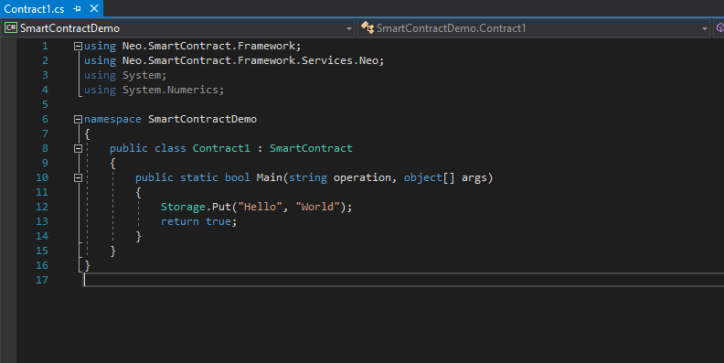

# Compile and Deploy the Smart Contract

>
> **Objective**:  Know the process of compile, deploy and invoke the smart contract
>
> **Main points**:
>
> 1. Compile the smart contract to AVM
>
> 2. Deploy the smart contract use the GUI
>
> 3. Invoke the smart contract and get the result
>


## Compiling contract file

Let's go back to the visual studio and start to compile this simple project.

 <p align="center">
  
 </p>


Click `generate`->`generate solutions` (hotkeys: Ctrl + Shift + B) in the Visual Studio menu to start compilation.


When the compilation is done, NEO smart contract file named`NEP5.avm` is generated in the `bin/Debug` directory of the project.


`SmartContractDemo.abi.json` is a descriptive file of the smart contract, which contains descriptions of the ScriptHash, entry, parameters and return values of the contract. More information about the smart contract ABI can be found in [NeoContract ABI](https://github.com/neo-project/proposals/blob/master/nep-3.mediawiki).

 <p align="center">
  
 </p>

 > [!!!!**Note**]
>
> Given that neon compiles .dll with nep-8 by default, which conflicts with nep-5, thus we need to execute .avm using nep-5 compatible method.
>
> Open Power Shell or command prompt (CMD), enter bin/Debug directory and input the following command (replace nep5.dll with your own project file):
>
> ```
> neon SmartContractDemo.dll --compatible
> ```

> The new `SmartContractDemo.avm`  file and `SmartContractDemo.abi.json`  file will overwrite the old files.


## Deploy the contract

  <p align="center">
  
 </p>

 We may use NEO-GUI to deploy the newly generated contract file.

1. Open 0.json wallet file, click `advance` -> `deploy contracts`.

2. Click `load` to select the compiled contract file `xxx.avm` in the contract deployment dialog.

	*Copy the contract script hash displayed under the code box for late use in contract invocation.*

3. Fill in the params in the information and meta data fields.

   For this contract, the argument is written as 0710 and the return value is 05.

   Detailed rules can be referred to  [Smart Contract Parameters and Return Values](http://docs.neo.org/zh-cn/sc/Parameter.html)。

   Check the box of `required to create a storage area`/

   No need to check the options` require dynamic invocation`.

4. After all the params are defined, click `deploy` -> `test` -> `invoke`.


#### Invoking contract

Now you may invoke the smart contract released just recently.

1. Click `advance` -> `contract call` -> `function call`。

2. Paste the contract scripthash copied in the last step to `ScriptHash` and press search button. Relevant contract information will be displayed automatically.

3. Click `...` beside `arguments` to enter the edit interface. Fill in the argument. In this contract, any arguments is ok because the main method does not use that.

4. Click `trial` to test the contract. If no error is spotted, click `invoke`, which may cost several GAS.


If invoke successfully, the gas will be reduced in the account balance.

## Next Step
**Congratulations!**, you set up your private network and invoke your first smart contract successfully. Now let's begin to learn [the basic of NEO smart contract and get your first one.](Smart_Contract_basics.md)

If you are not set up the IDE yet , you may first click [here](Development_set_up.md).
