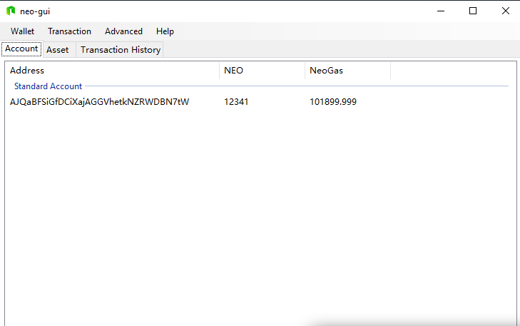
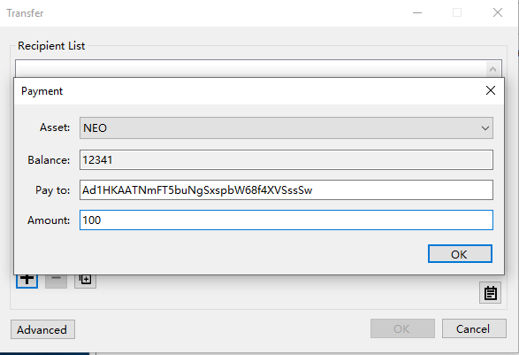

# Private Network

>
> **Objective**: Setup the private chain on the local computer
>
> **Main points**:
>
> 1. Simple way to set up a private chain
>
> 2. How to use NEO-GUI
>


NEO blockchain has launched several years and everyday, a number of users are making transaction and using Dapps on the mainNet. When you develop a smart contract, you have to deploy it to the blockchain and test it on with invocation. Deploying the smart contract  Dapp on the mainNet is spending the real Gas which is not an economic option for our developers. When developer wants to test their smart contract or Dapp, the best choice is to use TestNet or PrivateNet.

The TestNet is an environment where the user can develop, commission and test programs. Testing programs on the testnet incurs the network fee of testnet GAS (not real GAS!!). Testnet NEO and GAS can be applied free of charge, on the official website.

All the blockchain of the test network are independent of the main network. If you develop a simple smart contract or try to register assets, the use of testnet should suffice. After the testing is complete, the development can be moved to the NEO mainnet online operation.

All the transaction and blocks can be viewed on the [NEO scan](https://neoscan-testnet.io/).

In addition, building a private chain using four nodes and withdraw NEO and GAS from the private chain is a more convenient and fast way of developers like us who want to begin to learn how to develop the smart contract by step to step. By using such a private chain, developers do not have to worry about the GAS and also deploy and test on such a local network is much faster.


## Setting up your  private chain
In this tutorial, our development is based on a simplified private Chain which can be downloaded in this [Github Repository](https://github.com/steven1227/NEO-Private-Net).

This repository contains a configured private-chain and you can run it after downloads. The neo-cli in it version is 2.8.0. The gui version is 2.7.6

After clonning or download the repository, you cat start the private-net by run four cmd scripts.

```
enter node1 folder，double click 1Run.cmd

enter node2 folder，double click 1Run.cmd

enter node3 folder，double click 1Run.cmd

enter node4 folder，double click 1Run.cmd

```

 Now you see the private chain is running. All of the genesis NEO and GAS are taken into the wallet `1.json`.

Open NEO-GUI and click `wallet` ->  `open wallet database`,  Open `1.json` which is located in the *folder* `node1` and type the password is **11111111**.  

 The blockchain height is approximately 30. Please open the Neo-GUI and view the account balance.

 <p align="center">
  
 </p>


> [!Note]
> 
> Smart contract deployment and invocation cost GAS. Since GAS is generated with every new block generated, causing limited GAS generated on freshly-built private chains, therefore users are advised not to shut down private chains now in order to generate enough GAS in case of later use.

You can try to create a new wallet and transfers money to it.

1. Open NEO-GUI and click `wallet` ->  `create a wallet database`, then follow the instructions shown on the screen.
2. When the wallet is successfully created, right click the address in the standard account and select `view private key` tod view the account info (address, public key, private key).
3. Copy the address for next step.
4. Open the wallet `1.json` again and  click the `Transaction`, and then click the `+` symbol. Now lets add a new transaction.

   The *asset* type is `NEO`, the amount is your preferred amount to transfer, and the *payto* is the address from last step.
   <p align="center">
   
   </p>

 5. After confirmation, you can view the transaction success and there will be a transaction id. Click the `Transaction History ID`. The transaction you just made will be occurred here and it may show `unconfirmed`. Wait for seconds and it will display the confirmation number which means the block is confirmed by the consensus nodes. After that, open the new wallet you created just now and you will find the balance changed.
 6. Open the wallet `1.json` again and you can view there is another global asset `GAS`. GAS is the fuel for deploying and running smart contract on the blockchain in NEO. Gas can be claimed by the `NEO` token holders. In the GUI, click the `Advanced` ->  `NEO Gas claim`, you will see the gas available for you to claim. Then just click `Claim`, the GAS will show in your account balance.

 ## Next Step
 **Great!**, After set up the private Chain, next step is to [Set up the development tools.](Development_set_up.md)

If you are not clear with the idea of smart contract, click [here](What_is_smart_contract.md)

