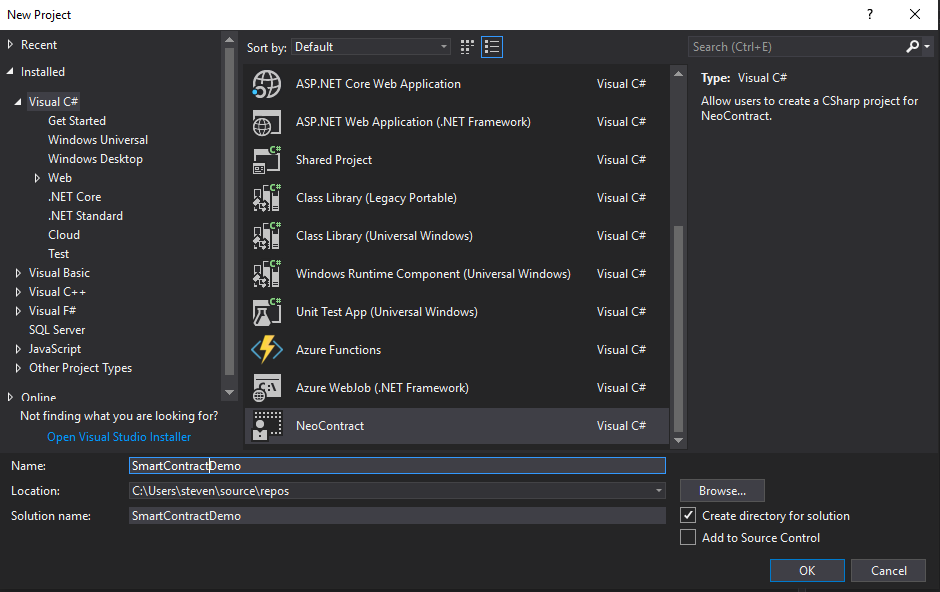

# C# Smart contract development environment

>**Objective**: Meet the development requirements
> 
>**Main points**:
> 
>1. System requirement
> 
>2. Visual Studio Setup
> 
>3. Neo-Compiler
> 

For NEO C# developers, it is very fortune for them  because  NEO blockchain is build based on the C# and therefore, from compiler to toolbox, the C# development environment has been widely supported and it is very easy for those .NET developers begin to learn NEO Smart contract development. It is also easy for users who did not get touch with C# to begin his smart contract and Dapp.

## Environment
For smart contract using C#, the best way is to develop with a local development environment with a IDE which support the NEO smart contract. Luckily, NEO is preparing a number of tools that achieve this. The only requirement for that is the operating system of your computer is Windows, preferred Windows 10 64 bit.

For non-windows users, such as MAC and Linux users, the best choice is to use the online editor and compiler which is more convenient for smart contract developing and deploying. This will be detailed in this [document](https://medium.com/neweconolab/with-neoray-neo-smart-contract-development-has-never-been-easier-edad41cc3ae6).

### Windows

In order to set-up a NEO private net and development environment, developer must install some dependencies:

-  [NET FrameWork](https://dotnet.microsoft.com/download/dotnet-framework-runtime/net472)
-  [NET Core](https://dotnet.microsoft.com/download)

In addition, in order to develop the C# based smart contract, also we have to use the IDE and the best choice is Visual Studio:

- [Microsoft Visual Studio](https://visualstudio.microsoft.com/vs/community/)

 Now let us prepare the smart contract development environment.

### Visual studio setup

#### Install and open visual studio.
Select  `.NET Core cross-platform` development option during installation

 

  
 

#### Install NeoContractPlugin
Open Visual Studio 2017 and click `tool` -> `extensions and Updates`，click `online`on the left column, search NEO and install NeoContractPlugin (the process must be completed online).

 

  
 

#### Configure neo-compiler

1. Download [neo-compiler](https://github.com/neo-project/neo-compiler) project to your localhost.

2. Click `file` -> `open` -> `project/solutions` in Visual Studio 2017 and select neo-compiler.sln in the project file.

3. Right click neon project in the list and click `release`.

4. After the release path is configured, click `release`.

	In my setting,  a `neon.exe` file is generated in `xxx\neo-compiler-master\neo-compiler-master\neon\bin\Debug\netcoreapp2.0\publish`

5. Add the neon to the `PATH` in system environment.

	For Windows10, press `Windows+S`, input environment parameter and select edit the account's environment parameters, and add it to `Path`.

#### Create a smart contract project
1. Click `file` -> `create` -> `project`.
2. Select `NeoContract` in the list and change settings where necessary, then click `confirm`.

 

  Â
 

A C# file will be auto-generated after the project is created with a default class inherited from the SmartContract. As indicated in the screenshot below, now you have a Hello World contract.

 

  
 

Nevertheless, the above only demonstrates a simple data storage method - to store data in private storage area using key-value method.

## Next Step
**Congratulations!**, After set up the development tools, next step is to [compile the contract, deploy it and invoke it.](Development_compile.md)

If you are not set up the private chain yet , you may first click [here](Development_privateChain.md).

