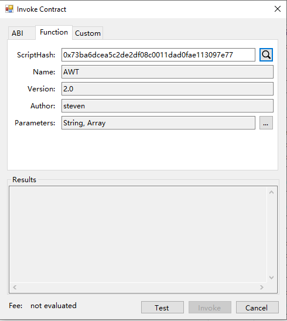
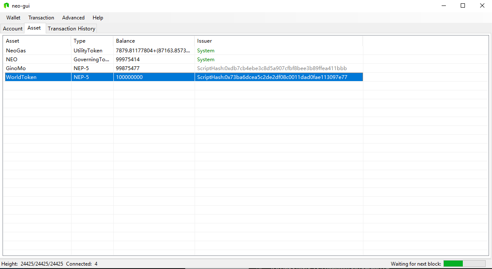
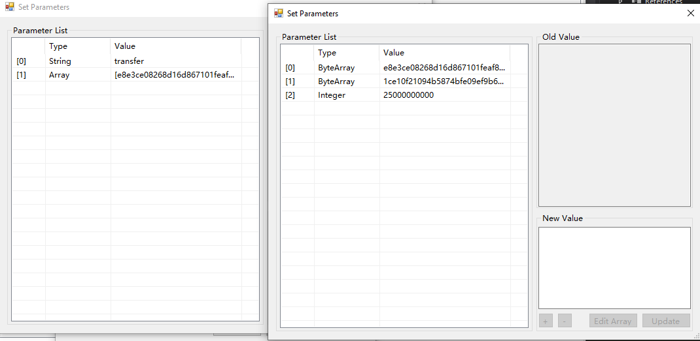
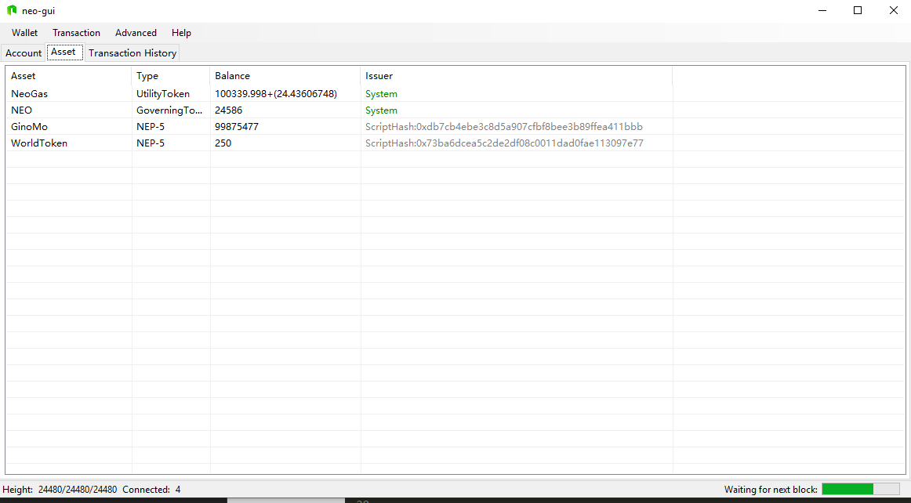

# Implementation of NEP-5


>
> **Objective**:  Learn the general idea of NEP5
>
> **Main points**:
>
> 1. Implementation of each point according to the NEP-5 standard
>
> 2. Use your NEP-5 Token on the NEO-Gui
>

First of all, we define a readably property owner to present the owner of the contract. The is the `Owner` and it is a `20` length byte array.

```csharp
// Here string "xxx" stands for the address you assigned as the onwer of address.
private static readonly byte[] Owner = "xxxxxxxxxxxxxxxxxxxxx".ToScriptHash(); //Owner Address
```

Now we begin with the main method and the  trigger:

```csharp
    public static object Main(string method, object[] args){
            if (Runtime.Trigger == TriggerType.Verification)
            {
                return Runtime.CheckWitness(Owner);
            }
            else if (Runtime.Trigger == TriggerType.Application)
            {
	            return true;
            }
}
```
Here the main method accept two arguments. The first one is string `method`,  which is a nep-5 method the user will call to this smart contract. The second one is an array `args`, which represents a list of arguments used in the nep-5 method.

Here we also judge the trigger here. When the triggerType is `Verification`, it means the end user invoke the transaction with the asset transaction. In other words, end user may want to send global asset such as NEO or GAS to or from this contract. In this condition, we should judge if the invoker ( or the Address that signed the contract ) is  owner.

When the triggerType is Application, that means the smart contract is being called by the application (Web/App) with  an InvocationTransaction. In this case, we should call other functions according to the method value. We will fill this part later.

Then we define the functions for name, symbol, decimals, which are fixed value for this contract.

```csharp
[DisplayName("name")]
public static string Name() => "MyToken"; //name of the token
```

```csharp
[DisplayName("decimals")]
public static byte Decimals() => 8;
```

```csharp
[DisplayName("symbol")]
public static string Symbol() => "MYT"; //symbol of the token
```

We also need  define a Transfer event which is also specified in the `NEP-5` standard.

```csharp
[DisplayName("transfer")]
public static event Action<byte[], byte[], BigInteger> Transferred;
```

Now. Let's define the totalSupply method of the contract. Before that, we should first define a `deploy` method. The deploy method is not specified in the `NEP-5` standard, but should be the first function that called by smart contract owner and called only once. The purpose of deploy function is to set the `totalSupply` value of your `NEP-5` token, and move all the token into the Owner's account balance.   

It is worth noticing that, in tokenized smart contract, the asset is stored in the storage as the key is the address and the value is the balance. Here is the table which may declare it.

| Address |   value |
|--|--|
| address1 | 1000 |
| address2 | 200 |

```csharp
//Static readonly value of total supply value
private static readonly BigInteger TotalSupplyValue = 10000000000000000;
```

```csharp
[DisplayName("deploy")]
public static bool Deploy()
{
      if (TotalSupply() != 0) return false;
      StorageMap contract = Storage.CurrentContext.CreateMap(nameof(contract));
      contract.Put("totalSupply", TotalSupplyValue);
      StorageMap asset = Storage.CurrentContext.CreateMap(nameof(asset));
      //The contract owner own the total nep-5 token
      asset.Put(Owner, TotalSupplyValue);
      // This is the Event we should fire when NEP-5 asset transferred
      Transferred(null, Owner, TotalSupplyValue);
      return true;
}
```

Now , we have the totalSupply defined in the deployment stage, we can fill our totalSupply method, which get the totalSupply value from the storage.


```csharp
[DisplayName("totalSupply")]
public static BigInteger TotalSupply()
{
    StorageMap contract = Storage.CurrentContext.CreateMap(nameof(contract));
    return contract.Get("totalSupply").AsBigInteger();
}
```

Let's set another method `balanceOf`, which get the account `NEP-5` balance of a specified address


```csharp
 [DisplayName("balanceOf")]
public static BigInteger BalanceOf(byte[] account)
{
	  // Do an argument check
      if (account.Length != 20)
          throw new InvalidOperationException("The parameter account SHOULD be 20-byte addresses.");
      StorageMap asset = Storage.CurrentContext.CreateMap(nameof(asset));
      return asset.Get(account).AsBigInteger();
}
```

Now, we have defined almost all the method required in the `NEP-5` standard except the transfer method, let us fill the main method first.

```csharp
public static object Main(string method, object[] args)
{
     if (Runtime.Trigger == TriggerType.Verification)
     {
         return Runtime.CheckWitness(Owner);
     }
     else if (Runtime.Trigger == TriggerType.Application)
     {
	     if (method == "balanceOf") return BalanceOf((byte[])args[0]);

	     if (method == "decimals") return Decimals();

	     if (method == "name") return Name();

	     if (method == "symbol") return Symbol();

	     if (method == "supportedStandards") return SupportedStandards();

	     if (method == "totalSupply") return TotalSupply();

	     if (method == "transfer") return Transfer((byte[])args[0], (byte[])args[1], (BigInteger)args[2]);
	  }
	 return false;
}
```

Now, the only method left is  the transfer method. What the transfer function has to do is first checking the arguments and check if the contract invoker is the owner. If it meets all requirements, get the `from` address's balance from the storage, and check if it has enough asset to deal with the transfer. If it has enough amount `NEP-5` token,  do the calculation and update the new account balance for the `from` account and `to` account.

```csharp
private static bool Transfer(byte[] from, byte[] to, BigInteger amount, byte[] callscript)
{
      //Check parameters
      if (from.Length != 20 || to.Length != 20)
          throw new InvalidOperationException("The parameters from and to SHOULD be 20-byte addresses.");
      if (amount <= 0)
          throw new InvalidOperationException("The parameter amount MUST be greater than 0.");
      if (!Runtime.CheckWitness(from))
          return false;
      StorageMap asset = Storage.CurrentContext.CreateMap(nameof(asset));
      var fromAmount = asset.Get(from).AsBigInteger();
      if (fromAmount < amount)
          return false;
      if (from == to)
          return true;

      //Reduce payer balances
      if (fromAmount == amount)
          asset.Delete(from);
      else
          asset.Put(from, fromAmount - amount);

      //Increase the payee balance
      var toAmount = asset.Get(to).AsBigInteger();
      asset.Put(to, toAmount + amount);

      Transferred(from, to, amount);
      return true;
  }
```

Now the NEP-5 Token has been finished and it can be tested on our [privateNet](Development_set_up.md). You can also view source code [here](https://github.com/neo-ngd/NEO-Tutorial/blob/steven/smartContract/sourceCode/NEP5.cs)

After compile the NEP5.cs and get the avm file, deploy it. And if the contract is already deployed on the blockchain, first invoke the deploy method which initial the totalSupply of the token.
<p align="center">
	
</p>
<p align="center">
	
</p>

Now, in the NEO-GUI click `Advanced`->`Option`, add the scriptHash of your contract, you can view the NEP-5 asset you have in the Asset tab。

<p align="center">
	
</p>

Let's test another transfer method in the NEP-5 standard. Open the invocation function tab and fill in the arguments. The string part is the method of smart contract you want to call. Here we put `transfer`. In the array, the arguments are `from`,`to`,`amount`. The `From` address and `To` address are in the format of byte array which can be  changed by the wallet address. For instance, use this [tool link](https://peterlinx.github.io/DataTransformationTools/) which transfer the wallet address to byte array. For the `amount`, do not forget the 10^8 decimal. Here I want to transfer  250000000 my NEP-5 token from my account to other account

<p align="center">
	
</p>

After the transaction to be recorded and confirmed, you can open the wallet of the target address and view the updated balance of NEP-5.
<p align="center">
	
</p>

## Assignment

Define a new NEP5-token by yourself.

## Next Step

In this tutorial, you have learned the standard of NEP-5 and how to implement the NEP-5 standard by define your own token. Now we can extend this step and go to [offer our token and make it publicly available](Give_an_ITO.md)

If you want to know what is NEP5, click [here](What_is_nep5.md).
