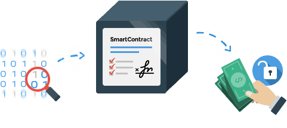

# What is smart contract?

## The popularity of smart contract

Have you heard about smart contract before? Recently, the word "smart contract" is discussed by everyone who are interested in the blockchain or even those who do not know blockchain. The concept of smart contract was pointed by Nick Szabo in 1994

> [!Note]
>
> A smart contract is a computerized transaction protocol that executes the terms of a contract. The general objectives are to satisfy common contractual conditions.

He called these new contracts "smart", because they are far more functional than their paper-based ancestors. No use of artificial intelligence is implied. A smart contract is a set of promises, specified in digital form, including protocols within which the parties perform on these promises.

From the blockchain's Perspective, a smart contract is a set of commitments that are defined in digital form, including the agreement on how contract participants shall fulfil these commitments. Blockchain technology gives us a decentralized, non-tampering, highly reliable system in which smart contracts are extremely useful. Smart contracts is one of the most important characteristics of blockchain technologies and the reason why blockchains can be called disruptive technology. It is increasing the efficiency of our social structure by each passing day.

Let's compare the smart contract with vending machines. In the real world, after inserting 10 dollars and press button, you will get the thing like potato chips which you expected. In the smart contract, you drop some digital coin and data, you will get the expected outcome, e.g. driver licence, into your own account. Smart contract is self-executing and is monitored by thousands of people, which makes it immutable and independent from centralization.

<p align="center">
  
</p>

## The merit of smart contract

- Autonomy
  Smart contract are independently running on the computers which spread the world and no rely on any centrailized system.
  
- Trust
  The trust is based on the distributed ledgers that execute and validates the contract.
  
- Robustness
  The smart contract is on the distributed network, loss or destroy of a single point is not working.
  
- Speed
  The decentralized processing of smart contract let the procedure of business can be finished in a short time.
  
- Economy
  Smart contract eliminated the need for a vast chain of middlemen includes lawyers, witness and other intermediatries.

## NEO smart contract

The NEO Smart Contract  includes the following features: certainty, high performance, and expandability. The contract types include: validation contracts, function contracts, and application contracts.

From the performance point of view, NEO uses the lightweight NeoVM (NEO Virtual Machine) as its intelligent contract execution environment. It starts very fast and takes up a small amount of resources and is suitable for smart contracts such as short procedures. Static compilation and caching of hotspot contracts can be significantly enhanced by JIT (real-time compiler) technology. The instructional setup of the NEO virtual machine provides a series of cryptographic instructions to optimize the execution efficiency of cryptographic algorithms in smart contracts. In addition, data manipulation instructions provide support for arrays and complex data structures directly.

NEO Smart Contract achieves a scalable approach through a combination of high concurrency and dynamic partitioning, combined with its low-coupling design. The low coupling contract procedure is executed in a virtual machine (NEO virtual machine) and communicates with the outside through the interactive service layer. Therefore, the vast majority of upgrades to the smart contract function can be achieved through API of the interactive service layer.

### Write smart contracts in any language
From the language point of view, the difference between NEO Smart Contract and  other blockchain such as Ethereum is more intuitive: unlike the original Solidity language in Ethereum, the NEO smart contract can be used directly by almost any high-level programming language. NEO provides compilers and plug-ins for these languages, which are used to compile high-level languages ​​into instruction sets supported by NEO virtual machines. The first compiler will be for MSIL (Microsoft intermediate language), so theoretically any .Net language and any language that can be translated into MSIL will be immediately supported.

The languages that are currently supported are:

- C#

- Java, Kotlin

- Python

- Golang

- JavaScript (Typescript)

With multiple-language support, more than 90% of developers can directly participate in the development of an NEO smart contract without the need to learn a new language. Existing business system code might even be directly ported to the blockchain. We envision that this will greatly increase the overall popularity of the future blockchain.

Additionally, traditional smart contracts are difficult to debug and test given lack of tool supports and access to clear instructions. NEO, however, provides major support for debugging at the NEO virtual machine level, allowing you to develop NEO Smart Contract both easier and faster.

Developing a smart contract is very simple. Here is a Hello world  smart contract using C#:

```c#
public class HelloWorld : SmartContract
{
    public static void Main()
    {
        Storage.Put(Storage.CurrentContext, "Hello", "World");
    }
}
```

Here is a Hello world  smart contract using Python:

```python
def Main():
    print("Hello World")
```

After compiled and tested by using the tools NEO provided, the smart contract can be invoked on the main-net, test-net, or the private-net by yourself.

In this smart contract tutorial, developers can understand the theory behind the smart contract itself with the technical detail of NEO blockchain, and learn how to develop a smart contract based on different programming languages and using different tools.

## Next Step

Now, let's begin to learn the smart contract development. The first thing to do is [Set up your Private Chain](Development_privateChain.md).

