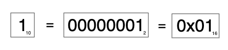
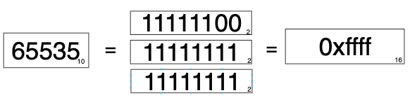
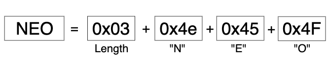
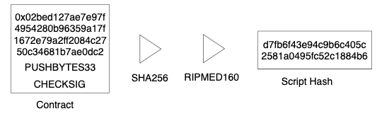
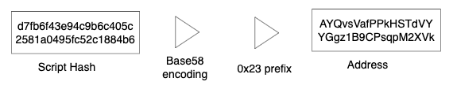
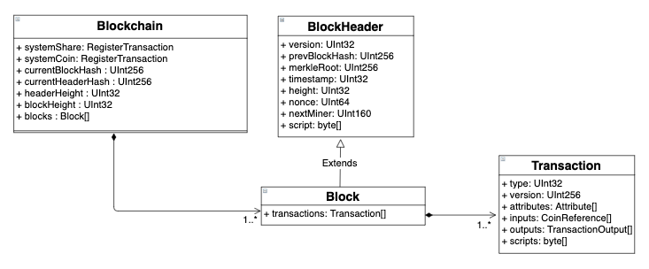
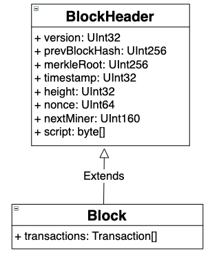

#  持久化

## 序列化模型
NEO平台支持的原生数据类型有Integer、Decimal和String、UInt160和UInt256。该模型在持久化层和网络层中都有使用。

### 整数序列化

根据存储的值，可使用可变长度的类型对整数进行编码：

|数值|长度|格式|
|---|---|---|
|< 0xfd|1|uint8|
|<= 0xffff|3|0xfd + uint16|
|<= 0xffffffff|5|0xfe + uint32|
|> 0xffffffff|9|0xff + uint64|

使用一个字节存储数值1:



但是数值65535需要使用3个字节进行存储:



#### 整数序列化代码
你可以点击[此处](https://github.com/neo-project/neo/blob/b0793b74f25d817f826c4dca3f7f06a8b7dce88e/neo/IO/Helper.cs#L235)查看C#版本的整数序列化代码:

``` CSharp

public static void WriteVarInt(this BinaryWriter writer, long value)
{
  if (value < 0)
    throw new ArgumentOutOfRangeException();
  if (value < 0xFD)
  {
    writer.Write((byte)value);
  }
  else if (value <= 0xFFFF)
  {
    writer.Write((byte)0xFD);
    writer.Write((ushort)value);
  }
  else if (value <= 0xFFFFFFFF)
  {
    writer.Write((byte)0xFE);
    writer.Write((uint)value);
  }
  else
  {
    writer.Write((byte)0xFF);
    writer.Write(value);
  }
}

```

#### 字节顺序
除IP地址和端口号外，NEO中所有变长的整数类型都使用小端存储。

### 字符串序列化
字符串使用变长的字符串变量进行编码，由一个表示字符串长度的整数以及随后紧跟的以UTF8编码的字符串构成。

|长度|字段|类型|说明|
|---|---|---|---|
|**？**|length|integer|字符串的字节长度|
|**length**|string|uint8[length]|字符串本身|

你可以点击[此处](http://www.unicode.org/versions/Unicode9.0.0/ch03.pdf#page=54)查看关于序列化UTF-8编码的字符串的其他信息。

#### 示例
字符串`NEO`使用4个字节存储：



#### 字符串序列化代码
你可以点击[此处](https://github.com/neo-project/neo/blob/b0793b74f25d817f826c4dca3f7f06a8b7dce88e/neo/IO/Helper.cs#L235)查看C＃版本的序列化字符串的代码：

``` CSharp
public static void WriteVarString(this BinaryWriter writer, string value)
{
  writer.WriteVarBytes(Encoding.UTF8.GetBytes(value));
}

public static void WriteVarBytes(this BinaryWriter writer, byte[] value)
{
  writer.WriteVarInt(value.Length);
  writer.Write(value);
}
```

在某些特殊场景，NEO会序列化一个固定长度的字符串。 对于这种情况，我们通过下面这种方式实现序列化：

``` CSharp
public static void WriteFixedString(this BinaryWriter writer, string value, int length)
{
  if (value == null)
    throw new ArgumentNullException(nameof(value));
  if (value.Length > length)
    throw new ArgumentException();
  byte[] bytes = Encoding.UTF8.GetBytes(value);
  if (bytes.Length > length)
    throw new ArgumentException();
  writer.Write(bytes);
  if (bytes.Length < length)
    writer.Write(new byte[length - bytes.Length]);
}
```


### UInt160 与 UInt256 序列化
UInt160和UInt256都存储为固定大小的字节数组，数组长度分别是20和32字节。NEO使用RIPMED160算法计算脚本哈希，并用SHA256算法计算交易和区块的哈希值。

请注意，在NEO中，我们会使用两次哈希函数。其中第一次始终是SHA256。

UInt160最常用于计算合约的哈希值：



#### 合约哈希代码
使用所有者的公钥创建一个简单的合约：

``` CSharp
public static byte[] CreateSignatureRedeemScript(ECPoint publicKey)
{
  using (ScriptBuilder sb = new ScriptBuilder())
  {
    sb.EmitPush(publicKey.EncodePoint(true));
    sb.Emit(OpCode.CHECKSIG);
    return sb.ToArray();
  }
}
```

生成的合约是一个字节数组。 使用前面说的哈希函数（RIPMED160）将该字节数组转换为脚本哈希：

``` CSharp
// https://github.com/neo-project/neo/blob/41caff115c28d6c7665b2a7ac72967e7ce82e921/neo/SmartContract/Helper.cs#L82
public static UInt160 ToScriptHash(this byte[] script)
{
  return new UInt160(Crypto.Default.Hash160(script));
}

// https://github.com/neo-project/neo/blob/35ff9a68010bdddc160840f222df13c3c46290f6/neo/Cryptography/Crypto.cs#L12
public byte[] Hash160(byte[] message)
{
  return message.Sha256().RIPEMD160();
}
```

#### 地址
UInt160用于计算合约的哈希值，该哈希值可以用于生成地址。
对合约的脚本哈希进行Base58编码，之后再附加上合约版本号作为前缀，当前为`0x17`，即可得出地址。



#### 地址转换代码
你可以点击[此处](https://github.com/neo-project/neo/blob/a8fd76b715e675bc7982f26481ecfb9b6ea68811/neo/Wallets/Helper.cs#L16)查看地址转换的代码示例。 请注意，地址只是为了方便人们理解，在系统操作中始终使用的是脚本哈希。

``` CSharp
public static string ToAddress(this UInt160 scriptHash)
{
  byte[] data = new byte[21];
  data[0] = ProtocolSettings.Default.AddressVersion;
  Buffer.BlockCopy(scriptHash.ToArray(), 0, data, 1, 20);
  return data.Base58CheckEncode();
}

public static UInt160 ToScriptHash(this string address)
{
  byte[] data = address.Base58CheckDecode();
  if (data.Length != 21)
    throw new FormatException();
  if (data[0] != ProtocolSettings.Default.AddressVersion)
    throw new FormatException();
  return new UInt160(data.Skip(1).ToArray());
}
```

### 十进制序列化
十进制数值存储为64位长的定点数，精度为10 <sup> -8 </sup>，取值范围为：[ -2 <sup>63</sup> / 10 <sup>8</sup>，+2<sup>63</sup>/ 10<sup>8</sup>]

有关定点数的更多信息，请点击[此处](http://www-inst.eecs.berkeley.edu/~cs61c/sp06/handout/fixedpt.html)查看。


### 数据结构
#### Arrays
#### Maps
#### Structs

### 域名类序列化
这里使用的编码方法同样适用于网络通信模块和持久层（C＃）。
区块链由多种数据组合而成，存储在持久层中。


区块链中至少包含一个区块（即创世块），每个区块至少包含有一个交易（即矿工交易）。

#### 区块头
区块头包含有关该区块的所有信息，但是不包括交易。通过区块头和交易列表可以构建出一个区块，并使用默克尔根节点来对进行完整性验证。


在网络层，节点会分别对区块头和交易发起请求从而查询一个区块。


区块头的可序列化数据结构如下所示：

|长度|字段|数据类型|说明|
|---|---|---|---|
|4|**Version**|uint32|区块的版本号，当前为0 |
|32|**PrevBlock**|uint256|前一个区块的哈希值|
|32|**MerkleRoot**|uint256|交易列表的默克尔根节点哈希|
|4|**Timestamp**|uint32|时间戳|
|4|**Height**|uint32|区块高度|
|8|**Nonce**|uint64|随机数|
|20|**NextMiner**|uint160|下一轮矿工节点的合约地址|
|1|**-**|uint8|固定为1|
|?|**Script**|script|验证区块的脚本|
|uint8|**-**|uint8|固定为0|

#### 区块
区块由一个区块头（具有多种属性）和一个交易列表组成，列表中至少包含一个交易（即矿工交易）。



区块的可序列化数据结构：

|长度|字段|数据类型|说明|
|---|---|---|---|
|4|**Version**|uint32|区块的版本号，当前为0|
|32|**PrevBlock**|uint256|前一个区块的哈希值|
|32|**MerkleRoot**|uint256|交易列表的默克尔根节点哈希|
|4|**Timestamp**|uint32|时间戳|
|4|**Height**|uint32|区块高度|
|8|**Nonce**|uint64|随机数|
|20|**NextMiner**|uint160|下一轮矿工节点的合约地址|
|1|**-**|uint8|固定为1|
|？|**Script**|script|验证区块的脚本|
|？*？|**Transactions**|tx[]|交易列表|


#### (原生) 资产
原生资产表示为 **RegisterTransaction** 的交易哈希。资产注册后，通过发起 **IssueTransaction** 交易将该资产发送到某个地址。这些交易用于在`创世块`中产生NEO和GAS。

#### 原生资产释放代码
请点击[此处](https://github.com/neo-project/neo/blob/41caff115c28d6c7665b2a7ac72967e7ce82e921/neo/Ledger/Blockchain.cs#L66)查看`创世块`的代码。

``` CSharp
public static readonly Block GenesisBlock = new Block
{
    PrevHash = UInt256.Zero,
    Timestamp = (new DateTime(2016, 7, 15, 15, 8, 21, DateTimeKind.Utc)).ToTimestamp(),
    Index = 0,
    ConsensusData = 2083236893, //向比特币致敬
    NextConsensus = GetConsensusAddress(StandbyValidators),
    Witness = new Witness
    {
        InvocationScript = new byte[0],
        VerificationScript = new[] { (byte)OpCode.PUSHT }
    },
    Transactions = new Transaction[]
    {
        new MinerTransaction
        {
            Nonce = 2083236893,
            Attributes = new TransactionAttribute[0],
            Inputs = new CoinReference[0],
            Outputs = new TransactionOutput[0],
            Witnesses = new Witness[0]
        },
        GoverningToken,
        UtilityToken,
        new IssueTransaction
        {
            Attributes = new TransactionAttribute[0],
            Inputs = new CoinReference[0],
            Outputs = new[]
            {
              new TransactionOutput
              {
                    AssetId = GoverningToken.Hash,
                    Value = GoverningToken.Amount,
                    ScriptHash = Contract.CreateMultiSigRedeemScript(StandbyValidators.Length / 2 + 1, StandbyValidators).ToScriptHash()
                }
            },
            Witnesses = new[]
            {
                new Witness
                {
                    InvocationScript = new byte[0],
                    VerificationScript = new[] { (byte)OpCode.PUSHT }
                }
            }
        }
    }
};
```

NEO为`治理代币`，注册后会被发送到`验证人`的多签合约地址中：

``` CSharp
public static readonly RegisterTransaction GoverningToken = new RegisterTransaction
{
  AssetType = AssetType.GoverningToken,
  Name = "[{\"lang\":\"zh-CN\",\"name\":\"小蚁股\"},{\"lang\":\"en\",\"name\":\"AntShare\"}]",
  Amount = Fixed8.FromDecimal(100000000),
  Precision = 0,
  Owner = ECCurve.Secp256r1.Infinity,
  Admin = (new[] { (byte)OpCode.PUSHT }).ToScriptHash(),
  Attributes = new TransactionAttribute[0],
  Inputs = new CoinReference[0],
  Outputs = new TransactionOutput[0],
  Witnesses = new Witness[0]
};
```

而GAS是`功能代币`。

``` CSharp
public static readonly RegisterTransaction UtilityToken = new RegisterTransaction
{
  AssetType = AssetType.UtilityToken,
  Name = "[{\"lang\":\"zh-CN\",\"name\":\"AntCoin \"},{\"lang\":\"en\",\"name\":\"AntCoin\"}]",
  Amount = Fixed8.FromDecimal(GenerationAmount.Sum(p => p) * DecrementInterval),
  Precision = 8,
  Owner = ECCurve.Secp256r1.Infinity,
  Admin = (new[] { (byte)OpCode.PUSHF }).ToScriptHash(),
  Attributes = new TransactionAttribute[0],
  Inputs = new CoinReference[0],
  Outputs = new TransactionOutput[0],
  Witnesses = new Witness[0]
};
```

##### 原生资产代码
原生资产可以在`创世块`中查看。 请注意，由于使用了`Validators`属性，这意味着该交易在不同的网络（主网，测试网或其他网络）中会具有不同的哈希。

##### 弃用通知
**RegisterTransaction** 和 **IssueTransaction** 这两种交易都已经被弃用了。 可以通过创建[NEP-5](https://github.com/neo-project/proposals/blob/master/nep-5.mediawiki)合约来发行自己的token。NEP-5合约通过创建 **InvocationTransaction** 交易来部署和运行智能合约。

#### 代币参考（交易输入）
NEO的原生资产使用了UTXO模型，这意味着要想花费代币，你需要引用给你发送代币的那个交易。该引用使用了两个属性：`PrevHash`和`PrevIndex`。 `PrevHash`表示的是交易哈希，`PrevIndex`表示该交易在交易输出数组中所处的索引号。

在该交易中，一个代币引用（在`vin`数组中）会被转换为多个交易输出（`vout`）。 请注意，最后一个交易输出用于将零钱发送回发送方，这样他/她就可以获得另一个未花费的交易，将来可以使用。

``` json
{
    "jsonrpc": "2.0",
    "id": "1",
    "result": {
        "txid": "0x630c74684cc6dad330397c63e8c7aa6403c043cc1f241638cff87e3b97a40716",
        "size": 382,
        "type": "ContractTransaction",
        "version": 0,
        "attributes": [],
        "vin": [
            {
                "txid": "0xd5ae4a22ffe49912a2a3dc698d39ac63a8fcf2cef63ae136850d039c312591d8",
                "vout": 5
            }
        ],
        "vout": [
            {
                "n": 0,
                "asset": "0xc56f33fc6ecfcd0c225c4ab356fee59390af8560be0e930faebe74a6daff7c9b",
                "value": "94",
                "address": "ATM7fayESuu1jKRWVXuNFYrq4EFfeAeSfj"
            },
            {
                "n": 1,
                "asset": "0xc56f33fc6ecfcd0c225c4ab356fee59390af8560be0e930faebe74a6daff7c9b",
                "value": "72",
                "address": "AYQvsVafPPkHSTdVYYGgz1B9CPsqpM2XVk"
            },
            {
                "n": 2,
                "asset": "0xc56f33fc6ecfcd0c225c4ab356fee59390af8560be0e930faebe74a6daff7c9b",
                "value": "45",
                "address": "AdPoqv3ZRAb8Bc4bUjhzHq4SBZMt6dxdfY"
            },
            {
                "n": 3,
                "asset": "0xc56f33fc6ecfcd0c225c4ab356fee59390af8560be0e930faebe74a6daff7c9b",
                "value": "2879",
                "address": "Aab9jDXcs4ZRdZyJZusCExauKE5wuzzVEX"
            }
        ],
        "sys_fee": "0",
        "net_fee": "0",
        "scripts": [
            {
                "invocation": "40a623d40c74fe2d7a51a98b580c08108f1f12cc76dbaf9307320f0fd0c3d0782bf14bd32c24e8d097f8a31ab0e60bc330386f3c5d1e5f6fe25b188c8eed6d8cff",
                "verification": "210310c5ab33fac18c22f280c8354d872af488508de74661ec799d03c94d23515358ac"
            }
        ],
        "blockhash": "0x5820dffbb46a86bbc7398522e157d68a2495b99b7bc5d18f4c848cde81a46c28",
        "confirmations": 68436,
        "blocktime": 1555106714
    }
}

```

现在根据交易哈希和索引，就可以在另一个交易中引用到交易输出中索引为1的交易。 在本示例中，前一个交易的哈希是`0x630c74684cc6dad330397c63e8c7aa6403c043cc1f241638cff87e3b97a40716`，索引是`1`。

```json
{
    "jsonrpc": "2.0",
    "id": "1",
    "result": {
        "txid": "0xd59ab9e40e3dc5302fb6ca464823f3569eceace69f3a30a41d1ef1e86225e467",
        "size": 245,
        "type": "ContractTransaction",
        "version": 0,
        "attributes": [
            {
                "usage": "Remark",
                "data": "4f335853454e44"
            }
        ],
        "vin": [
            {
                "txid": "0x630c74684cc6dad330397c63e8c7aa6403c043cc1f241638cff87e3b97a40716",
                "vout": 1
            },
            {
                "txid": "0xd5ae4a22ffe49912a2a3dc698d39ac63a8fcf2cef63ae136850d039c312591d8",
                "vout": 3
            }
        ],
        "vout": [
            {
                "n": 0,
                "asset": "0xc56f33fc6ecfcd0c225c4ab356fee59390af8560be0e930faebe74a6daff7c9b",
                "value": "180",
                "address": "Ab4U1pBCQCDSKWq4nHvUtXdbQPB6DsDj8S"
            }
        ],
        "sys_fee": "0",
        "net_fee": "0",
        "scripts": [
            {
                "invocation": "40fafd537ad4a8aabf3645d8f546b9f7207facbd4cb6647d2d8bb2c9eb400269ddd97c37c511fb72c4d3e3d0a01ee979eab8da87fa7e45c912adb801e006c08e30",
                "verification": "2102bed127ae7e97f4954280b96359a17f1672e79a2ff2084c2750c34681b7ae0dc2ac"
            }
        ],
        "blockhash": "0xbc9626bcdfa31c6efdf19e6de2b52a8a9b86d0cf660c4e83c4b09c3e382231f9",
        "confirmations": 59884,
        "blocktime": 1555278520
    }
}

```

代币只能通过被引用的方式来花费。 构建索引是钱包提供的服务之一。 当向钱包添加账户时，钱包会搜索所有区块以便找到属于该地址的交易。 通过这种方式，当用户需要发送资金时，就可以找到这些未花费代币的引用并使用它们来构建交易。 在轻钱包中，由于不会存储区块链数据，我们使用[neoscan.io](neoscan.io)等外部服务来获取用户账户的余额（未花费的代币引用）。

常规节点不会提供构建索引服务，但是，目前正在构建的一个插件，可以用于向C#节点添加索引功能。

#### 交易属性
交易可能具有特殊属性，这取决于它们所属的类型。 交易属性的序列化在`Version`字段之后。

##### 矿工交易的属性
`MinerTransaction`有一个名为`nonce`的属性，用于避免哈希冲突。

矿工交易中的特殊属性：

|长度|字段|数据类型|描述|
|---|---|---|---|
|4|**Nonce**|uint32|随机数|


#### 见证人

#### 合约
#### 交易
交易用于作为账本的输入。 可以用于提取GAS，转账原生资产以及其他一些对区块链的操作。交易的序列化取决于要在账本中注册的交易类型。

|长度|字段|数据类型|说明|
|---|---|---|---|
|1|**Type**|uint8|合约类型|
|1|**Version**|uint8|交易版本号，当前为0 |
|?|**-**|-|指定交易类型的数据|
|?*?|**Attributes**|tx_attr[]|交易具有的其他属性|
|34*？|**Inputs**|tx_in[]|输入|
|60*？|**Outputs**|tx_out[]|输出|
|？*？|**Scripts**|script[]|用于验证交易的脚本列表|

##### 合约交易
合约交易的类型为`0x80`。 使用的验证脚本通常是一个64字节长的签名。

##### InvocationTransaction
测试调用

附加系统费

附加网络费

## 阅读下节

[LevelDB 区块链数据结构 ](2-levelDB_data_structure.md)

