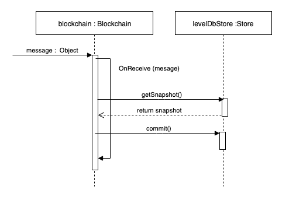

# LevelDB 区块链数据结构

NEO当前的C#实现使用了高效的键值数据库LevelDB来持久化区块链数据。LevelDB既可用于存储系统数据，例如区块和交易，也可用于智能合约相关的数据的持久化。当节点接收到一条会触发状态改变的消息时（比如说一个新的区块或者区块头），它会检索并更新快照信息，并在操作结束后提交结果。下图是相关过程的简单的示例：



## LevelDB 表结构
数据使用[Ledger](https://github.com/neo-project/neo/tree/master-2.x/neo/Ledger)包中的类定义的结构进行存储。使用`前缀`来区分各个`表`。

此处我们可以看到neo（C#）中使用的前缀信息：

| 前缀     | 说明     | LevelDB 键 | LevelDB 值 |
| :------------- | :------------- | :------------- | :------------- |
| 0x01      | **区块**: 附带`系统费`的区块头     | 区块哈希 | [BlockState](https://github.com/neo-project/neo/blob/master-2.x/neo/Ledger/BlockState.cs) |
| 0x02      | **交易**: 附带`区块高度`的交易       | 交易哈希 | [TransactonState](https://github.com/neo-project/neo/blob/master-2.x/neo/Ledger/TransactionState.cs) |
| 0x40      | **账户**: 账户的元数据(票数，余额)       | 账户的脚本哈希 | [AccountState](https://github.com/neo-project/neo/blob/master-2.x/neo/Ledger/AccountState.cs) |
| 0x44      | **未花费的代币**: 可以在另一个交易中使用的交易     | Transaction Hash | [UnspentCoinState](https://github.com/neo-project/neo/blob/master-2.x/neo/Ledger/UnspentCoinState.cs) |
| 0x45      | **已花费的代币**: 已经作为之前交易输入的交易（已花费）  | 交易哈希 | [SpentCoinState](https://github.com/neo-project/neo/blob/master-2.x/neo/Ledger/SpentCoinState.cs) |
| 0x48      | **验证人**: 网络验证人的元数据  | 验证人公钥| [ValidatorState](https://github.com/neo-project/neo/blob/master-2.x/neo/Ledger/ValidatorState.cs)|
| 0x4c      | **资产**: 原生代币的元数据 |注册交易的哈希 | [AssetState](https://github.com/neo-project/neo/blob/master-2.x/neo/Ledger/AssetState.cs) |
| 0x50      | **合约**: 合约的元数据 | 合约的脚本哈希| [ContractState](https://github.com/neo-project/neo/blob/master-2.x/neo/Ledger/ContractState.cs) |
| 0x70    | **智能合约存储区**: 智能合约使用的存储区  | 脚本哈希+密钥 | Byte[] |
| 0x80      | **附加区块头**: 在同步过程中使用，用于跟踪待同步的区块信息  | 仅为前缀 | [HeaderHashList](https://github.com/neo-project/neo/blob/master-2.x/neo/Ledger/HeaderHashList.cs) |
| 0x90      | **验证人个数**: 用于记录待选共识节点的票数      |仅为前缀 | [ValidatorsCountState](https://github.com/neo-project/neo/blob/master-2.x/neo/Ledger/ValidatorsCountState.cs) |
| 0xc0      | **当前区块**: 最后提交的区块  | 仅为前缀 |  [HashIndexState]([HashIndexState](https://github.com/neo-project/neo/blob/master-2.x/neo/Ledger/HashIndexState.cs))|
| 0xc1      | **当前区块头**: 同步的区块 | 仅为前缀 | [HashIndexState]([HashIndexState](https://github.com/neo-project/neo/blob/master-2.x/neo/Ledger/HashIndexState.cs))|
| 0xf0      | **系统版本号**: 当前的系统版本。用于避免数据的不一致 | 仅为前缀 | String ("2.9.2") |

可以点击 [此处](https://github.com/neo-project/neo/blob/master/neo/persistence/leveldb/prefixes.cs)查看更多前缀信息。

### 内存池

内存池是内存中用于跟踪那些还没有提交/持久化交易的集合。在查找交易时，节点始终都会先查找交易是否在内存池中，之后再查找节点的存储区。


如果`Storage`返回一个空交易，则说明该交易要么不存在（如果节点已经完全同步），要么必须从其他节点那里获取该交易。

### 0x01 - 区块

```CSharp
private void OnNewHeaders(Header[] headers)
        {
            using (Snapshot snapshot = GetSnapshot())
            {
                foreach (Header header in headers)
                {
                    if (header.Index - 1 >= header_index.Count) break;
                    if (header.Index < header_index.Count) continue;
                    if (!header.Verify(snapshot)) break;
                    header_index.Add(header.Hash);
                    snapshot.Blocks.Add(header.Hash, new BlockState
                    {
                        SystemFeeAmount = 0,
                        TrimmedBlock = header.Trim()
                    });
                    snapshot.HeaderHashIndex.GetAndChange().Hash = header.Hash;
                    snapshot.HeaderHashIndex.GetAndChange().Index = header.Index;
                }
                SaveHeaderHashList(snapshot);
                snapshot.Commit();
            }
            UpdateCurrentSnapshot();
            system.TaskManager.Tell(new TaskManager.HeaderTaskCompleted(), Sender);
        }
```

> [!Caution]
>
> 通过网络发送给其他外部节点的`区块`在持久层中称为`修剪块`。

```CSharp
public static bool ContainsBlock(this IPersistence persistence, UInt256 hash)
{
  BlockState state = persistence.Blocks.TryGet(hash);
  if (state == null) return false;
    return state.TrimmedBlock.IsBlock;
}

 public bool IsBlock => Hashes.Length > 0;
```

### 0x02 - 交易

所有交易都存储在前缀为`交易`的表下。共识节点负责打包各个交易到区块中，之后再提交该区块。可以通过单个或者批量的形式检索这些交易。

```CSharp
private bool AddTransaction(Transaction tx, bool verify)
{
      if (verify && !tx.Verify(context.Snapshot, context.Transactions.Values))
      {
          Log($"Invalid transaction: {tx.Hash}{Environment.NewLine}{tx.ToArray().ToHexString()}", LogLevel.Warning);
          RequestChangeView();
          return false;
      }
      if (!Plugin.CheckPolicy(tx))
      {
          Log($"reject tx: {tx.Hash}{Environment.NewLine}{tx.ToArray().ToHexString()}", LogLevel.Warning);
          RequestChangeView();
          return false;
      }
      context.Transactions[tx.Hash] = tx;
      if (context.TransactionHashes.Length == context.Transactions.Count)
      {
          if (VerifyRequest())
          {
              //如果是当前视图的议长，但由于恢复了之前发送的Prepare请求，因此会被当做一个备份节点，并且不会发送Prepare响应信息。
              if (context.IsPrimary() || context.WatchOnly()) return true;

                //由于在2*15/M=30.0/5时，约等于出块时间的40%（M=5）发送了prepare响应而导致的超时延长
	          ExtendTimerByFactor(2);

              Log($"send prepare response");
              localNode.Tell(new LocalNode.SendDirectly { Inventory = context.MakePrepareResponse() });
              CheckPreparations();
          }
          else
          {
              RequestChangeView();
              return false;
          }
      }
      return true;
  }

```


### 0x40 – 账户
NEO使用账户来跟踪用户的余额信息，但不会跟踪UTXO。

### 0x44 - (未花费) 代币集合
如果某个交易没有被其他交易作为输入引用，那么这个交易就是“未花费”的交易。节点会跟踪这些未花费的代币以便对交易执行验证操作，但不会按账户对交易进行分组，这意味着节点可以确定一个代币是否是可花费的，但不能获取特定账户的所有可花费的代币。通过账户跟踪可花费代币的功能是由钱包或[neoscan](neoscan.io)/[neosracker](neosracker.io)这样的可构建索引的服务提供的。

这个集合可以用来确定代币是否是可花费的。以下是C#中的实现方法：

``` CSharp
public static bool IsDoubleSpend(this IPersistence persistence, Transaction tx)
{
  if (tx.Inputs.Length == 0) return false;
    foreach (var group in tx.Inputs.GroupBy(p => p.PrevHash))
    {
      UnspentCoinState state = persistence.UnspentCoins.TryGet(group.Key);
      if (state == null) return true;
      if (group.Any(p => p.PrevIndex >= state.Items.Length || state.Items[p.PrevIndex].HasFlag(CoinState.Spent)))
        return true;
      }
  return false;
}
```

请注意，此时我们没有查看内存池。这个操作是在`IsDoublesPend`方法执行前完成的。

### 0x45 - 已花费代币

NEO会跟踪那些已花费的代币，以便用户可以`提取GAS`。可提取的GAS是根据交易创建时所处的区块高度与交易花费时所处区块高度之间的高度差计算出来的。这意味着，要想提取GAS，你需要花费该笔交易。通常情况下，可以将该笔交易发送给自己从而`解锁`这些可提取的GAS。

``` CSharp
public Dictionary<ushort, SpentCoin> GetUnclaimed(UInt256 hash)
        {
    TransactionState tx_state = Transactions.TryGet(hash);
    if (tx_state == null) return null;
    SpentCoinState coin_state = SpentCoins.TryGet(hash);
    if (coin_state != null)
    {
        return coin_state.Items.ToDictionary(p => p.Key, p => new SpentCoin
        {
            Output = tx_state.Transaction.Outputs[p.Key],
            StartHeight = tx_state.BlockIndex,
            EndHeight = p.Value
        });
    }
    else
    {
        return new Dictionary<ushort, SpentCoin>();
    }
}

```

### 0x48 – 验证人
在验证区块时会使用到这个集合，因为需要知道验证人的公钥才能对区块中包含的多个签名进行验证。 

```CSharp
UInt160[] IVerifiable.GetScriptHashesForVerifying(Snapshot snapshot)
{
  ECPoint[] validators = snapshot.GetValidators();
  if (validators.Length <= ValidatorIndex)
  throw new InvalidOperationException();
  return new[] { Contract.CreateSignatureRedeemScript(validators[ValidatorIndex]).ToScriptHash() };
}
```

### 0x4c - (原生) 资产
该集合包含使用 **Register Transaction** 来注册原生资产的相关信息，从而决定是否允许执行 **Issue Transactions**。

钱包模块也会用到这个集合，来检索token的信息（名称、符号等）。

当前该集合还没有被弃用，不过由于计划将原生资产转移到类似于NEP-5的合约中，因此在不久的将来，该集合可能会被弃用。

在代码层，我们可以看到资产信息会被用于执行额外的验证操作：

``` CSharp
public virtual bool Verify(Snapshot snapshot, IEnumerable<Transaction> mempool)
{
    if (Size > MaxTransactionSize) return false;
    for (int i = 1; i < Inputs.Length; i++)
        for (int j = 0; j < i; j++)
                if (Inputs[i].PrevHash == Inputs[j].PrevHash && Inputs[i].PrevIndex == Inputs[j].PrevIndex)
                        return false;
    if (mempool.Where(p => p != this).SelectMany(p => p.Inputs).Intersect(Inputs).Count() > 0)
        return false;
    if (snapshot.IsDoubleSpend(this))
        return false;
    foreach (var group in Outputs.GroupBy(p => p.AssetId))
    {
        AssetState asset = snapshot.Assets.TryGet(group.Key);
        if (asset == null) return false;
        if (asset.Expiration <= snapshot.Height + 1 && asset.AssetType != AssetType.GoverningToken && asset.AssetType != AssetType.UtilityToken)
            return false;
        foreach (TransactionOutput output in group)
            if (output.Value.GetData() % (long)Math.Pow(10, 8 - asset.Precision) != 0)
                return false;
    }
    TransactionResult[] results = GetTransactionResults()?.ToArray();
    if (results == null) return false;
    TransactionResult[] results_destroy = results.Where(p => p.Amount > Fixed8.Zero).ToArray();
    if (results_destroy.Length > 1) return false;
    if (results_destroy.Length == 1 && results_destroy[0].AssetId != Blockchain.UtilityToken.Hash)
        return false;
    if (SystemFee > Fixed8.Zero && (results_destroy.Length == 0 || results_destroy[0].Amount < SystemFee))
        return false;
    TransactionResult[] results_issue = results.Where(p => p.Amount < Fixed8.Zero).ToArray();
    switch (Type)
    {
        case TransactionType.MinerTransaction:
        case TransactionType.ClaimTransaction:
            if (results_issue.Any(p => p.AssetId != Blockchain.UtilityToken.Hash))
                return false;
            break;
        case TransactionType.IssueTransaction:
            if (results_issue.Any(p => p.AssetId == Blockchain.UtilityToken.Hash))
                return false;
            break;
        default:
            if (results_issue.Length > 0)
                return false;
            break;
    }
    if (Attributes.Count(p => p.Usage == TransactionAttributeUsage.ECDH02 || p.Usage == TransactionAttributeUsage.ECDH03) > 1)
        return false;
    if (!VerifyReceivingScripts()) return false;
    return this.VerifyWitnesses(snapshot);
}

```

### 0x50 – 合约
该集合用于存储智能合约代码和元数据。通过**InvocationTransaction**交易来部署合约，并在以`合约`为前缀的表下存储合约的相关数据，包括全部的代码（脚本）和元数据。请注意，合约使用的存储区位于其他位置（0x70的前缀下），但是，节点会使用这个集合来判断合约是否可以使用存储区或执行动态调用。

当前这个集合还没有被弃用，但是，由于计划将元数据移动到`Manifest`文件中，因此该集合有可能在不久的将来会被弃用。

在下面的代码中，我们不仅会检查智能合约的存在性，还会检查它是否有权限使用存储区（部署一个可使用存储区的合约花费的成本更高）。

``` CSharp
internal bool CheckStorageContext(StorageContext context)
{
  ContractState contract = Snapshot.Contracts.TryGet(context.ScriptHash);
  if (contract == null) return false;
  if (!contract.HasStorage) return false;
    return true;
}
```

下面是在运行时进行的验证，从而确保合约设置了动态调用的标志位：

```CSharp
private bool CheckDynamicInvoke()
{
    Instruction instruction = CurrentContext.CurrentInstruction;
    switch (instruction.OpCode)
    {
        case OpCode.APPCALL:
        case OpCode.TAILCALL:
            if (instruction.Operand.NotZero()) return true;
         //如果执行到这一步，则表明它是一个动态调用，现在来查看下当前正在执行的脚本，以便确定它是否可以执行动态调用
            return snapshot.Contracts[new UInt160(CurrentContext.ScriptHash)].HasDynamicInvoke;
        case OpCode.CALL_ED:
        case OpCode.CALL_EDT:
            return snapshot.Contracts[new UInt160(CurrentContext.ScriptHash)].HasDynamicInvoke;
        default:
            return true;
    }
}

```

### 0x70 – 智能合约存储区
这部分的存储区是为智能合约自定义的数据存储而保留的。在此集合中，我们使用智能合约的脚本哈希作为执行上下文中执行的所有`Get`调用的基础前缀。

下面是它的用法示例。请注意，还需发送上下文的脚本哈希以便检索数据：

```CSharp
protected bool Storage_Get(ExecutionEngine engine)
{
   if (engine.CurrentContext.EvaluationStack.Pop() is InteropInterface _interface)
   {
       StorageContext context = _interface.GetInterface<StorageContext>();
       if (!CheckStorageContext(context)) return false;
       byte[] key = engine.CurrentContext.EvaluationStack.Pop().GetByteArray();
       StorageItem item = Snapshot.Storages.TryGet(new StorageKey
       {
           ScriptHash = context.ScriptHash,
           Key = key
       });
       engine.CurrentContext.EvaluationStack.Push(item?.Value ?? new byte[0]);
       return true;
   }
   return false;
}
```

### 0x80 – 区块头哈希列表
NEO节点会分别对区块头和区块交易进行同步，这意味着节点首先会下载一个区块头构成的列表（通过哈希来引用），然后再获取各个区块相应的交易列表，包括从其他节点获取这些信息。

请注意，在接收到新的区块头时，`区块`集合也会发生变化，因为区块实际上就是由一个区块头和多个交易构成的。

```CSharp
private void OnNewHeaders(Header[] headers)
{
   using (Snapshot snapshot = GetSnapshot())
   {
       foreach (Header header in headers)
       {
           if (header.Index - 1 >= header_index.Count) break;
           if (header.Index < header_index.Count) continue;
           if (!header.Verify(snapshot)) break;
           header_index.Add(header.Hash);
           snapshot.Blocks.Add(header.Hash, new BlockState
           {
               SystemFeeAmount = 0,
               TrimmedBlock = header.Trim()
           });
           snapshot.HeaderHashIndex.GetAndChange().Hash = header.Hash;
           snapshot.HeaderHashIndex.GetAndChange().Index = header.Index;
       }
       SaveHeaderHashList(snapshot);
       snapshot.Commit();
   }
   UpdateCurrentSnapshot();
   system.TaskManager.Tell(new TaskManager.HeaderTaskCompleted(), Sender);
}
```


### 0x90 – 验证人个数
### 0xc0 – 当前区块
当前区块表示已通过验证的且包含交易数据的区块高度最大的那个区块。存储当前区块的信息是为了获取已同步的最新（最高的）的区块。区块链的高度就是当前区块的高度。

``` CSharp
public uint Height => BlockHashIndex.Get().Index;
```

请牢记：区块**是**一个带有额外信息（交易）的区块头，因此区块哈希始终与它的区块头哈希相同。

### 0xC1 - 当前区块头

该前缀用于存储最新（最高）的区块头信息。这属于元数据信息，且仅用于帮助节点同步数据。

```CSharp
public override MetaDataCache<HashIndexState> GetHeaderHashIndex()
{
  return new DbMetaDataCache<HashIndexState>(db, null, null, Prefixes.IX_CurrentHeader);
}

public Blockchain(NeoSystem system, Store store)
{
 this.system = system;
 this.MemPool = new MemoryPool(system, MemoryPoolMaxTransactions);
 this.Store = store;
 lock (lockObj)
 {
     if (singleton != null)
         throw new InvalidOperationException();
     header_index.AddRange(store.GetHeaderHashList().Find().OrderBy(p => (uint)p.Key).SelectMany(p => p.Value.Hashes));
     stored_header_count += (uint)header_index.Count;
     if (stored_header_count == 0)
     {
         header_index.AddRange(store.GetBlocks().Find().OrderBy(p => p.Value.TrimmedBlock.Index).Select(p => p.Key));
     }
     else
     {
         HashIndexState hashIndex = store.GetHeaderHashIndex().Get();
         if (hashIndex.Index >= stored_header_count)
         {
           DataCache<UInt256, BlockState> cache = store.GetBlocks();
           for (UInt256 hash = hashIndex.Hash; hash != header_index[(int)stored_header_count - 1];)
           {
             header_index.Insert((int)stored_header_count, hash);
             hash = cache[hash].TrimmedBlock.PrevHash;
           }
         }
     }
     if (header_index.Count == 0)
         Persist(GenesisBlock);
     else
         UpdateCurrentSnapshot();
         singleton = this;
   }
}
```

### 0xF0 - 系统版本
前缀`SYS_Version`用于跟踪当前的系统版本。该项检查用于确保我们使用的数据是与系统是兼容的。

可以点击[此处](https://github.com/neo-project/neo/blob/master/neo/persistence/leveldb/leveldbstore.cs)的节点代码以及[此处](https://github.com/neo-ngd/NEO-Tutorial/blob/5bb96cfdcb03cda1f9b4ac68daf927ad5fd33516/en/6-persistence)的钱包模块查看它的用法。

节点代码中的使用方式：

``` CSharp
public LevelDBStore(string path)
{
  this.db = DB.Open(path, new Options { CreateIfMissing = true });
  if (db.TryGet(ReadOptions.Default, SliceBuilder.Begin(Prefixes.SYS_Version), out Slice value) && Version.TryParse(value.ToString(), out Version version) && version >= Version.Parse("2.9.1"))
    return;
  WriteBatch batch = new WriteBatch();
  ReadOptions options = new ReadOptions { FillCache = false };
  using (Iterator it = db.NewIterator(options))
  {
    for (it.SeekToFirst(); it.Valid(); it.Next())
    {
      batch.Delete(it.Key());
    }
  }
  db.Put(WriteOptions.Default, SliceBuilder.Begin(Prefixes.SYS_Version), Assembly.GetExecutingAssembly().GetName().Version.ToString());
  db.Write(WriteOptions.Default, batch);
}
```

钱包中的使用方式:

``` CSharp
public WalletIndexer(string path)
{
  path = Path.GetFullPath(path);
  Directory.CreateDirectory(path);
  db = DB.Open(path, new Options { CreateIfMissing = true });
  if (db.TryGet(ReadOptions.Default, SliceBuilder.Begin(DataEntryPrefix.SYS_Version), out Slice value) && Version.TryParse(value.ToString(), out Version version) && version >= Version.Parse("2.5.4"))
  {
      ReadOptions options = new ReadOptions { FillCache = false };
      foreach (var group in db.Find(options, SliceBuilder.Begin(DataEntryPrefix.IX_Group), (k, v) => new
      {
          Height = k.ToUInt32(1),
          Id = v.ToArray()
      }))
      {
          UInt160[] accounts = db.Get(options, SliceBuilder.Begin(DataEntryPrefix.IX_Accounts).Add(group.Id)).ToArray().AsSerializableArray<UInt160>();
          indexes.Add(group.Height, new HashSet<UInt160>(accounts));
          foreach (UInt160 account in accounts)
              accounts_tracked.Add(account, new HashSet<CoinReference>());
      }
      foreach (Coin coin in db.Find(options, SliceBuilder.Begin(DataEntryPrefix.ST_Coin), (k, v) => new Coin
      {
          Reference = k.ToArray().Skip(1).ToArray().AsSerializable<CoinReference>(),
          Output = v.ToArray().AsSerializable<TransactionOutput>(),
          State = (CoinState)v.ToArray()[60]
      }))
      {
          accounts_tracked[coin.Output.ScriptHash].Add(coin.Reference);
          coins_tracked.Add(coin.Reference, coin);
      }
  }
  else
  {
      WriteBatch batch = new WriteBatch();
      ReadOptions options = new ReadOptions { FillCache = false };
      using (Iterator it = db.NewIterator(options))
      {
          for (it.SeekToFirst(); it.Valid(); it.Next())
          {
              batch.Delete(it.Key());
          }
      }
      batch.Put(SliceBuilder.Begin(DataEntryPrefix.SYS_Version), Assembly.GetExecutingAssembly().GetName().Version.ToString());
      db.Write(WriteOptions.Default, batch);
  }
  thread = new Thread(ProcessBlocks)
  {
      IsBackground = true,
      Name = $"{nameof(WalletIndexer)}.{nameof(ProcessBlocks)}"
  };
thread.Start();
}
```

## 阅读下节

[共识机制介绍](../7-consensus/1-Introduction_to_consensus.md)

