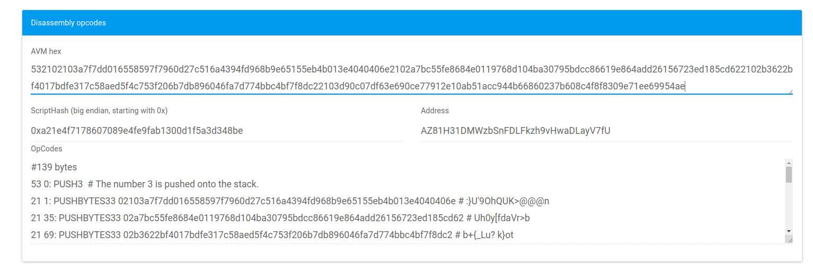

# dBFT 共识示例与场景

## Watch-only模式的共识节点

正如可以在[网络教程](../5-network/1-Introduction_to_the_NEO_network_protocol.md)中验证的那样，NEO网络以完全分布式的方式运行，如上图所示，摘自[Medium文章](https://medium.com/neoresearch/understanding-neo-network-in-five-pictures-e51b7c19d6e0):

绿色框代表共识，可出现在节点池中。消息全部广播给相邻节点（最好的情况下）。具有特殊功能的节点可以设计为仅监控来自共识节点的P2P消息，可以访问[NeoCompiler Eco共享私有链](https://neocompiler.io/#!/ecolab/cnnodesinfo)来查看相关信息。

在这个图中，该Watch-Only节点还具有RPC功能。值得注意的是，节点可以具有其他特性并整理任意管理该客户端的节点所需的信息。

## dBFT 场景

为了举例说明一些可能的共识场景，考虑以下角色：

 -  **N1：** 张铮文，绝地大师 ;
 -  **N2：** 达鸿飞，智能经济的壁炉;
 -  **N3：** 林鹏涛，壁炉中的真相;
 -  **N4：** NEO 生态系统，用户、交易所和开发人员的所有项目和利益的总和;
 -  **N5：** City of Zion，世界各地的结合和合作;
 -  **N6：** NeoResearch Buterfly，探索、恢复和改造的能力;
 -  **N7：** 尤达大师，从过往的经验中学习。

通过使用这7个共识节点并结合他们的优点，我们会给出一些例子让读者了解dBFT机制的工作原理：

### 创世块

创世块创建了3个交易，其中原生资产NEO和GAS在该块中注册并创建，并转移到当前验证人的账户中（由这7个角色组成的多签名账户）;

### 情况 1 (正常运行)

- 我们处于高度`1`以及视图编号`0`, 议长节点是`N1`(考虑一个数学公式);
- 张铮文选择了由多签账户签名的第一组交易，并且发起了提案块`b_1_0`;
- 需要`2f+1`个节点对该提案达成一致。N2, N3, N4 and N5是首先响应希望处理这个区块的节点。包括N1,现在有5个节点 (正好是2f +1);
- N1, ..., N5可能会首先进入提交阶段。
- 处于提交阶段的节点会自动发送针对当前区块提案`b_1_0`的签名;
- 一旦节点收集到`2f+1`个签名，就会向网络广播一个有效地区块。即便是一个**watch-only模式的节点**也可能是第一个执行该任务的节点(突出显示了这个MAS环境可能的工作方式)。

### 情况 2 (议长故障)

- 现在我们处于高度`2`且视图编号为`0`, 议长节点是`N2`;
- 达鸿飞小睡了一会儿，在这几秒钟内无法与其他角色交流了;
- `2f+1`个节点同意应该`更改视图`。网络上没有任何进展，节点应该严格按照将`出块时间`左移1位来设置超时时间。如果是15秒，则超时时间是30秒。
- 议长节点更改为N3。
- N3节点只有在参与`视图更改`的情况下才会发起新的提案块, 否则, 它仍将等待`N2`的提案块。
- 考虑到N3得到了`2f+1`条`更改视图`消息, 它现在将发起新的提案块`b_2_1`;
- 从这里开始执行情况1下的正常流程。

### 情况 3 (提交之后发生故障)

- 现在我们处于高度`3`以及视图`0`, 议长节点是`N3`;
- N3发起了提案块`b_3_0`;
- 从`N3`, ..., `N7`开始的大多数节点都同意提案;
- 然而，在进入提交节点后，`N4`在广播其对区块`b_3_0`的签名前发生故障了;
- `N3`, `N5`, `N6` 以及`N7`，现在只有`2F`个节点，仍然还需要一个对`b_3_0`的签名。 可能的情况是: 1) `N4`从故障中恢复了; 2) `N1`以及`N2`可以看到它们丢失的消息; 3) `N1`和`N2`请求`更改视图`，但不会获得大多数`M` 的同意，其他节点将发送一条`Recovery`消息来响应它们, 在该消息中，它们将自动接收到所有已知的消息。一旦这3个节点中的任何一个收到此类消息，它们将对当前区块`b_3_0`进行操作。

需要注意的是，3个故障节点个数是`f+1`，这会阻止网络的运行。另一方面，应该注意的是，没有检测到真正的拜占庭行为，这只是延迟和连接的问题。从这个意义上来说，由于部分同步协议，消息有时会达到这些节点.

### 情况 4 (议长节点出现拜占庭)

- 现在我们处于高度`4`且视图编号为`0`, 议长节点是`N4`;
- `N4`是恶意节点，且试图向网络发送一个不同的区块;
- 每个节点设计为只接受每个`视图`下的单的提案。在大多数`M = 2f+1`个节点不能就同一个提案达成共识之前(通过`hash`汇总)，不会提交任何节点。
- 如果`M`个节点提交了而另外的`f = 2`个节点缓存了一个不同的提案块，它们将在某个时刻收到一条`Recover`消息, 这将允许它们匹配哈希值。如果哈希值不同，我们将有一个针对这个议长节点的反证，这肯定会使得NEO持有者将这个节点从验证人中删除。

## 一个由4个节点组成的共识

正如你可能知道的那样，NEO区块链2.x中的地址由`21`（表示[“向计算栈推送34个字节”](https://github.com/neo-project/neo-vm/blob/f81c3039d5fb4417b3c1ad780378c7f92499964a/src/neo-vm/OpCode.cs＃L144)）、 公钥和`ac`（操作码，用于调用一个脚本来对地址见证人执行验证）组成。

建议读者看看以下文章：

 -  [了解NEO的多方签名](https://medium.com/neoresearch/understanding-multisig-on-neo-df9c9c1403b1)。

让我们考虑具有以下公钥的节点（21 + rootOfPubKey + ac）：

 -  N1：`2102103a7f7dd016558597f7960d27c516a4394fd968b9e65155eb4b013e4040406eac`
 -  N2：`2102a7bc55fe8684e0119768d104ba30795bdcc86619e864add26156723ed185cd62ac`
 -  N3：`2102b3622bf4017bdfe317c58aed5f4c753f206b7db896046fa7d774bbc4bf7f8dc2ac`
 -  N4：`2103d90c07df63e690ce77912e10ab51acc944b66860237b608c4f8f8309e71ee699ac`

可以使用以下脚本来创建一个多方签名账户：

`532102103a7f7dd016558597f7960d27c516a4394fd968b9e65155eb4b013e4040406e2102a7bc55fe8684e0119768d104ba30795bdcc86619e864add26156723ed185cd622102b3622bf4017bdfe317c58aed5f4c753f206b7db896046fa7d774bbc4bf7f8dc22103d90c07df63e690ce77912e10ab51acc944b66860237b608c4f8f8309e71ee69954ae`

解读为：`53`（签名个数）+`21` +`02 ... 6e` +`21` + `02 ... 62` +`21` + `02 ... c2` +`21`+`03 ... 99` +`54`（公钥所有者个数）+`ae`

我们选择这4个节点作为验证人节点，下面的脚本将为每个区块提供签名，地址如下：`AZ81H31DMWzbSnFDLFkzh9vHwaDLayV7fU`。后者可以通过将该脚本转换为“大端存储的脚本哈希”然后再进行base-58编码来获取。如果读者想要试着转换格式的话，我们建议访问[NeoCompiler-Eco](https://neocompiler.io/#!/ecolab/conversor)。

## 一个简单的单节点共识

让我们以前面描述的第一个节点（N1）为例，通过将`53`和`54`转换为`4f`，来创建一个包含1个所有者和1个签名者的多签名账户。

`512102b3622bf4017bdfe317c58aed5f4c753f206b7db896046fa7d774bbc4bf7f8dc251ae`

后者将产生以下地址：`AbU69m8WUZJSWanfr1Cy66cpEcsmMcX7BR`

## 阅读下节

[什么是智能合约？](../9-smartContract/What_is_smart_contract.md)

