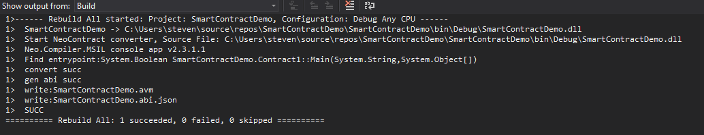
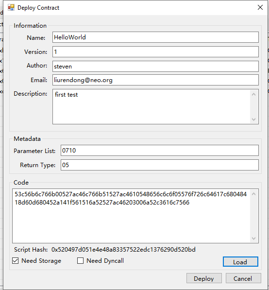

# 智能合约的编译和部署

## 编译合约文件

让我们回到IDE Visual Studio，来编译这个简单的合约工程。

 <p align="center">
  
 </p>


在Visual Studio菜单中单击 `生成`->`生成解决方案` (快捷键: Ctrl + Shift + B) 开始编译。

编译完成后，在项目的`bin/Debug`路径下会生成一个名为`NEP5.avm`的NEO 智能合约文件。

`SmartContractDemo.abi.json`是一个智能合约的描述文件，它包含有关于合约的ScriptHash、合约项、参数和返回值信息。有关智能合约ABI的更多信息可以查看[NeoContract ABI](https://github.com/neo-project/proposals/blob/master/nep-3.mediawiki)。

 <p align="center">
  
 </p>

 > [!Caution]
>
> 由于neon默认使用nep-8编译.dll文件，这会与nep-5发生冲突，因此我们需要使用nep-5兼容的方法执行.avm。
>
> 打开Power Shell或命令提示符(CMD)，输入路径bin/Debug，并输入以下命令 (用自己的工程文件替换nep5.dll):
>
> ```
> neon SmartContractDemo.dll --compatible
> ```

> [!Note]
>
> 新的`SmartContractDemo.avm`文件和 `SmartContractDemo.abi.json` 文件将覆盖相应的旧文件。

## 部署合约

  <p align="center">
  
 </p>

 我们可以使用NEO-GUI来部署新生成的合约文件。

1. 打开0.json钱包文件，单击 `高级` -> `部署合约`。

2. 单击合约部署对话框中的 `加载` 按钮选择已编译的合约文件`xxx.avm`。

	*复制代码框下显示的合约脚本散列，以备稍后在合约调用中使用。*

3. 填写信息和元数据字段中的参数。

	对于这个合约，参数是0710，返回值是05。

	详细规则可以参考[智能合约参数和返回值](http://docs.neo.org/zh-cn/sc/Parameter.html)。

	选中 `需要创建存储区域` 复选框

	不需要检查 `需要动态调用` 选项。

4. 所有参数都设置完成后，单击 `部署` -> `测试` -> `调用`。


#### 调用合约

现在你可以调用最近发布的智能合约了。

1. 单击 `高级` -> `合约调用` -> `方法调用`。
2. 将最后一个步骤中复制的合约脚本散列粘贴到 `ScriptHash` 并点击搜索按钮。这时会自动显示合约的相关信息。

3. 点击 `参数` 按钮旁边的 `…`，进入参数编辑界面。输入参数。在这个合约中，可以输入任意参数，因为main方法中不使用这些参数。

4. 单击 `尝试` 按钮来测试合约。如果没有发现错误，则单击 `调用`，这可能需要花费一些GAS。


如果调用成功，账户余额中将减少相应的GAS数。

## 阅读下节
你已经成功地设置了私有网络并调用了你的第一个智能合约。现在让我们开始学习[NEO 智能合约的基础知识并开发你的第一个合约](Smart_Contract_basics.md)。

要返回上节搭建开发环境，点击[这里](Development_set_up.md)。