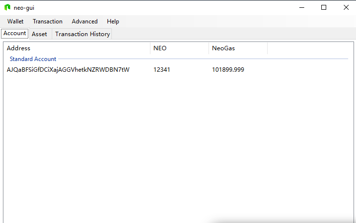
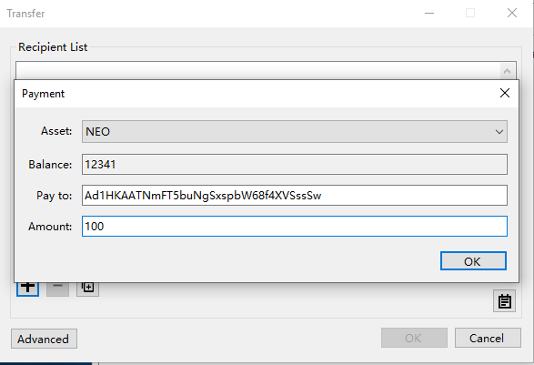

# 私有网络

当开发智能合约时，你必须将合约部署到区块链上并通过调用对其进行测试。在主网上部署智能合约或者dApp需要花费真正的Gas，这对于开发人员来说并不是一个经济的选择。当开发人员想要在那里测试智能合约或者dApp时，最好的方式是使用测试网络 (TestNet) 或私有网络（PrivateNet）。

测试网络是一个用户可以开发、委托和测试程序的环境。测试网络上的测试程序会花费测试网的GAS（不是真正的GAS！）作为网络的手续费。测试网络的 NEO和GAS可以在官方网站上免费申请使用。

测试网络的所有区块链都独立于主网。如果只是想要开发一个简单的智能合约或者尝试去注册资产，使用测试网络就足够了。测试通过后，再将开发转移到主网上进行在线操作。

所有交易和区块信息都可以在 [NEO scan](https://neoscan-testnet.io/) 上查看。

此外，对于想要逐步学习开发智能合约的开发人员来说，使用四个节点构建一个私有链并从私有链中提取NEO和GAS是一种更方便、更快速的方法。通过使用这样的私有链，开发人员不必担心GAS的开销，而且在本地网络上进行部署和测试要快得多。


## 搭建私有链

在本教程中，我们在一个简化的私有链上进行开发，可以在这个 [Github存储库]( https://github.com/steven1227/NEO-Private-Net) 中下载。

这个存储库中包含一个配置好的私有链，可以在下载之后运行它。其中neo-cli的版本号是2.8.0，gui版本号是2.7.6。

克隆或下载存储库之后，运行以下四个命令行脚本来启动私有网络。

```
enter node1 folder，double click 1Run.cmd

enter node2 folder，double click 1Run.cmd

enter node3 folder，double click 1Run.cmd

enter node4 folder，double click 1Run.cmd

```

现在私有链就可以运行起来了。所有的NEO和GAS创世区块都放在钱包文件 `1.json`中。

打开NEO-GUI，点击 `钱包` -> `打开钱包库`，打开位于*文件夹* `node1`下的 `1.json` 文件，输入密码 **11111111**。

 区块高度大约是30。请打开Neo-GUI查看账户余额。

 <p align="center">
  
 </p>


> [!Note]
>
> 智能合约的部署和调用需要消耗GAS。由于每产生一个新的区块就会产生GAS，这就使得在新建的私有链上会产生有限的GAS，因此建议用户现在不要关闭私有链，从而可以产生足够的GAS以便之后使用。

你可以试着去创建一个新的钱包，并向钱包中转入一笔资金。

1. 打开NEO-GUI并单击 `钱包` -> `创建一个钱包库` ，然后按照屏幕上显示的说明进行操作。
2. 钱包创建成功后，右键单击标准账户中的地址，选择 `查看私钥` 来查看账户信息（地址，公钥，私钥）。
3. 复制地址进行下一步操作。
4. 再次打开钱包文件 `1.json` 并单击 `交易` ，然后单击 `+` 号。现在让我们添加一个新的交易。

	*资产* 类型是 `NEO` ，金额是要转账的NEO数量，`payto` 是上一个步骤中复制的地址。

	 <p align="center">
	  
	 </p>

5. 确认完成后，就可以看到交易成功了，同时会产生一个交易ID。单击 `交易历史ID` ，可以看到刚刚发起的那笔交易，这个时候可能显示的状态是 `未确认` 。等待几秒钟后，它将显示确认数，这个数字代表着区块已被共识节点确认。之后，打开刚才创建的新钱包，你会发现余额发生了变化。
6. 再次打开钱包文件 `1.json` ，你可以看到另一个全局资产 `GAS` 。在NEO的区块链上，GAS是部署和运行智能合约的燃料。 `NEO` 的持有者可以领取GAS。在GUI中，单击 `高级` -> ` NEO Gas领取` ，你将看到可以领取的GAS数。然后点击 `领取` ，就会在你的账户中增加相应的GAS余额。

## 阅读下节

完成私链搭建后，接下来让我们[设置开发环境](Development_set_up.md)。

如果对智能合约不太了解，请返回上节 [什么是智能合约](What_is_smart_contract.md)。

