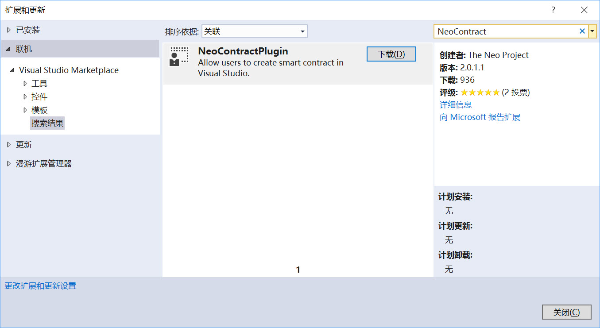
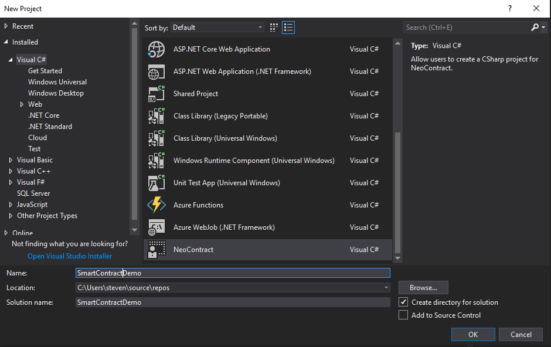
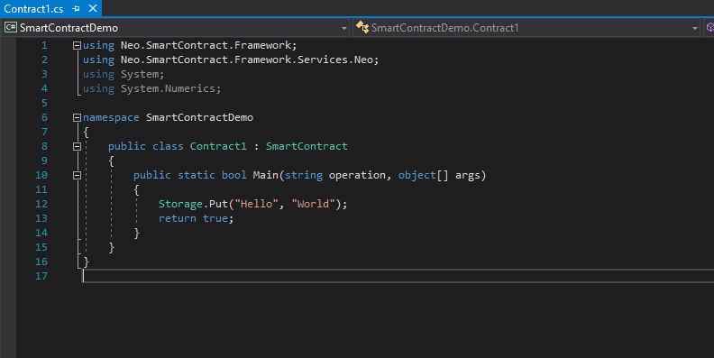

# C#智能合约开发环境

NEO C#的开发人员是非常幸运的，因为NEO区块链本身是基于C#搭建的，从编译器到工具箱，C#开发环境得到了广泛的支持，因此对于那些.NET开发人员来说，开始学习NEO智能合约的开发是一件非常容易的事情。而对于那些没有接触过C#的用户而言，开始编写智能合约和dApp也不是一件难事。

## 环境
使用C#语言编写智能合约最好的方式是，在本地开发环境中使用支持NEO智能合约的IDE进行开发。幸运的是，NEO正在为开发人员提供一系列工具从而可以方便他们的开发。对开发环境的唯一的要求是Windows的操作系统，建议是Windows 10 64位系统。

对于非windows用户，如MAC和Linux用户，最好的选择是使用在线编辑器和编译器，这样更便于智能合约的开发和部署。这部分内容在这篇[文档]( https://medium.com/neweconolab/with-neoray-neo-smart-contract-development-has-never-been-easier-edad41cc3ae6)中有详细说明。

### Windows

为了建立一个NEO私有网络和开发环境，开发人员必须安装一些依赖项:

-  [NET FrameWork](https://dotnet.microsoft.com/download/dotnet-framework-runtime/net472)
-  [NET Core](https://dotnet.microsoft.com/download)

另外，为了开发基于C#的智能合约，我们还必须使用IDE，而最好的选择是Visual Studio:

- [Microsoft Visual Studio](https://visualstudio.microsoft.com/vs/community/)

 现在让我们准备智能合约的开发环境。

### Visual Studio 安装

#### 安装并打开 visual studio.

在安装期间选择  `.NET Core 跨平台` 开发选项

 

  
 

#### 安装 NeoContractPlugin

打开Visual Studio 2017,点击 `工具` - > `扩展和更新` ,单击左侧栏的 `联机` 选项，搜索NEO并安装NeoContractPlugin (过程中必须联网操作)。

 

  
 

#### 配置 neo-compiler

1. 下载 [neo-compiler](https://github.com/neo-project/neo-compiler) 工程到本地主机。
2. 在Visual Studio 2017中点击 `文件` -> `打开` -> `工程/解决方案`，在工程文件中选择neo-compiler.sln。

3. 右键单击列表中的neon项目，然后单击 `启动` 。

4. 配置好发布路径后，单击 `启动` 。

	在我的设置中，在`xxx\neo-compiler-master\neo-compiler-master\neon\bin\Debug\netcoreapp2.0\publish` 路径下会生成一个 `neon.exe` 文件。

5. 将neon添加到系统变量 `PATH` 中。

	对于Windows10用户，按 `Windows+S` 并输入环境变量，选择编辑账户的环境变量并将其添加到 `Path` 中。

#### 创建一个智能合约工程
1. 点击 `文件` -> `创建` -> `工程`。
2. 在列表中选择 `NeoContract` 并对设置做一些必要的修改，然后单击 `确认`。

 

  
 

使用从智能合约继承的默认类创建工程后，将自动生成一个C#文件。如下面的截图所示，现在你就实现了一个Hello World合约了。

 

  
 

然而，上面只演示了一种简单的数据存储方法——使用键值对的方法在私有存储区域中存储数据。

## 阅读下节

你已经完成开发环境搭建，下节我们将介绍[编译，部署和调用合约](Development_compile.md)。

要返回上节查看如何搭建一个私链，点击[这里](Development_privateChain.md)。