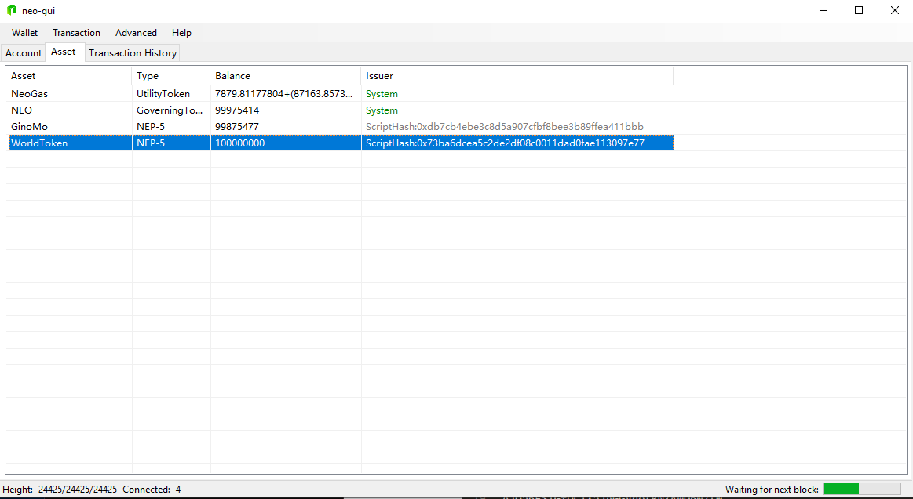
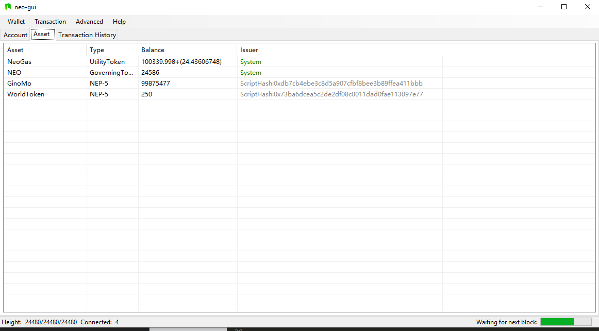

# 实现 NEP-5


>
> **目的**:  了解NEP-5的基本概念
>
> **要点**:
>
> 1. 根据NEP-5标准来实现每个要点
>
> 2. 在NEO-Gui上使用NEP-5通证
>

首先，我们定义一个只读属性Owner来表示合约的所有者。如下所示，`Owner` 是一个字节数组，长度为 `20` 。

```csharp
// 这里，字符串“xxx”表示所指定的作为所有者的地址。
private static readonly byte[] Owner = "xxxxxxxxxxxxxxxxxxxxx".ToScriptHash(); //所有者地址
```

现在我们开始学习一下main方法和触发器:

```csharp
    public static object Main(string method, object[] args){
            if (Runtime.Trigger == TriggerType.Verification)
            {
                return Runtime.CheckWitness(Owner);
            }
            else if (Runtime.Trigger == TriggerType.Application)
            {
	            return true;
            }
}
```
这里，main方法接受两个参数。第一个是代表方法名的字符串 `method` ，它是用户将在这个智能合约中调用的nep-5方法。第二个是数组对象 `args`，它表示nep-5方法中使用的参数列表。

这里我们也会对触发器类型进行判断。当触发器类型是 `Verification` 时，它意味着终端用户使用资产交易来调用交易。换句话说，终端用户可能希望将NEO或GAS等全局资产发送到该合约或者从该合约获取这些资产。在这种情况下，我们应该判断调用者(或对合约进行签名的地址)是否是所有者。

当触发器类型是 `Application` 时，这意味着应用程序(Web/App)正在通过InvocationTransaction来调用智能合约。在这种情况下，我们应该根据方法值调用其他函数。这部分内容我们之后会补充。

然后我们定义表示名称、符号、小数位的相应函数，这些对于这个合约而言都是固定值。

```csharp
[DisplayName("name")]
public static string Name() => "MyToken"; //通证的名称
```

```csharp
[DisplayName("decimals")]
public static byte Decimals() => 8;
```

```csharp
[DisplayName("symbol")]
public static string Symbol() => "MYT"; //通证的符号
```

我们还需要定义一个转账事件，该事件也在 `NEP-5` 标准中指定了。

```csharp
[DisplayName("transfer")]
public static event Action<byte[], byte[], BigInteger> Transferred;
```

现在。让我们定义合约的的totalSupply方法。在此之前，我们应该首先定义一个 `deploy`方法。deploy方法没有在 `NEP-5` 标准中指定，但是应该是智能合约所有者调用的第一个函数，并且只能调用一次。deploy函数的目的是设置 `NEP-5` 通证的 `总供应量` 值，并将所有通证转入到所有者的账户余额中。

需要注意的是，在通证化的智能合约中，资产以键值对的形式存储在存储区中，其中键是地址，值是余额。下面的表格可以说明这一点。

| 地址 |   值 |
|--|--|
| address1 | 1000 |
| address2 | 200 |

```csharp
//代表总供应量的静态只读值
private static readonly BigInteger TotalSupplyValue = 10000000000000000;
```

```csharp
[DisplayName("deploy")]
public static bool Deploy()
{
      if (TotalSupply() != 0) return false;
      StorageMap contract = Storage.CurrentContext.CreateMap(nameof(contract));
      contract.Put("totalSupply", TotalSupplyValue);
      StorageMap asset = Storage.CurrentContext.CreateMap(nameof(asset));
      //合约所有者拥有所有的nep-5通证
      asset.Put(Owner, TotalSupplyValue);
      // 当发生NEP-5资产转账时触发该事件
      Transferred(null, Owner, TotalSupplyValue);
      return true;
}
```

现在，我们已经在部署阶段定义了总供应量，我们可以实现totalSupply方法了，该方法从存储区中获取totalSupply值。


```csharp
[DisplayName("totalSupply")]
public static BigInteger TotalSupply()
{
    StorageMap contract = Storage.CurrentContext.CreateMap(nameof(contract));
    return contract.Get("totalSupply").AsBigInteger();
}
```

让我们设置另一个 `balanceOf` 方法，它获取指定地址所对应账户的 `NEP-5` 余额。


```csharp
 [DisplayName("balanceOf")]
public static BigInteger BalanceOf(byte[] account)
{
	  // 参数校验
      if (account.Length != 20)
          throw new InvalidOperationException("The parameter account SHOULD be 20-byte addresses.");
      StorageMap asset = Storage.CurrentContext.CreateMap(nameof(asset));
      return asset.Get(account).AsBigInteger();
}
```

现在，除了转账方法之外，我们几乎已经完成了 `NEP-5` 标准中要求的所有方法，让我们先填充一下main方法。

```csharp
public static object Main(string method, object[] args)
{
     if (Runtime.Trigger == TriggerType.Verification)
     {
         return Runtime.CheckWitness(Owner);
     }
     else if (Runtime.Trigger == TriggerType.Application)
     {
	     if (method == "balanceOf") return BalanceOf((byte[])args[0]);

	     if (method == "decimals") return Decimals();

	     if (method == "name") return Name();

	     if (method == "symbol") return Symbol();

	     if (method == "supportedStandards") return SupportedStandards();

	     if (method == "totalSupply") return TotalSupply();

	     if (method == "transfer") return Transfer((byte[])args[0], (byte[])args[1], (BigInteger)args[2]);
	  }
	 return false;
}
```

现在，剩下的唯一方法就是转账函数。转账函数首先要做的是检查参数，并检查合约调用者是否是合约的所有者。如果满足所有要求，就从存储区中获取 `from` 地址所对应账户中的余额，并检查该余额是否能够满足转账的数量要求。如果 `NEP-5` 通证的数量足够，则计算并更新 `from` 账户和 `to` 账户中的余额。

```csharp
private static bool Transfer(byte[] from, byte[] to, BigInteger amount, byte[] callscript)
{
      //参数校验
      if (from.Length != 20 || to.Length != 20)
          throw new InvalidOperationException("The parameters from and to SHOULD be 20-byte addresses.");
      if (amount <= 0)
          throw new InvalidOperationException("The parameter amount MUST be greater than 0.");
      if (!Runtime.CheckWitness(from))
          return false;
      StorageMap asset = Storage.CurrentContext.CreateMap(nameof(asset));
      var fromAmount = asset.Get(from).AsBigInteger();
      if (fromAmount < amount)
          return false;
      if (from == to)
          return true;

      //减少发送方的账户余额
      if (fromAmount == amount)
          asset.Delete(from);
      else
          asset.Put(from, fromAmount - amount);

      //增加接收方的账户余额
      var toAmount = asset.Get(to).AsBigInteger();
      asset.Put(to, toAmount + amount);

      Transferred(from, to, amount);
      return true;
  }
```

现在NEP-5通证已经完成，可以在我们的私有链上测试了。你可以点击[此处](https://github.com/neo-ngd/NEO-Tutorial/blob/steven/smartContract/sourceCode/NEP5.cs)查看源码。

编译NEP5.cs并获得avm文件后，部署它。如果合约已经部署在区块链上的话，那么首先调用deploy方法，该方法会初始化通证的totalSupply变量。

<p align="center">
	
</p>
<p align="center">
	
</p>

现在，在NEP-GUI中单击 `高级` -> `选项` ，添加合约的scriptHash，你可以在资产选项卡中查看NEP-5资产。

<p align="center">
	
</p>
让我们测试一下NEP-5标准中的另一个转账方法。打开调用功能选项卡并填写相应的参数。字符串部分是要调用的智能合约方法。这里是 `transfer` 。在数组中，参数是 `from` 、`to` 、`amount` 。`from` 地址和 `to` 地址的格式是字节数组，可以由钱包地址进行转换。例如，点击这个[工具链接](https://peterlinx.github.io/DataTransformationTools/)，它可以将钱包地址转换成字节数组。对于 `amount` 参数，不要忘了将小数乘以10^8。
这里我想把我的NEP-5通证从我的账户转250000000个到其他账户。

<p align="center">
	
</p>

待交易被记录且确认后，打开目标地址的钱包，查看更新后的NEP-5余额。

<p align="center">
	
</p>

## 作业

自己定义一个新的NEP-5通证。

## 阅读下节

在本教程中，你已经了解了NEP-5的标准，以及如何通过定义自己的通证来实现NEP-5标准。现在我们可以扩展这一步骤来[发起我们的通证，并公开发布](Give_an_ITO.md)。

要返回上节查看什么是NEP5，点击[这里](What_is_nep5.md)。

