# NEO Python 小白入门

本教程适合初步接触 NEO 的 Python 开发者快速入门使用，如想进行更全面的学习可移步我们的 [技术文档](http://docs.neo.org/zh-cn/index.html)。为避免遇到不必要的麻烦，建议按照教程的顺序一步步进行。

> [!Note]
>
> 在NEO Python中我们使用NEO-CLI。
> 相关项目：[neo-python-rpc](https://github.com/CityOfZion/neo-python-rpc)、[neo-boa](https://github.com/CityOfZion/neo-boa)

## 关于NEO Python

目的：
 1. 将[NEO Project](https://github.com/neo-project)从C#完全移植到 Python 

NEO-Python目前的功能:

 1. 运行基于Python的P2P节点
 2. 提供可交互CLI进行配置节点和检测区块链
 3. 编写、部署及调用以 Python 编写的智能合约或任意 **.avm** 格式的合约
 4. 钱包的基础功能（未经过完全测试，请勿在主网使用）
 5. RPC的客户端和服务器
 6. 符合NEP2和NEP5标准的钱包功能
 7. NEP7和NEP8支持
 8. 通知服务器（用于查看NEP5代币的转账）
 9. Runtime.Log 和 Runtime.Notify 活动的监视

将会逐步添加的功能：
 1. 成为共识节点
 2. 优化智能合约的调试和审查能力 

文档：
 更多信息可见[Docs](https://neo-python.readthedocs.io/en/latest/)

## 你将会学到什么

- 部署 NEO Python 环境
- 管理钱包
- 搭建私链
- 编写、部署和调用智能合约

## 你需要准备什么

- Linux / macOS
- [Docker](https://github.com/yeasy/docker_practice)
- [LevelDB](http://leveldb.org/)
- [Python3.6 (or higher)](https://www.python.org/downloads/)

> [!Note]
>
> Docker 是一个开源的应用引擎容器，让开发者可以打包应用及其以来包到一个可移植的容器（Container）中，再发布到 Linux 机器上，实现虚拟化，容器之间不会有任何接口，以保持独立。在 NEO Python 中，我们将用Docker打包 NEO 私链，用于开发。

安装 Docker：

```shell
sudo apt-get install curl
sudo curl -sSL https://get.docker.com/ | sh
sudo apt-get update && apt-get upgrade
sudo service docker start
```

LevelDB是一种适用于写多读少的KV数据库，安装 LevelDB：

```shell
brew install leveldb
```

在 CentOS, RHEL, Fedora 上安装 Python 可参考[此处](https://tecadmin.net/install-python-3-6-on-centos/)。

## 第一步：环境配置

### 创建私链

安装 Docker 容器（Container），从 Docker Hub 下载最新的镜像：

```shell
sudo docker pull cityofzion/neo-privatenet
```

下载可能花费较长时间，建议科学上网。成功下载后得到了一个区块高度为0，且有足够NEO和Gas的私链，可用于后续测试及开发。接下来打开容器：

```shell
sudo docker run --rm -d --name neo-privatenet -p 20333-20336:20333-20336/tcp -p 30333-30336:30333-30336/tcp cityofzion/neo-privatenet
```

在容器中打开 bash：

```shell
sudo docker exec -it neo-privatenet /bin/bash
```

关闭容器：

```shell
sudo docker rm -f neo-privatenet
```

### 运行 NEO Python

如果还没有安装git，可以点击[此处](https://git-scm.com/book/zh/v1/%E8%B5%B7%E6%AD%A5-%E5%AE%89%E8%A3%85-Git)。再从这里下载[NEO Python](https://github.com/CityOfZion/neo-python/releases/tag/v0.7.1)。解压后进入 neo-python-0.7.1 文件夹。

创建虚拟环境，使安装过程保持独立：

```shell
sudo python3.6 -m venv venv
source venv/bin/activate
```

安装 NEO Python：

```shell
sudo pip install -r requirements.txt
sudo pip install -e .
```

运行 NEO Python：

```shell
np-prompt -p
```

关闭 NEO Python：

```shell
exit
```

若希望再次打开，在打开 Docker 容器，进入文件夹后：

```shell
source venv/bin/activate
np-prompt -p
```

* * *

## 第二步：钱包操作

### 帮助

输入“help”得到可用命令的列表。

-   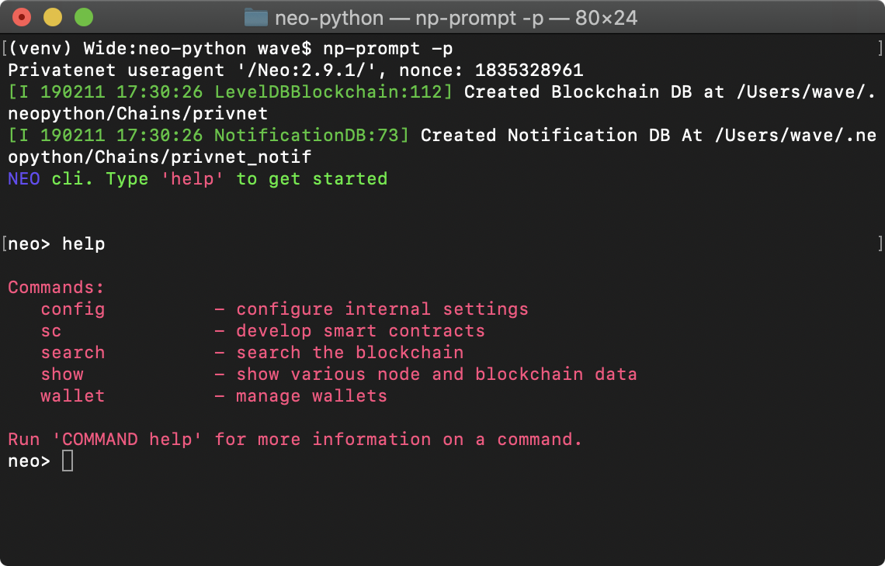
  

### 打开钱包

打开一个已经存在的钱包，如 neo-privnet.sample.wallet，密码是coz。

```shell
    wallet open neo-privnet.sample.wallet
```

使用命令“wallet”可显示钱包的详细信息。

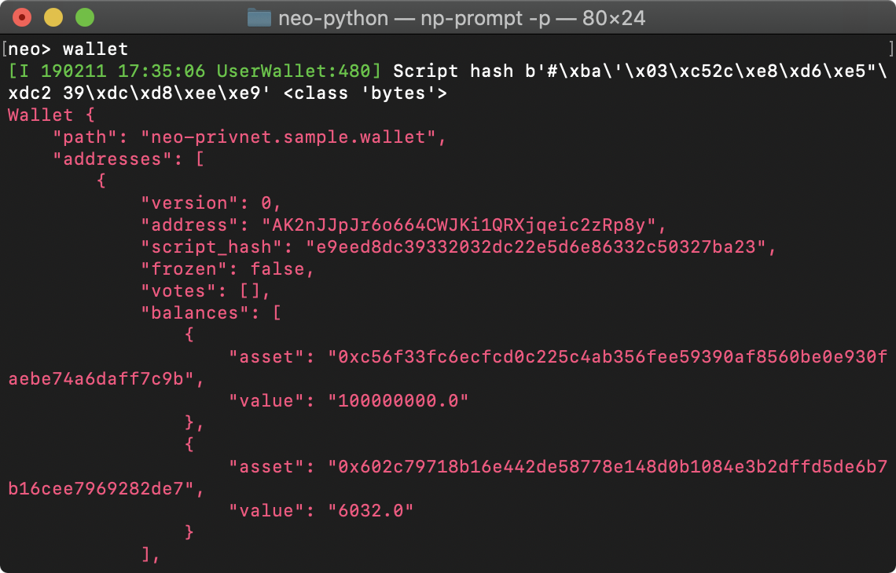

### 创建新钱包

```shell
    wallet create {path}
```

其中{path}是钱包的存储路径。创建钱包后可见该钱包的详细信息，如余额、地址等。注意钱包的密码，如果密码丢失，钱包将会永远无法访问。

### 发送代币（Tokens）

首先根据2.2中的操作打开 neo-privnet.sample.wallet，输入命令：

```shell
    wallet send neo {address} 10000
    wallet send gas {address} 10000
```

这一操作需要15～20秒的确认时间。

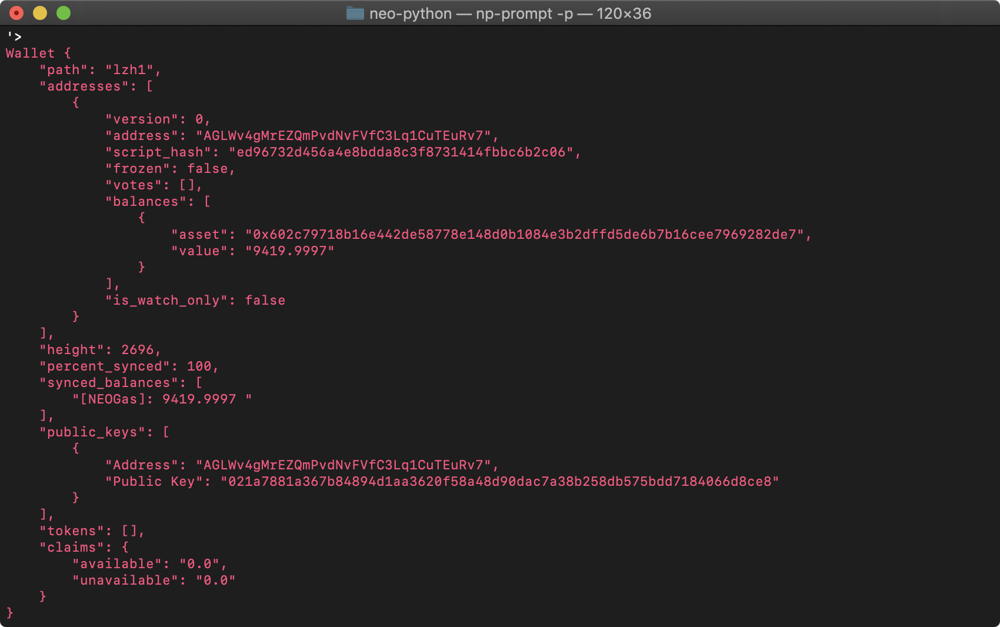


## 第三步 智能合约

NEO Python 中的智能合约使用 Python 编写并由 neo-boa 编译。注意我们使用的不是 Python 原本的翻译器，所以智能合约使用的语言是语法和 Python 类似的另一门语言，这造成了对调用第三方库的限制。接下来我们将使用几个合约介绍如何操作。首先下载 smart-contracts，其中包含了五个简单的例子。将该文件夹置于 neo-python 目录下。

### Hello World

#### 创建（Build）合约

 创建合约的命令的格式为：

```shell
    sc build {path}
```

```
或使用以下命令创建并且测试合约：
```

```shell
    sc build_run {path} {storage} {dynamic_invoke} {payable} {params} {returntype} (inputs) (--no-parse-addr) (--from-addr) (--owners) (--tx-attr)
```

1. {path}: Python 文件的路径。
2. {storage}: 布尔型，该智能合约是否需要存储空间。
3. {dynamic_invoke}: 布尔型，该智能合约是否需要动态调用。
4. {payable}: 布尔型，是否支持向该智能合约转账。
5. {params} : 参数类型，对应关系见下表。
6. {returntype}: 返回值类型，对应关系见下表。

其他可选参数具体含义可运行 “sc build_run help” 查看。

其中 params 和 returntype 的类型：

- Signature 00
- Boolean 01
- Integer 02
- Hash160 03
- Hash256 04
- ByteArray 05
- PublicKey 06
- String 07
- Array 10
- InteropInterface f0
- void ff

由于 Hello World 程序不需要输入、输出、存储空间等，所以输入命令：

```shell
    config sc-events on
    config sc-debug-notify on
    sc build_run smart-contracts/1-print.py False False False 06 ff
```

如果出现找不到文件或路径的错误，可尝试使用 1-print.py 的绝对路径。在 SmartContract.Runtime.Log 下可见输出了“Hello World”。

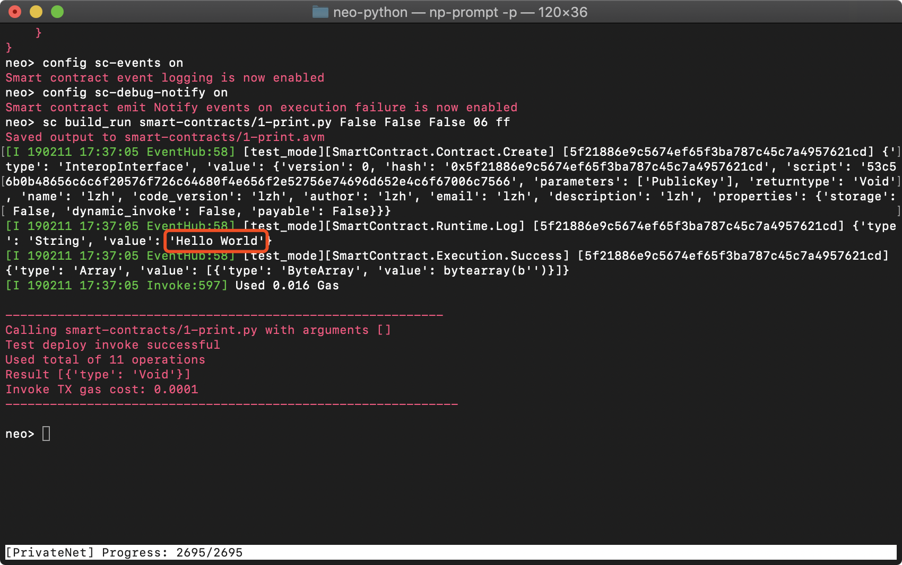

若成功运行，应当输出了 **.avm** 文件，即可以在 NeoVM 上运行的文件。

#### 部署（Deploy）合约

部署指将智能合约写入区块链中。输入命令：

```shell
sc deploy {path} {storage} {dynamic_invoke} {payable} {params} (returntype)
```

你可以输入一些信息：合约名称，合约版本，合约作者，联系方式，合约描述。输入密码并且等待15～20秒即可部署完成。要注意的是，其中参数类型和返回值类型并不是指定智能合约的参数和返回值类型，而是用于保存在区块链中，对智能合约的调用者起到提示作用。实际上的类型由智能合约的源文件决定。

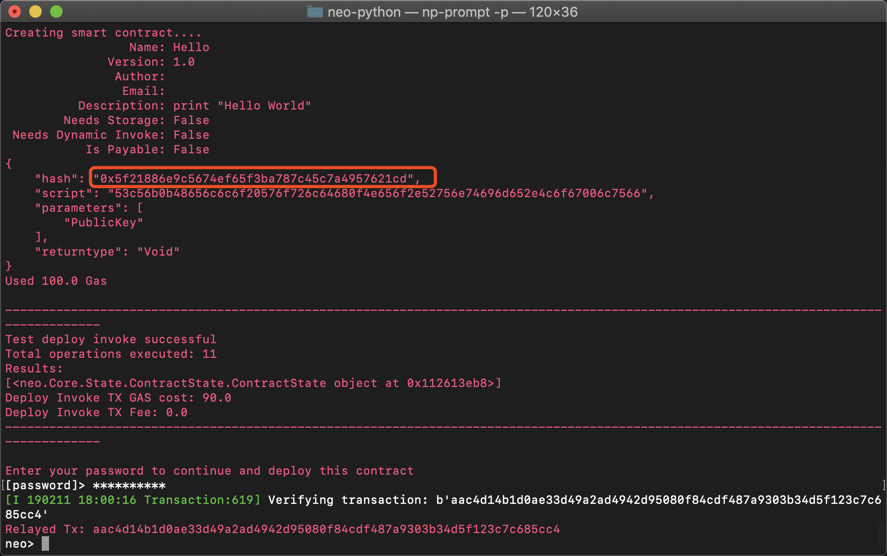

#### 调用合约

首先查找合约的 hash：

```shell
search contract {contract info}
```

其中{contract info}可以是3.1.2中输入的合约的名称。返回值中将显示合约的 hash。

```shell
sc invoke {contract hash}
```

如查找 Hello World 并调用，在 SmartContract.Runtime.Log 中可见输出。

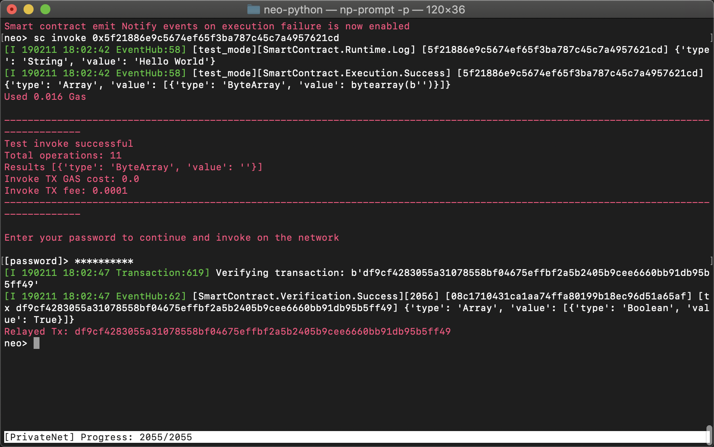

### 打印和通知

输入命令：

```shell
sc build_run smart-contracts/2-print-and-notify.py False False False 06 ff
```

从结果中可见 print(), log(), notify()函数的不同。从代码看，前两个函数本质上相同，输出简单的开发信息。而 notify()函数可用于输出变量。

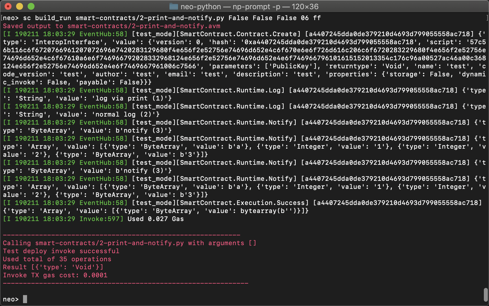

### 计算器

输入命令：

```shell
sc build_run smart-contracts/3-calculator.py False False False 070202 02 add 1 2
```

其中{test_params}中包含三个参数，add、1、2。返回值为 Integer，值为3。再次调用该合约可使用3.1.3中的方法。但在{contract hash}后需要三个参数。

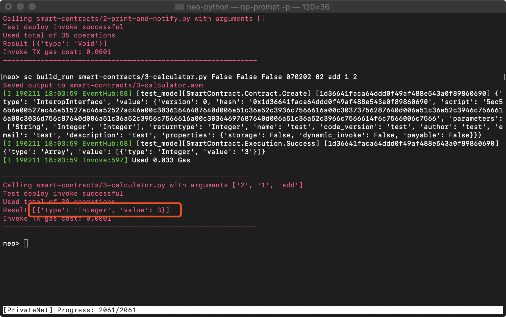

### 存储空间

输入命令以允许调过程中使用存储空间，再创建合约：

```shell
sc debugstorage on
sc build_run smart-contracts/4-storage.py True False False 02 ff
```

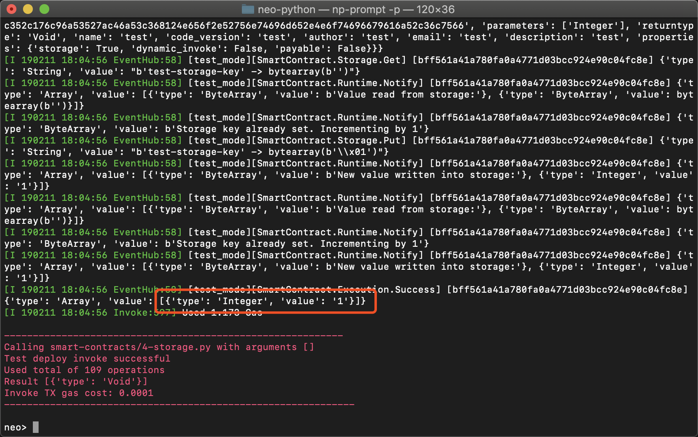

可见`{needs_storage}`为True，该合约将使用存储空间。之后每次运行：

```shell
sc build_run smart-contracts/4-storage.py True False False 02 ff
```

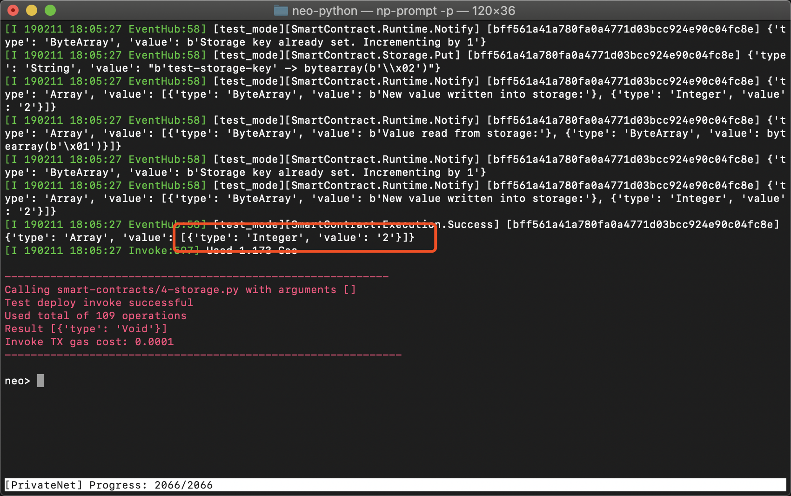

返回值中`New value written into storage`的值都会加1。再清空存储并部署：

```shell
    sc debugstorage reset
    sc deploy smart-contracts/4-storage.avm True False False 02 ff
```

此时调用该合约可见返回值为1。

### 域名服务（DNS）

输入命令创建并部署DNS合约：

```shell
    sc build smart-contracts/5-domain.py
    sc deploy smart-contracts/5-domain.avm True False False 0710 05
```

该合约功能如下：

- 注册域名
- 查询域名
- 删除域名
- 转让域名

> [!Note]
>
> 合约中的DNS与计算机网络中通常所说的DNS有所不同。通常的DNS是一个域名和IP地址的相互映射的分布式数据库，而该合约中的域名服务存储的则是域名和钱包地址之间的映射关系。

#### 注册域名

打开当前的钱包，输入命令：

```shell
sc invoke {contract_hash} register ['{name}', '{address}']
```

返回值最后为1则表明注册域名成功。

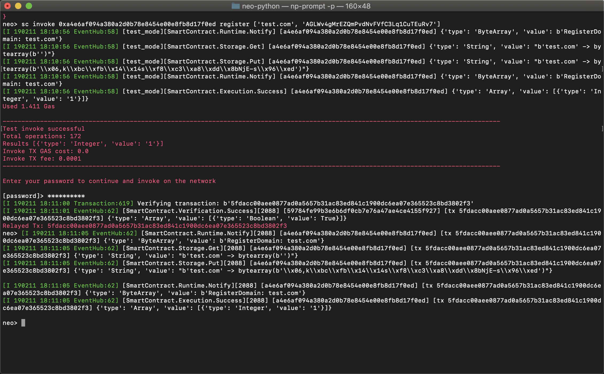

#### 查询域名

```shell
sc invoke {contract_hash} query ['{name}']
```

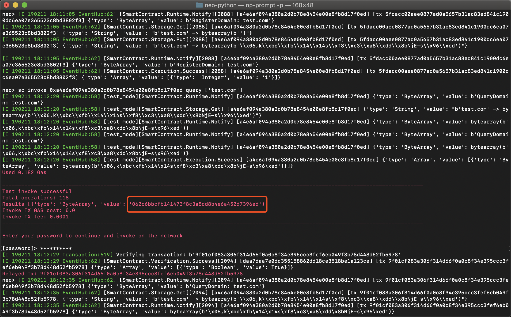

该查询将返回一个 ByteArray，而地址是一个字符串，两者看似不同。但我们有一个[工具](https://peterlinx.github.io/DataTransformationTools/)可以转化他们。

* 将 ByteArray 复制到 Address (little endian) 下方的 Script Hash 处
* 点击 Transform
* 查看 Address 的值，发现是与域名的地址相等的


#### 删除域名

```shell
testinvoke {contract_hash} delete ['{name}']
```

再参考下节进行查询，将无法得到结果。

#### 转让域名

```shell
testinvoke {contract_hash} transfer ['{name}', 'another_ad']
```

再参考前文中的查询域名方法并验证，发现域名已经转让给了一个新的地址。

## 结束语

至此，我们已经进行了一些在neo-python上基本的命令行操作，对如何在NEO上部署智能合约有了更清楚的认识。
有兴趣的话，可以加入我们的[Discord](https://discordapp.com/invite/bXhmTGp)。

### 鸣谢

感谢[Peter Lin](https://github.com/peterlinx), [Jon](https://github.com/jonathanlimwj) 和 [Chris Hager](https://github.com/metachris)对项目作出的贡献。
