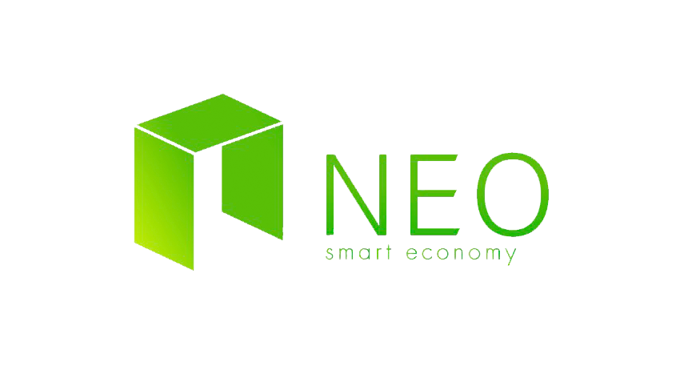

  
<h1>NEO-Tutorial</h1>

面向 NEO 开发人员和学习者的完整学习教程

## 教程目录
- [NEO 介绍](1-introduction/1-Introduction_to_NEO.md)
- [钱包](2-wallet/1-Introduction_to_wallets.md)
- [交易](3-transactions/1-Introduction_to_transactions.md)
- [区块](4-blocks/1-Introduction_to_blocks_and_blockchain.md)
- [NEO 网络](5-network/1-Introduction_to_the_NEO_network_protocol.md)
- [持久性](6-persistence/1-persistence.md)
- [共识算法](7-consensus/1-Introduction_to_consensus.md)
- [智能合约](9-smartContract/What_is_smart_contract.md)

## 其他智能合约开发资料
- [Neo-python 教程](9-smartContract/neopython/part1_setup.md)
