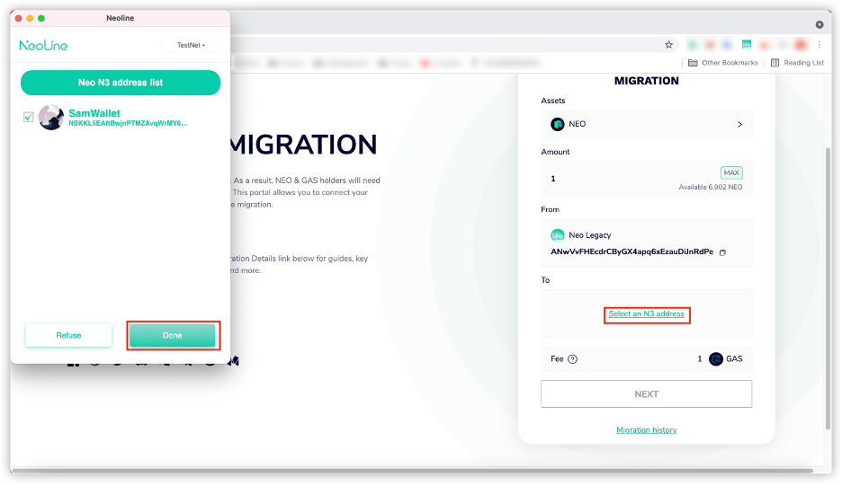

# Neo N3 Migration Guideline on Migration Page

This tutorial will guide you through the process of migrating Neo and GAS tokens from Neo legacy to Neo N3 on the Migration website using N3 compatible wallets.

## Migration with NeoLine Wallet

1. Click the icon in the upper right corner and click `Create wallet`.

    

2. Select `Neo N3` to create a Neo N3 wallet.

    

3. Input your wallet name and password and click `Create` . A new Neo N3 wallet is successfully created. 
   
    > [!Note]
    >
    > Please follow the prompt to back up your private key carefully.
   
    

4. Go to the [Migration To N3](https://migration.neo.org/) website. Click `CONNECT WALLET`.

    

5. Click `Connect NeoLine` to connect a NeoLine wallet.

    

6. Click `Connect`.

    

7. Select an asset you want to migrate.

    

8. Input the amount you want to migrate. 

   > [!Note]
   >
   > A 1 GAS fee is required if you are migrating less than 10 NEO or 20 GAS. This is because fees are now required on all Neo N3 transactions. Allowing users to migrate small quantities of tokens with no fee opens up an exploit where users could potentially spam transactions to burn Neo Foundation GAS inefficiently.

    

9. Click `Select an N3 address` to select an N3 wallet address that you want to migrate to and then click `Done`.

    

10. Click `NEXT` to start the migration.

    

11. Confirm the migration information. If the information is correct, click `NEXT`. Otherwise, click the `BACK` button to revise the information.

    

12. Click `Yes` to approve the migration. 

    

13. Wait for the migration process to complete. You can click `Migration history` to check the migration status.

     

     

     

## Migration with O3 Wallet

1. Open the O3 wallet app. Click the wallet account and click `Create`.

2. Select `NEO N3` and click `Next` to create a Neo N3 wallet.
   
    

3. Input your wallet name and password and click `Create`. A new Neo N3 wallet is successfully created. 
   
4. Go to the [Migrate To N3](https://migration.neo.org/) website. Click `CONNECT WALLET` to connect a wallet.

    

5. Click `Connect O3` to connect an O3 wallet.

6. Select an account and click `Connect`.

    

7. Select an asset you want to migrate.

    

8. Input the amount you want to migrate.

   > [!Note]
   >
   > A 1 GAS fee is required if you are migrating less than 10 NEO or 20 GAS. This is because fees are now required on all Neo N3 transactions. Allowing users to migrate small quantities of tokens with no fee opens up an exploit where users could potentially spam transactions to burn Neo Foundation GAS inefficiently.

   

9. Click `Select an N3 address` to select an address that you want to migrate to, and then click `Select`.

    

10. Click `NEXT` to start the migration.
   
    

11. Confirm the migration information. If the information is correct, click `NEXT`. Otherwise, click `BACK` to revise the information.

    

12. Click `Approve`. 

    

13. Wait for the migration process to complete. You can click `Migration history` to check the migration status.

     

     
