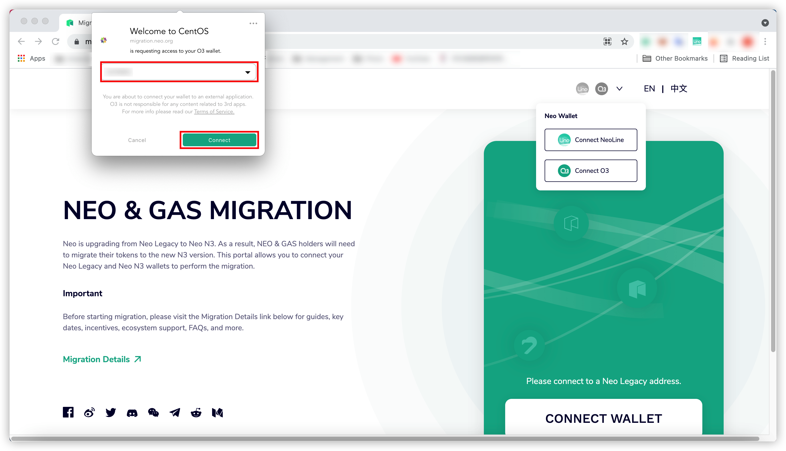

# Neo N3 Migration Guideline on Migration Page

## Migration with NeoLine Wallet

1. Click the icon in the upper right corner and click `Create wallet` to create a new wallet.

    

2. Select `Neo N3` to create a Neo N3 wallet.

    

3. Input the name and password of your wallet and click the `Create` button. A new Neo N3 wallet will be successfully created. 
   
    > [!Note]
    >
    > Remark, please follow the prompt to backup your private key carefully.
   
    

4. Open [Migration To N3](https://migration.neo.org/) website. Click the `CONNECT WALLET` button to connect a wallet.

    

5. Click the `Connect NeoLine` button to connect a NeoLine wallet.

    

6. Click the `Connect` button.

    

7. Select an asset you want to migrate.

    

8. Input the amount you want to migrate. 

   > [!Note]
   >
   > Remark: A 1 GAS fee is required if you are migrating less than 10 NEO or 20 GAS. This is because fees are now required on all Neo N3 transactions. Allowing users to migrate small quantities of tokens with no fee opens up an exploit where users could potentially spam transactions to burn Neo Foundation GAS inefficiently.

    

9. Click the `Select an N3 address` button, select an N3 wallet address that you want to migrate to and then click the `Done` button.

    

10. Click the `NEXT` button to start the migration.

    

11. Confirm the migration information. If the information is correct, click the `NEXT` button. Otherwise, click the `BACK` button to revise the information.

    

12. Click the `Yes` button to approve the migration. 

    

13. Wait for the migration process to complete.

    

14. Click the `CONFIRM` button to complete the migration.

    

15. Click the `Migration history` button to check the migration status.

    > [!Note]
    >
    > Remark: If the NEO migration amount can meet the Token Migration Incentive program, the status of the rewards will turn to `Done` when they are sent. You can check the detailed transaction information by clicking the `Done` button.

    

    

    

## Migration with O3 Wallet

1. Open the O3 wallet app. Click the wallet account and click the `Create` button to create a new wallet.

    

2. Select `NEO N3` and click the `Next` button to create a Neo N3 wallet.
   
    

3. Input the name and password of your wallet and click the `Create` button. A new Neo N3 wallet will be successfully created. 
   
    

4. Open [Migrate To N3](https://migration.neo.org/) website. Click the `CONNECT WALLET` button to connect a wallet.

    

5. Click the `Connect O3` button to connect an O3 wallet

    

6. Select an account and click the `Connect` button.

    

7. Select an asset you want to migrate.

    

8. Input the amount you want to migrate.

   > [!Note]
   >
   > Remark: A 1 GAS fee is required if you are migrating less than 10 NEO or 20 GAS. This is because fees are now required on all Neo N3 transactions. Allowing users to migrate small quantities of tokens with no fee opens up an exploit where users could potentially spam transactions to burn Neo Foundation GAS inefficiently.

    

9. Click the `Select an N3 address` button, select an N3 wallet address that you want to migrate to, and then click the `Select` button.

    

10. Click the `NEXT` button to start the migration.
   
    

11. Confirm the migration information. If the information is correct, click the `NEXT` button. Otherwise, click the `BACK` button to revise the information.

    

12. Click the `Approve` button to approve the migration. 

    

13. Wait for the migration process to complete.

    

14. Click the `CONFIRM` button to complete the migration.

    

15. Click the `Migration history` button to check the migration status.
    
    > [!Note]
    >
    > Remark: If the NEO migration amount can meet the Token Migration Incentive program, the status of the rewards will turn to `Done` when they are sent. You can check the detailed transaction information by clicking the `Done` button.
    
    

    