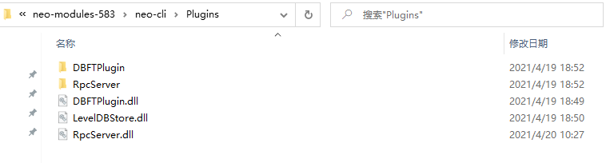
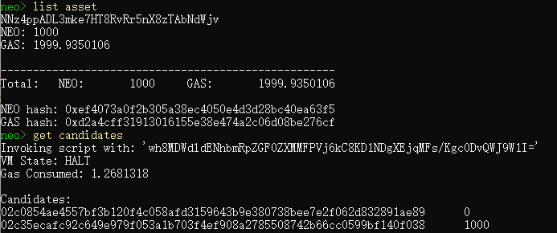

# N3 节点部署指南

本教程是面向共识节点候选人的节点部署指南，将指导你完成节点搭建并参与链上治理。

## 节点服务器要求

|          | 最低配置                                               | 推荐配置                                               |
| -------- | ------------------------------------------------------ | ------------------------------------------------------ |
| 操作系统 | Windows 10<br />Centos7.4及以上<br />ubuntu16.04\18.04 | Windows 10<br />Centos7.4及以上<br />ubuntu16.04\18.04 |
| CPU      | 2核                                                    | 4核                                                    |
| 内存     | 8G                                                     | 16G                                                    |
| 磁盘     | 64G固态                                                | 256G固态                                               |
| 运维     | 建议15天重启一次，最长不超过30天                       | 建议2个月重启一次，最长不超过3个月                     |

## 部署节点 

首先在 GitHub 上下载 [neo-cli](https://github.com/neo-project/neo-node/releases) 程序包并解压备用。

### 环境准备

1. 安装 Neo 节点的运行环境 [.NET Core Runtime](https://www.microsoft.com/net/download/core#/runtime) ，3.0 或以上版本。

2. 特别地，对于 Linux 系统，需要安装 `LevelDB` 和 `SQLite3` 开发包。

 **Ubuntu:**

   ```
   sudo apt-get install libleveldb-dev sqlite3 libsqlite3-dev libunwind8-dev
   ```

 **CentOS:**

   ```
   sudo yum install sqlite-devel
   sudo yum install libunwind-devel
   sudo wget https://download-ib01.fedoraproject.org/pub/epel/6/x86_64/epel-release-6-8.noarch.rpm
   sudo rpm -ivh epel-release-6-8.noarch.rpm
   sudo yum install leveldb-devel
   ```

### 配置节点

Neo-cli 在执行过程中会访问其根目录下的配置文件 `config.json` ，启动 neo-cli 前需要对该文件中的参数进行配置。我们的 release 包中已经包含了主网和测试网的配置文件，默认连接至主网，如果你想连接到测试网，用 `config.testnet.json` 中的内容去替换`config.json`中的内容即可。

下面是一个以连接到测试网为例的配置文件，我们将对其中你可能会用到的参数进行介绍。

```
{
  "ApplicationConfiguration": {
    "Logger": {
      "Path": "Logs_{0}",
      "ConsoleOutput": false,
      "Active": false
    },
    "Storage": {
      "Engine": "LevelDBStore",
      "Path": "Data_LevelDB_{0}"
    },
    "P2P": {
      "Port": 20333,
      "WsPort": 20334
    },
    "UnlockWallet": {
      "Path": "admint.json",
      "Password": "1",
      "IsActive": true
    },
    "PluginURL": "https://github.com/neo-project/neo-modules/releases/download/v{1}/{0}.zip"
  },
  "ProtocolConfiguration": {
    "Network": 1951352142,
    "MillisecondsPerBlock": 15000,
    "MaxTraceableBlocks": 2102400,
    "ValidatorsCount": 7,
    "StandbyCommittee": [
      "023e9b32ea89b94d066e649b124fd50e396ee91369e8e2a6ae1b11c170d022256d",
      "03009b7540e10f2562e5fd8fac9eaec25166a58b26e412348ff5a86927bfac22a2",
      "02ba2c70f5996f357a43198705859fae2cfea13e1172962800772b3d588a9d4abd",
      "03408dcd416396f64783ac587ea1e1593c57d9fea880c8a6a1920e92a259477806",
      "02a7834be9b32e2981d157cb5bbd3acb42cfd11ea5c3b10224d7a44e98c5910f1b",
      "0214baf0ceea3a66f17e7e1e839ea25fd8bed6cd82e6bb6e68250189065f44ff01",
      "030205e9cefaea5a1dfc580af20c8d5aa2468bb0148f1a5e4605fc622c80e604ba"
    ],
    "SeedList": [
      "seed1t.neo.org:20333",
      "seed2t.neo.org:20333",
      "seed3t.neo.org:20333",
      "seed4t.neo.org:20333",
      "seed5t.neo.org:20333"
    ]
  }
}
```

该配置文件分为两部分，`ApplicationConfiguration`和`ProtocolConfiguration`。

- `ApplicationConfiguration`

  - `UnlockWallet`

     你可以开启自动绑定并打开钱包功能（钱包打开后才可以调用与钱包相关的 API）。配置参数如下：

     - `Path`：钱包路径

     - `Password`：钱包密码

     - `IsActive`：设为 true 允许自动打开钱包

  - `Logger`

     - `ConsoleOutput`：是否在控制台打印出 Log 信息。（true：前后台打印，false：后台记录）

     - `Active` ：是否开启 Log 信息。

  - `Storage`

     - `Engine` ：默认 LevelDBStore。表示区块链数据存储使用的引擎。

  - `PluginURL` 

     表示下载插件的地址，使用 CLI 的 install 命令时会用到。

- `ProtocolConfiguration`

  - `Network`

     网络 ID，主网、测试网、各个私链等都有不同的ID

### 安装插件

一些附加功能被独立封装在插件中用以调用，提升了节点的安全性，稳定性和灵活性。关于插件的详细信息以及使用场景，请参见 [安装插件 ](https://docs.neo.org/docs/zh-cn/node/cli/config.html#安装插件)。

我们推荐交易所至少安装以下插件，以保证 API 的正常使用和自动读取离线包的完整性：

- ApplicationLogs（必选）
- LevelDBStore（已预装）
- RpcServer（必选）
- RpcNep17Tracker（推荐）

#### 安装方法

- 第一种：在 [这里 ](https://github.com/neo-project/neo-modules/releases/)将下载的插件包解压到 neo-cli 根目录下，解压完成后的目录结构如下图: 

  

- 第二种：启动 neo-cli 后（参见 [启动节点](#启动节点)），直接在终端使用以下命令自动进行安装，并在安装完所需插件后，根据提示重启 neo-cli ：

  ```
  install ApplicationLogs
  install RpcServer
  install RpcNep17Tracker
  ```

#### 修改配置文件

部分插件也有自己的 `config.json` 文件，我们来进行简单的介绍。

- `RpcServer`

  用于提供节点的RPC功能。

  ```
  {
    "PluginConfiguration": {
      "Servers": [
        {
          "Network": 5195086,
          "BindAddress": "127.0.0.1",
          "Port": 20332,
          "SslCert": "",
          "SslCertPassword": "",
          "TrustedAuthorities": [],
          "RpcUser": "",
          "RpcPass": "",
          "MaxGasInvoke": 20,
          "MaxFee": 0.1,
          "MaxConcurrentConnections": 40,
          "MaxIteratorResultItems": 100,
          "DisabledMethods": [ "openwallet" ]
        }
      ]
    }
  }
  ```

  - `Network`：网络ID，需和节点的 `config.json` 文件中保持一致
  - `BindAddress`：如果不想对外开放API，设置成`127.0.0.1`，否则设置成`0.0.0.0`
  - `Port`：`RPC`端口
  - `RpcUser/RpcPass`：设置后，调用API方法时请求头中必须带 username/password
  - `MaxFee`：network fee 上限
  - `MaxIteratorResultItems`：调用合约时，当返回结果包含迭代器时的迭代次数上限
  - `DisabledMethods`：禁用的API方法，默认禁用`openwallet`

- `ApplicationLogs`

  用于同步智能合约和 NativeContract 的日志（Notify）。

  ```
  {
    "PluginConfiguration": {
      "Path": "ApplicationLogs_{0}",
      "Network": 5195086
    }
  }
  ```

  - `Network`：网络ID，需和节点的 `config.json` 文件中保持一致

- `RpcNep17Tracker`

  提供 NEP17 余额及交易历史的 RPC 查询功能。

  ```
  {
    "PluginConfiguration": {
      "DBPath": "Nep17BalanceData",
      "TrackHistory": true,
      "RecordNullAddressHistory": false,
      "MaxResults": 1000,
      "Network": 5195086
    }
  }
  ```

  - `Network`：网络ID，需和节点的 `config.json` 文件中保持一致
  - `MaxResults`：调用`getnep17transfers`时，返回结果中 sent/received 的条数上限

### 启动节点

打开命令行，定位到 Neo-CLI 所在目录，输入以下命令启动 Neo 节点。

**Windows 10** :

```
dotnet neo-cli.dll
```

或

```
neo-cli.exe
```

**Linux (ubuntu 16.04/18.04)** :

```
./neo-cli
```

或

```
dotnet neo-cli.dll
```

如果你想让外部程序访问该节点的 API 需要开放防火墙端口，如本文示例中对应的端口：20331-20334 

> [!WARNING]
>
> 如果开通了 API 服务，并且在 Neo-CLI 中打开钱包的话，需要设置防火墙策略，例如设置防火墙的白名单，这些端口仅对白名单的 IP 地址开放。如果完全对外开放，其它人可能会通过 API 导出私钥或者进行转账。

## 参与链上治理

作为一个由社区驱动的开放平台，Neo N3 的全新链上治理引入了多种角色以及相应的激励机制，以确保所有参与者都可获得相应的奖励。

新的治理机制主要包含三部分：候选人，委员会以及共识节点。其中，委员会负责主网参数调整，维护链上环境；共识节点负责打包交易和出块，保持主网的正常运行。两者均需要从候选人中，通过 NEO 持有者投票选出。关于各个角色的具体职能，可查看 [链上治理与激励](https://docs.neo.org/docs/zh-cn/basic/governance.html)。

目前主网的委员会成员最多 21 位，共识节点 7 个，候选者没有限制。三者之间逻辑关系如下图所示：


### 注册候选人

参与链上治理的第一步是注册成为候选人。

任何组织与个人都可以通过注册成为候选人，也可以通过注销解除候选人资格。只有自己才能对自己执行注册 / 注销的操作。候选人票数为所有给其投票的地址的 NEO 余额之和。每 21 个区块，网络将根据票数将候选人排序，排在前面的一定数量的候选人将被选为委员会成员以及共识节点。

你可以在 neo-cli 端通过以下命令注册成为候选人，注册费用为1000 GAS， 为确保交易的成功进行，请提前在该地址中准备足够的 GAS。

句法：

 `register candidate <account> [maxGas=1010]`

参数：

`account`：注册者账户

`maxGas`: 最大花费 GAS，默认为 1010，其中注册费用 1000 GAS。

示例：

```
neo> register candidate NNuEErrm2qpLyoWUxtEy7Sgxh1cm71Ngb6
Invoking script with: 'DCECw17K/JLGSel58FOhtwP075CKJ4VQh0K2bMBZm/FA8DgRwB8MEXJlZ2lzdGVyQ2FuZGlkYXRlDBT1Y+pAvCg9TQ4FxI6jBbPyoHNA70FifVtS'
VM State: HALT
Gas Consumed: 1000.0104529
Result Stack: [{"type":"Boolean","value":true}]
Relay tx(no|yes): y
Signed and relayed transaction with hash=0xde4403e0890062077f37739a2e819db89297ab26b72f862d32479f90a498ad76
```

交易上链后，可以通过 `get candidates` 命令查看自己是否已成功成为候选人。

示例：

```
neo> get candidates
Invoking script with: 'wh8MDWdldENhbmRpZGF0ZXMMFPVj6kC8KD1NDgXEjqMFs/Kgc0DvQWJ9W1I='
VM State: HALT
Gas Consumed: 1.2681318
 
Candidates:
02c35ecafc92c649e979f053a1b703f4ef908a2785508742b66cc0599bf140f038      0
```

上述示例中可以看到我的地址 `NNuEErrm2qpLyoWUxtEy7Sgxh1cm71Ngb6` 对应的公钥 `02c35ecafc92c649e979f053a1b703f4ef908a2785508742b66cc0599bf140f038` 已经在候选人列表中，且当前获得投票数为0。

### 给候选人投票

每一个持有 neo 的地址都可以对候选人进行投票，候选人将按照获得票数多少排序，排名靠前的一定数量候选人（默认 21 个）将当选为委员会成员。候选人排名会实时变动，委员会名单每 21 个区块更新一次。
你可以通过以下命令给候选人投票：

句法：

 `vote <senderAccount> <publicKey>`

参数：

- `senderAccount`：用来投票的账户
- `publickey`：被投票地址的公钥

示例：

```
neo> vote NNz4ppADL3mke7HT8RvRr5nX8zTAbNdWjv 02c35ecafc92c649e979f053a1b703f4ef908a2785508742b66cc0599bf140f038
Invoking script with: 'DCECw17K/JLGSel58FOhtwP075CKJ4VQh0K2bMBZm/FA8DgMFCGuv5M7mu78Jasb6bcarzQV/e05EsAfDAR2b3RlDBT1Y+pAvCg9TQ4FxI6jBbPyoHNA70FifVtS'
VM State: HALT
Gas Consumed: 0.0301161
Result Stack: [{"type":"Boolean","value":true}]
Relay tx(no|yes): y
Signed and relayed transaction with hash=0xc3b29d0bab7b800ad4a47497b2989454a9623c764cfa5f7b83bf09afce570ac9
```

上述示例中，我用 `NNz4ppADL3mke7HT8RvRr5nX8zTAbNdWjv` 这个地址给 `02c35ecafc92c649e979f053a1b703f4ef908a2785508742b66cc0599bf140f038` 这个候选人投了票，这样 `NNz4ppADL3mke7HT8RvRr5nX8zTAbNdWjv` 地址里持有的 neo 将会被计入该候选人的得票数，如下所示：



### 当选为委员会成员

当同时满足以下两个条件时，会触发一次委员会更新：

- 所有候选人人数大于等于最初 config 文件中设置的 StandbyCommittee 个数（默认为21个）
- 所有候选人获得的总票数大于等于 20% 的 NEO

如果此时你的排名在前21，则会当选为委员会成员。在委员会内部，可以通过投票的方式，对 Neo 网络的一些参数进行修改，以及角色节点的指认，具体请参照 [文档](https://docs.neo.org/docs/zh-cn/basic/governance.html#委员会)。

