# Neo N3 迁移页面指南

本教程将指导用户在迁移页面使用Neo N3 兼容钱包将通证资产从 Neo Legacy 迁移到 Neo N3。

## 使用NeoLine进行迁移

1. 点击Neoline右上角的图标，并点击`创建钱包`。

   

2. 选择 `Neo N3` ，创建一个新的Neo N3钱包。

   

3. 输入钱包名称及其密码，并点击`创建`。一个新的Neo N3钱包就创建成功了。
   
   注意，请根据提示妥善保管你的钱包私钥。
   
   
   
4. 打开 [迁移到N3](https://migration.neo.org/) 网页。点击`连接钱包`来连接一个Neo Legacy钱包。

   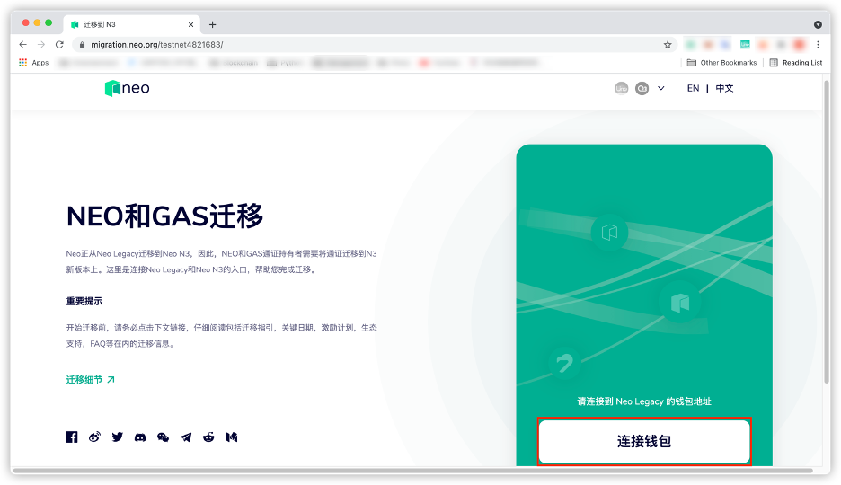

5. 点击 `连接 NeoLine`。

   

6. 点击 `连接`。

   

7. 选择进行迁移的通证。

   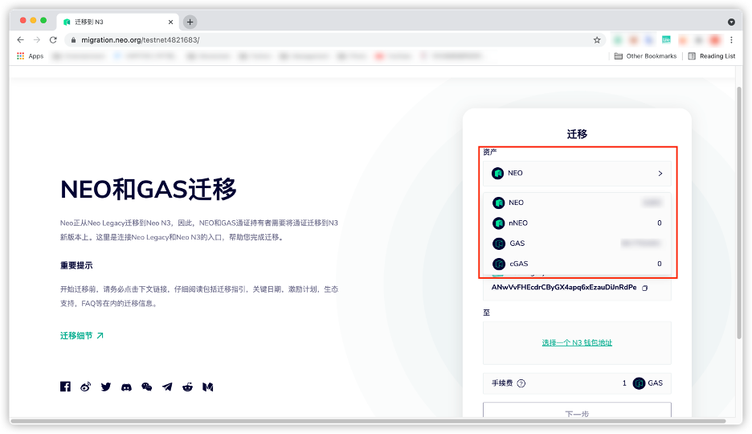

8. 输入要迁移的数量。

   > [!Note]
   >
   > 当用户迁移少于 10 个 NEO 或 20 个 GAS 时，则需要支付大约1 个 GAS 的手续费。因为当前所有 Neo N3 上的交易都要收费，如果允许用户免费迁移少量代币，就会产生漏洞，即用户有可能通过垃圾交易来慢性消耗 Neo 基金会的 GAS。

   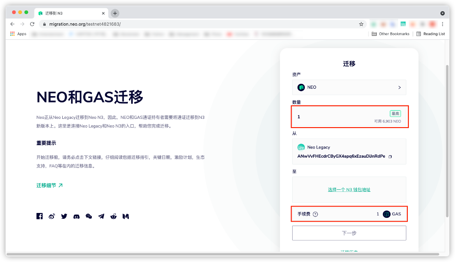

9. 点击`选择一个N3钱包地址`， 完成选择后点击`确认`。

   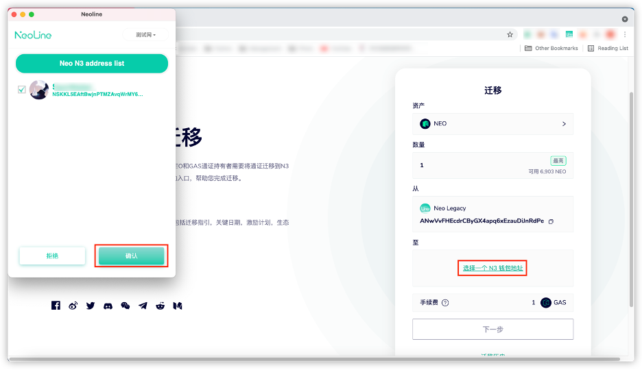

10. 点击`下一步`开始通证迁移。

    

11. 确认迁移信息是否正确。如正确，点击`下一步`；否则点击`返回`并修改迁移信息。

    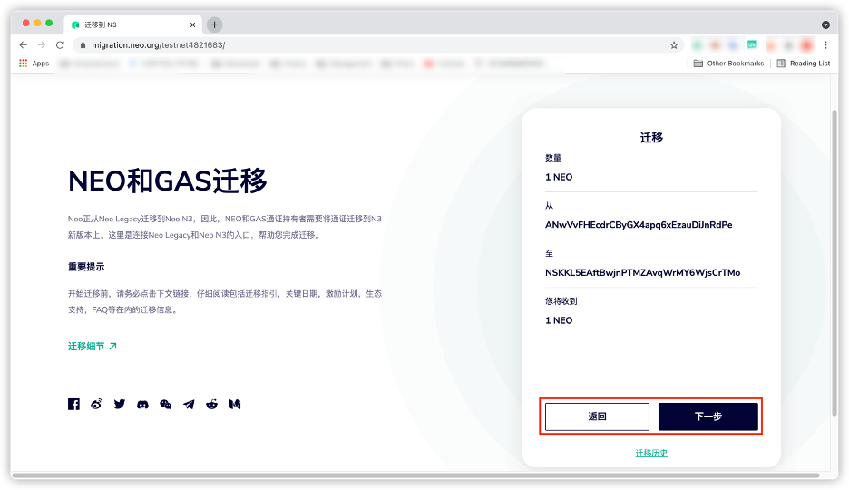

12. 点击`确认`开始迁移过程。

    

13. 等待迁移过程完成。

    

14. 点击`确认`完成迁移。

    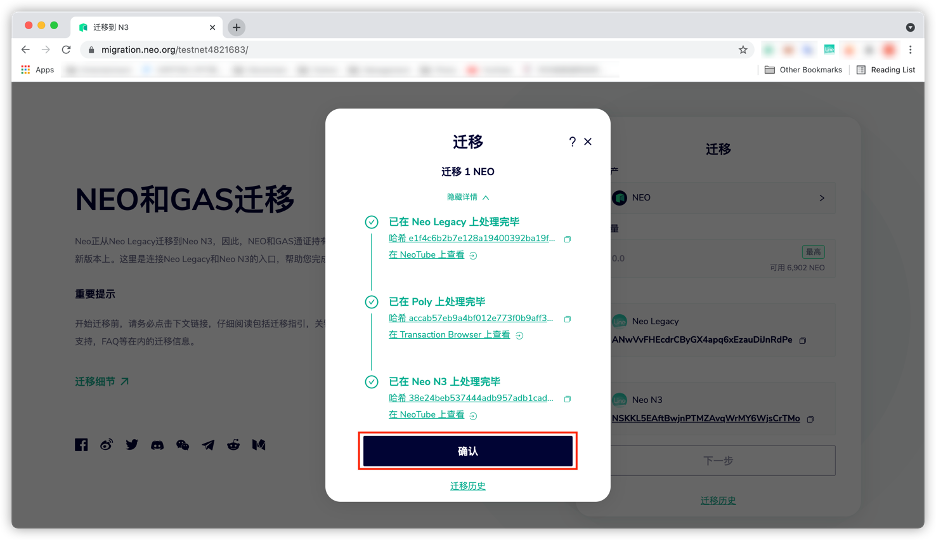

15. 点击`迁移历史`查看迁移状态。

    > [!Note]
    >
    > 如果迁移满足激励条件，这笔迁移在激励栏的状态将在激励到账时显示为`完成`。激励详细交易信息可点击`完成`查看。

    

    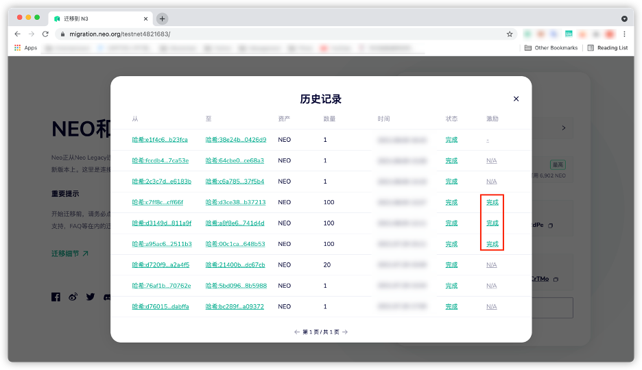

## 使用O3钱包进行迁移

1. 打开O3钱包应用。点击上方的钱包账户，并点击`创建`。

   

2. 选择`Neo N3`并点击`下一步`开始创建Neo钱包。

   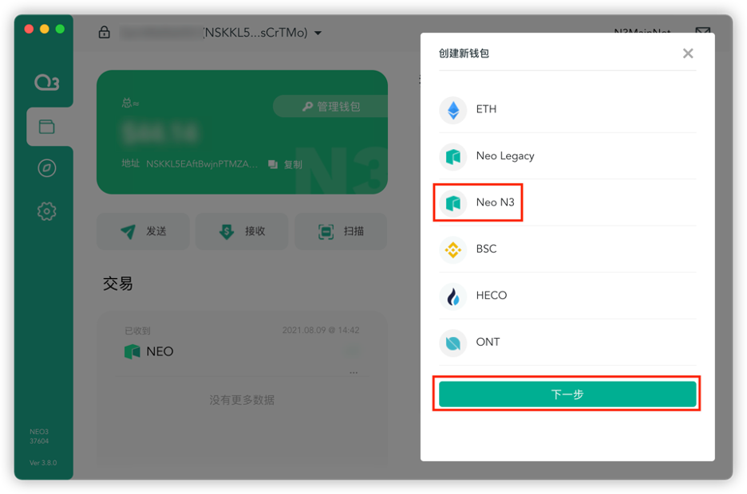

3. 输入钱包名称及密码，并点击`创建`。一个新的Neo N3钱包就创建成功了。

   

4. 打开 [迁移到N3](https://migration.neo.org/) 网页。点击`连接钱包`来连接一个O3钱包。

   

5. 点击`连接 O3`。

   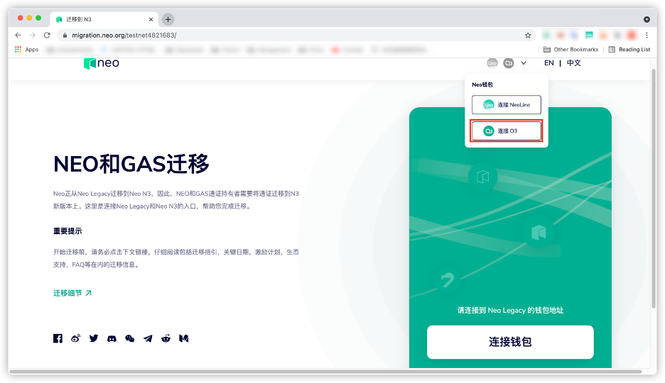

6. 选择一个钱包，并点击`连接`。

   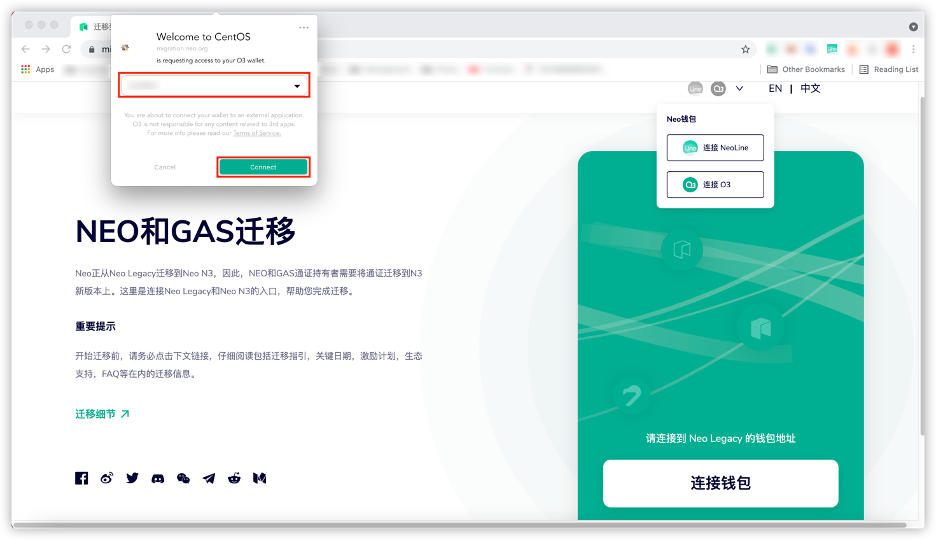

7. 选择进行迁移的通证。

   

8. 输入要迁移的数量。

   > [!Note]
   >
   > 当用户迁移少于 10 个 NEO 或 20 个 GAS 时，则需要支付大约1 个 GAS 的手续费。因为当前所有 Neo N3 上的交易都要收费，如果允许用户免费迁移少量代币，就会产生漏洞，即用户有可能通过垃圾交易来慢性消耗 Neo 基金会的 GAS。

   
   
9. 点击`选择一个N3钱包地址`，完成选择后点击`选择`。

   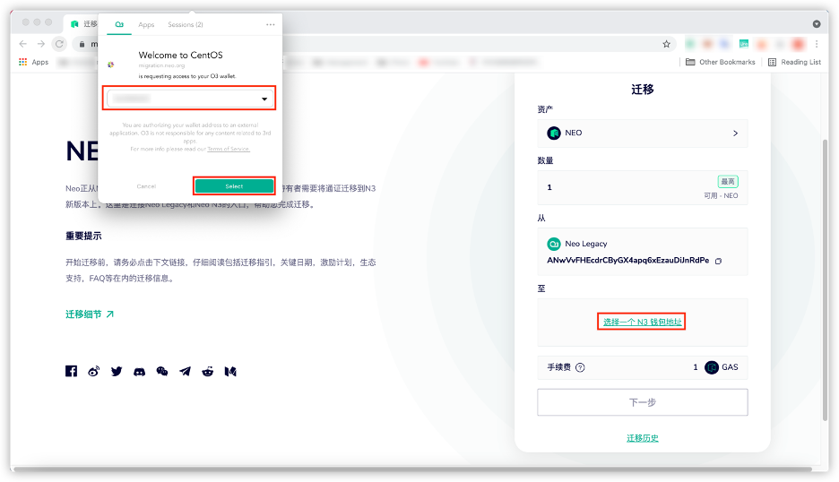

10. 点击`下一步`开始通证迁移。

    

11. 确认迁移信息是否正确。如正确，点击`下一步`；否则点击`返回`并修改迁移信息。

    

12. 点击`准许`开始迁移过程。

     

13. 等待迁移过程完成。

    

14. 点击`确认`完成迁移。

    

15. 点击`迁移历史`查看迁移状态。

    > [!Note]
    >
    > 如果迁移满足激励条件，这笔迁移在激励栏的状态将在激励到账时显示为`完成`。激励详细交易信息可点击`完成`查看。

    
    
    