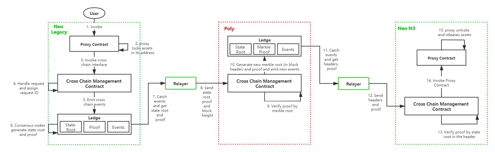

# 从 Neo Legacy 迁移到 Neo N3

本教程将指导开发人员将 Neo Legacy 上的全局资产 NEO 和 GAS 跨链转移到 Neo N3。

## 转换 nNEO 和 cGAS

由于智能合约无法调用 UTXO 资产 NEO 和GAS，我们需要将其分别转换成 NEP-17合约映射资产 nNEO 和 cGAS，从而使得资产能被跨链调用，计算精度以及与智能合约进行交互。

nNEO 和 cGAS 是开源的，可以在GitHub上查看其合约源代码和详解：[nNEO ](https://github.com/neo-ngd/CNEO-Contract "nNEO")和 [cGAS](https://github.com/neo-ngd/CGAS-Contract "cGAS")。

> [!Note]
>
> 由于 Neo 的最小单位为1，所以从 Neo Legacy 上迁移 NEO (nNEO) 资产时，只能迁移整数个 NEO (nNEO)。例如钱包中有 10.5 个 nNEO，则只能迁移 10个 nNEO 到 N3。

nNEO 和 cGAS 通过 `mintTokens` 方法与全局资产进行 1:1 转换，可参考以下示例代码。

JS 示例：

```js
const { default: Neon, api, wallet, tx, u, sc, rpc, core } = require("@cityofzion/neon-js");

let outPutObj1 = {
    "assetId": "602c79718b16e442de58778e148d0b1084e3b2dffd5de6b7b16cee7969282de7",
    "value": "1022",
    "scriptHash": "f0e522806601209e9599d5e9b4dfc59773c4a882"
}

let outPutObj2 = {
    "assetId": "602c79718b16e442de58778e148d0b1084e3b2dffd5de6b7b16cee7969282de7",
    "value": "10",
    "scriptHash": "74f2dc36a68fdc4682034178eb2220729231db76"
}

let inputObj = {
    "prevHash": "f9452b21e6c079e06be717c9eded71a7d947e83f54a962e5277c7c8d56fff86c",
    "prevIndex": 1
}

const props2 = {
    scriptHash: "74f2dc36a68fdc4682034178eb2220729231db76",
    operation: "mintTokens",
    args: []
};
const script2 = Neon.default.create.script(props2);
let invokeTx = new Neon.tx.InvocationTransaction({ script: script2 })
invokeTx.addOutput(new Neon.tx.TransactionOutput(outPutObj1));
invokeTx.addOutput(new Neon.tx.TransactionOutput(outPutObj2));
invokeTx.inputs[0] = new Neon.tx.TransactionInput(inputObj);

invokeTx.sign("Your private key")

const rpcClient = new Neon.rpc.RPCClient("http://seed10.ngd.network:20332");

rpcClient.sendRawTransaction(invokeTx).then((response) => {
    console.log(response);
}).catch((err) => {
    console.log(err);
});

```

C# 示例：

```c#
//UTXO 输入
            var inputs = new List<CoinReference>
            {
                new CoinReference()
                {
                    PrevHash = neoList[0].txid,
                    PrevIndex = (ushort)neoList[0].n
                }
            }.ToArray();

            long amount = 100_2345_6789;
            //UTXO 输出
            var outputs = new List<TransactionOutput>
            {
                new TransactionOutput()
                {
                    AssetId = Blockchain.UtilityToken.Hash,
                    ScriptHash = CGAS,
                    Value = new Fixed8(amount)//数量
                },
                new TransactionOutput()
                {
                    AssetId = Blockchain.UtilityToken.Hash,
                    ScriptHash = User.ScriptHash,
                    Value = Fixed8.FromDecimal(neoList[0].value) -  new Fixed8(amount)//数量
                }
            }.ToArray();


            //构造交易
            Transaction tx = null;
            using (ScriptBuilder sb = new ScriptBuilder())
            {
                //nNEO
                sb.EmitAppCall(UInt160.Parse("0xf46719e2d16bf50cddcef9d4bbfece901f73cbb6"), "mintTokens");     //合约方法 mintTokens
                //cGAS
                //sb.EmitAppCall(UInt160.Parse("0x74f2dc36a68fdc4682034178eb2220729231db76"), "mintTokens");
                tx = new InvocationTransaction
                {
                    Version = 1,
                    Script = sb.ToArray(),
                    Outputs = outputs,
                    Inputs = inputs,
                    Attributes = new TransactionAttribute[0],
                    Witnesses = new Witness[0]
                };
            }

            //用户签名
            tx.Attributes = Helper.GetAttribute(User.ScriptHash);
            var signature = tx.Sign(keyPair);
            tx.Witnesses = Helper.GetWitness(signature, keyPair.PublicKey);

            //发交易
            byte[] data = tx.ToArray();
			string rawdata = data.ToHexString();
            string result = Helper.InvokeRpc(url, "sendrawtransaction", rawdata);
```

Java示例

```java
    Neow3j neow3j = Neow3j.build(new HttpService("http://seed1.ngd.network:20332")); // Neo2 test net
    Account account = Account.fromWIF("your wif string").build();
    // nNeo contract hash on Neo2 testnet
    ScriptHash nNeoHash = new ScriptHash("0x17da3881ab2d050fea414c80b3fa8324d756f60e"); 
    account.updateAssetBalances(neow3j);
    ContractInvocation invoc = new ContractInvocation.Builder(neow3j)
            .contractScriptHash(nNeoHash)
            .function("mintTokens")
            .account(account)
            .output(new RawTransactionOutput(NEOAsset.HASH_ID, lockValue, nNeoHash.toAddress()))
            .build()
            .sign()
            .invoke();
    String txHash = invoc.getTransaction().getTxId();
```

## 跨链架构

由于跨链天然的具有将数据从一条链转移到另一条链的功能，本次迁移采用跨链的方式，其架构如下图所示：



上图中各组件定义如下：

- **Neo Legacy**：neo 2.x 版本的侧链，本次迁移中的资产迁出方。
- **Neo N3**：neo 3.0 版本的侧链，本次迁移中的资产迁入方。
- [**中继链 Poly**](https://github.com/polynetwork/docs/blob/master/poly/README_CN.md)：中继链是整个架构中的重要部分，每个节点由不同的个人或组织运行，有自己独特的治理模式和信任机制，它负责将各个侧链连接到一起并进行跨链信息的传递。
- **Relayer**：每条侧链都有自己的 Relayer，负责把交易等跨链信息搬运到中继链或从中继链搬运到侧链，并且它们会在这个过程中获取收益。
- **跨链管理合约**：简称 CCMC (Cross Chain Management Contract)，其作用包括但不限于处理跨链请求、验证跨链交易有效性、发出跨链事件等。
- **代理合约**：用来锁定和解锁资产，且两条侧链上各自锁定/解锁的资产必须种类相同，数量相等。
- **用户**：泛指所有进行迁移操作的对象，包括但不限于交易所、个人用户、钱包等。用户必须调用代理合约，发起跨链交易。

## 迁移流程

迁移开始前需注册两条侧链和两个 Relayer，绑定两条侧链上的对应资产，然后进入下列流程：

**Neo Legacy 端：**

1. 用户调用Neo Legacy链上的代理合约的 `lock` 方法。

   > [!Note]
   >
   > - C# 调用代码请参考 [C# Demo](https://github.com/neo-ngd/CrossChainExample/blob/main/CrossChainDemo/Demo.cs)
   > - Java 调用代码请参考 [Java Demo](https://github.com/neo-ngd/CrossChainExample/tree/main/CrossChainDemo_Java/src/main/java/crosschain/demo)
   > - Javascript 调用代码请参考 [JS Demo](https://github.com/neo-ngd/CrossChainExample/blob/main/crosschaindemo.js)

2. 代理合约将需要迁移的资产锁定在其地址上

3. 代理合约调用跨链管理合约的 `crossChain` 方法

4. 跨链管理合约生成 `Request ID` 并保存

5. 跨链管理合约发出跨链事件

6. 共识节点生成 state root 和该笔跨链交易的 proof

7. Relayer 通过逐个扫描侧链区块捕捉到跨链事件

8. Relayer 构造交易将 state root 和 proof 发送到中继链 Poly 上

**Poly 端：**

9. 中继链的跨链管理合约通过跨链参数中的 `from chain ID` 使用 Neo Legacy 链的 handler 来验证 proof 的有效性
10. Poly 为第8步中的交易构造新的 state root 和 proof，并发出跨链事件

**Neo N3 端：**

11. Relayer 通过逐个扫描 Poly 区块捕捉到跨链事件
12. Relayer 调用跨链管理合约的 `verifyAndExecuteTx` 方法构造一笔交易，将包含 state root 的区块头和 proof 发送到侧链上
13. 跨链管理合约验证 Poly 交易 proof 的有效性
14. 跨链管理合约调用 Neo N3 的代理合约的 `UnlockAsset` 方法
15. 代理合约解锁对应资产到用户在 Neo N3 上的地址

## 验证资产转移成功

完成资产跨链转移后，交易所需要查看资产是否到账，操作如下：

1. 通过 [getblock](https://docs.neo.org/docs/zh-cn/reference/rpc/latest-version/api/getblock.html) API 获取每个区块的详情，其中便包括该区块中所有交易的详情；

3. 调用 [getapplicationlog](https://docs.neo.org/docs/zh-cn/reference/rpc/latest-version/api/getapplicationlog.html) API 获取每笔交易的详情，分析交易内容，确认资产转移成功。

### 调用 getapplicationlog

正确安装 [ApplicationLogs 插件](https://github.com/neo-project/neo-modules/releases/download/v3.0.0-rc2/ApplicationLogs.zip) 并启动 Neo-CLI 节点后，可以看到在neo-cli 根目录下生成了一个 ApplicationLogs 文件夹，完整的合约日志会记录到该目录下，每笔 NEP-17 交易会记录在 leveldb 文件中，通过 API 来读取。

以下是一个 API 调用结果：

```json
{
    "jsonrpc": "2.0",
    "id": 1,
    "result": {
        "txid": "0xd9aaa1243cae91e063a140239807a9de45f82850130ec36403f44770955dd2d7",
        "trigger": "Application",
        "vmstate": "HALT",
        "gasconsumed": "11819770",
        "stack": [],
        "notifications": [
            {
                "contract": "0xd2c270ebfc2a1cdd3e470014a4dff7c091f699ec",
                "eventname": "Transfer",
                "state": {
                    "type": "Array",
                    "value": [
                        {
                            "type": "ByteString",
                            "value": "uXtKzX+CD2HS1NT5rqXrUEmN31U="
                        },
                        {
                            "type": "ByteString",
                            "value": "7ztGBn8vR7L38EQqojcghdCHCO8="
                        },
                        {
                            "type": "Integer",
                            "value": "800000000000"
                        }
                    ]
                }
            }
        ]
    }
}
```

> [!Note]
>
> 失败的 NEP-17 交易也可以上链，因此需要判断虚拟机的状态项 "vmstate" 是否正确（HALT）。如果包含"FAULT"，则说明执行失败，该交易无效。

其中与交易相关的参数如下：

- `contract`：该字符串为智能合约的脚本哈希，对于交易所来说，这里是 NEP17 类型资产的脚本哈希，交易所可以以此来确定资产的唯一性。例如，"0xd2c270ebfc2a1cdd3e470014a4dff7c091f699ec" 就是该NEP17 资产的脚本哈希，是该资产在全网的唯一标识。

- `eventname`：该字段为合约事件标识，跨链交易的 notifications 数组中可能有多个 eventname, 只有 Transfer 关键字的 eventname 才是 NEP17 转账数据。对于交易所来说，应当只监听标识为 Transfer 类型的交易以确认是否为用户的转账交易。

- `state`：对于转账交易，"value" 对应的数组包含以下三个对象：

  - 转出账户：数组中的的第一个对象，类型为 bytearray，值为 "uXtKzX+CD2HS1NT5rqXrUEmN31U="，经过 base64 解码为 ByteArray 后再转换为字符串 "NcphtjgTye3c3ZL5J5nDZhsf3UJMGAjd7o"。
  
    > [!Note]
    >
    > Neo 中 16 进制值如果前面加 0x，按大端序处理，如果没加 0x，按小端序处理。

    ```json
    {
      "type": "ByteString",
      "value": "uXtKzX+CD2HS1NT5rqXrUEmN31U="
    }
    ```
  
   - 转入账户：数组中的第二个对象，类型为 bytearray，值为 "7ztGBn8vR7L38EQqojcghdCHCO8="，经过 base64 解码为 ByteArray 后再转换为字符串 "Nhiuh11SHF4n9FE6G5LuFHHYc7Lgws9U1z"。对于交易所来说，如果该地址为交易所地址，那么该交易是一笔充值交易。
  
     ```json
     {
       "type": "ByteString",
       "value": "7ztGBn8vR7L38EQqojcghdCHCO8="
     }
     ```
  
  - 转账金额：数组中的的第三个对象，因为 decimal 为 8 位，所以实际值是 8000.00000000。
    
    ```json
    {
      "type": "Integer",
      "value": "800000000000"
    }
    ```

关于文件中 transfer 数据格式的转换，可以参考官方页面 [Neo数据转换](https://neo.org/converter/index)。

## 相关参考

- [Cross-chain Configuration Info](https://github.com/polynetwork/docs/blob/master/config/README.md)

