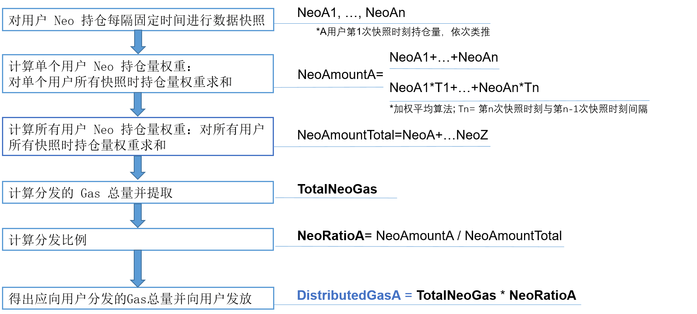

# 交易所对接指南

本文主要用于指导交易所完成与 NEO 对接的安装部署，程序开发和相关交易处理，在阅读以下内容之前，请确认您已了解 NEO 背景知识和相关原理，详情请参阅 [NEO白皮书](index.html)。

通常，交易所需要完成以下操作：

- [在服务器中部署 NEO 节点](#在服务器中部署-neo-节点)
- [创建和使用 NEO-CLI 钱包](#创建和使用-neo-cli-钱包)
- [处理全局资产交易](#处理全局资产交易)
- [处理NEP-5资产交易](#处理-nep-5-资产交易)
- [（可选）给用户分发 GAS](#（可选）给用户分发-gas)


## 在服务器中部署 NEO 节点

NEO节点的初始安装部署包含以下步骤：

1.  安装 NEO节点的运行环境 [.NET Core Runtime](https://www.microsoft.com/net/download/core#/runtime)，1.0.1 或以上版本。
2.  在 Github 上下载 [Neo-CLI](https://github.com/neo-project/neo-cli/releases) 程序包并启动 NEO 节点。

更多详细内容，请参阅 [NEO 节点的安装部署](node/setup.html)。

## 创建和使用 NEO-CLI 钱包

### 关于NEO-CLI

NEO-CLI 是为开发者提供的命令行客户端，开发者可以通过两种方式与之交互： 

- 使用 CLI（命令行界面）的命令，如创建钱包，创建地址等。
- 通过程序的 RPC 请求，如向指定地址转账，获得指定高度的区块信息，获得指定的交易等。

NEO-CLI 提供以下功能： 

- 作为命令行钱包，管理资产。

  要启动钱包功能，在 NEO-CLI 程序目录下输入以下命令：

  ```
  dotnet neo-cli.dll
  ```

  要查看所有命令，在 NEO-CLI 程序目录下输入以下命令：

  ```
  help
  ```

  更多信息，请参阅 [CLI 命令参考](node/cli.html)。

- 提供一系列 API 接口，用于从节点获取区块链数据。接口通过 [JSON-RPC](http://www.jsonrpc.org/specification) 的方式提供，底层使用 HTTP/HTTPS 协议进行通讯。 

  如果想启动节点的同时开启 API，在 NEO-CLI 程序目录下输入以下命令：

  ```
  dotnet neo-cli.dll /rpc
  ```

  要查看更多 API 信息，请参阅 [API参考](node/api.html)。


### 创建钱包

交易所需要创建一个在线钱包管理用户充值地址。钱包用来存储账户（包含公钥和私钥）、合约地址等信息，是用户持有资产的最重要的凭证，一定要保管好钱包文件和钱包密码，不要丢失或泄露。 

> [!Note]
>
> 交易所不需要为每个地址创建一个钱包，通常一个在线钱包可以存储用户所有充值地址。也可以使用一个冷钱包（离线钱包）作为更安全的存储方式。

请按照以下步骤创建钱包：

1. 输入命令 `create wallet <path>` 。

   其中 <path> 为钱包路径及名称，扩展名任意。 如 create wallet mywallet.db3。

2. 设置钱包密码。 

> [!Note]
>
> 钱包要一直保持打开状态以便处理用户的提现，为了安全钱包应该运行在单独的服务器上，并参考下表配置好防火墙。 
>

|                    | Mainnet | Testnet |
| ------------------ | ------- | ------- |
| JSON-RPC via HTTPS | 10331   | 20331   |
| JSON-RPC via HTTP  | 10332   | 20332   |
| P2P                | 10333   | 20333   |
| websocket          | 10334   | 20334   |

### 生成充值地址

一个钱包可以存储多个地址，交易所需要为每个用户生成一个充值地址。 

充值地址有两种生成方式： 

- 用户第一次充值（NEO/NEO GAS）时，程序动态创建 NEO 地址，优点：无需人工定期创建地址；缺点：不方便备份钱包。

  要动态创建地址，可以使用 NEO-CLI API 的 [getnewaddress方法](node/api/getnewaddress.html) 实现。程序会返回创建的地址。

- 交易所提前创建一批 NEO 地址，并在用户第一次充值（NEO/NEO GAS）时，给用户分配一个 NEO 地址。优点：可以备份钱包；缺点：当地址不足时需要人工创建 NEO 地址。

  要批量创建地址，执行 NEO- CLI 的 create address [n] 命令，地址会自动导出到 address.txt 文件。
  方括号为可选参数，默认值为 1。例如要一次创建100个地址，输入 `create address 100` 。


> [!Note]
>
> 无论采用哪种方式，交易所需要将生成的地址导入到数据库中，作为充值地址分配给用户。

## 处理全局资产交易

### 开发交易对接程序

对于全局资产，交易所需要进行以下功能的开发：

1. 使用NEO-CLI  API （[getblock方法](node/api/getblock2.html)）监控新区块。
2. 根据交易信息完成用户充值。
3. 存储交易所相关交易记录。

#### 用户充值 

关于用户充值，交易所需要了解以下内容： 

- NEO区块链只有一条主链，没有侧链，不会分叉，也不会有孤立区块。
- 所有记录在NEO区块链中的交易都是不可篡改的，即一个确认就代表充值成功。
- 一般来讲，交易所充值地址里的余额并不等于用户在交易所里的余额，有以下原因：
  - 在转账或提现时，NEO钱包会从一个或多个地址中找到即能满足需求又使用总输入最小的零钱作为本次交易的输入，而不会将指定地址的零钱作为交易输入（除非交易所重写了NEO钱包的部分代码使其满足自身需求）。
  - 其他操作，例如交易所将一部分资产转移到交易所的冷钱包等。
- NEO 地址中不仅包含 NEO 和 NEO GAS 两种资产，还可以有许多种用户自己发行的资产（如股权、Token等），交易所记录用户充值时需要判断充值资产的资产类型，以免把其它资产的充值当成 NEO 股或 NEO 币，或把 NEO 和 NEO GAS 的充值弄混。
- NEO 钱包是一个全节点，要保持在线才能同步区块，可以通过 NEO-CLI 的 `show state` 命令查看区块同步状态，左侧为本地区块高度，右侧为节点区块高度。
- 交易所内的用户之间转账不需要通过区块链，而可以直接修改数据库中的用户余额进行，只有充值提现才上链。

#### 充值记录

交易所需要写代码监控每个区块的每个交易，在数据库中记录下所有充值提现交易。如果有充值交易就要修改数据库中的用户余额。 

NEO-CLI  API 中的 getblock <index> [verbose] 方法提供了获取区块信息的功能，该方法中的 <index> 为区块索引。[verbose] 默认值为 0，表示返回的是区块序列化后的信息，用 16 进制字符串表示，如果从中获取详细信息需要反序列化。[verbose] 为 1 时返回的是对应区块的详细信息，用 Json 格式字符串表示。更多信息请参阅 [getblock方法](node/api/getblock2.html)。

获取的区块信息中包含了交易输入和交易输出，交易所需要记录下所有和自己相关的交易，作为用户充值提现的交易记录。如果发现在交易的输出中有属于交易所的地址，则要修改数据库中该充值地址对应的用户 NEO 或 NEO GAS 余额。

也有交易所采用另一种方式：如果发现在交易的输出中有属于交易所的地址，先在数据库中记录下充值记录，待几个确认后再修改用户余额。如果不是为了与其它区块链操作方式统一，并不推荐这么做。 

> [!Note]
>
> - getblockcount 返回的是主链中的区块数量，getblock <index> 第一个参数是区块索引，区块索引 = 区块高度 = 区块数量 - 1，所以如果 getblockcount 返回 1234，调用 getblock 1234将获取不到结果，而应该调用 getblock 1233。
> - 交易所充值提现交易的交易类型都是 ContractTransaction（无论是充值 NEO 股还是 NEO 币），交易所在遍历区块中的所有交易时，只需关心 ContractTransaction 。
> - 每个区块的第一个交易必定是 MinerTransaction，在遍历交易时可以忽略或跳过。
> - NEO系统中的一切事务都以交易为单位进行记录。
>

### 处理用户的提现请求 

关于用户提现，交易所需要完成以下操作： 

1. 在 NEO-CLI 中，执行 `open wallet <path>` 命令打开钱包。

2. 记录用户提现，修改用户账户余额。

3. （可选）客服处理提现申请。

4. 使用NEO-CLI  API 中的 `sendtoaddress <asset_id> <address> <value>` 方法 ，向用户提现地址发送交易。更多信息，请参阅 [sendtoaddress方法](node/api/sendtoaddress.html)。

   - `<asset_id>` ：资产ID
   - `<address>` ：提现地址
   - `<value>` ：提现金额

   要向多个地址批量发送交易，可以使用 API [sendmany方法](node/api/sendmany.html)。

5. 从返回的 Json 格式交易详情中提取交易ID，记录在数据库中。

6. 等待区块链确认，确认后将提现记录标志为提现成功。

   类似充值时对区块链的监控，提现也一样，监控时若发现区块中的某个交易 ID 与提现记录中的交易 ID 相等，则该交易已经确认，即提现成功。

> [!Note]
>
> -  <value> 为实际金额，并非乘以10^8后的金额。
> -  NEO 转账金额必须是整数，否则区块链不会确认，这时钱包里的零钱就不准确了，需要重建钱包索引，即根据区块链重新计算钱包里的交易和零钱。

## 处理 NEP-5 资产交易

### 获取用户充值通知

对于 NEP-5 资产，交易所需要获取用户充值通知。每个区块的通知信息会记录在一个 JSON 文件中，包含每笔 NEP-5 交易的所有信息。

要获取通知文件，运行以下命令：

```
dotnet neo-cli.dll --rpc --record-notifications
```

可以看到在根目录下生成了一个 Notifications 文件夹：


#### 

#### 查看 Notifications 文件

以下是一个通知文件的内容示例。

```json
[
{
    "txid": "0x65d62a736a73c4d15dc4e4d0bfc1e4bbc4ef220e163625d770eb05577b1afdee",
    "contract": "0xecc6b20d3ccac1ee9ef109af5a7cdb85706b1df9",
    "state":
    {
        "type": "Array",
        "value": [
        {
            "type": "ByteArray",
            "value": "7472616e73666572"
        },
        {
            "type": "ByteArray",
            "value": "d336d7eb9975a29b2404fdb28185e277a4b299bc"
        },
        {
            "type": "ByteArray",
            "value": "eab336cac807707295afa7e7da2f4683237f612a"
        },
        {
            "type": "ByteArray",
            "value": "006ad42d100100"
        }]
    }
}]
```

在该文件中的通知数组只有一个对象，表示该区块上只有一个 NEP-5 事件被触发。在一个通知文件中，你需要查看以下与交易相关的信息：

- **contract**: 其后面的字符串代表了资产类型.
- 数组中的第一个对象，如上述例子所示，其值是代表转账交易的字符串 : 

```json
{
	"type": "ByteArray",
	"value": "7472616e73666572"
}
```

- 对于转账交易，"state" 中的数组包含以下四个对象： 

  [事件，转出账户，转入账户，金额]

- 数组中的的第三个对象，如果其值是交易所地址，交易所会收到通知。

### 查询用户余额

要查询用户账户余额，交易所需要进行以下操作：

1. 编写 JSON 文件，使用 PRC API `invokefunction` 调用三个方法： `balanceOf`、`decimals`和 `symbol`。 
2. 向 NEO RPC 服务器发送文件请求。
3. 根据返回值计算出用户余额。

#### invokefunction

在 JSON 文件中，invokefunction 的请求正文通常为以下格式：

```
{
  "jsonrpc": "2.0",
  "method": "invokefunction",
  "params": [
    "script hash",
    "method name",
    [
      {
        "optional arguments"
      }
    ]
  ],
  "id": 1
}
```

查询用户余额时，你需要替换上例中的这些字符：

- script hash

  要查询的 NEP-5 币的散列值，例如，PRX 的散列值是：*0xecc6b20d3ccac1ee9ef109af5a7cdb85706b1df9*


- method name

  要调用的方法。要查询用户余额，需要调用以下三个方法：

  **balanceOf**

  - 语法： <code>public static BigInteger balanceOf(byte[] account)</code>
  - 说明：“balanceOf” 返回 "account'' 的余额。

  **decimals**

  - 语法： <code>public static byte decimals()</code>
  - 说明： "decimals" 返回代币使用的小数位数。

  **symbol**

  - 语法： <code>public static string symbol()</code>
  - 说明：”symbol“ 返回币种符号。


- optional arguments

  可选。如果调用的方法需要参数，可以将这些参数构造成一个数组传入。例如，NEP-5 的 "balanceOf"返回 "account" 的余额：

  <code>public static BigInteger balanceOf(byte[] account)</code> 

  因此，你需要把 account 作为 "balanceOf" 方法的一个参数。

#### 调用示例

##### **调用 balanceOf**

假设用户账户地址是 AJShjraX4iMJjwVt8WYYzZyGvDMxw6Xfbe，你需要将其转换为 Hash160类型并将此参数构造为 JSON 对象，如下所示:

```json
{
    "type": "Hash160",
    "value": "bfc469dd56932409677278f6b7422f3e1f34481d"
}
```

然后编写如下 JSON 消息：

请求正文：

```json
{
  "jsonrpc": "2.0",
  "method": "invokefunction",
  "params": [
    "ecc6b20d3ccac1ee9ef109af5a7cdb85706b1df9",
    "balanceOf",
    [
      {
        "type": "Hash160",
        "value": "bfc469dd56932409677278f6b7422f3e1f34481d"
      }
    ]
  ],
  "id": 3
}
```

发送请求后，将收到如下响应：

```json
{
    "jsonrpc": "2.0",
    "id": 3,
    "result": {
        "state": "HALT, BREAK",
        "gas_consumed": "0.338",
        "stack": [
            {
                "type": "ByteArray",
                "value": "00e1f505"
            }
        ]
    }
}
```

返回值”00e1f505“ 可以转化为整数**100000000**。

##### **调用 decimals**

请求正文：

```json
{
  "jsonrpc": "2.0",
  "method": "invokefunction",
  "params": [
    "0xecc6b20d3ccac1ee9ef109af5a7cdb85706b1df9",
    "decimals", 
    []
    ],
  "id": 2
}
```

发送请求后，将收到如下响应：

```json
{
    "jsonrpc": "2.0",
    "id": 2,
    "result": {
        "state": "HALT, BREAK",
        "gas_consumed": "0.156",
        "stack": [
            {
                "type": "Integer",
                "value": "8"
            }
        ]
    }
}
```

返回值为整数 **8**。

##### **调用 symbol**

请求正文:

```json
{
  "jsonrpc": "2.0",
  "method": "invokefunction",
  "params": [
    "0xecc6b20d3ccac1ee9ef109af5a7cdb85706b1df9",
    "symbol", 
    []
    ],
  "id": 1
}
```

发送请求后，将收到如下响应：

```json
{
    "jsonrpc": "2.0",
    "id": 1,
    "result": {
        "state": "HALT, BREAK",
        "gas_consumed": "0.141",
        "stack": [
            {
                "type": "ByteArray",
                "value": "525058"
            }
        ]
    }
}
```

返回值 "525058" 可以被转换为币种符号 "RPX"。

##### **计算用户余额**

根据所有返回值，可以计算出用户余额为：
用户余额 = 100000000/10<sup>8</sup> RPX = 1 RPX

### 处理用户提现

交易所可以通过以下一种方式发送 NEP-5 资产给用户： 

- NEO-CLI 命令： `send`
- RPC 方法： `sendtoaddress`
- PRC 方法： `sendmany`

#### NEO-CLI 命令：send

##### 语法

`send <txid|script hash> <address> <value> [fee = 0]`

##### 参数

- txid|script hash：资产ID。
- address：付款地址。
- value：转账金额。
- fee：手续费。该参数可以留空。默认值为0。

该命令会检查钱包密码。

##### 示例

要将100 RPX 转账到地址 *AeSHyuirtXbfZbFik6SiBW2BEj7GK3N62b*，输入以下命令：

```
send 0xecc6b20d3ccac1ee9ef109af5a7cdb85706b1df9 AeSHyuirtXbfZbFik6SiBW2BEj7GK3N62b 100
```

如果要转账全局资产，只需要将第一个参数改为 txid。例如，
NEO txid: 0Xc56f33fc6ecfcd0c225c4ab356fee59390af8560be0e930faebe74a6daff7c9b
GAS txid: 0x602c79718b16e442de58778e148d0b1084e3b2dffd5de6b7b16cee7969282de7

#### RPC 方法：sendtoaddress

 "params"  包含一个至少三个参数的数组。

`"params":[script hash, address, amount, fee(optional), change address(optional)]`

例如，要发送 1 RPX 到 *AbP3FU3YcqBrWh72nc9deyQB99eazG9XUg*，编写如下 JSON 文件并发送给 RPC 服务器。

请求正文：

```json
{
    "jsonrpc":"2.0",
    "method":"sendtoaddress",
    "params":[
        "0xecc6b20d3ccac1ee9ef109af5a7cdb85706b1df9",
        "AbP3FU3YcqBrWh72nc9deyQB99eazG9XUg",
        "1",
        "0",
        "ARkJ8QcVdYL68WRvN3wj3TSvXX8CgmC73Z"
    ],
    "id":1
}
```

发送请求后，将收到如下响应：

```json
{
    "jsonrpc":"2.0",
    "id":1,
    "result":{
        "txid":"0xc6d4bf7c62fb47e0b2a6e838c3a1ca297622a1b1df7ceb2d30fa4ef8b7870700",
        "size":219,
        "type":"InvocationTransaction",
        "version":1,
        "attributes":[
            {
                "usage":"Script",
                "data":"5305fbbd4bd5a5e3e859b452b7897157eb20144f"
            }
        ],
        "vin":[

        ],
        "vout":[

        ],
        "sys_fee":"0",
        "net_fee":"0",
        "scripts":[
            {
                "invocation":"4054fbfca678737ae164ebf0e476da0c8215782bc42b67ae08cf4d8a716eeef81fcc17641e7f63893c3e685fb7eb1fb8516161c5257af41630f4508dde3afa3a8c",
                "verification":"210331d1feacd79b53aeeeeb9de56018eadcd07948675a50258f9e64a1204b5d58d1ac"
            }
        ],
        "script":"0400e1f50514d710f6f3f0bad2996a09a56d454cfc116a881bfd145305fbbd4bd5a5e3e859b452b7897157eb20144f53c1087472616e7366657267f91d6b7085db7c5aaf09f19eeec1ca3c0db2c6ecf166187b7883718089c8",
        "gas":"0"
    }
}
```

#### RPC 方法：sendmany

"params"  包含一个至少一个参数的数组。

`"params":[[], fee(optional), change address(optional)]`

例如，要发送 15.5 RPX 和 0.0001 GAS 到 *AbP3FU3YcqBrWh72nc9deyQB99eazG9XUg* ，且零钱地址`change address`也是 *AbP3FU3YcqBrWh72nc9deyQB99eazG9XUg*，编写如下 JSON 文件并发送给 RPC 服务器。

请求正文：

```json
{
    "jsonrpc":"2.0",
    "method":"sendmany",
    "params":[
        [
            {
                "asset":"0xecc6b20d3ccac1ee9ef109af5a7cdb85706b1df9",
                "value":"15.5",
                "address":"AbP3FU3YcqBrWh72nc9deyQB99eazG9XUg"
            },
            {
                "asset":"0x602c79718b16e442de58778e148d0b1084e3b2dffd5de6b7b16cee7969282de7",
                "value":"0.0001",
                "address":"AbP3FU3YcqBrWh72nc9deyQB99eazG9XUg"
            }
        ],"0.00001","AbP3FU3YcqBrWh72nc9deyQB99eazG9XUg"
    ],
    "id":1
}
```

发送请求后，将收到如下响应：

```json
{
    "jsonrpc": "2.0",
    "id": 1,
    "result": {
        "txid": "0xe1351c9c9f2205a801d1b04f0df2d65fb4b1692d7d3b06cf41e0712fd1b12c9c",
        "size": 373,
        "type": "InvocationTransaction",
        "version": 1,
        "attributes": [
            {
                "usage": "Script",
                "data": "6d64dc9e50af8e911247436b264c8f7d791ad58c"
            }
        ],
        "vin": [
            {
                "txid": "0x9f0a28a912527604ab4b7d5e8b8d1a9b57631fcbab460132811ae7b6ed1ccaff",
                "vout": 1
            }
        ],
        "vout": [
            {
                "n": 0,
                "asset": "0x602c79718b16e442de58778e148d0b1084e3b2dffd5de6b7b16cee7969282de7",
                "value": "0.0001",
                "address": "AbP3FU3YcqBrWh72nc9deyQB99eazG9XUg"
            },
            {
                "n": 1,
                "asset": "0x602c79718b16e442de58778e148d0b1084e3b2dffd5de6b7b16cee7969282de7",
                "value": "0.01359",
                "address": "AbP3FU3YcqBrWh72nc9deyQB99eazG9XUg"
            }
        ],
        "sys_fee": "0",
        "net_fee": "0.00001",
        "scripts": [
            {
                "invocation": "40644ab915419dbf855a52d5c75596e80b78c8e928cc0ce91ae6afc3b75a0c31ee54efe1836f9ec232f6c42dcb3ace0bfdc688e626944fa20970a76064975eade9",
                "verification": "2103d4b6fc2d116855f86a483d151182f68e88e6ddd13f3f1f3631e36300aac122bfac"
            }
        ],
        "script": "04801f635c14d710f6f3f0bad2996a09a56d454cfc116a881bfd146d64dc9e50af8e911247436b264c8f7d791ad58c53c1087472616e7366657267f91d6b7085db7c5aaf09f19eeec1ca3c0db2c6ecf166f871fb30fc859b77",
        "gas": "0"
    }
}
```

### 相关参考

[NEP-5 Token Standard](https://github.com/neo-project/proposals/blob/master/nep-5.mediawiki "NEP5")

#### 方法

##### name

- 语法： `<code>public static string name()</code>`
- 说明： "name" 返回币种名称。

##### transfer

- 语法： `<code>public static bool transfer(byte[] from, byte[] to, BigInteger amount)</code>`
- 说明："transfer" 会从 ”from“ 账户转账 ”amount“ 金额到 ”to“ 账户。

##### transferFrom ''(optional)''

- 语法：  `<code>public static bool transferFrom(byte[] originator, byte[] from, byte[] to, BigInteger amount)</code>`
- 说明：如果''originator'' 已被批准转移请求的 ”amount“，"transferFrom" 会从 ”from“ 账户转账 ”amount“ 金额到 ”to“ 账户。

#### 事件

##### transfer

- 语法： `<code>public static event Action<byte[], byte[], BigInteger> transfer</code>`
- 说明：“transfer”事件在成功执行 “transfer” 方法后触发。

## （可选）给用户分发 GAS

交易所可以选择是否给用户分发 GAS。GAS 用来支付 Neo 区块链的记账费和附加服务费。

### 什么是 GAS ?

NeoGas（缩写符号 GAS）共1亿份，代表了Neo区块链的使用权。GAS 会随着每个新区块的生成而产生，依照既定的缓慢衰减的发行速度，经历总量从0到1亿的过程，约22年达到1亿总量。只要获得Neo，GAS 便会在系统中按照算法自动生成。

每一个Neo都有两种状态：unspent 和 spent。每一个Gas也有两种状态，unavailable 和 available。一个Neo的生命周期以转入地址起始，转出地址截止，转入时状态变为 unspent，转出时状态变为 spent。当 Neo 处于unspent 状态时，所产生的 Gas 为 unavailable 状态，即不可提取。当 Neo 处于spent 状态时，期间所产生的Gas 变为 available，用户可以提取。

### 计算可提取的 GAS 总量

- 可提取的*Gas = f(neo_amount, Δt_const)*

  -  Δt_const = t_end - t_start
    -  t_end = Neo变为spent状态时刻
    -  t_start = Neo变为unspent状态时刻

  由于 Δt 是定量，所以可提取的 Gas 也是一个定量。可提取Gas的大小取决于所持有的 Neo 数量以及两个状态的时间差。


- 不可提取的*Gas = f(neo_amount, Δt_var)*

  - Δt_var = t - t_start
    - t为当前时刻
    - t_start = Neo变为unspent状态时刻

  由于 t 是变量，所以不可提取的 Gas 也随时间增长而不停增长，是一个变量。

### 给用户分发 GAS

假设交易所的所有地址都在一个钱包里，下图显示了交易所向某用户 A 分发 GAS 的流程和计算公式：





快照间隔越短，计算越精确。如果快照时间间隔不均匀，可以采用加权平均算法。

### 用户提取 GAS

用户将地址中的 NEO 完成一次转账即可提取 GAS，例如： 地址 A 中有 Neo，Gas 为不可提取状态， 那么只需要将 Neo 转给自己，Gas 即可变为可提取状态。

具体提取步骤和命令请参见下表。

| #    | 步骤                                       | 输入命令                                     |
| ---- | :--------------------------------------- | ---------------------------------------- |
| 1    | 运行客户端                                    | `./neo-cli.dll /rpc`                     |
| 2    | 查看客户端版本                                  | `version`                                |
| 3    | 查看客户端同步高度（Height: 区块高度/区块头高度，Nodes: 连接节点数量）。 | `show state`                             |
| 4    | 创建钱包                                     | `create wallet /home/NeoNode/test.db3`   |
| 5    | 打开钱包                                     | `open wallet /home/NeoNode/test.db3`     |
| 6    | 查看钱包里的地址列表                               | `list address`                           |
| 7    | 查看钱包资产                                   | `list asset`                             |
| 8    | 获取钱包GAS余额详情                              | `show gas`                               |
| 9    | 给自己的钱包地址 （如AaAHt6Xi51iMCaDaYoDFTFLnGbBN1m75SM 1）转账，通过给自己转账将 GAS 状态变为可提取状态 | `send NEO AaAHt6Xi51iMCaDaYoDFTFLnGbBN1m75SM 1` |
| 10   | 再次获取钱包 GAS 余额详情，此时所有gas都为可提取状态           | `show gas`                               |
| 11   | 提取 GAS                                   | `claim gas`                              |
| 12   | 再次查看钱包余额，确认提取成功                          | `list asset`                             |

