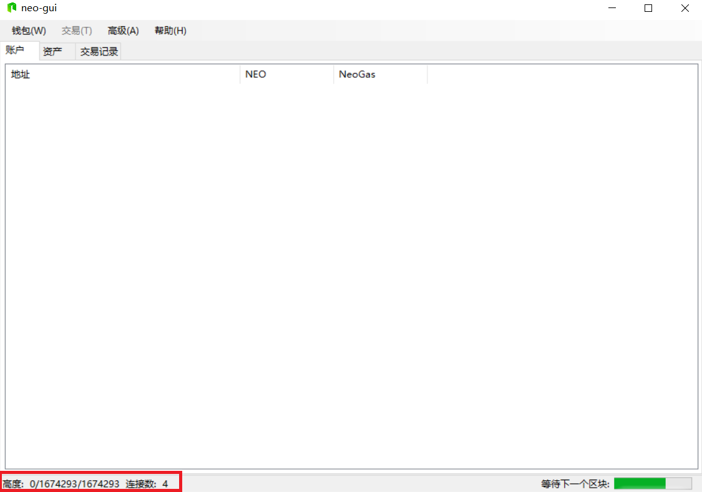
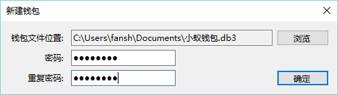
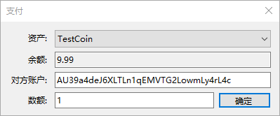
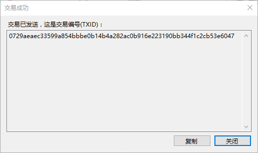
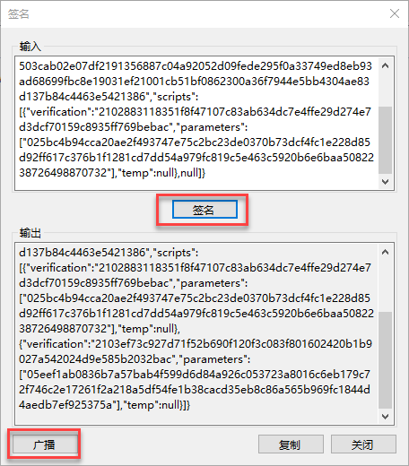
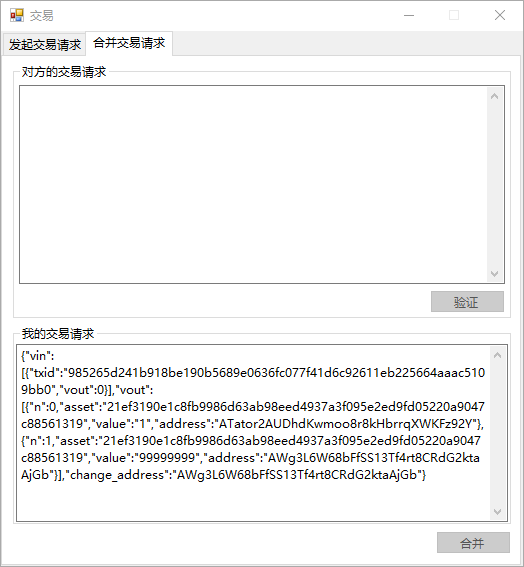
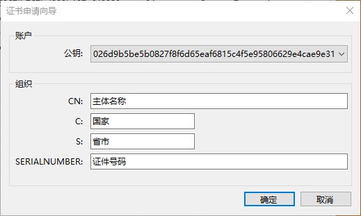
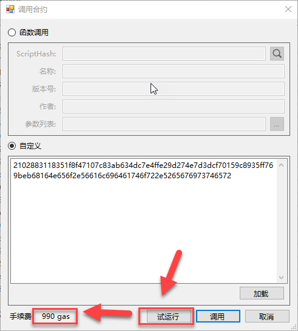
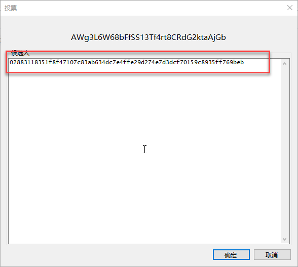

# 使用 NEO-GUI 客户端

> [!Note]
>
> 如无特别说明，本文中的描述均假设 NEO-GUI 运行在测试网。有关测试网与主网的切换，请参阅 [测试网](testnet.md)。

## 下载与运行客户端

客户端无需安装，进入[客户端下载](https://neo.org/download)页面，下载后直接运行 neo-gui.exe 即可。使用过程中，如遇到任何问题导致客户端无法正常使用，请保留好客户端目录下的 error.log 文件，并与我们的技术人员联系。

> [!Note]
>
> 客户端适应系统为： Windows 7 SP1 / Windows 8 / Windows 10。
>
> Windows 10 之前版本的系统需要安装 [.NET Framework 4.7.1](https://www.microsoft.com/net/download/framework) 。

## 快速同步区块数据

客户端运行时会自动同步区块数据，打开钱包时也会自动同步钱包数据，当同步完成后才可以正常使用客户端以及查看钱包内资产，即客户端界面左下角三个数值相同且保持相近速度稳步增加。这三个数据依次代表：钱包高度/区块高度/区块头高度。

由于区块链数据庞大，初次同步时等待时间通常很久，建议采用离线同步包进行同步：

1. 进入 [客户端下载](https://neo.org/download) 页面，根据您所在的网络选择下载主网数据包（chain.acc.zip）或测试网数据包（chain.acc.test.zip）

2. 如果是测试网数据包，将文件名改为chain.acc.zip。如果是主网数据包则无需更改

3. 关闭客户端。将 chain.acc.zip 复制到 neo-gui.exe 文件夹中。

4. 再次打开NEO-GUI，将发现客户端以超快速度进行同步。

   

您也可以使用NEO-CLI 的 `export blocks` 命令，将同步好的区块数据导出成离线同步包。相关信息请参见 [CLI命令参考](cli.md) 。

## 钱包

钱包用来存储 NEO 账户及账户中的资产信息，是客户端的钱包数据库文件，以 .json 或.db3 为后缀名称。该文件非常重要，需要**安全备份**。

> [!Important]
>
> 钱包文件或钱包密码一旦丢失，将导致您资产的损失。所以请将钱包文件安全备份，妥善保管，并牢记钱包密码。

### 创建钱包数据库

1. 在客户端中点击 `钱包` -> `创建钱包数据库`。

2. 在 `新建钱包` 页面中点击 `浏览`，选定钱包文件存储位置，并设置好文件名称，然后点击保存。

3. 输入 `密码` 与 `重复密码` ，并保存好自己的密码。

4. 点击 `确定` 后，钱包创建成功，此时钱包里会默认带有一个标准账户。

   右键单击钱包可以创建更多地址。

   > [!Note]
   >
   > 因找零机制的作用，根据转账金额，转账后的剩余部分资产会默认转到第一个地址里，所以需备份好相应的私钥与钱包。

### 查看钱包信息

#### 账户

右键单击钱包中的 `账户` -> `查看私钥`，可以查看该账户信息：

- 地址：相当于银行账户或银行卡号，用于交易时接收资产。 
- 私钥：一个 256 位的随机数，由用户保管且不对外公开，是用户账户使用权以及账户内资产所有权的证明。 
- 公钥：每一个私钥都有一个与之相匹配的公钥。

> [!Important]
>
> 任何时刻不要向他人泄露私钥，私钥一旦泄露，很可能会导致您资产的损失。

在账户列表中右键单击某地址，还可以进行以下功能操作：

| 功能     | 说明                                       |
| ------ | ---------------------------------------- |
| 创建新地址  | 在钱包内创建一个新地址                              |
| 导入     | 导入wif：将私钥对应的地址导入钱包 导入证书: 导入证书  导入监视地址：导入对方的地址作为监视地址后，便可以看到该地址上的资产情况。 |
| 复制到剪贴板 | 复制该账户地址                                  |
| 删除     | 删除该地址                                    |

#### 资产

点击 `资产` 页签，可以查看该钱包所拥有的资产信息，资产信息包括：资产（NEO、NeoGas、用户所创设的资产）、类型、余额和发行者。

#### 交易记录

点击 `交易记录` 页签，可以查看与该钱包有关的所有交易信息记录。

### 打开钱包数据库

1. 每次重新打开客户端时，都需要点击 `钱包` -> `打开钱包数据库` 来选择要打开的钱包。默认显示上一次打开的钱包。

2. 要打开其他钱包，点击 `浏览` 选择钱包。

3. 在对话框中选择要打开的文件类型：NEP-6 钱包文件（.json）或 SQLite 钱包文件（.db3）

   Neo GUI v2.5.2 以前版本仅支持 .db3 格式文件。

4. 输入密码，点击 `确定` 后进入钱包。

5. 如果打开的是旧的 .db3 钱包文件，需要根据提示选择是否升级到 NEP-6 格式钱包。

   升级文件格式后钱包可以在多个客户端之间共享，比如手机、PC 或 Web 端，但升级后的钱包文件无法在 Neo GUI v2.5.2 以前版本客户端打开。

### 修改钱包密码

在客户端中点击 `钱包` -> `修改秘密`。

修改密码后请记得重新备份钱包，因为之前备份的钱包密码未变。

### 重建钱包索引

在客户端中点击 `钱包` -> `重建钱包索引`。

该选项用于恢复出现异常时客户端内有误的数据。在以下情况下可能需要重建钱包索引：

- 导入私钥后需要重建钱包索引

- 某笔交易长时间未确认

- 钱包内资产显示错误，与区块链数据不符

- 在测试网和主网之间进行切换时

目前区块高度较高，重建钱包索引大概需要 15-20 分钟，请耐心等待。

## 交易

### 转账

向对方进行资产转移，若资产类型为 Share，需双方签名确认，其他类型资产转账无需确认。

1. 在客户端中点击 `交易` ->`转账` 。

2. 选择以下一种操作：

   1. 要给单个地址转账，点击 `+` ，输入转账信息，如资产类型，转入地址和金额。
   2. 要给多个地址转账，点击，输入地址和金额并以空格分隔，如下图所示：

   

3. 点击`确定`，如果需要，可以点击填写备注信息，备注信息会记录到 NEO 区块链上。

4. 检查转账信息，确认无误点击 `确定`。

   如果是代币类转账，交易成功后显示交易编号。

   

   如果是股权类转账，显示需要更多签名。点击 `复制`，复制交易信息并发送给对方。交易的另一方需要在NEO-GUI客户端中进行签名并广播，才能完成交易。详细内容请参见 [签名](#签名)。

   

### 签名

在进行股权类资产转账或资产交换交易时，需要对方签名才能完成交易。

1. 在NEO-GUI客户端中点击 `交易` -> `签名`，将对方发来的交易信息粘贴在输入框内，点击 `签名`，生成输出数据。

   `广播` 按钮显示出来。 广播会将签名后的交易信息发送到全网，由各节点进行确认，完成交易。

   

2. 点击 `广播` ，交易成功发送，等待确认后便可完成该笔交易。

### 资产交易

与对方进行资产交换交易，是一种线上的以物换物，需双方签名确认。如交易方A和B进行资产交换交易的流程为：

1. 双方发起交易请求，将生成的请求发送给对方
2. 将收到的请求进行验证
3. 合并双方交易请求，生成签名，并发给对方
4. 双方签名后进行广播，完成该笔交易

下面将详细讲解操作步骤。

#### 步骤1 - 发起交易请求

以A方操作为例：

1. 在客户端中点击 `交易` -> `交易`。

2. 填写对方账户，点击 `+` 输入要发送的资产信息并确认。

3. 点击`发起请求`，将生成的交易请求复制并发送给B。 点击`关闭`。

   

4. 进入合并交易请求页面，等待B发来交易请求。

   B方进行同样的操作发起交易请求，并将请求发送给A。

 #### 步骤2 - 合并交易请求

以A方操作为例：

1. 将 B 发来的交易请求粘贴到输入框。点击 `验证`。

   

2. 确认交易信息，如果无误，点击 `接收` 。

3. 点击 `合并`，将双发请求合并并生成签名信息。

4. 复制签名信息，发送给B。

5. B进行同样的操作并将签名信息发给A。

 #### 步骤3 - 签名并广播
交易双方进行签名并广播，完成交易。详细步骤请参考 [签名](#签名)。

## 高级

### 多方签名地址

多方签名地址是由多个公钥组成的，需要一方或多方签名的合约地址。   

在NEO-GUI客户端中，右键单击账户页面空白处，选择`创建合约地址` -> `多方签名`，在下方的文本框中依次输入各个公钥，设定 `最小签名数量`，如下图所示：    

即可成功创建出合约地址，并出现在账户页面中，如下图所示：    

### 提取 NeoGas

NeoGas（简称 GAS） 伴随着每个新区块的生成而产生，会按照 NEO 的持股比例，记录在 NEO 地址上（资产余额中的括号里的数目即为待认领的 GAS 数目）。NEO 持有人可以在任意时间进行发起一笔提取交易，将这些 GAS 提取到 NEO 的地址上。

每一个 NEO 都有两种状态：unspent 和 spent。每一个未提取的 GAS 也有两种状态，available 和 unavailable。一个 NEO 的生命周期以转入地址起始，转出地址截止，转入时状态变为 unspent，转出时状态变为 spent。当 NEO 处于 unspent 状态时，所产生的 Gas 为 unavailable 状态，即不可提取。当 NEO 处于 spent 状态时，期间所产生的 GAS 变为 available，用户可以提取。如何将钱包中的所有 unavailable GAS 转为 available GAS 呢？很简单，将钱包中的所有 NEO 转到钱包中的任意一个地址即可。

更多关于 GAS 的信息，请参考 [NEO 白皮书](index.html#neo-的管理模式)。

具体操作步骤为：

1. 对钱包中的所有 NEO 进行一次转账操作（可以直接转到目前地址），待认领的 NeoGas 才会结算一次，变得可提取。

2. 点击 `高级`，`提取 NeoGas`，`全部提取`，提取完成。

### 申请证书

注意，该功能只可以生成一个证书申请文件，用户仍需去相关数字证书颁发机构申请证书。
点击 `高级`，`申请证书`，然后填写证书申请向导。

最终会生成一个如下图所示的文件：

### 注册资产

您可以在 NEO 区块链中创设一种新的发行资产，可以自己定义资产的类型、名称、总量等，并指定资产的管理员账户。创设资产需要消耗一定数量的 Gas 作为附加服务费，目前为 4990 Gas。

资产类型有两种，代币（Token） 和 股份 （Share，转账时需要双方签名）。以下操作步骤以 Token 为例：     

1. 在 neo-gui 中点击 `高级` -> `注册资产`。填写以下选项并点击 `确定`：

   - 资产种类：设置资产类型：代币（Token）或 股份 （Share）
   - 名称：设置资产名称。资产发行后，可以在neo-gui的资产页签中或者区块链浏览器中查看到资产名称。
   - 总量限制：如果要限制资产发行总量，选取此项并设置上限。
   - 精度：资产的最小单位数。默认为8，表示最小单位为0.00000001。如果设置为0，表示最小单位为1。
   - 发行者：设置资产的发行者。
   - 管理员：管理员可以修改资产的名称、总量等。目前功能尚未支持。
   - 分发：设置分发资产的地址。

   

2. 注册资产通过调用智能合约来完成，如下图所示，点击`试运行`，即可看到所需手续费详情：

   同时，您也可以选择加载本地写好的智能合约文档。     

   需要注意的是，注册资产需花费大量手续费（目前为 4990 Gas），请谨慎操作。 

   

3. 确认注册资产，点击 `调用`。

4. 返回交易成功结果，复制交易ID并粘贴到记事本，以备资产分发时使用。

   您也可以在交易记录中查看到注册资产的交易编号并右键单击复制交易ID。     

> [!Note]
>
> 注册资产后需要等待约15分钟才能分发资产。

### 分发资产

完成资产注册后，就可以在资产创设所设定的总量上限范围内，向发行人指定的地址中发放该资产。分发后的资产可以用于转账和交易。分发资产需要消耗一定数量的 Gas 作为附加服务费，目前为1 Gas。

1. 在 neo-gui 中点击 `高级` -> `分发资产`。

2. 将在注册资产最后一步中复制的交易ID粘贴到`资产 ID`中，会自动显示对应的资产详情。

   如果交易ID以 ”0x“ 开始，需要删去”0x“ 再输入。

3. 点击加号按钮输入要分发资产的账户地址和数额，点击确定。

   分发完毕后可以在钱包资产中查看到用户创设的资产。

      

> [!Note]
>
> 每次分发资产需花费手续费（目前为 1 Gas），请谨慎操作，可以选择一次性批量分发以节省费用。

### NEP-5资产

NEO-GUI客户端支持NEP-5资产交易。要进行NEP-5资产交易，需要先在客户端中点击 `高级`-> `选项`，添加 NEP-5资产的脚本散列。之后便可以在资产转账或交易时选择NEP-5资产类型。

### 选举

该功能用于报名成为 NEO 区块链记账人候选人。   

     

选举同样通过调用智能合约来完成，如下图所示，点击`试运行`，即可看到所需手续费详情：      

      

同样地，您也可以选择加载本地写好的智能合约文档。    

需要注意的是，选举需花费大量手续费（目前为 990 NeoGas），请谨慎操作。目前记账人权限暂未开放，请等候通知（计划之内）。   

### 投票

成为候选人之后，即可通过投票来竞选成为记账人，如下图所示：      

     

投票同样通过调用智能合约来完成，如下图所示，点击`试运行`，即可看到所需手续费详情：     

      

同样，您也可以选择加载本地写好的智能合约文档。    

需要注意的是，投票需花费手续费（目前为 1NeoGas），请谨慎操作。目前记账人权限暂未开放，请等候通知（计划之内）。    
