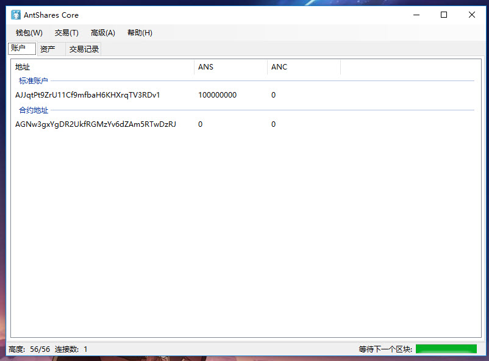

# 用 NEO 节点搭建私有链

阅读完 [NEO 节点的安装部署](setup.md) 后，我们已经可以在 Windows 和 Linux 上部署 NEO 节点了，本篇教程会教你如何用 NEO 节点搭建私有链或联盟链，并且如何从自己的私有链中提取 NEO 和 NeoGas。                        

NEO 私有链的部署至少需要 4 台服务器才能取得共识，每台服务器对应一个共识节点，每台服务器上有一个 NEO 钱包文件。

## 1、配置虚拟机

NEO 私有链的部署至少需要 4 台服务器才能取得共识，每台服务器对应一个共识节点。为了演示，我在 Azure 上创建了 4 台 Windows 虚拟机，大小为 Standard DS1 v2 (1 核心，3.5 GB 内存)，你也可以在局域网中或虚拟机中部署私有链。


创建好后，要开通 10331-10334 端口，具体方法为在系统的 `防火墙` `高级设置` `入站规则` 中新建规则，然后添加端口 10331-10334。

> [!Note]
> 如果你在云服务器上创建的虚拟机，还要登录虚拟机的管理后台，设置网络安全组
>
> Azure 上的设置方法为：`网络接口` `网络安全组` `入站安全规则` `添加` 添加端口 10331-10334。

创建好虚拟机后，将四台虚拟机的 IP 地址保存下来以备后用。

## 2、安装 NEO 节点

NEO 节点的安装过程上文已经详细介绍过了，安装过程请参考 [NEO 节点的安装部署](setup.md)。 

## 3、创建钱包

我们首先创建 4 个钱包文件，依次为 wallet1.db3 - wallet4.db3，这一步在 PC 版钱包和命令行钱包都可以创建，下图是在命令行客户端创建钱包文件的截图。


创建好钱包后将 4 个钱包的公钥保存下来（保存到一个 txt 文件中即可）以备后用。直接复制上面的公钥或者用 [CLI 命令](cli.md) 中的 `                                                                           list key` 命令查看公钥再复制均可。

然后将 4 个钱包分别复制到 4 个虚拟机的节点目录下。

## 4、修改节点的配置文件

打开节点的配置文件 `protocol.json` 。

首先修改 `Magic` 值，Magic 用于识别消息的来源网络，指定不同的 Magic 确保 NEO 区块链中的不同网络信息在传输过程中不会发送到其它网络。 

> [!Note]
> Magic 的类型为 uint，所以注意所填写的数值要在 [0 - 4294967295] 区间内。

然后修改 `StandbyValidators`，将第三步记下来的 4 个公钥填写在这里。

最后修改 `SeedList`，将第一步记下来的 IP 地址填写在这里，端口号保持不变，例如我修改成下面的配置。

```json
{
  "ProtocolConfiguration": {
    "Magic": 1704630,
    "AddressVersion": 23,
    "StandbyValidators": [
   "02f27545181beb8f528d13bbb66d279db996ecb56ed9a324496d114acb48aa7a32",
      "02daa386d979ae6643869a365294055546023acb332ee1a74a5ae5d54774a97bac",
      "0306f12f7217569cdbe9dde9ff702d0040e0a4570873eee63291adaa658128e55c",
      "035781b4d55dc58187f61b5d9277afbaae425deacc5df57f9891f3a5c73ecb24df"
    ],
    "SeedList": [
      "13.75.112.62:10333",
      "137.116.173.200:10333",
      "168.63.206.73:10333",
      "137.116.171.134:10333"
    ],
    "SystemFee": {
      "EnrollmentTransaction": 0,
      "IssueTransaction": 0,
      "PublishTransaction": 0,
      "RegisterTransaction": 0
    }
  }
}
```

SystemFee 是系统手续费，目前手续费如下（单位为 GAS）：

记账人报名 1000 分发资产 500 智能合约发布 500 注册资产 10000

可以在这里设置私有链中的系统手续费。

最后将修改过的 protocol.json 复制到 4 个节点的客户端目录下，替换之前的 protocol.json 的文件。

然后在 4 台虚拟机上依次输入以下命令启动节点，打开钱包，开启共识。不记得命令的请参考 [CLI 命令参考](cli.md)。 

启动节点：

`dotnet neo-cli.dll`

打开钱包：

`open wallet wallet1.db3` 

注：这里并非所有节点都要打开 wallet1 钱包，每个节点应该打开自己的钱包文件。

`start consensus`

如果上述操作成功，那么此时 4 个节点便会开始共识过程，如图所示


4 个节点即使关掉一台依然可以达成共识，如图所示


## 5、提取 NEO、NeoGas

安装 PC 版客户端（Neo-GUI），修改配置文件 protocol.json 使其连接到私有链中。

打开钱包，如果左下角有连接数不为零，而且一直在同步区块，表示该客户端已经成功地连接到了私有链中。

在 PC 版客户端中打开钱包 wallet1.db3，添加多方签名地址，输入 protocol.json 中的 4 个公钥，设置最小签名数量为 3（共识节点数量 / 2 + 1），如图所示。


确定，然后需要重建钱包索引，在菜单栏中点击 `钱包` `重建钱包索引` 然后你就会看到在合约地址中有 1 亿的 NEO 了。


> [!Note]
>  4 个钱包都要执行这个操作：添加多方签名地址，重建钱包索引

下面我们要将该 NEO 从合约地址转到普通地址中，打开 4 个钱包中的任意一个，点击 `交易` `转账` 输入一个标准地址，将 1 亿 NEO 转到这个地址中。

然后系统会提示“交易构造完成，但没有足够的签名”，然后将代码复制下来，打开第二个钱包，点击 `交易` `签名` 粘贴刚才复制的代码，点击 `签名`， 然后将代码复制下来，打开第三个钱包，点击 `交易` `签名` 粘贴刚才复制的代码，点击 `签名`， 这时你会发现窗口中出现了一个 `广播` 按钮，代表交易已经签名完成（达到多方签名合约要求的最少签名数量）可以广播，点击 `广播` 后转账交易开始广播，约 15 秒后转账成功。



提取 NeoGas 的操作方法也类似，点击 `高级` `提取 NeoGas` `提取` ，（记得这时所在的钱包 X，下文会用到），如图所示


接下来的操作与转账 NEO 类似，将没有足够的签名的代码复制下来，打开第二个钱包，点击 `交易` `签名` 粘贴刚才复制的代码，点击 `签名`， 然后将代码复制下来，打开第三个钱包，点击 `交易` `签名` 粘贴刚才复制的代码，点击 `签名`，点击 `广播` 后提取 NeoGas 的交易开始广播，约 15 秒后提取成功。

提取成功后 NeoGas 会进入到你发起提取 NeoGas 的交易所在的钱包（即上方的 X 钱包）的第一个标准地址，如图所示


