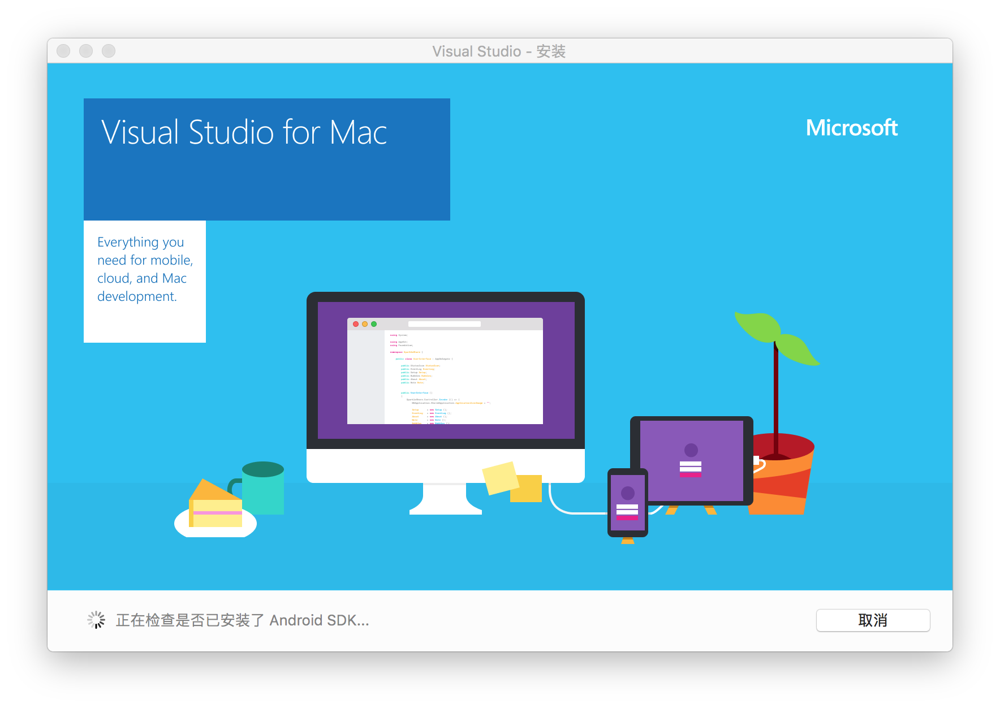
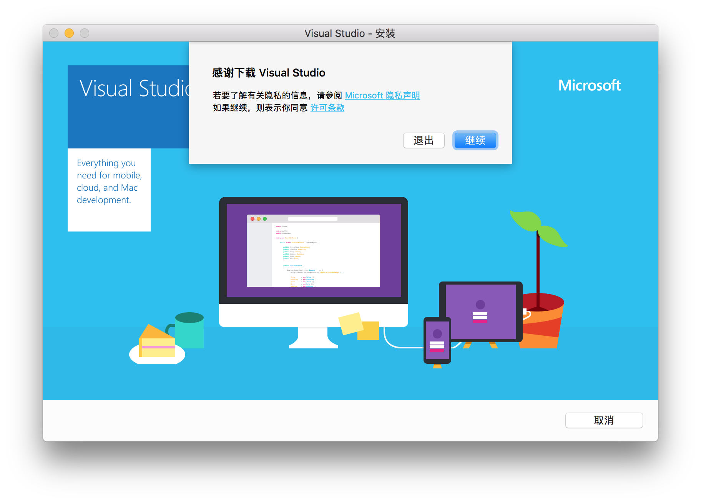
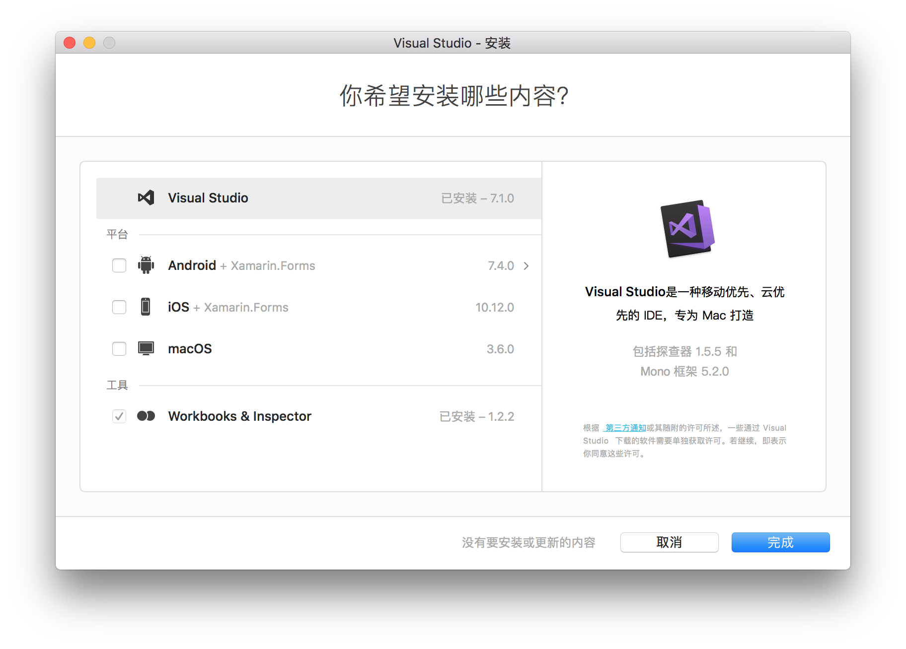
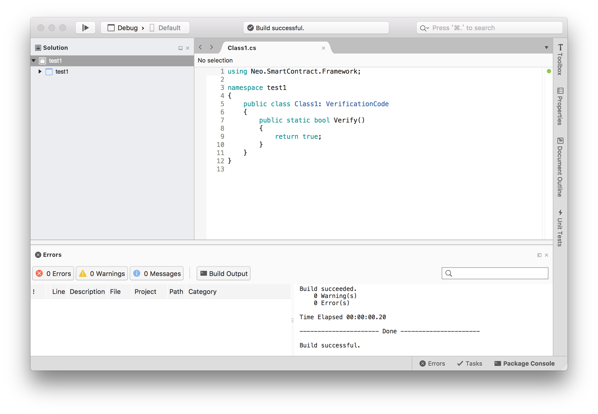
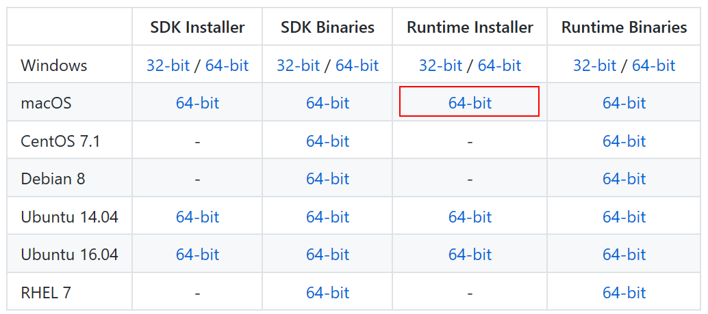

# 在 macOS 上如何用 C# 编写智能合约

### 1. Visual Studio for Mac 

如果你的计算机中已经安装过 Visual Studio for Mac ，可跳过本小节。

[Visual Studio for Mac 下载地址](https://www.visualstudio.com/zh-hans/vs/visual-studio-mac/)

安装时只需勾选基本功能，无需安装 Android / iOS / macOS 等平台组件。







> [!Note]
> 基本安装全程大约需要几十分钟，如果勾选了 Android / iOS / macOS 平台，其安装时间可能会需要数小时，而且由于网络情况，可能会失败 N 次，所以不建议勾选平台组件。

### 2. 新建项目

打开 Visual Studio for Mac，新建项目，选择 .NET Standard Library（.NET Core → Library）。


> [!Note]
> 新建项目时 .NET Core 版本请选择 2.0，因为如果选择 1.x 后，接下来添加 “Neo.SmartContract.Framework” 时会失败。

然后右击 `Dependencies`，单击 `Restore`，搜索 “neo” ，选择 “Neo.SmartContract.Framework”，点击 `Add Package`。


程序开始添加 NEO 智能合约框架，该过程大约需要几分钟。

安装成功后，编写如下示例代码：

```c#
using Neo.SmartContract.Framework;
using Neo.SmartContract.Framework.Services.Neo;

public class Class1: VerificationCode
{
    public static bool Verify()
    {
        return true;
    }
}
```


点击 `Build`，`Build All` 编译相应代码，编译成功后，会在 bin/Debug/netstandard2.0/ 目录下生成 .dll 文件，该 .dll 文件是 .NET IL 语言的文件，之后会用 neon 将其二次编译为 .avm 智能合约文件。

这里我项目名为 test1，编译后会生成 test1.dll，之后会用到这个文件。



### 3. neo-compiler

在 GitHub 上下载 [neo-compiler](https://github.com/neo-project/neo-compiler) 项目，用 Visual Studio for Mac 打开该解决方案，编译其中的 neon 项目

   > [!Note]
   > 首次编译 neon 需要还原 NuGet 程序包，根据网络速度 该过程可能需要几十分钟至几小时不等，并且中途可能失败十余次，请耐心尝试。
   >
   > 本次测试过程中我使用  Visual Studio for Mac 还原项目，又用 Visual Studio Code 还原项目，又用 dotnet 命令行还原项目，总之失败 N 次后，终于还原成功了。历时几个小时。
   >
   > 如果实在无法还原 NuGet，可以在 Windows 上**发布** neon 项目，然后将发布后的项目复制到 macOS 上。
   >
   > 在 Windows 上发布 macOS 版本的 neon 前需要将 neon.csproj 文件打开，将 \<RuntimeIdentifiers>win10-x64\</RuntimeIdentifiers> 更改为 \<RuntimeIdentifiers>osx.10.12-x64\</RuntimeIdentifiers>
   >
   > 详细 RID 可以参考 [.NET Core Runtime IDentifier (RID) catalog](https://docs.microsoft.com/en-us/dotnet/core/rid-catalog)

发布成功后，会在 bin\Release\PublishOutput 目录下生成 neon.dll 文件，记住这个文件夹，之后会用到。

### 4. .NET Core

下载并安装  .NET Core 1.0.4

[.NET Core 1.0.4 下载地址](https://github.com/dotnet/core/blob/master/release-notes/download-archives/1.0.4-download.md)



> [!Note]
> [.NET Core 官网](https://www.microsoft.com/net/core#macos) 上的 macOS 版只有 .NET Core 2.0 版，目前 neon 项目为 .NET Core 1.0.4 版，所以官网上的版本无法运行 neon，需要在 GitHub 中下载  .NET Core 1.0.4。

### 5. 输入命令

直接用 dotnet neon.dll test1.dll 编译会提示如下错误：

```
Unhandled Exception: System.TypeInitializationException: The type initializer for 'Crypto' threw an exception. ---> System.TypeInitializationException: The type initializer for 'CryptoInitializer' threw an exception. ---> System.DllNotFoundException: Unable to load DLL 'System.Security.Cryptography.Native': The specified module could not be found.
```

不要紧，这是 .NET Core 在 macOS 上的已经问题，也是个普遍现象，按照如下办法可修复：

打开 `终端`，输入以下命令

```
sudo install_name_tool -add_rpath /usr/local/opt/openssl/lib /usr/local/share/dotnet/shared/Microsoft.NETCore.App/1.0.4/System.Security.Cryptography.Native.dylib
```

详情可参考以下网页：

[https://github.com/dotnet/cli/issues/2229](https://github.com/dotnet/cli/issues/2229)

[https://stackoverflow.com/questions/39133356](https://stackoverflow.com/questions/39133356)

### 6. 编译

打开 `终端`，用 `cd` 命令进入第三步最后的文件夹中，输入

```
dotnet neon.dll test1.dll
```

即可开始编译，此处的 test1.dll 是第二步最后生成的文件。


```
Neo.Compiler.MSIL console app v2.0.1.0 
找到函数入口点:System.Boolean test1.Class1::Verity()
convert succ
write:test1.avm
SUCC
```

编译器输出如上内容，编译成功，在目录中会生成 test1.avm 文件。


