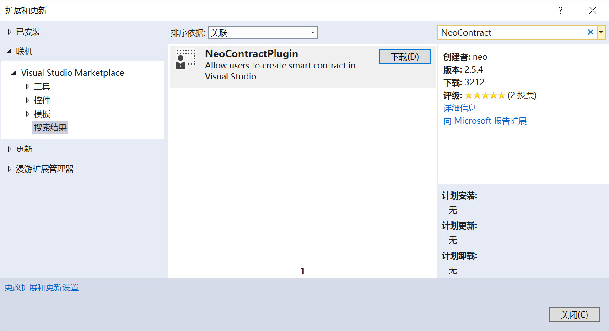
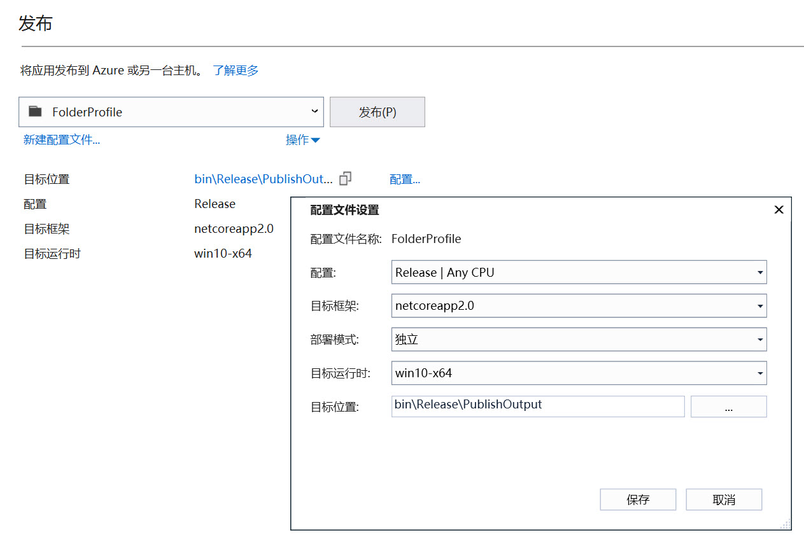
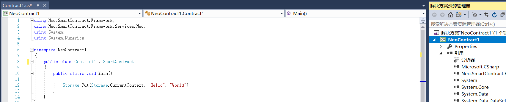
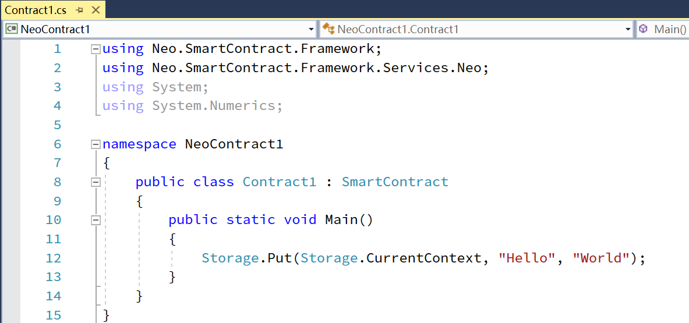
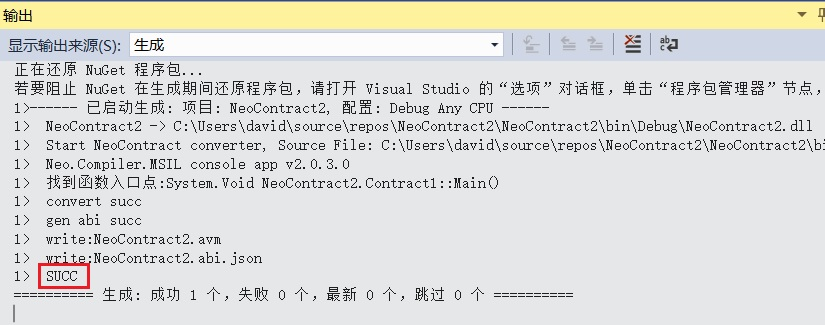

# 如何用 C# 编写 NEO 智能合约

目前 NEO 智能合约推荐使用 C# 语言来开发（此外还支持 Java、Kotlin、Go、C/C++、Python、JavaScript 等编程语言）

此部分包含简短的教程，可指导你配置 NEO 智能合约的 C# 开发环境，并使你了解如何创建智能合约项目，以及如何编译。

   > [!Note]
   > 目前 NEO 的所有项目已经升级到了 Visual Studio 2017 版本，如果你电脑中安装的是 Visual Studio 2015，请升级。

## 开发工具

### 1. Visual Studio 2017

如果你的计算机中已经安装过 Visual Studio 2017，并且在安装时勾选了 `.NET Core 跨平台开发 ` 可跳过本小节。

下载及安装方法：

[Visual Studio 下载地址](https://www.visualstudio.com/products/visual-studio-community-vs)

安装过程很简单，直接按照提示一步一步操作即可，需要注意的是在安装时需要勾选 `.NET Core 跨平台开发 ` ，安装大概需要十几分钟或几十分钟。

### 2. NeoContractPlugin 插件

安装方法：

打开 Visual Studio 2017，打开 ` 工具 `， ` 扩展和更新 ` ，在左侧点击 ` 联机 ` ，搜索 Neo，安装 NeoContractPlugin 插件（该过程需要联网）

### 3. neo-compiler

安装和配置方法：

在 Github 上下载 [neo-compiler](https://github.com/neo-project/neo-compiler) 项目，用 Visual Studio 2017 打开该解决方案，发布其中的 neon 项目，如图

> [!Note]
> 发布 neon 时程序会先还原 NuGet 程序包，如果此时看不到界面有任何变化，可以点击菜单栏上的 `视图`，`输出` 来查看（快捷键 Ctrl + Alt + O）。
>
> 这时会看到 “正在还原 NuGet 程序包...”。该过程可能需要十几分钟甚至几十分钟，并且中间可能失败 N 次，有条件的可以科学上网加快还原过程。

发布成功后，会在 bin\Release\PublishOutput 目录下生成 neon.exe 文件

然后需要添加 path，让任何位置都能访问这个 exe 程序

添加 path 方法：

Windows10：按 Windows + S 键，输入“环境变量”，选择 “编辑账户的环境变量” 回车

Windows7 SP1 - Windows8.1 系统：右击 `计算机`，`属性`，`高级系统设置`，`环境变量`

然后选择 Path, 点击 ` 编辑 `

在弹出来的窗口中点击 `新建` 输入 neon.exe 所在的文件夹目录，点击 ` 确定 ` ，` 确定 `。

> [!Note]
> 截图中为示例的路径，真正添加的要是你自己电脑上的 neon.exe 所在的文件夹目录。
>
> 在环境变量中不要添加 “…… neon.exe” 字样的路径，要填写 neon.exe **所在的文件夹目录** 而非 neon.exe 本身的路径
>
> 这时会看到 “正在还原 NuGet 程序包...”。该过程可能需要十几分钟甚至几十分钟，并且中间可能失败 N 次，有条件的可以科学上网加快还原过程。

添加完 path 后，运行 CMD 或者 PowerShell 测试一下（如果添加 path 前就已经启动了 CMD 则要关掉重启），输入 neon 后，没有报错，输出如图所示的版本号的提示信息即表示环境变量配置成功

> [!Note]
> 如果你的系统是 Windows 7 SP1，此步骤会提示缺少  [api-ms-win-core-console-l2-1-0.dll](https://cn.dll-files.com/api-ms-win-core-console-l2-1-0.dll.html) 文件。
>
> 可在 [这里](https://cn.dll-files.com/api-ms-win-core-console-l2-1-0.dll.html) 下载该文件，下载后解压出 api-ms-win-core-console-l2-1-0.dll 文件，放在 neon.exe 所在的目录中。

## 创建项目

以上四步安装配置成功后，即可在 Visual Studio 2017 中创建 NEO 智能合约项目（.NET Framework 版本任意），如图

创建项目好后，会自动生成一个 c# 文件，默认的类继承于 SmartContract，如图

新创建的项目会因为没有还原 NuGet 程序包而报错，注意右侧 “引用” 中会有个感叹号。

（如果你新建的项目没有报错，请跳过这一步）

解决方法也很简单，右击 `解决方案"NeoContract1"`（也就是右击解决方案文件），点击 `还原 NuGet 程序 包` ，这时在 “输出” 面板会看到 “正在还原 NuGet 程序包...”（如果没看到 “输出” 面板，可以用快捷键 Ctrl + Alt + O 打开 “输出” 面板）。该过程可能需要几分钟，有条件的可以科学上网加快还原过程。

所有程序包已经还原成功后，如果代码仍然报错，并且右侧 “引用” 中仍有个感叹号，可以尝试双击感叹号，或者重启 Visual Studio。

正常情况下，代码如下图所示。

## 编译项目

点击菜单栏上的 `生成`，`生成解决方案`（快捷键 Ctrl + Shift + B）开始编译程序。

编译成功后你会在该项目的 `bin/Debug` 目录下看到生成的 `项目名.avm` 文件，该文件即是生成的 NEO 智能合约文件。

现在，你已经完成了 NEO 智能合约开发环境的配置，更多智能合约编写方法请参考 [NEO 智能合约教程](tutorial.md)

