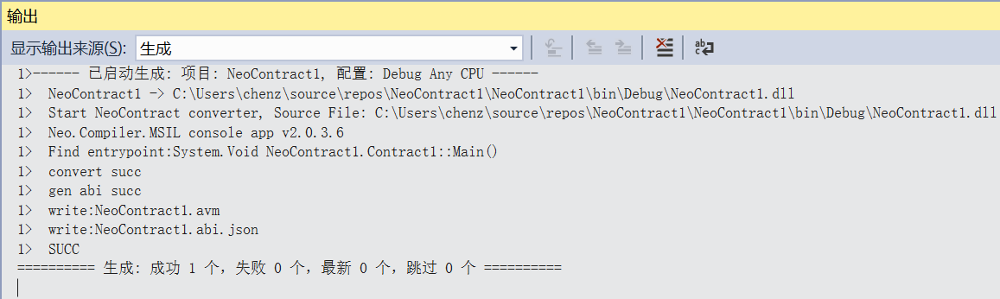

# 如何用 C# 编写 NEO 智能合约

目前 NEO 智能合约推荐使用 C# 语言来开发（此外还支持 Java、Kotlin、Python 等语言开发，未来还将支持 Go、 C/C++、JavaScript 等更多的编程语言）

此部分包含简短的教程，可指导你配置 NEO 智能合约的 C# 开发环境，并使你了解如何创建智能合约项目，以及如何编译。

## 开发工具

### Visual Studio 2017

如果你的计算机中已经安装过 Visual Studio 2017，并且在安装时勾选了 `.NET Core 跨平台开发 ` 可跳过本小节。如果你电脑中安装的是 Visual Studio 2015，则无法进行下一步，请升级 Visual Studio。

下载及安装方法：

[Visual Studio 下载地址](https://www.visualstudio.com/products/visual-studio-community-vs)

安装过程很简单，直接按照提示一步一步操作即可，需要注意的是在安装时需要勾选 `.NET Core 跨平台开发 ` ，安装大概需要十几分钟或几十分钟。

### NeoContractPlugin 插件

安装方法：

打开 Visual Studio 2017，打开 ` 工具 `， ` 扩展和更新 ` ，在左侧点击 ` 联机 ` ，搜索 Neo，安装 NeoContractPlugin 插件（该过程需要联网）

### neo-compiler

安装和配置方法：

在 Github 上下载 [neo-compiler](https://github.com/neo-project/neo-compiler) 项目，用 Visual Studio 2017 打开该解决方案，发布其中的 neon 项目，如图

- 

neon 项目默认的发布平台为 win10-x64，如果你不是 Windows10 系统，需要修改发布平台，用文本编译器打开 neon.csproj 文件，将 `<RuntimeIdentifiers>win10-x64</RuntimeIdentifiers>` 更改为目标平台，如 `<RuntimeIdentifiers>win7-64\</RuntimeIdentifiers>`，然后用 VS 重新发布该项目即可。详细 RID 可以参考 [.NET Core Runtime IDentifier (RID) catalog](https://docs.microsoft.com/en-us/dotnet/core/rid-catalog)。

发布成功后，会在 bin\Release\PublishOutput 目录下生成 neon.exe 文件。

然后需要添加 path，让任何位置都能访问这个 exe 程序。

添加 path 方法：

Windows10：按 Windows + S 键，输入环境变量，选择 `编辑账户的环境变量` 回车

Windows7 SP1 - Windows8.1 系统：右击 `计算机` ->`属性` ->`高级系统设置` ->`环境变量`

然后选择 Path, 点击 ` 编辑 `:

在弹出来的窗口中点击 `新建` 输入 neon.exe 所在的文件夹目录，点击 ` 确定 ` ，` 确定 `。

> [!Note]
> 截图中为示例的路径，真正添加的要是你自己电脑上的 neon.exe 所在的文件夹目录。
>
> 在环境变量中不要添加 “…… neon.exe” 字样的路径，要填写 neon.exe **所在的文件夹目录** 而非 neon.exe 本身的路径
>

添加完 path 后，运行 CMD 或者 PowerShell 测试一下（如果添加 path 前就已经启动了 CMD 则要关掉重启），输入 neon 后，没有报错，输出如图所示的版本号的提示信息即表示环境变量配置成功

## 创建项目

以上四步安装配置成功后，即可在 Visual Studio 2017 中创建 NEO 智能合约项目（.NET Framework 版本任意），如图

创建项目好后，会自动生成一个 c# 文件，默认的类继承于 SmartContract，如图

## 编译项目

点击菜单栏上的 `生成`，`生成解决方案`（快捷键 Ctrl + Shift + B）开始编译程序。

编译成功后你会在该项目的 `bin/Debug` 目录下看到生成的 `项目名.avm` 文件，该文件即是生成的 NEO 智能合约文件。

 `项目名.abi.json` 是智能合约的描述文档，文档中对合约的 ScriptHash、入口、方法、参数、返回值等进行了描述。关于更多智能合约 ABI 的信息，可以参考 [NeoContract ABI](https://github.com/neo-project/proposals/blob/master/nep-3.mediawiki)。

>[!Note]
>
>关于在配置智能合约开发环境中遇到的常见问题，可以参考 [FAQ](../../faq.md#智能合约)。

现在，你已经完成了 NEO 智能合约开发环境的配置。

