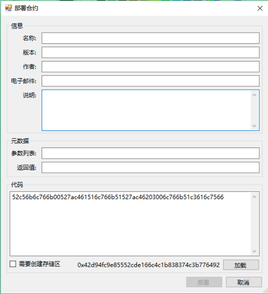
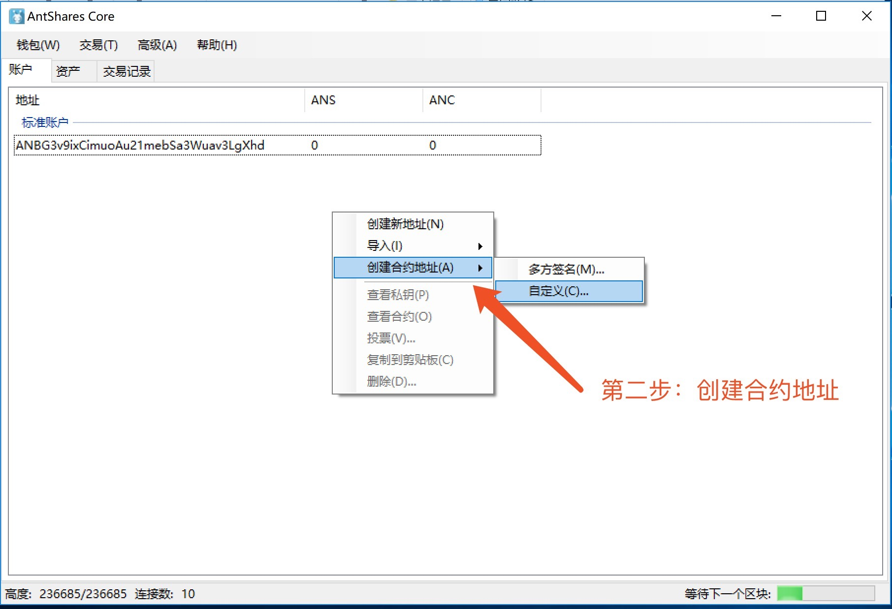
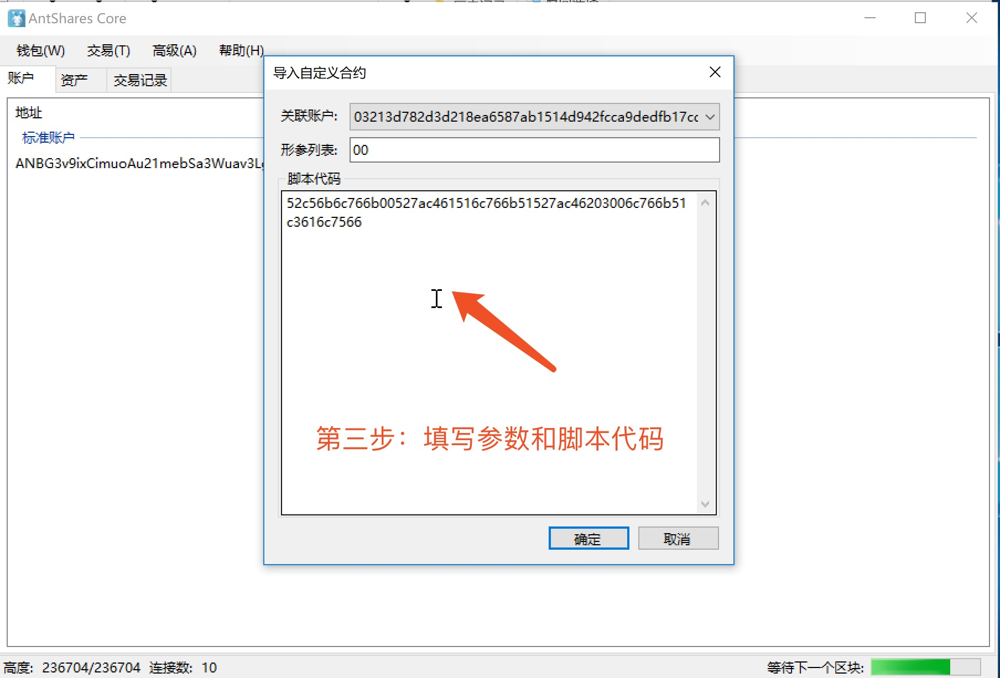

# 鉴权合约示例教程

本教程是基于 Visual Studio 2017 中创建的示例，请确保 Visual Studio 升级到了 2017 版本。另外本教程是基于智能合约 2.0 的演示，请从 [GitHub](https://github.com/neo-project/neo-gui/releases) 中下载最新的客户端运行。

附：截止到文档编写时，最新的客户端下载地址：[Neo GUI v2.2.0](https://github.com/neo-project/neo-gui/releases)。

## 编译合约脚本

```c#
using Neo.SmartContract.Framework;
using Neo.SmartContract.Framework.Services.Neo;
using Neo.SmartContract.Framework.Services.System;
namespace Neo.SmartContract
{
    public class Test : SmartContract
    {
        public static bool Main(byte[] signature)
        {
            return true;
        }
    }
}
```

> [!Note]
> 若不清楚如何编写生成智能合约脚本，请参考 [如何用 c# 编写智能合约](../getting-started-csharp.md)
>

以上合约编译后会生成 Test.avm 文件，其合约脚本（Test.avm 的二进制数据）为：52c56b6c766b00527ac461516c766b51527ac46203006c766b51c3616c7566

稍后会介绍如何获得一个 .avm 文件的合约脚本。

## 创建钱包

按照如下图所示的教程创建一个新的钱包：


## 获得合约脚本

获取合约脚本的方法有很多种，可以直接通过如下的 C# 代码读取 .avm 文件获取二进制代码。

```c#
byte[] bytes = System.IO.File.ReadAllBytes("Test.avm");
string str = System.Text.Encoding.Default.GetString(bytes);
```

如果觉得写代码获取合约脚本比较麻烦，客户端的 ` 部署合约 ` 中提供了简单的获取合约代码的方法：

在 PC 版客户端中点击 ` 高级 `，` 部署合约 `，在右下角点击 ` 加载 `，选择编译后的 Test.avm 文件，在 ` 代码 ` 框中就看到了合约的脚本了，如图。将其复制下来下一步会用到。



## 创建合约地址

创建完自己的钱包后，点击鼠标右键，运用你生成的合约脚本创建合约地址：



绑定合约地址到自己的账户，并填入相应的参数。因为我们的合约中有一个签名的参数，所以在 ` 形参列表 ` 中要填写 00 （关于参数填写可以参考 [此文](Parameter.md)。），并在 ` 脚本代码 ` 中填写上一步复制的合约脚本代码。

关联账户的作用是将一个合约与一个公私钥对进行绑定，当合约中需要签名时，客户端会自动用绑定的账户的私钥进行签名，这里随便选择一个公钥即可。



点击 ` 确定 ` 后，智能合约鉴权账户创建成功。

## 测试

下面是对智能合约鉴权账户的测试，当从一个智能合约鉴权账户转出资产时，共识节点在验证交易时会执行该智能合约。如果合约验证成功（返回结果为 true），则交易确定。否则这笔交易一直会未确认。测试方法就是先向合约鉴权账户转入一笔资产，再将其转出。

> [!Note]
> 为了保证测试的准确性，钱包中最好不要有其余的资产，否则你可能不知道资产是从标准账户转出还是从合约账户转出，除非你理解客户端的零钱查找算法，知道该笔交易输入是从智能合约地址转出。

### 转入资产到合约地址

转一定数量的资产到你的合约账户：


### 转出合约资产

从你的智能合约账户中转出资产：


> [!Note]
> 客户端中资产的余额是标准账户和合约地址中资产的加和，也就是这里显示的是所有地址的资产。但你是否能使用合约地址中的资产是依据智能合约的运行结果，如果合约执行成功（返回结果为 true），则这笔资产可以转出，否则将无法转出。
